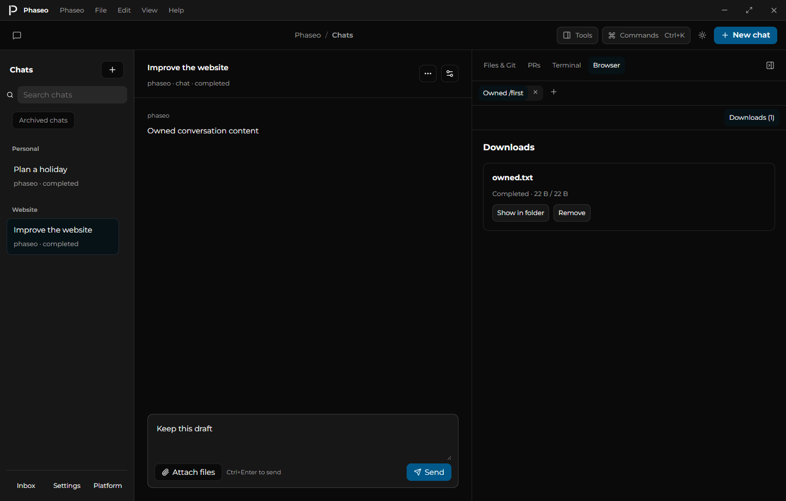
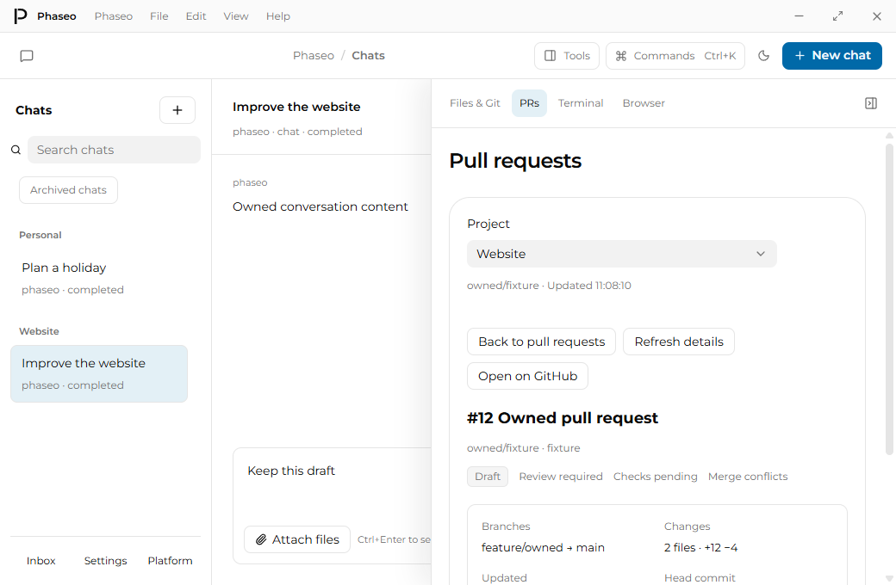
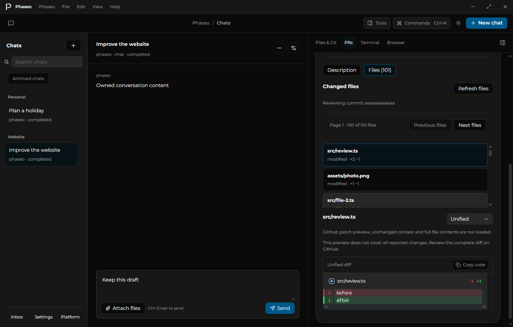
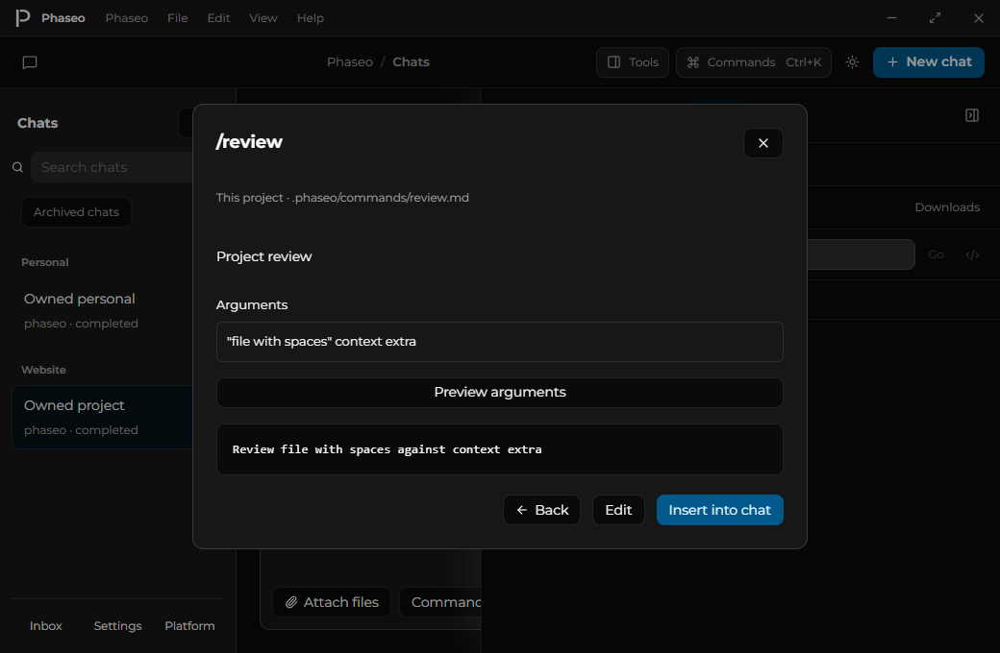
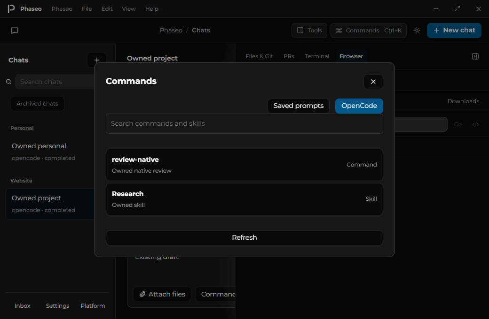
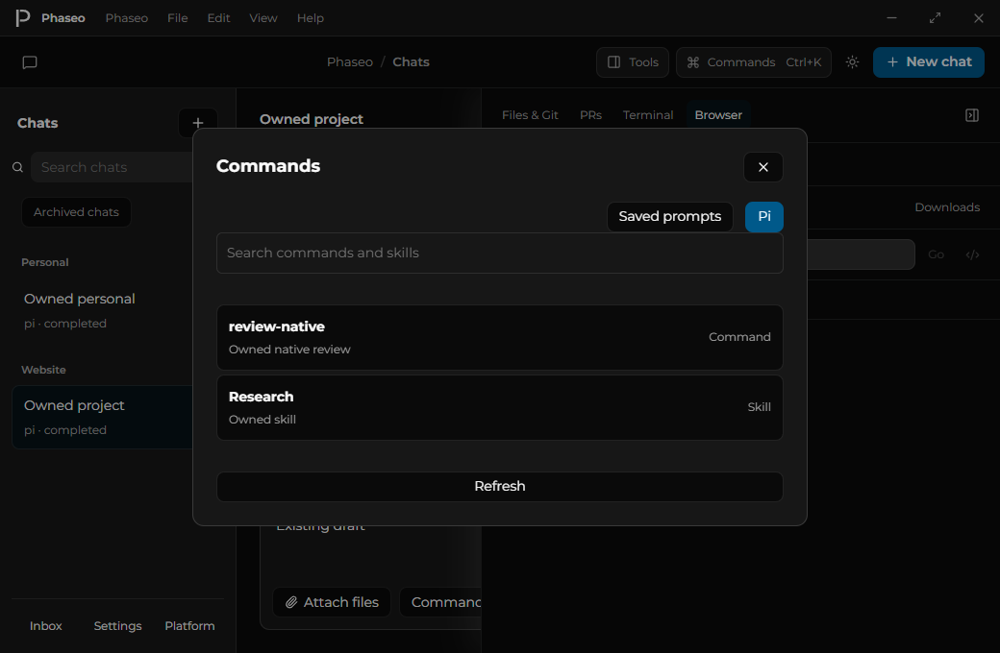
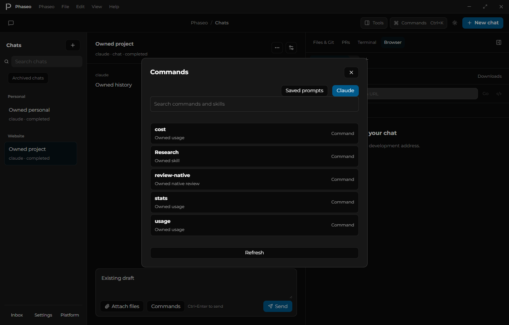
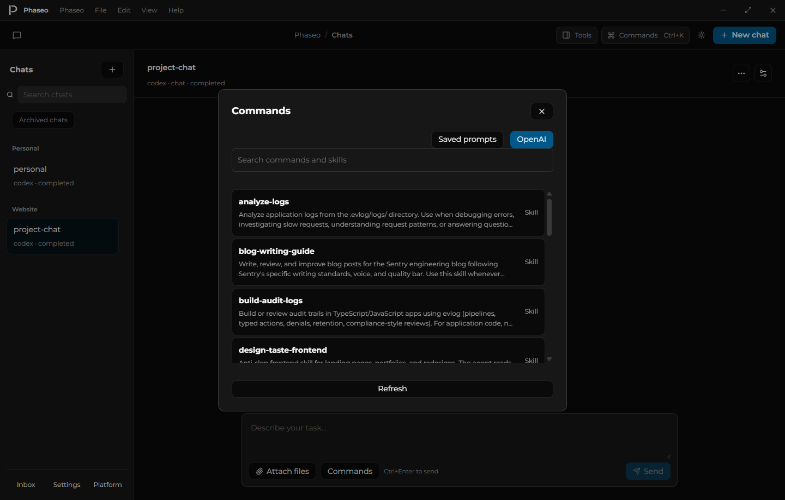

# Chats and contextual tools

Chats are the desktop workspace's primary navigation. Each chat can be personal or associated with a project; the bounded history projection carries the optional project ID without returning conversation bodies. Search, pinning, archives and pagination remain available in the single left sidebar.

The centre keeps the selected conversation mounted while opening tools and settings. Message drafts and history position survive those interactions. Accounts, agents, MCP connections and schedules live under Settings; Inbox and the existing Platform surface remain available from the sidebar footer.

Files & Git, pull requests, terminal and Browser share a collapsible right panel. Selecting a different chat initializes project tools from its project. Personal chats start without a project. Terminal lists follow that context; file drafts from another project are not restored into the current project's editor. At narrower widths the tools overlay the conversation and can be dismissed without losing it.

## Native browser

The Browser uses Electron WebContentsView, with up to twenty tabs per chat, navigation, back/forward, reload/stop and independent native history for each tab during the app session. Tab titles, addresses and active selection are saved locally; fresh native surfaces restore those addresses. Closing a tab disposes its remote web contents; closing the last tab opens a blank replacement. Tab selection supports arrow keys, Home and End. A dedicated persistent browser partition stores website sessions separately from the app and provider credentials. Closing the panel hides the surface; reopening restores it. App shutdown disposes the remote web contents.

Remote pages have no preload, Node integration or workspace bridge. HTTP/HTTPS addresses, including local development servers, are supported. File/data/custom protocol navigation and embedded URL credentials are rejected. Main IPC requires the application's own main-frame web contents, including when another native surface belongs to its window. Native surfaces hide for app dialogs and menus, and their bounds follow the host panel and zoom.

This is an initial browser surface, not full browser parity. Website permission prompts, durable browser history and remote preview routing remain to implement. Website permission requests currently return false. HTTP/HTTPS popup links open a tab in the current chat; background-tab requests retain the active tab and load when selected. Inactive native surfaces cannot request popups into another chat.

## Verification

`pnpm --filter @phaseo/desktop audit:design` runs the new chat-shell smoke/audit. It uses an isolated local profile, two seeded conversations and a local HTTP site, with no provider inference. It verifies grouping, drafts, settings, project PR/terminal context, native navigation/history, chat-specific browser restoration, unsafe-address rejection, remote privilege isolation, bounds, modal hiding and cleanup.

Source and Windows archive runs produce 16 shell captures across light/dark themes at 1440×920 and 1040×680, plus multiple-tab, phone-preview and downloads captures, two separate native browser page captures and four pull-request-detail captures and a file-review capture. Electron's host `capturePage` does not include the separate WebContentsView pixels; the native page is captured directly and is not composited into the shell screenshot.

The broader source/archive desktop smoke covers existing accounts, agents, MCP, schedules, attachments, Git, worktrees, notifications and native protocol fixtures through the new public navigation. Provider fixtures do not establish signed-in live inference or complete product parity. Multi-OS rendering, scaling and assistive-technology verification remain open.

Tab workflows verify independent native surfaces/history, keyboard selection, disposal, fresh-surface address restoration and last-tab replacement. Renderer reload hides existing native surfaces before the new shell loads. Owned native window.open and Ctrl-click workflows verify foreground/background tab delivery, source-history preservation, unsafe-popup rejection, remote privilege isolation and disposal. Twenty tabs created through the UI verify the admission limit, readable error, recovery after closing a tab and active-tab visibility. The audit fails on unexpected unhandled promise rejections. Blank-window/opener-dependent authentication flows remain unverified.

[Browser tab controls](screenshots/browser-tabs-desktop.png) show the host chrome; the separate native page capture contains the website pixels.

## Developer tools

The selected browser tab can open Electron’s native detached inspector from the toolbar, F12, Ctrl+Shift+I or Cmd+Alt+I. Native open/closed events update the button state. The inspector targets that website web contents; the app renderer is not inspected. Closing the tab disposes its inspector. Owned source/archive workflows verify toolbar toggling, native Windows keyboard input, external inspector closure, selected-target isolation and disposal. macOS shortcuts and complete developer-tool workflows remain unverified.

## Responsive previews

Each browser tab saves its Desktop, Phone or Tablet preview. Phone uses 390×844 and Tablet uses 768×1024 CSS pixels; Rotate swaps the dimensions. The native view fits and centres inside the available panel. Choosing a preview before entering an address is supported: emulation starts when the document is ready.

Source and Windows archive checks verify actual native page and screen dimensions in both orientations, modal dismissal and panel restoration, and rejection of invalid modes. These are Chromium viewport previews; physical-device fidelity, touch, custom dimensions and device-specific user agents remain unverified.


## Downloads

Downloads use [Electron’s native save workflow](https://www.electronjs.org/docs/latest/api/download-item) and appear in their originating chat’s Browser panel. The list shows bytes and state, Pause/Resume, Cancel, Show in folder and Remove. Removing a record leaves the saved file intact. Only confirmed native download paths can be revealed. Active transfers continue when the panel is hidden; owner-window shutdown cancels them. The app bounds concurrent transfers to twenty and keeps up to one hundred records, pruning finished entries first. A rejected transfer reports the limit in its record.

Owned source and Windows archive workflows use temporary save destinations, verify exact saved bytes, pause/resume/cancel, chat isolation and removal, and confirm the native page hides behind the downloads list. Five deterministic cases cover progress, completion, owner isolation, action guards, bounds, limit feedback and shutdown. The native save-dialog interaction and operating-system folder UI remain unverified. Download records are stored in the workspace SQLite database and survive app restarts. Unfinished records recover as terminal interruptions; automatic transfer resumption across restarts remains open.



`pnpm --filter @phaseo/desktop test:downloads` runs three separate Electron processes against an isolated profile: download, reopen and remove its record, then reopen again. Source and Windows archive runs verify retained native paths, exact saved bytes and durable removal without deleting the file. SQLite reopening tests cover interrupted-state recovery and a one-hundred-record bound that preserves active transfers. Progress writes are limited to once per second; final states and control changes save immediately. Write failures report that history may not survive a restart, and failed removal retains the visible record. Windows CI repeats both restart audits.

## Pull-request details

Select a pull-request title to open its description, branches, commit, changed-file totals, state, check/review summary and conflict status inside the right panel. Back restores the list page and focus. Detail refresh retains confirmed content on failure, provides Retry and ignores late results after changing projects. Visible details use the same 45/60-second refresh policy as lists. GitHub remains available as a separate action.

The production adapter reads a project’s GitHub origin through a compact native CLI GraphQL query with validated numbers, bounded output and canonical links. An installed-CLI read of PR #2702 verifies real body and commit metadata. Source and Windows archive audits cover failure/retry, retained-body refresh, Markdown isolation, Back focus and stale project responses, with light/dark captures at both window sizes. Changed-file diffs, review threads/actions, merge and background watchers remain open.



Live native tabs now retain their configured viewport when the tools panel remounts, even if an immediate rotate/close leaves older saved metadata. Saved preview settings apply only to a fresh unconfigured surface. Source/archive regression checks reproduce the former portrait reversion and verify both live landscape preservation and fresh phone restoration. `pnpm --filter @phaseo/desktop test:browser-viewport` runs 96 native geometry cases across four device orientations, eight fractional panel sizes and app zoom factors of 1, 1.25 and 1.5; it verifies exact page/screen dimensions, containment and centring. The evidence is written to `output/playwright/browser-viewport/geometry.json` and uploaded by Windows CI. Physical display scaling and other operating systems remain unverified.

## PR file previews

The Files tab pages through up to one hundred changed files at a time and keeps confirmed rows after a failed page read. Retry requests the failed page. Selecting a file shows its available GitHub patch in the existing unified/side-by-side diff viewer, with the original patch available for copying. Missing text patches and previews that exceed the display budget retain their file metadata and an explicit unavailable state. The page identifies the reviewed commit and scrolls the file area into view after loading. Automatic detail refresh pauses during file review; explicit Refresh details loads a newer revision.

The native adapter validates the request, checks head/base commit identities before and after each read, and rejects changed revisions, incomplete pages and duplicate records. GitHub CLI projects bounded patch text before returning it to the app; each preview is capped at 200,000 characters and each page at 1,000,000 patch characters. [GitHub’s file API](https://docs.github.com/en/rest/pulls/pulls#list-pull-requests-files) exposes at most 3,000 files; the UI reports that ceiling when reached. These are server-provided patch previews: full file blobs, unchanged context and proof of complete server patches remain open.

Twenty-four new native/parser cases and three patch-presentation cases bring the desktop suite to 560 tests across 79 files. Source/archive workflows verify initial failure/retry, 100-row bounds, failed-page retention/retry, omitted patches and both layouts. The production adapter reads all 299 files in PR #2702 across three pages without changing the temporary repository. Review threads/actions, viewed-file marks and merge remain open.



Patch previews now check hunk line counts and reported addition/deletion totals. An incomplete or unsupported patch shows a warning while remaining readable. Passing this check proves changed-line coverage only, not full file contents or unchanged context. Nine additional tests bring the suite to 569 tests across 80 files.

Full context can now load the complete supported text of a selected PR file at its merge base and head commit. Each side is limited to 1 MB and 10,000 lines; binary or unreadable files show an error. Confirmed blob bytes are checked against their Git identities, and a PR update during loading rejects the response. Missing objects are never interpreted as deletion. The original patch remains visible after a failed load. Full text supports unified/split layouts and unchanged context. See [GitHub commit comparison](https://docs.github.com/en/rest/commits/commits#compare-two-commits) and [Git blobs](https://docs.github.com/en/rest/git/blobs#get-a-blob).

Current verification: 596 tests / 81 files; source and Windows archive checks capture 27 states, including failed full-context retry and actual unchanged-line rendering. Production reads verified both immutable README versions in PR #2702. Cross-fork reads, binary/oversized review, viewed marks and review actions remain open.

## Project instructions

Phaseo project Chats load the project's root `AGENTS.md`. Code and Plan also load directory-scoped `AGENTS.md` files when inspecting files or directories. Edit these files through the existing Files panel. Personal Chats do not load project instructions; native harnesses retain their own discovery rules.

More specific instructions apply to their directory and descendants. Files must be valid UTF-8 text within the registered project, at most 16 KiB each, with up to 32 loaded files and 64 KiB total. Invalid root instructions reject submission and retain queued input. Local writes and commands carry the confirmed instruction revision: changed or newly discovered instructions block execution until the model reviews them and requests a fresh approval. A saved pending approval is restored before continuing after a restart.

Owned model fixtures verify root and folder scopes, approval-time changes, new instruction discovery, commands, persisted approval recovery and actual file effects. Global instructions, filesystem watchers, native instruction settings, reusable commands and skills remain in progress.

## Reusable chat commands

Use **Commands** beside the composer to find, preview, create or edit a saved prompt. Commands can belong to **All chats** or **This project**. The picker shows both scopes explicitly, including commands that share a name. Insertion appends the expanded text to the current draft and returns focus to the composer; sending remains a separate action.

Global commands live in the desktop profile's `commands` directory. Project commands live in `.phaseo/commands`. Files use a lowercase name with letters, numbers and hyphens, and Markdown with optional YAML `description` frontmatter:

```md
---
description: Review a change
---
Review $1 against $2 and explain your findings.
```

`$ARGUMENTS` inserts all supplied text. Numbered arguments accept quoted phrases; the last numbered placeholder receives the remaining arguments. Templates without placeholders append the supplied arguments. Preview reloads the file; editing uses its confirmed hash to reject an external change. Invalid command files remain visible as diagnostics while valid commands are available. Files are limited to 16 KiB, catalogs to 200 commands, and expansion to the composer's message limit. Template expansion does not execute shell code or alter harness, model or permission settings.

For OpenCode chats, the same dialog has an OpenCode catalog of registered commands and skills. Select an action and enter arguments to prepare an explicit draft; Send or Queue submits it. Commands require approval before native execution, and native tool permissions still apply. Skills activate through the native skill API before submitting their task. Changing the draft prefix clears native execution intent; queued argument edits retain it. Catalogs use the same personal-chat or project directory as execution. Other harness catalogs, Phaseo skills, nested saved command names, advanced frontmatter, deletion/import and plugin management remain in progress.

Current verification: 669 tests / 90 files; source and Windows archive command workflows each capture 13 states across both themes/window sizes. They verify keyboard selection, draft/focus preservation, scope, UI creation, stale edit rejection and native browser hide/restore, with zero submissions or provider inference.



OpenCode native actions add fourteen deterministic cases for catalog scope/metadata, explicit identities, argument edits, queue persistence/rejection, command approval/catalog changes, skill ordering and durable output reconciliation. Current verification: 683 tests / 91 files. Source and completed Windows archive picker workflows each capture 18 states, preserve drafts across chat switches, verify native browser hide/restore and make zero native submissions or provider inference calls. Command execution is covered by owned protocol fixtures; signed-in native execution remains unverified.



Pi chats now expose their native extension commands, prompt templates and skills in the same Commands dialog. Discovery uses the exact execution directory through get_commands, without sending a prompt or persisting a discovery session. Interactive-only Pi commands are unavailable through RPC and do not appear. Selecting an action preserves explicit draft/queue intent; running it requires approval and a fresh catalog check afterward. Pi owns the action effects and its configured tool policies. Decline, cancellation and unavailable catalogs before submission retain the input; a failure after native submission does not imply safe retry. Skills use the registered skill:name identity through the native prompt path.

Pi validation adds twelve deterministic cases for catalog metadata, identity/source bounds, ambiguity, owned discovery cleanup/cancellation, command/skill dispatch and approval-time removal/decline/cancellation. Current desktop suite: 695 tests / 92 files. Source and completed Windows archive workflows each capture 18 picker states, execute two owned native RPC prompts, verify an approved actual file effect and both replies, retain queued input on catalog removal, and verify all owned child processes stop. OpenCode picker regressions also pass. These fixtures use zero provider inference; an installed signed-in Pi engine and extension/plugin-specific side effects remain unverified.



Claude chats offer registered commands and skills in the same composer dialog, including aliases and argument hints. Discovery uses the selected account profile and exact chat directory without submitting input or persisting a session. Native actions require approval and a fresh catalog check before their slash prompt is released. Unavailable actions retain queued input; local command output appears in activity alongside assistant replies.

Claude validation adds fourteen deterministic cases, bringing the desktop suite to 709 tests across 93 files. Source and completed Windows archive workflows each verify 18 picker states, selected-profile isolation, three owned SDK prompts, approved file effects, aliases, local output and child-process cleanup. Archive hashes match the current build, and OpenCode/Pi source regressions pass. Windows CI includes both Claude workflows. An installed Claude CLI catalog check independently discovers a project command with zero inference requests. Owned execution fixtures do not prove signed-in provider inference or arbitrary plugin behavior.



OpenAI chats now offer native skills in the existing Commands dialog. Catalog discovery uses the selected isolated account profile and exact chat directory without starting a thread or turn. Disabled skills are excluded; native loading errors remain visible. Selection keeps the native file identity in the draft and queue. Execution checks availability before and after approval, then sends structured skill input with the task arguments and attachments. Ordinary slash text does not activate a skill. Native OpenAI commands are unavailable through this catalog.

Eight new tests cover scope/identity bounds, selected-profile isolation, owned discovery cancellation/cleanup, fresh approval checks, structured input and removed-skill admission. The desktop suite passes 717 tests across 94 files, plus typecheck, lint and build. The installed native CLI independently discovers an owned project skill without a turn submission. Source and completed Windows archive picker verification each cover project/personal scope and explicit draft preparation in four captures across both themes and window sizes. Archive hashes match the build; Claude source regressions pass. Windows CI includes the pinned native catalog and both picker workflows. Native skill execution is covered by owned protocol fixtures; signed-in inference remains unverified. Skill list rows preserve spacing and show two description lines, with the complete description available on selection.

Claude catalog lifecycle follow-up: source and Windows archive bridge audits stall native initialization for the real 15-second deadline. Concurrent sign-in, account status, harness update and duplicate catalog reads reject before side effects. Timeout stops both owned relay/SDK child processes, releases guards and allows a fresh successful catalog read. No additional user prompts or provider inference occur. T3 nightly 2648 remains the latest published release on recheck.



All native catalogs share keyboard navigation: arrows cycle results, Home/End select the first/last result, and Enter opens its arguments. Search and argument fields receive focus on entry and Back. IME composition keeps Enter for text entry. The search exposes its active option to assistive technology, distinguishes an empty catalog from no matching results, and clears stale choices while refreshing or after discovery failure.
