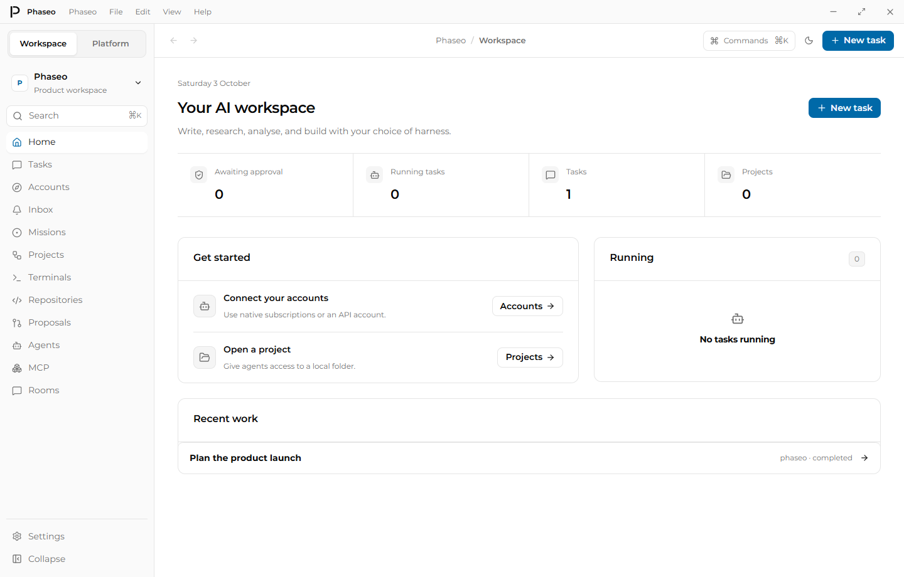
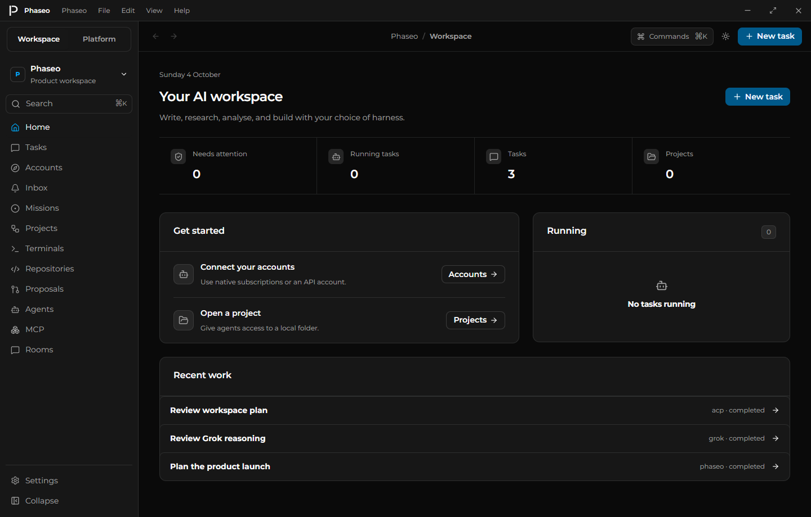
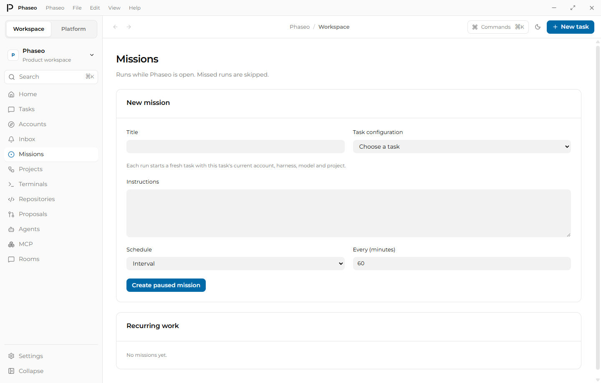
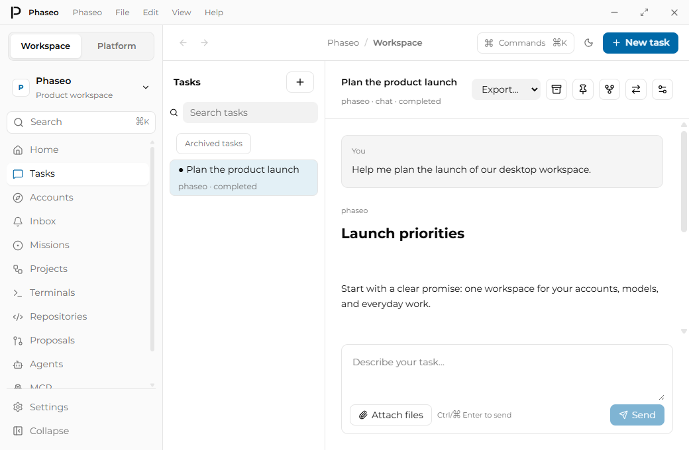
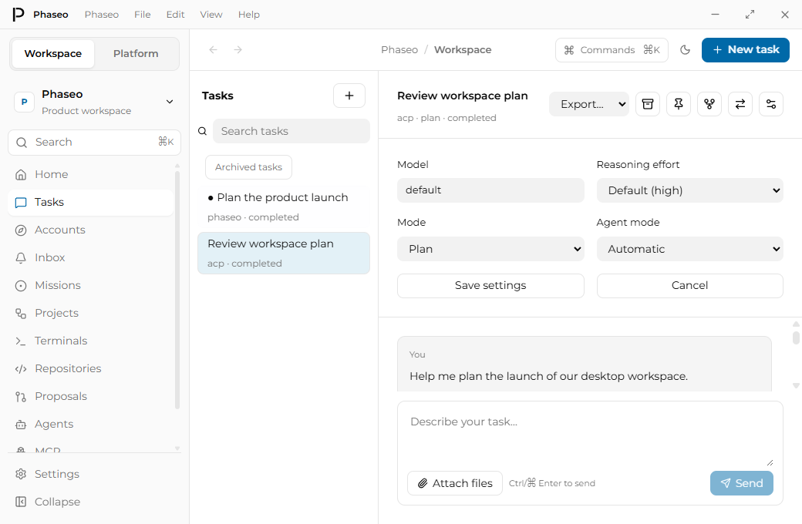
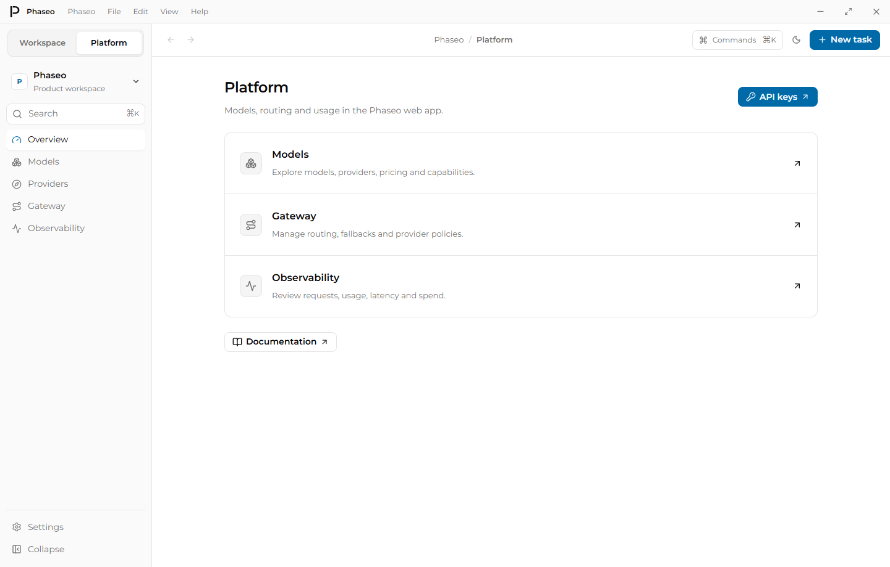

# Desktop design review

Reviewed against the live Phaseo Models and Chat layouts and the web application's existing fonts, logo, palette, buttons and inputs. Updated 4 October 2026. Screenshots use a separate local profile with sample conversations and native configuration fixtures, with no connected accounts or inference calls.

## Flow and findings

1. **Home:** replace tiny metric labels and a setup panel stretched across two empty sections with readable metrics, compact setup/running sections and a full-width recent-work list.
2. **New task:** retain account, harness, mode and model choice; use matching input sizes, clear labels and consistent form gaps.
3. **Conversation:** keep the title and compact actions on one row at minimum width; retain named controls for assistive technology and tooltips for handoff/settings. Keep message and composer backgrounds distinct. The long conversation remains scrollable.
4. **Accounts:** align profile actions and apply the same form rhythm and control styling as task setup.
5. **Projects:** use matching controls, wrap project/Git actions and show selected Files/Git tabs. This visual capture covers the empty state; the separate desktop smoke covers real file/Git interactions.
6. **Missions:** move the heading above a padded form, make instructions span both columns, separate recurring work and retain readable weekday checkboxes.
7. **Agents:** replace browser-default controls and an inline unpadded form with matching controls, padded rows and a two-column form.
8. **MCP:** apply the same form and row treatment; keep checkbox controls at their own size.
9. **Settings:** use aligned preference rows with separate labels and helper text; indicate the current page in navigation.
10. **Inbox:** use the same headings, list padding and readable empty-state text.
11. **Platform:** replace the decorative marketing hero and unverified readiness/health badges with concise links to the existing web tools.
12. **Conversation settings:** inset the model, reasoning and mode controls by 24 pixels, matching the toolbar and composer. Capture both window sizes and themes after the rendered frame settles.

The sidebar now scrolls independently while Settings and Collapse remain accessible. Application menus align to the selected trigger as text sizes change. The desktop uses the web logo rather than an invented mark.

## Reproduce and limits

Run `pnpm --filter @phaseo/desktop audit:design`. Captures and DOM size/spacing observations are written to `output/playwright/design-audit/after`. The audit waits for the selected page heading before capturing; conversation settings also wait for a rendered frame and verify their inset. It covers ten pages plus conversation and settings states at 1440×920 and 1040×680 in light and dark modes: 48 screenshots.

Focus rings, larger labels and current-page semantics improve readability and navigation. Screenshots do not verify screen-reader operation, complete keyboard focus management, contrast in every state, Windows scaling, macOS/Linux rendering, large histories, or live provider sign-in. Those remain separate checks.
