<Update label="26. Februar 2026" tags={["Funktionen","Modellveröffentlichungen","Dokumentation"]}>

### Funktionen

- Gemini 3.1 Flash Image Preview wurde in den Modellkatalog, die Gateway-Kompatibilität und die Dokumentation aufgenommen.

### Modellveröffentlichungen

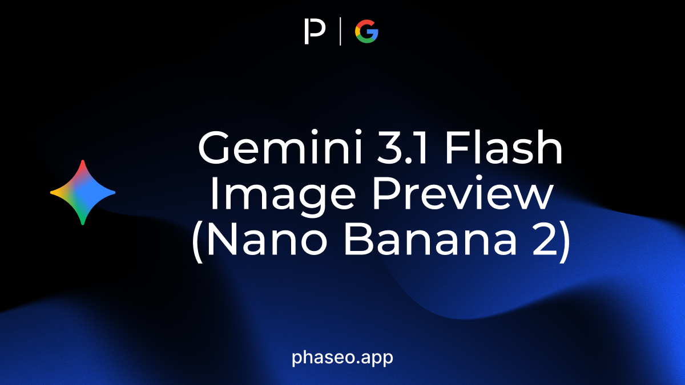

- [Google: Gemini 3.1 Flash Image Preview (Nano Banana 2)](https://phaseo.app/models/google/gemini-3.1-flash-image-preview)

</Update>

<Update label="24. Februar 2026" tags={["Modellveröffentlichungen"]}>

### Modellveröffentlichungen

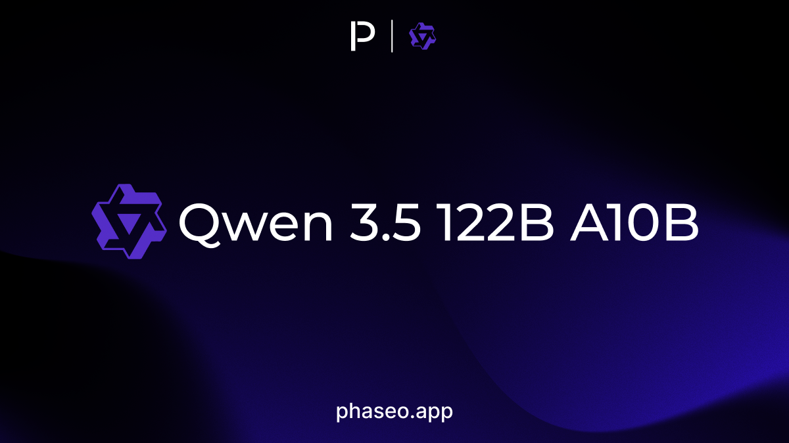

- [Inception: Mercury 2](https://phaseo.app/models/inception/mercury-2)
- [Inception: Mercury Edit 2](https://phaseo.app/models/inception/mercury-edit-2)
- [Liquid AI: LFM 2 24B A2B](https://phaseo.app/models/liquid-ai/lfm-2-24b-a2b)
- [Qwen: Qwen 3.5 122B A10B](https://phaseo.app/models/qwen/qwen3.5-122b-a10b)
- [Qwen: Qwen 3.5 27B](https://phaseo.app/models/qwen/qwen3.5-27b)
- [Qwen: Qwen 3.5 35B A3B](https://phaseo.app/models/qwen/qwen3.5-35b-a3b)

</Update>

<Update label="23. Februar 2026" tags={["Modellveröffentlichungen"]}>

### Modellveröffentlichungen

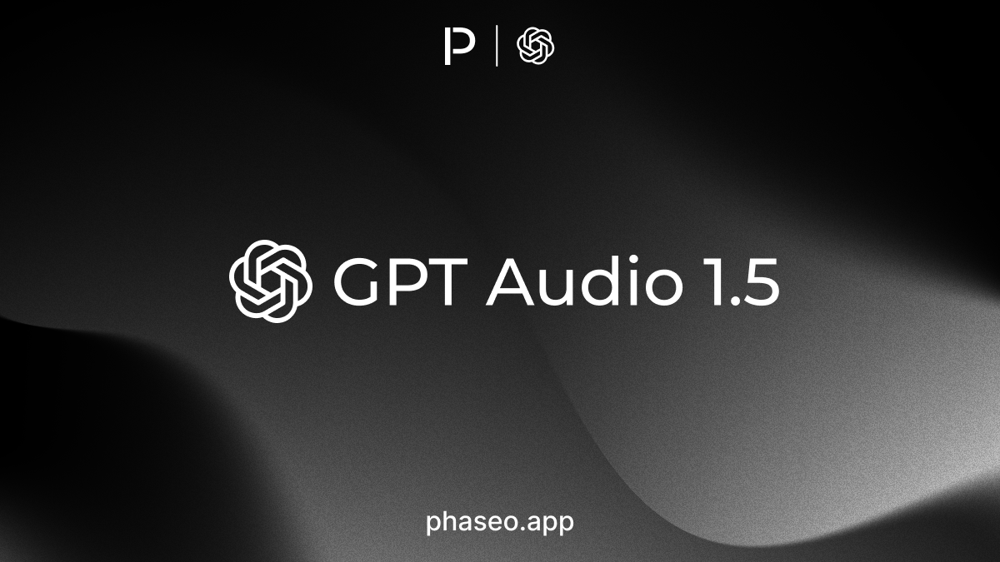

- [OpenAI: GPT Audio 1.5](https://phaseo.app/models/openai/gpt-audio-1.5)
- [OpenAI: GPT Realtime 1.5](https://phaseo.app/models/openai/gpt-realtime-1.5)
- [Qwen: Qwen 3.5 Flash](https://phaseo.app/models/qwen/qwen3.5-flash)

</Update>

<Update label="19. Februar 2026" tags={["Funktionen","Modellveröffentlichungen","Preise","Dokumentation"]}>

### Funktionen

- Gemini 3.1 Pro Preview wurde in den Modellkatalog, die Preisgestaltung, das Gateway und die Dokumentation aufgenommen.

### Modellveröffentlichungen

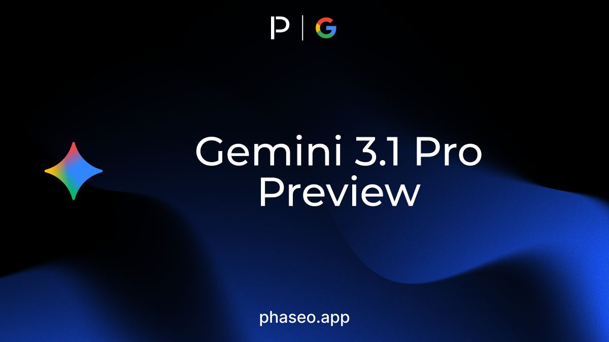

- [Google: Gemini 3.1 Pro Preview](https://phaseo.app/models/google/gemini-3.1-pro-preview)
- [Google: Gemini 3.1 Pro Preview Customtools](https://phaseo.app/models/google/gemini-3.1-pro-preview-customtools)

</Update>

<Update label="18. Februar 2026" tags={["Funktionen","Modellveröffentlichungen","Dokumentation"]}>

### Funktionen

- Claude Sonnet 4.6 wurde in den Modellkatalog, die Gateway-Kompatibilität und die Dokumentation aufgenommen.

### Modellveröffentlichungen

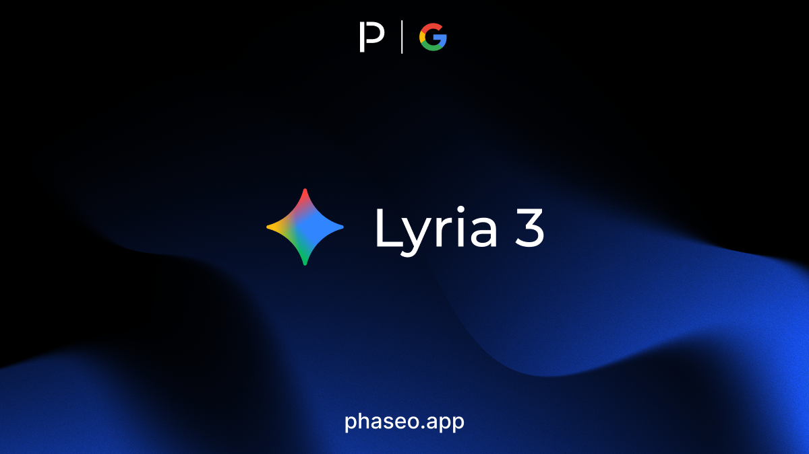

- [Google: Lyria 3](https://phaseo.app/models/google/lyria-3)
- [Prime Intellect: Intellect 3.1](https://phaseo.app/models/prime-intellect/intellect-3.1)

</Update>

<Update label="17. Februar 2026" tags={["Modellveröffentlichungen"]}>

### Modellveröffentlichungen

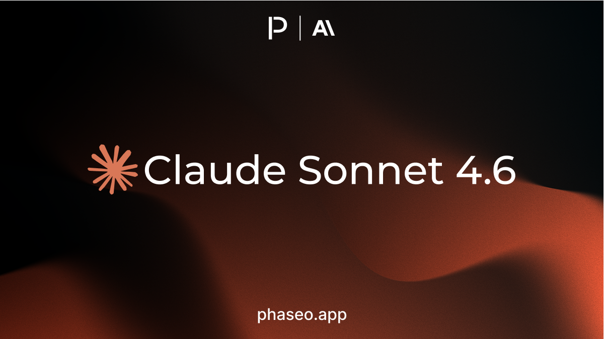

- [Anthropic: Claude Sonnet 4.6](https://phaseo.app/models/anthropic/claude-sonnet-4.6)
- [Cohere: Tiny Aya Earth](https://phaseo.app/models/cohere/tiny-aya-earth)
- [Cohere: Tiny Aya Fire](https://phaseo.app/models/cohere/tiny-aya-fire)
- [Cohere: Tiny Aya Global](https://phaseo.app/models/cohere/tiny-aya-global)
- [Cohere: Tiny Aya Water](https://phaseo.app/models/cohere/tiny-aya-water)
- [xAI: Grok 4.20](https://phaseo.app/models/x-ai/grok-4.20)
- [xAI: Grok 4.20 Multi Agent Beta](https://phaseo.app/models/x-ai/grok-4.20-multi-agent-beta)

</Update>

<Update label="16. Februar 2026" tags={["Modellveröffentlichungen"]}>

### Modellveröffentlichungen

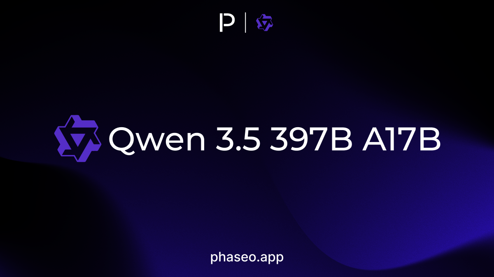

- [Qwen: Qwen 3.5 397B A17B](https://phaseo.app/models/qwen/qwen3.5-397b-a17b)
- [Qwen: Qwen 3.5 Plus](https://phaseo.app/models/qwen/qwen3.5-plus)
- [Qwen: Qwen 3.5 Plus (2026-02-15)](https://phaseo.app/models/qwen/qwen3.5-plus-2026-02-15)

</Update>

<Update label="15. Februar 2026" tags={["Modellveröffentlichungen"]}>

### Modellveröffentlichungen

- [ByteDance: Seed 2.0 Code Preview (2026-02-15)](https://phaseo.app/models/bytedance/seed-2.0-code-preview-2026-02-15)

</Update>

<Update label="14. Februar 2026" tags={["Modellveröffentlichungen"]}>

### Modellveröffentlichungen

- [ByteDance: Seed 2.0 Lite](https://phaseo.app/models/bytedance/seed-2.0-lite)
- [ByteDance: Seed 2.0 Mini](https://phaseo.app/models/bytedance/seed-2.0-mini)
- [ByteDance: Seed 2.0 Pro](https://phaseo.app/models/bytedance/seed-2.0-pro)

</Update>

<Update label="12. Februar 2026" tags={["Modellveröffentlichungen"]}>

### Modellveröffentlichungen

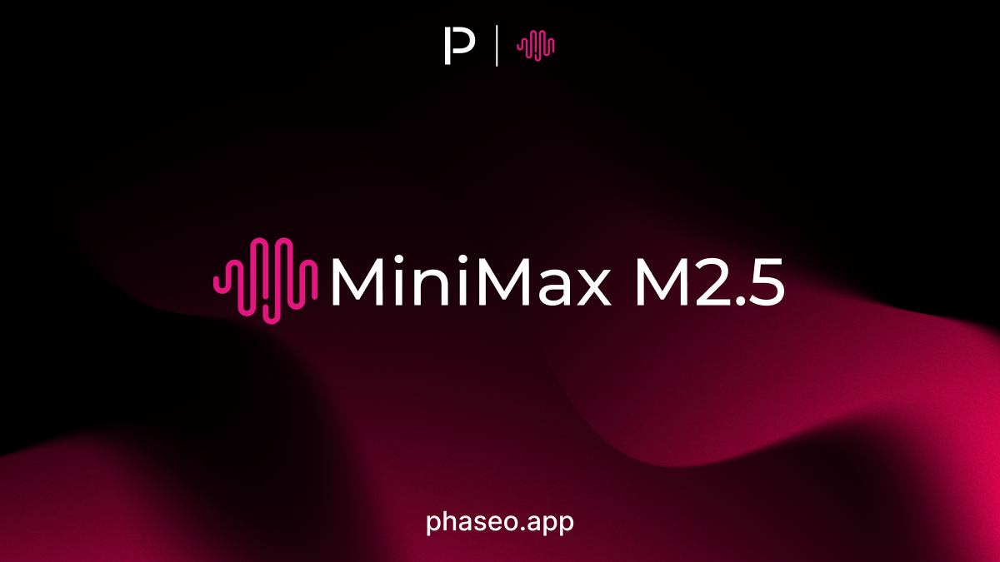

- [ByteDance: Seedance 2.0](https://phaseo.app/models/bytedance/seedance-2.0)
- [ByteDance: Seedance 2.0 Fast](https://phaseo.app/models/bytedance/seedance-2.0-fast)
- [Inclusion AI: Ring 1T 2.5](https://phaseo.app/models/inclusionai/ring-1t-2.5)
- [MiniMax: MiniMax M2.5](https://phaseo.app/models/minimax/minimax-m2.5)
- [OpenAI: GPT 5.3 Codex Spark](https://phaseo.app/models/openai/gpt-5.3-codex-spark)

</Update>

<Update label="11. Februar 2026" tags={["Modellveröffentlichungen"]}>

### Modellveröffentlichungen

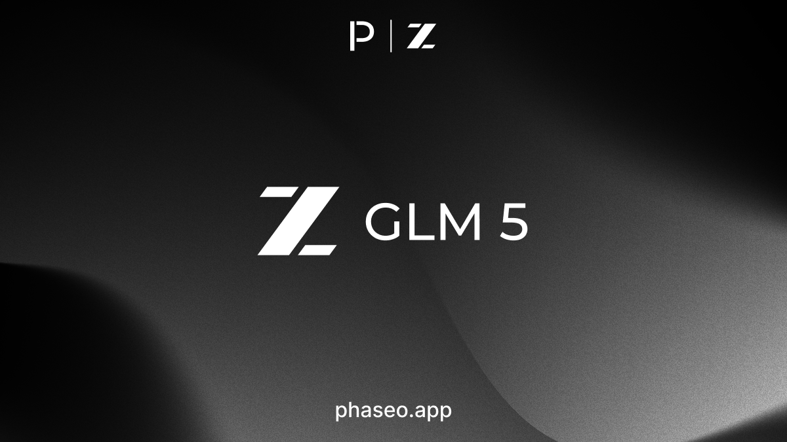

- [z.AI: GLM 5](https://phaseo.app/models/z-ai/glm-5)

</Update>

<Update label="9. Februar 2026" tags={["Modellveröffentlichungen"]}>

### Modellveröffentlichungen

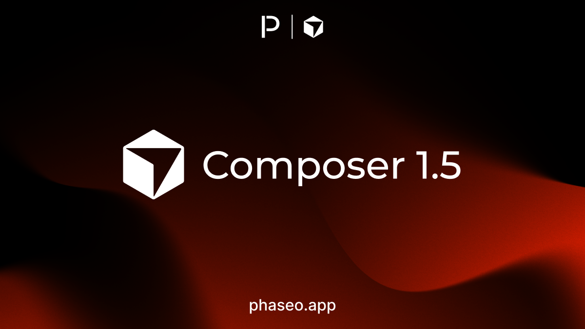

- [Cursor: Composer 1.5](https://phaseo.app/models/cursor/composer-1.5)

</Update>

<Update label="5. Februar 2026" tags={["Modellveröffentlichungen"]}>

### Modellveröffentlichungen

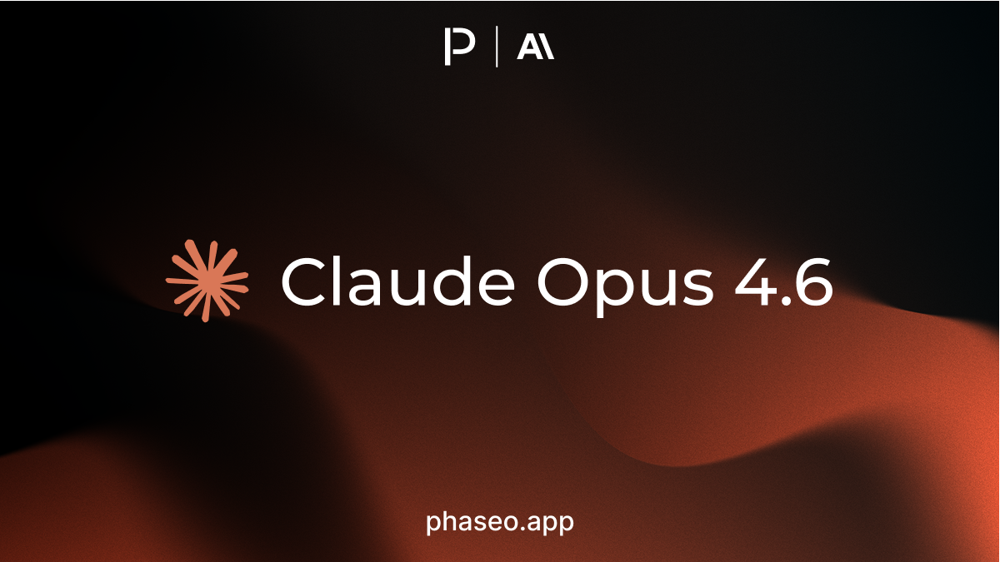

- [Anthropic: Claude Opus 4.6](https://phaseo.app/models/anthropic/claude-opus-4.6)
- [OpenAI: GPT 5.3 Codex](https://phaseo.app/models/openai/gpt-5.3-codex)

</Update>

<Update label="4. Februar 2026" tags={["Modellveröffentlichungen"]}>

### Modellveröffentlichungen

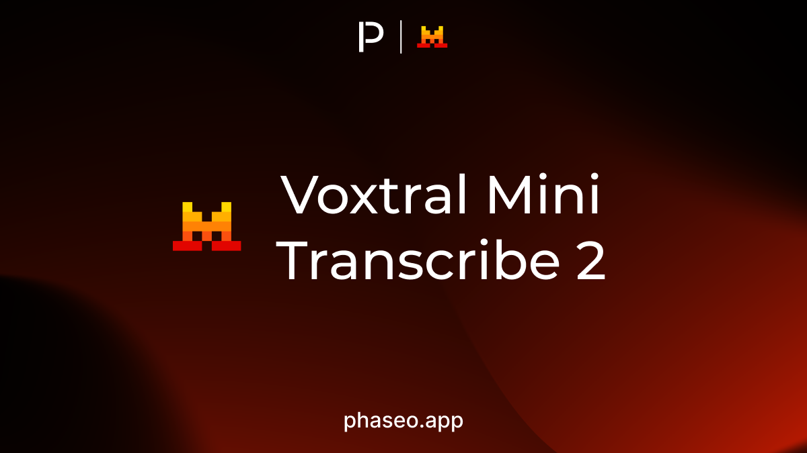

- [Mistral: Voxtral Mini Transcribe 2](https://phaseo.app/models/mistral/voxtral-mini-transcribe-2)

</Update>

