<Update label="30. April 2026" tags={["Modellveröffentlichungen"]}>

### Modellveröffentlichungen

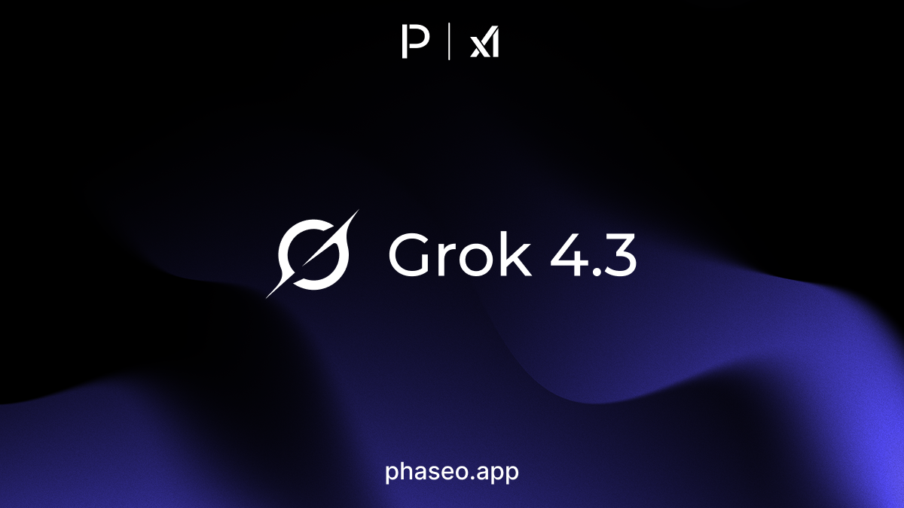

- [xAI: Grok 4.3](https://phaseo.app/models/x-ai/grok-4.3)

</Update>

<Update label="29. April 2026" tags={["Funktionen","Modellveröffentlichungen","SDK"]}>

### SDK-Veröffentlichungen

- SDK `2.0.2` wurde veröffentlicht für [TypeScript](https://github.com/phaseoteam/Phaseo/releases/tag/%40ai-stats%2Fsdk%402.0.2), [Python](https://github.com/phaseoteam/Phaseo/releases/tag/%40ai-stats%2Fpy-sdk%402.0.2), [Go](https://github.com/phaseoteam/Phaseo/releases/tag/%40ai-stats%2Fgo-sdk%402.0.2), [C#](https://github.com/phaseoteam/Phaseo/releases/tag/%40ai-stats%2Fcsharp-sdk%402.0.2), [Java](https://github.com/phaseoteam/Phaseo/releases/tag/%40ai-stats%2Fjava-sdk%402.0.2), [PHP](https://github.com/phaseoteam/Phaseo/releases/tag/%40ai-stats%2Fphp-sdk%402.0.2) und [Ruby](https://github.com/phaseoteam/Phaseo/releases/tag/%40ai-stats%2Fruby-sdk%402.0.2).
- Diese Version trennte Laufzeit-Modell-IDs für Anfragen von generierten Konstanten für aufrufbare Hilfsfunktionen. So lassen sich neue Modelle vor der nächsten SDK-Veröffentlichung verwenden.
- Generierte Hilfsfunktionen folgen jetzt dem aktuellen Snapshot der über das Gateway aufrufbaren Modelle. Dadurch entfallen unnötige SDK-Änderungen bei reinen Katalogaktualisierungen.

### Modellveröffentlichungen

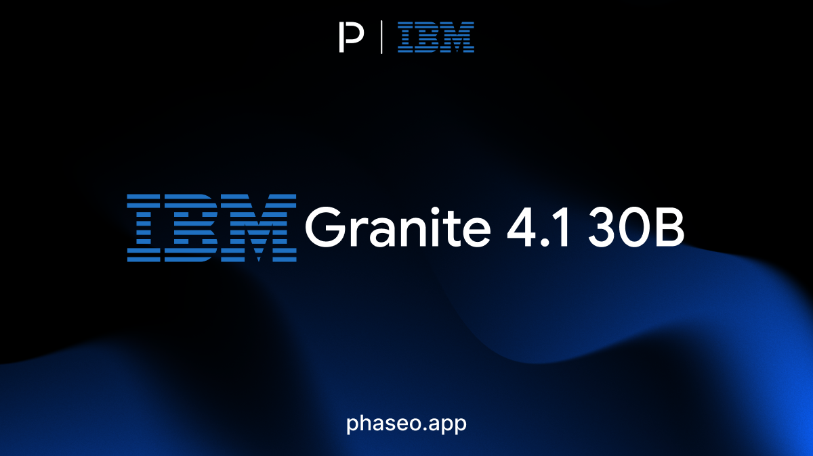

- [IBM: Granite 4.1 30B](https://phaseo.app/models/ibm/granite-4.1-30b)
- [IBM: Granite 4.1 3B](https://phaseo.app/models/ibm/granite-4.1-3b)
- [IBM: Granite 4.1 8B](https://phaseo.app/models/ibm/granite-4.1-8b)
- [Mistral: Mistral Medium 3.5](https://phaseo.app/models/mistral/mistral-medium-3.5)

</Update>

<Update label="28. April 2026" tags={["Modellveröffentlichungen"]}>

### Modellveröffentlichungen

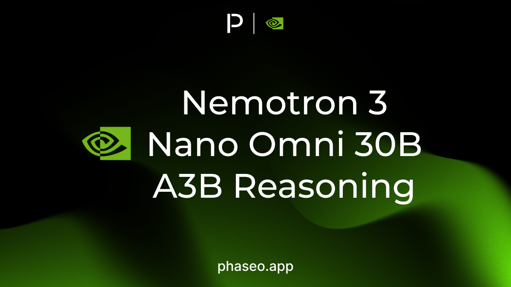

- [ByteDance: Seed 2.0 Lite (2026-04-28)](https://phaseo.app/models/bytedance/seed-2.0-lite-2026-04-28)
- [ByteDance: Seed 2.0 Mini (2026-04-28)](https://phaseo.app/models/bytedance/seed-2.0-mini-2026-04-28)
- [Nvidia: Nemotron 3 Nano Omni 30B A3B Reasoning](https://phaseo.app/models/nvidia/nemotron-3-nano-omni-30b-a3b-reasoning)
- [Poolside: Laguna XS.2](https://phaseo.app/models/poolside/laguna-xs.2)

</Update>

<Update label="25. April 2026" tags={["Funktionen","Preise","Modellveröffentlichungen"]}>

### Funktionen

- Warnungen bei niedrigem Guthaben und Abrechnungsschutz wurden erweitert, damit Teams vor Erreichen der Kontolimits deutlicher informiert werden ([PR #371](https://github.com/phaseoteam/Phaseo/pull/371)).
- Preisfehler treten jetzt vorhersehbarer auf, wenn Abrechnungsregeln eines Anbieters unvollständig sind oder sich Routenmetadaten unerwartet ändern ([PR #374](https://github.com/phaseoteam/Phaseo/pull/374)).

### Modellveröffentlichungen

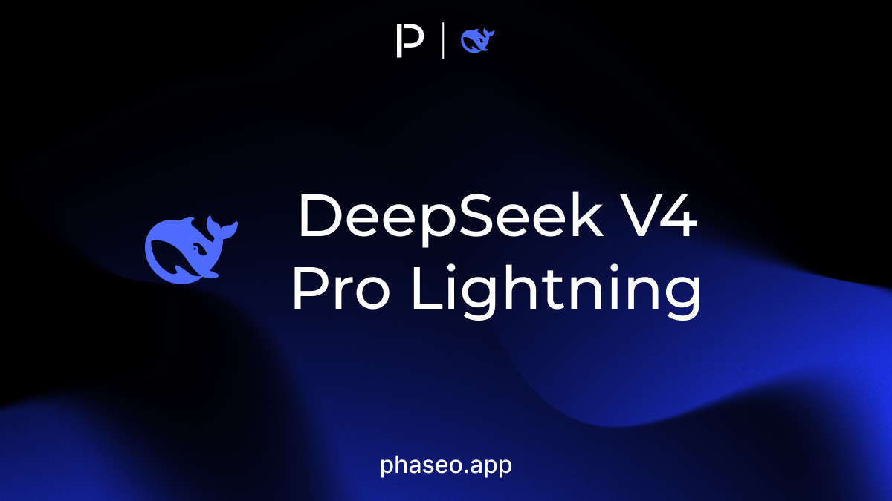

- [DeepSeek: DeepSeek V4 Pro Lightning](https://phaseo.app/models/deepseek/deepseek-v4-pro-lightning)

</Update>

<Update label="24. April 2026" tags={["Modellveröffentlichungen"]}>

### Modellveröffentlichungen

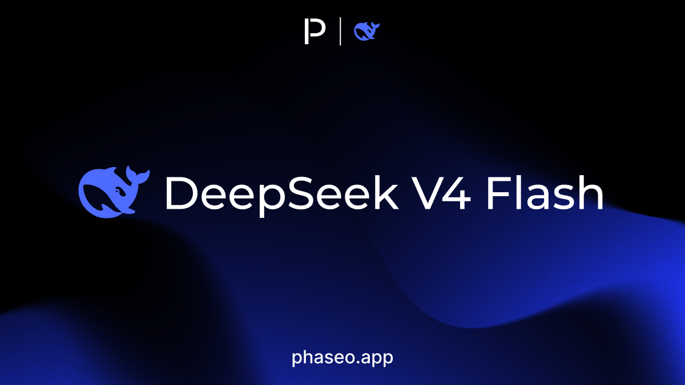

- [DeepSeek: DeepSeek V4 Flash](https://phaseo.app/models/deepseek/deepseek-v4-flash)
- [DeepSeek: DeepSeek V4 Pro](https://phaseo.app/models/deepseek/deepseek-v4-pro)

</Update>

<Update label="23. April 2026" tags={["Modellveröffentlichungen"]}>

### Modellveröffentlichungen

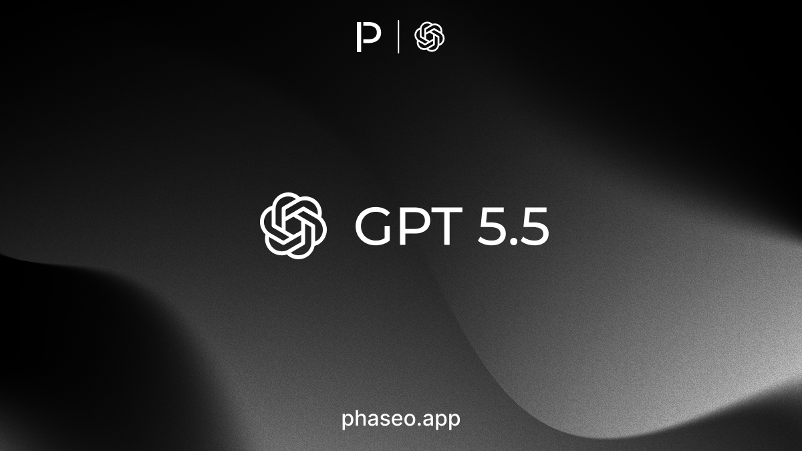

- [OpenAI: GPT 5.5](https://phaseo.app/models/openai/gpt-5.5)
- [OpenAI: GPT 5.5 Pro](https://phaseo.app/models/openai/gpt-5.5-pro)
- [Tencent Hunyuan: Hy3 Preview](https://phaseo.app/models/tencent/hy3-preview)

</Update>

<Update label="22. April 2026" tags={["Funktionen","SDK","Modellveröffentlichungen"]}>

### Funktionen

- SDK `2.0.0` wurde mit neu generierten Clients und umfassenderer Übereinstimmung mit dem aktuellen Gateway-Vertrag veröffentlicht.

### Modellveröffentlichungen

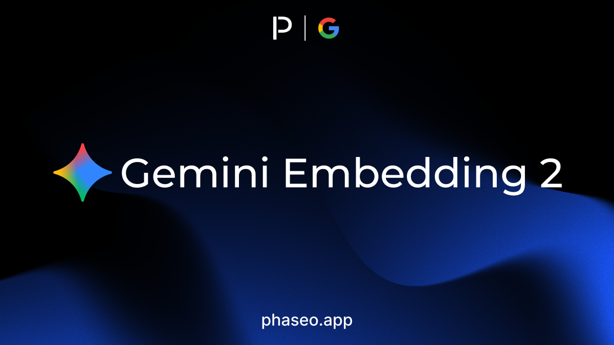

- [Google: Gemini Embedding 2](https://phaseo.app/models/google/gemini-embedding-2)
- [Qwen: Qwen 3.6 27B](https://phaseo.app/models/qwen/qwen3.6-27b)
- [Xiaomi: MiMo V2.5](https://phaseo.app/models/xiaomi/mimo-v2.5)
- [Xiaomi: MiMo V2.5 Pro](https://phaseo.app/models/xiaomi/mimo-v2.5-pro)
- [Xiaomi: MiMo V2.5 TTS](https://phaseo.app/models/xiaomi/mimo-v2.5-tts)

</Update>

<Update label="21. April 2026" tags={["Funktionen","Modellveröffentlichungen"]}>

### Funktionen

- Das Ankündigungscenter, die Arbeitsbereichsverwaltung und zugehörige Abläufe für Mitgliedschaften wurden veröffentlicht.

### Modellveröffentlichungen

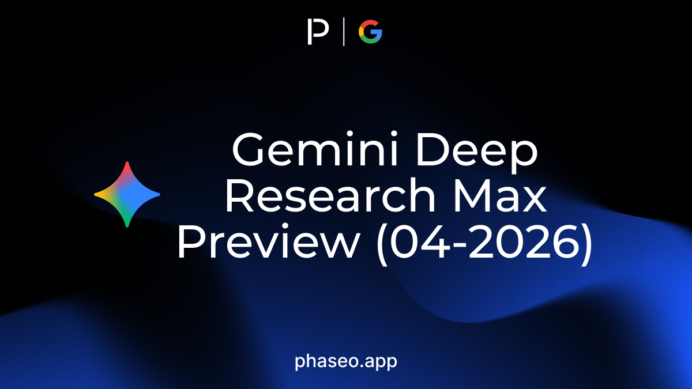

- [Google: Gemini Deep Research Max Preview (04-2026)](https://phaseo.app/models/google/deep-research-max-preview-04-2026)
- [Google: Gemini Deep Research Preview (04-2026)](https://phaseo.app/models/google/deep-research-preview-04-2026)
- [OpenAI: GPT Image 2](https://phaseo.app/models/openai/gpt-image-2)

</Update>

<Update label="20. April 2026" tags={["Modellveröffentlichungen"]}>

### Modellveröffentlichungen

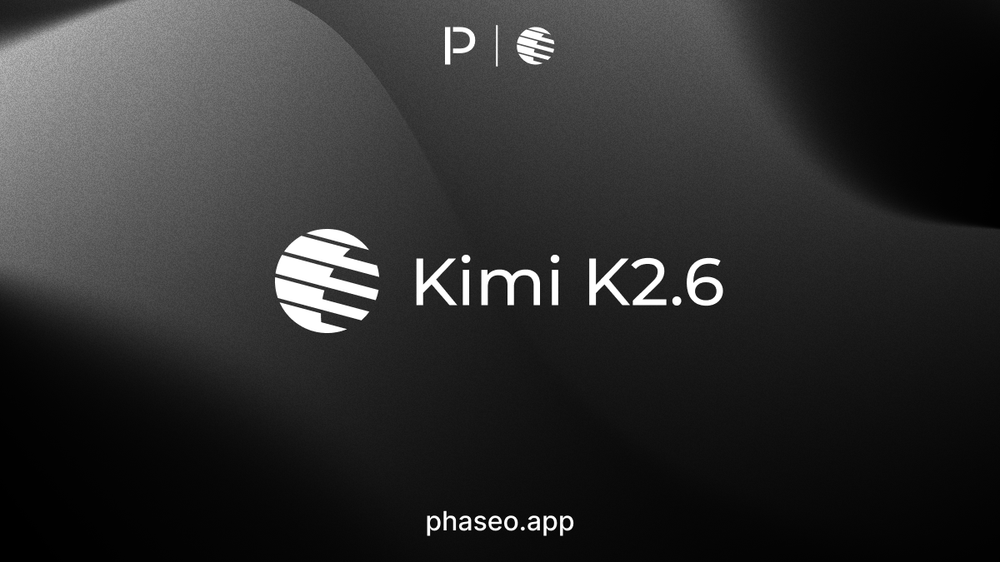

- [Moonshot: Kimi K2.6](https://phaseo.app/models/moonshotai/kimi-k2.6)
- [Qwen: Qwen 3.5 Plus (2026-04-20)](https://phaseo.app/models/qwen/qwen3.5-plus-2026-04-20)

</Update>

<Update label="18. April 2026" tags={["Funktionen","Modellveröffentlichungen","SDK","Dokumentation"]}>

### Funktionen

- SDK `1.2.0` synchronisierte Modellverfügbarkeit, generierte Typen und Dokumentation mit den neuesten Katalogänderungen.

</Update>

<Update label="17. April 2026" tags={["Modellveröffentlichungen"]}>

### Modellveröffentlichungen

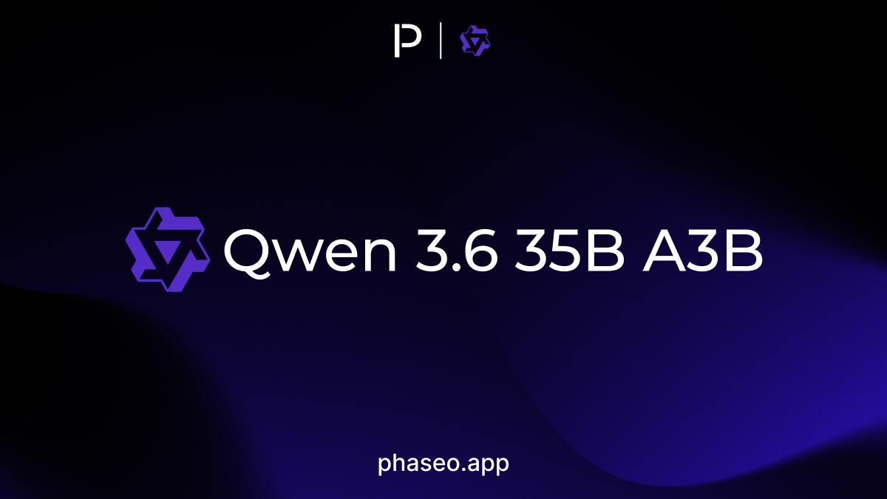

- [Qwen: Qwen 3.6 35B A3B](https://phaseo.app/models/qwen/qwen3.6-35b-a3b)
- [xAI: Grok TTS](https://phaseo.app/models/x-ai/grok-tts)

</Update>

<Update label="16. April 2026" tags={["Modellveröffentlichungen"]}>

### Modellveröffentlichungen

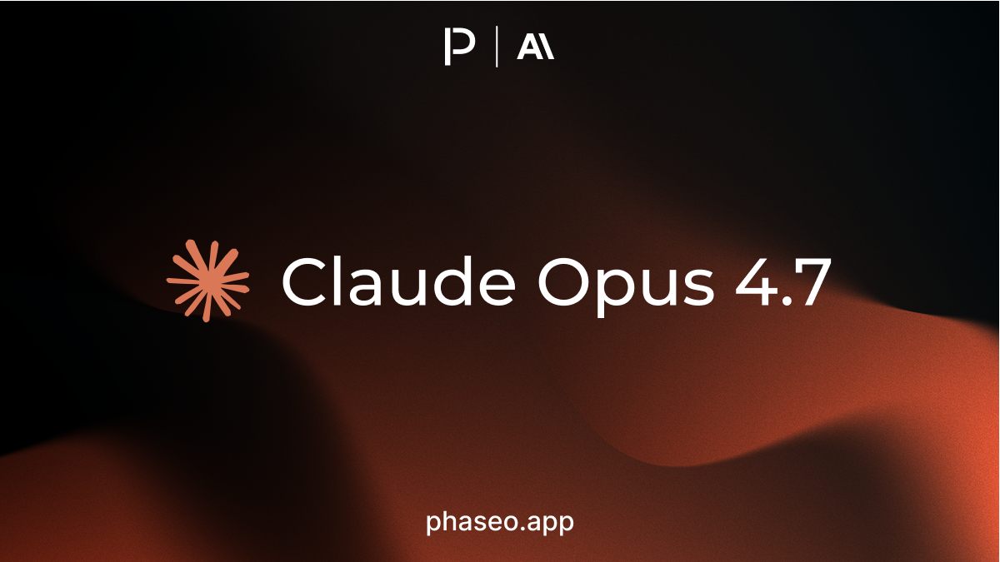

- [Anthropic: Claude Opus 4.7](https://phaseo.app/models/anthropic/claude-opus-4.7)

</Update>

<Update label="15. April 2026" tags={["Modellveröffentlichungen"]}>

### Modellveröffentlichungen

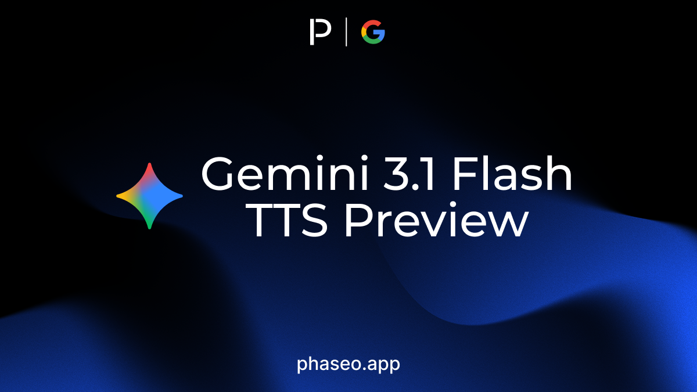

- [Google: Gemini 3.1 Flash TTS Preview](https://phaseo.app/models/google/gemini-3.1-flash-tts-preview)

</Update>

<Update label="14. April 2026" tags={["Modellveröffentlichungen"]}>

### Modellveröffentlichungen

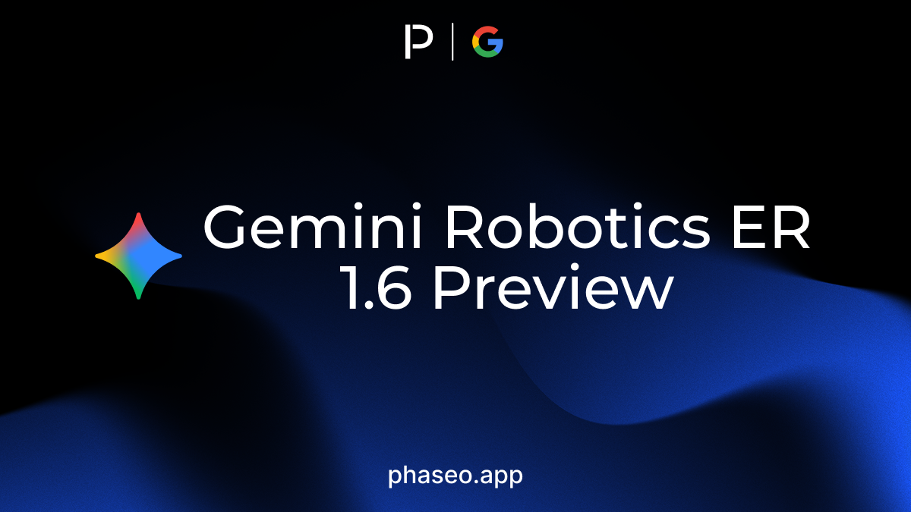

- [Google: Gemini Robotics ER 1.6 Preview](https://phaseo.app/models/google/gemini-robotics-er-1.6-preview)

</Update>

<Update label="13. April 2026" tags={["Modellveröffentlichungen"]}>

### Modellveröffentlichungen

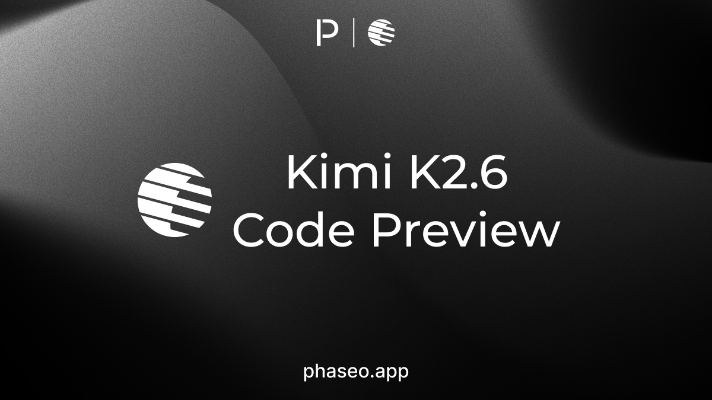

- [Moonshot: Kimi K2.6 Code Preview](https://phaseo.app/models/moonshotai/kimi-k2.6-code-preview)

</Update>

<Update label="11. April 2026" tags={["Modellveröffentlichungen"]}>

### Modellveröffentlichungen

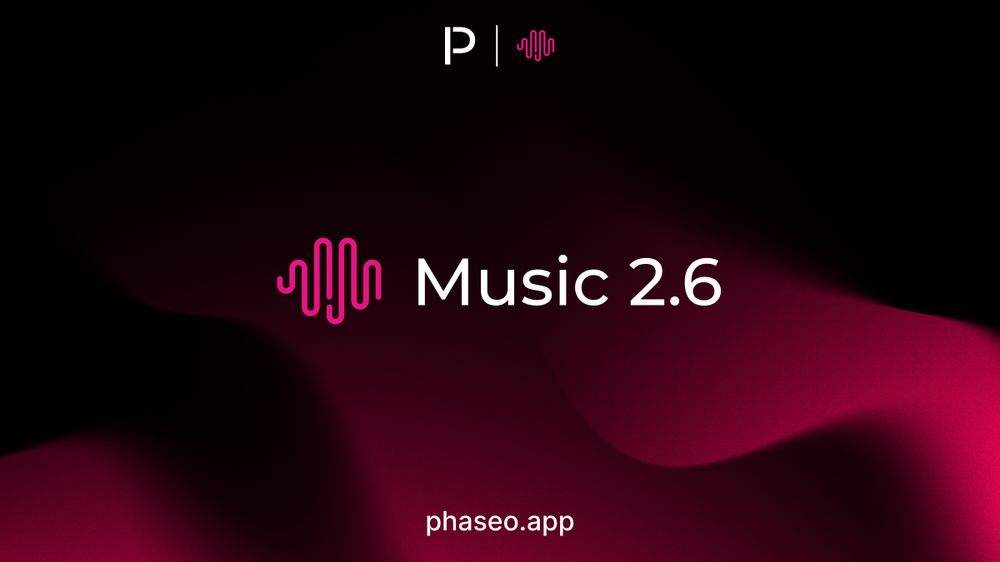

- [MiniMax: Music 2.6](https://phaseo.app/models/minimax/music-2.6)

</Update>

<Update label="8. April 2026" tags={["Modellveröffentlichungen"]}>

### Modellveröffentlichungen

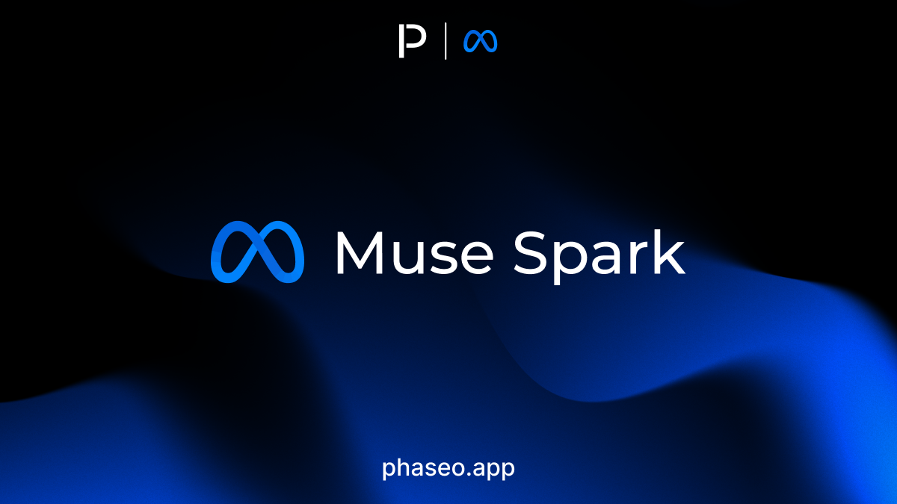

- [Meta: Muse Spark](https://phaseo.app/models/meta/muse-spark)
- [Meta: Muse Spark Contemplating](https://phaseo.app/models/meta/muse-spark-contemplating)

</Update>

<Update label="7. April 2026" tags={["Modellveröffentlichungen"]}>

### Modellveröffentlichungen

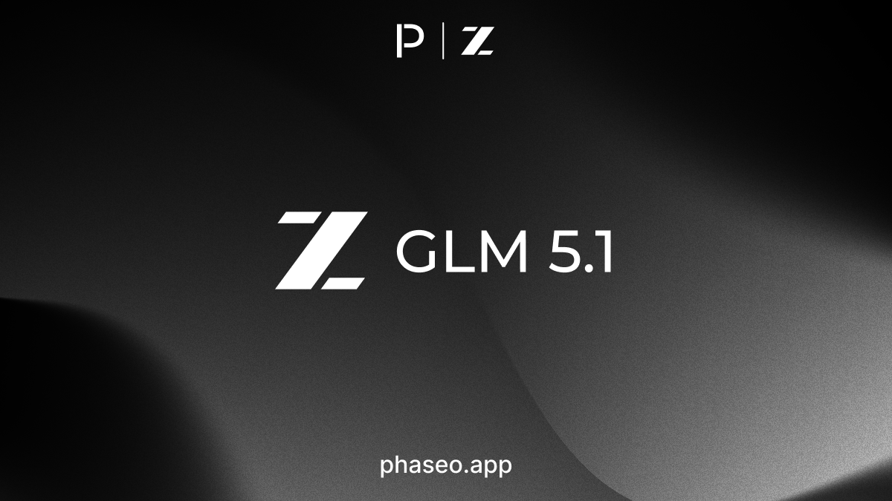

- [z.AI: GLM 5.1](https://phaseo.app/models/z-ai/glm-5.1)

</Update>

<Update label="4. April 2026" tags={["Funktionen","Modellveröffentlichungen","SDK","Preise"]}>

### Funktionen

- Mobile Modellseiten, Preisansichten und die Sichtbarkeit kostenloser Routen wurden verbessert. Die Aufladegebühr für Pay As You Go sank auf 5 %.

</Update>

<Update label="3. April 2026" tags={["Modellveröffentlichungen"]}>

### Modellveröffentlichungen

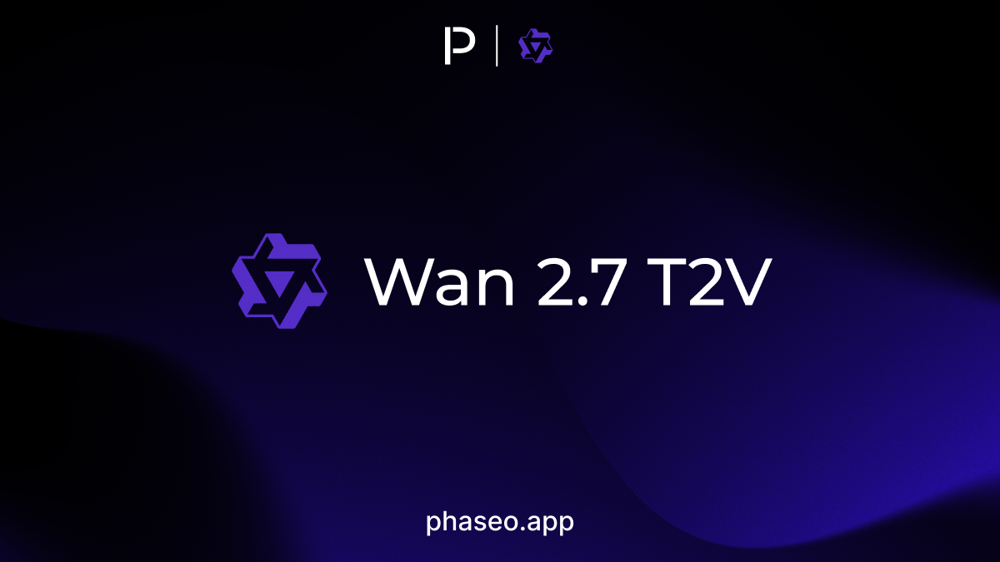

- [Qwen: Wan 2.7 T2V](https://phaseo.app/models/qwen/wan2.7-t2v)

</Update>

<Update label="2. April 2026" tags={["Modellveröffentlichungen"]}>

### Modellveröffentlichungen

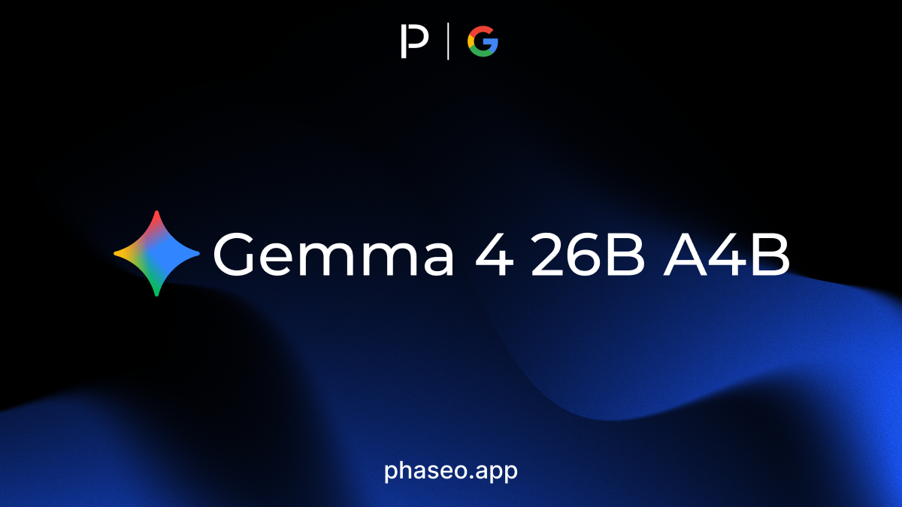

- [Google: Gemma 4 26B A4B](https://phaseo.app/models/google/gemma-4-26b-a4b)
- [Google: Gemma 4 31B](https://phaseo.app/models/google/gemma-4-31b)

</Update>

<Update label="1. April 2026" tags={["Modellveröffentlichungen"]}>

### Modellveröffentlichungen

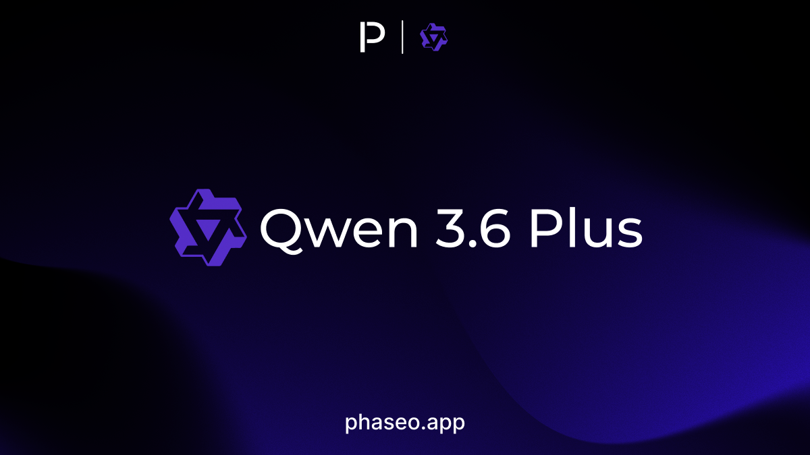

- [Arcee AI: Trinity Large Thinking](https://phaseo.app/models/arcee-ai/trinity-large-thinking)
- [Qwen: Qwen 3.6 Plus](https://phaseo.app/models/qwen/qwen3.6-plus)
- [z.AI: GLM 5V Turbo](https://phaseo.app/models/z-ai/glm-5v-turbo)

</Update>

