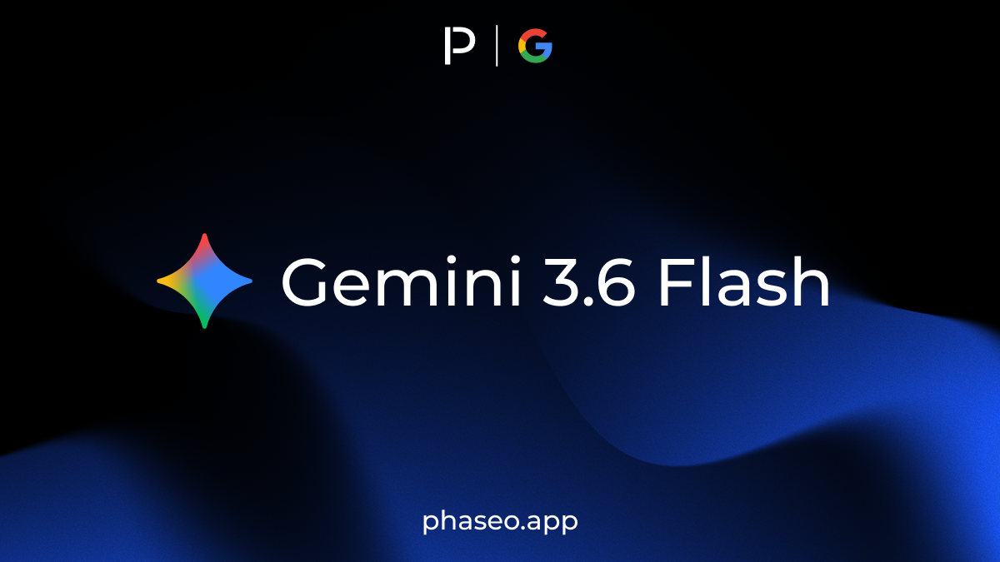
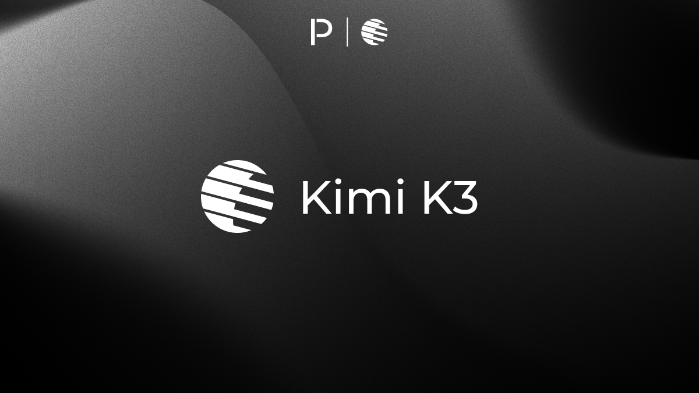
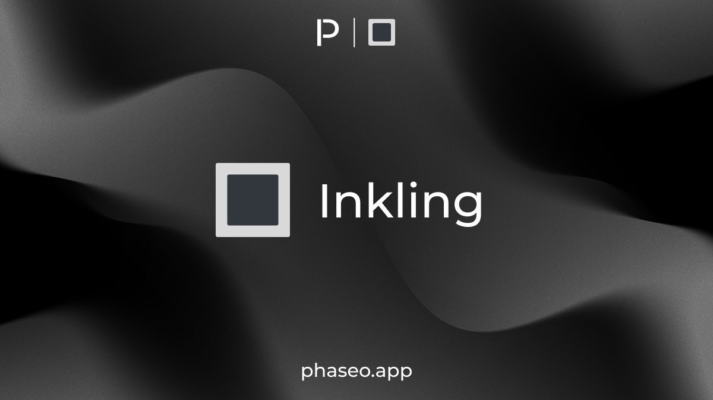
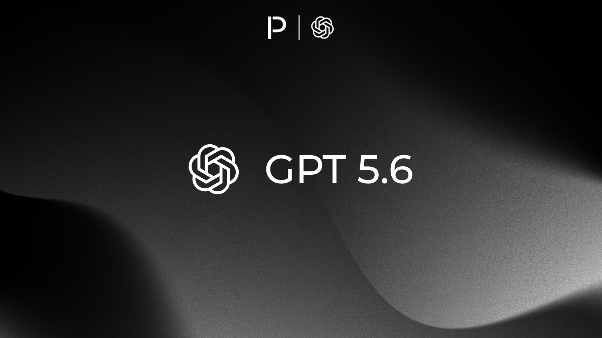
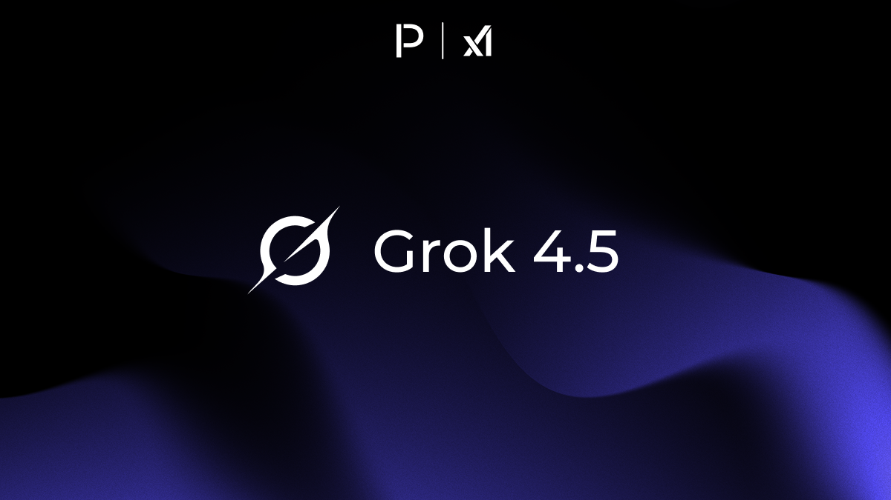
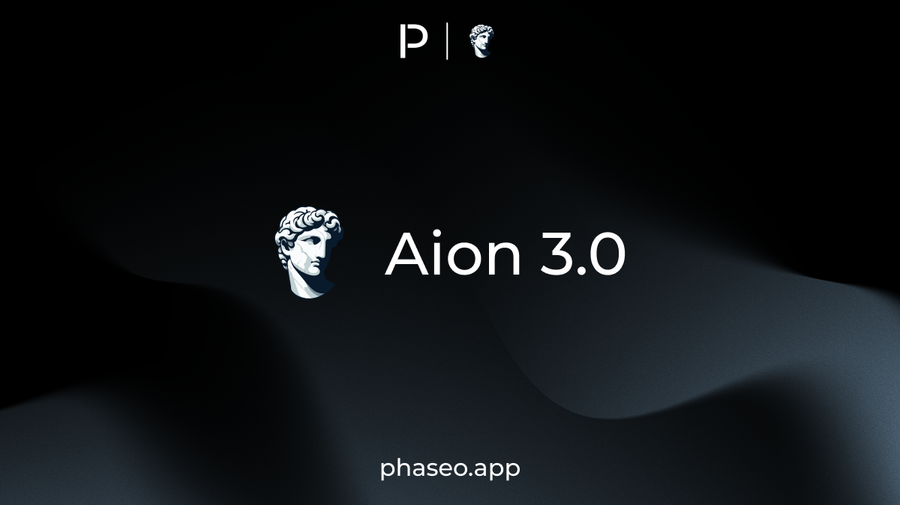
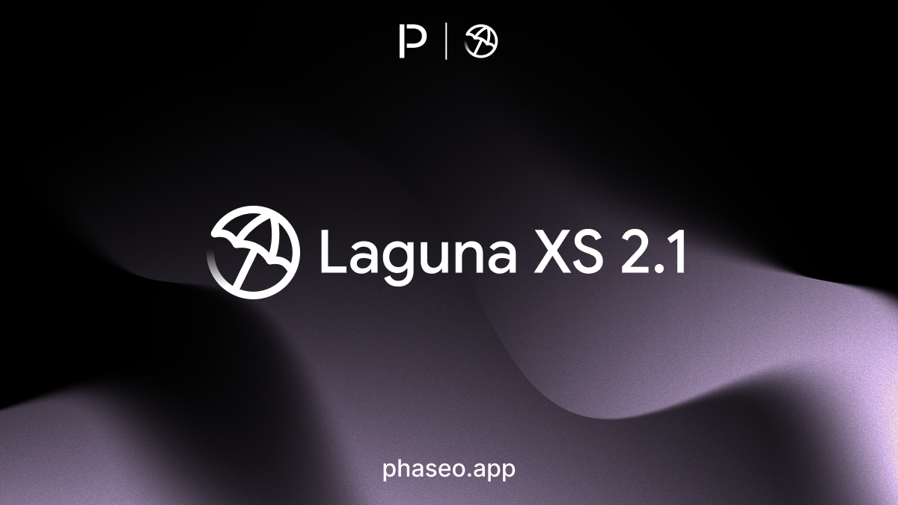

<Update label="31 de julio de 2026" tags={["Lanzamientos de modelos"]}>

### Lanzamientos de modelos

- [DeepSeek: DeepSeek V4 Flash 0731](https://phaseo.app/models/deepseek/deepseek-v4-flash-0731)
- [LG: K-EXAONE 2.0](https://phaseo.app/models/lg/k-exaone-2.0)
- [MiniMax: MiniMax H3](https://phaseo.app/models/minimax/h3)

</Update>

<Update label="30 de julio de 2026" tags={["Lanzamientos de modelos"]}>

### Lanzamientos de modelos

- [Google: Lyria 3.5](https://phaseo.app/models/google/lyria-3.5)
- [Google: Gemini Robotics ER 2 Preview](https://phaseo.app/models/google/gemini-robotics-er-2-preview)
- [Google: Gemini Robotics ER 2 Streaming Preview](https://phaseo.app/models/google/gemini-robotics-er-2-streaming-preview)
- [SpaceXAI: Grok Voice Think Fast 2.0](https://phaseo.app/models/spacex-ai/grok-voice-think-fast-2.0)

</Update>

<Update label="24 de julio de 2026" tags={["Lanzamientos de modelos"]}>

### Lanzamientos de modelos

- [Anthropic: Claude Opus 5](https://phaseo.app/models/anthropic/claude-opus-5)

</Update>

<Update label="23 de julio de 2026" tags={["Lanzamientos de modelos"]}>

### Lanzamientos de modelos

- [Inclusion AI: Ling 3.0 Flash](https://phaseo.app/models/inclusionai/ling-3.0-flash)

</Update>

<Update label="21 de julio de 2026" tags={["Lanzamientos de modelos"]}>

### Lanzamientos de modelos

- [Google: Gemini 3.6 Flash](https://phaseo.app/models/google/gemini-3.6-flash)
- [Google: Gemini 3.5 Flash-Lite](https://phaseo.app/models/google/gemini-3.5-flash-lite)
- [Mind Lab: Macaron V1 Venti](https://phaseo.app/models/mindai/macaron-v1-venti)
- [Sakana AI: Fugu Cyber](https://phaseo.app/models/sakana/fugu-cyber)

</Update>

<Update label="19 de julio de 2026" tags={["Lanzamientos de modelos"]}>

### Lanzamientos de modelos

- [Poolside: Laguna S 2.1](https://phaseo.app/models/poolside/laguna-s-2.1)
- [Qwen: Qwen3.8 Max Preview](https://phaseo.app/models/qwen/qwen3.8-max-preview)

</Update>

<Update label="16 de julio de 2026" tags={["Lanzamientos de modelos"]}>

### Lanzamientos de modelos

- [Moonshot: Kimi K3](https://phaseo.app/models/moonshotai/kimi-k3)

</Update>

<Update label="15 de julio de 2026" tags={["Lanzamientos de modelos"]}>

### Lanzamientos de modelos

- [Thinking Machines Lab: Inkling](https://phaseo.app/models/thinking-machines/inkling)
- [Thinking Machines Lab: Inkling 64K](https://phaseo.app/models/thinking-machines/inkling-64k)
- [Thinking Machines Lab: Inkling Small](https://phaseo.app/models/thinking-machines/inkling-small)

</Update>

<Update label="9 de julio de 2026" tags={["Lanzamientos de modelos"]}>

### Lanzamientos de modelos

- [OpenAI: GPT 5.6 Sol](https://phaseo.app/models/openai/gpt-5.6-sol)
- [OpenAI: GPT 5.6 Terra](https://phaseo.app/models/openai/gpt-5.6-terra)
- [OpenAI: GPT 5.6 Luna](https://phaseo.app/models/openai/gpt-5.6-luna)
- [Meta: Muse Spark 1.1](https://phaseo.app/models/meta/muse-spark-1.1)

</Update>

<Update label="8 de julio de 2026" tags={["Lanzamientos de modelos"]}>

### Lanzamientos de modelos

- [OpenAI: GPT Live 1](https://phaseo.app/models/openai/gpt-live-1)
- [OpenAI: GPT Live 1 Mini](https://phaseo.app/models/openai/gpt-live-1-mini)
- [SpaceXAI: Grok 4.5](https://phaseo.app/models/spacex-ai/grok-4.5)
- [KwaiKAT: Kat Coder Air V2.5](https://phaseo.app/models/kwaipilot/kat-coder-air-v2.5)
- [KwaiKAT: Kat Coder Pro V2.5](https://phaseo.app/models/kwaipilot/kat-coder-pro-v2.5)

</Update>

<Update label="7 de julio de 2026" tags={["Lanzamientos de modelos"]}>

### Lanzamientos de modelos

- [Aion Labs: Aion 3.0](https://phaseo.app/models/aion-labs/aion-3.0)
- [Aion Labs: Aion 3.0 Mini](https://phaseo.app/models/aion-labs/aion-3.0-mini)
- [Meta: Muse Image](https://phaseo.app/models/meta/muse-image)
- [Meta: Muse Video](https://phaseo.app/models/meta/muse-video)
- [Sakana AI: Fugu](https://phaseo.app/models/sakana/fugu)
- [Sakana AI: Fugu Ultra](https://phaseo.app/models/sakana/fugu-ultra)
- [Tencent Hunyuan: Hy3](https://phaseo.app/models/tencent/hy3)

</Update>

<Update label="6 de julio de 2026" tags={["Lanzamientos de modelos"]}>

### Lanzamientos de modelos

- [OpenAI: GPT Realtime 2.1](https://phaseo.app/models/openai/gpt-realtime-2.1)
- [OpenAI: GPT Realtime 2.1 Mini](https://phaseo.app/models/openai/gpt-realtime-2.1-mini)
- [Tencent Hunyuan: Hy3](https://phaseo.app/models/tencent/hy3)

</Update>

<Update label="2 de julio de 2026" tags={["Lanzamientos de modelos"]}>

### Lanzamientos de modelos

- [Poolside: Laguna XS 2.1](https://phaseo.app/models/poolside/laguna-xs-2.1)

</Update>

<Update label="1 de julio de 2026" tags={["Lanzamientos de modelos"]}>

### Lanzamientos de modelos

- [Anthropic: Claude Fable 5](https://phaseo.app/models/anthropic/claude-fable-5)

</Update>

