<Update label="2026年5月31日" tags={["モデルのリリース"]}>

### モデルのリリース

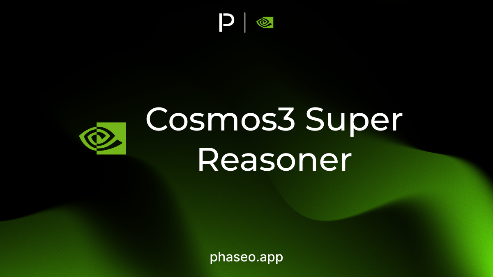

- [Nvidia: Cosmos3 Super Reasoner](https://phaseo.app/models/nvidia/cosmos3-super-reasoner)

</Update>

<Update label="2026年5月30日" tags={["モデルのリリース"]}>

### モデルのリリース

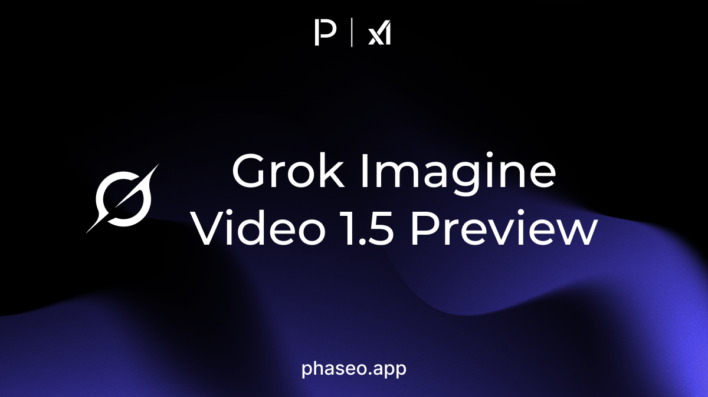

- [xAI: Grok Imagine Video 1.5 Preview](https://phaseo.app/models/x-ai/grok-imagine-video-1.5-preview)

</Update>

<Update label="2026年5月29日" tags={["モデルのリリース"]}>

### モデルのリリース

- [StepFun: Step 3.7 Flash](https://phaseo.app/models/stepfun/step-3.7-flash)

</Update>

<Update label="2026年5月28日" tags={["機能","モデルのリリース","プロバイダー対応","料金"]}>

### 機能

- 料金セレクターでQwen 3.7 Maxの各バリエーションを分かりやすく表示し、プレビュー版、日付付き、現行のモデルルートを区別しやすくしました ([PR #418](https://github.com/phaseoteam/Phaseo/pull/418)).
- AWS上のAnthropicプロバイダー表記を見直し、プロバイダー一覧でBedrockとClaude Platformのルートを区別しやすくしました ([PR #415](https://github.com/phaseoteam/Phaseo/pull/415)).

### モデルのリリース

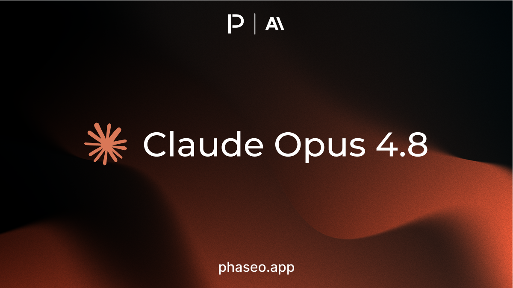

- [Anthropic: Claude Opus 4.8](https://phaseo.app/models/anthropic/claude-opus-4.8)
- [CrofAI: Greg RP](https://phaseo.app/models/crofai/greg-rp)
- [Google: Gemini 3 Pro Image (Nano Banana Pro)](https://phaseo.app/models/google/gemini-3-pro-image)
- [Google: Gemini 3.1 Flash Image (Nano Banana 2)](https://phaseo.app/models/google/gemini-3.1-flash-image)

</Update>

<Update label="2026年5月26日" tags={["モデルのリリース"]}>

### モデルのリリース

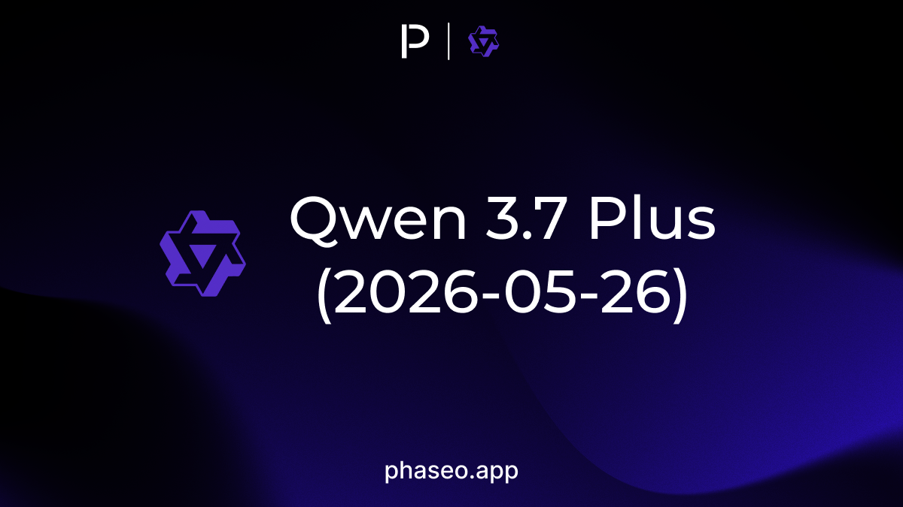

- [Qwen: Qwen 3.7 Plus (2026-05-26)](https://phaseo.app/models/qwen/qwen3.7-plus-2026-05-26)

</Update>

<Update label="2026年5月25日" tags={["モデルのリリース"]}>

### モデルのリリース

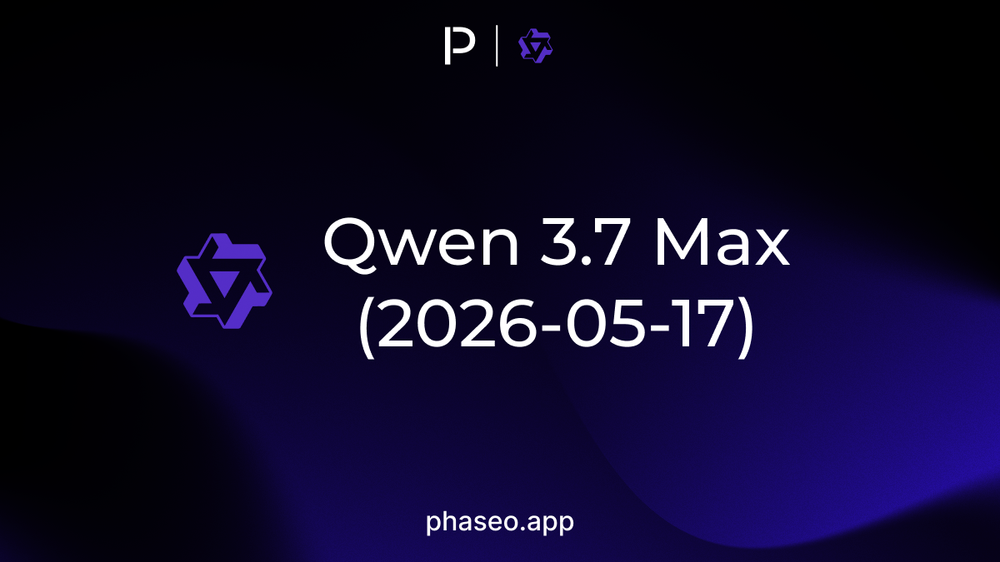

- [Qwen: Qwen 3.7 Max (2026-05-17)](https://phaseo.app/models/qwen/qwen3.7-max-2026-05-17)
- [Qwen: Qwen 3.7 Max Preview](https://phaseo.app/models/qwen/qwen3.7-max-preview)

</Update>

<Update label="2026年5月21日" tags={["モデルのリリース"]}>

### モデルのリリース

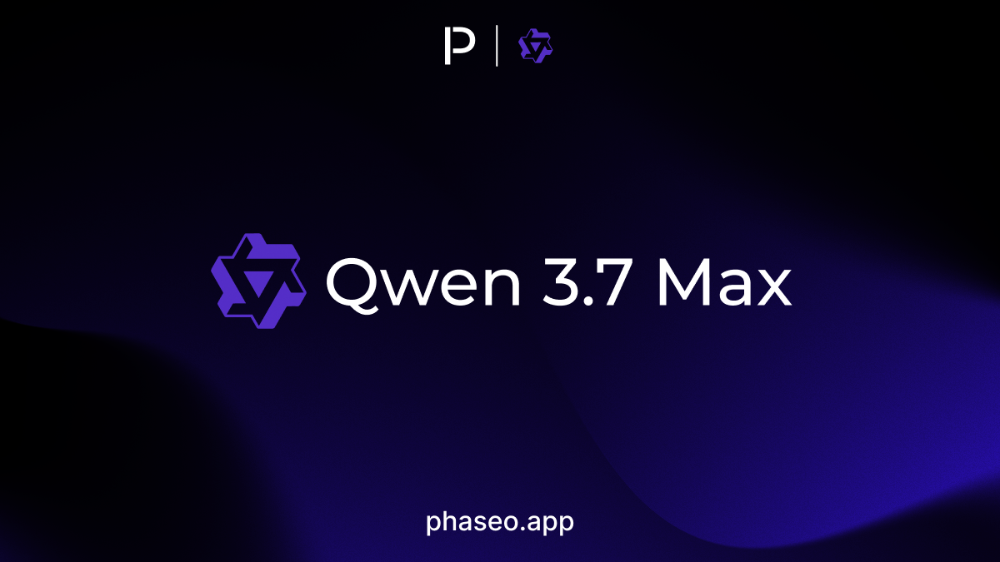

- [Qwen: Qwen 3.7 Max](https://phaseo.app/models/qwen/qwen3.7-max)

</Update>

<Update label="2026年5月20日" tags={["モデルのリリース"]}>

### モデルのリリース

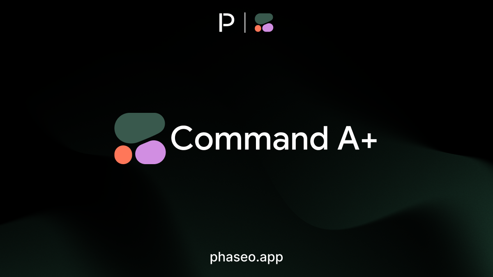

- [Cohere: Command A+](https://phaseo.app/models/cohere/command-a-plus)

</Update>

<Update label="2026年5月19日" tags={["機能","モデルのリリース","SDK","ドキュメント"]}>

### SDKのリリース

- TypeScript Agent SDKの公開に伴い、Phaseo Gateway上でエージェントアプリを構築するための専用パッケージを追加しました ([PR #495](https://github.com/phaseoteam/Phaseo/pull/495)). 参照: [`@phaseo/agent-sdk`](https://github.com/phaseoteam/Phaseo/tree/main/packages/sdk/agent-sdk-ts).

### モデルのリリース

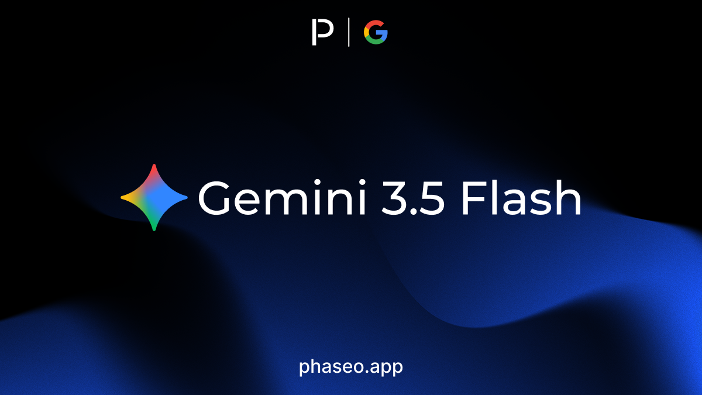

- [Google: Gemini 3.5 Flash](https://phaseo.app/models/google/gemini-3.5-flash)
- [Qwen: Qwen 3.5 LiveTranslate Flash Realtime (2026-05-19)](https://phaseo.app/models/qwen/qwen3.5-livetranslate-flash-realtime-2026-05-19)

</Update>

<Update label="2026年5月18日" tags={["モデルのリリース"]}>

### モデルのリリース

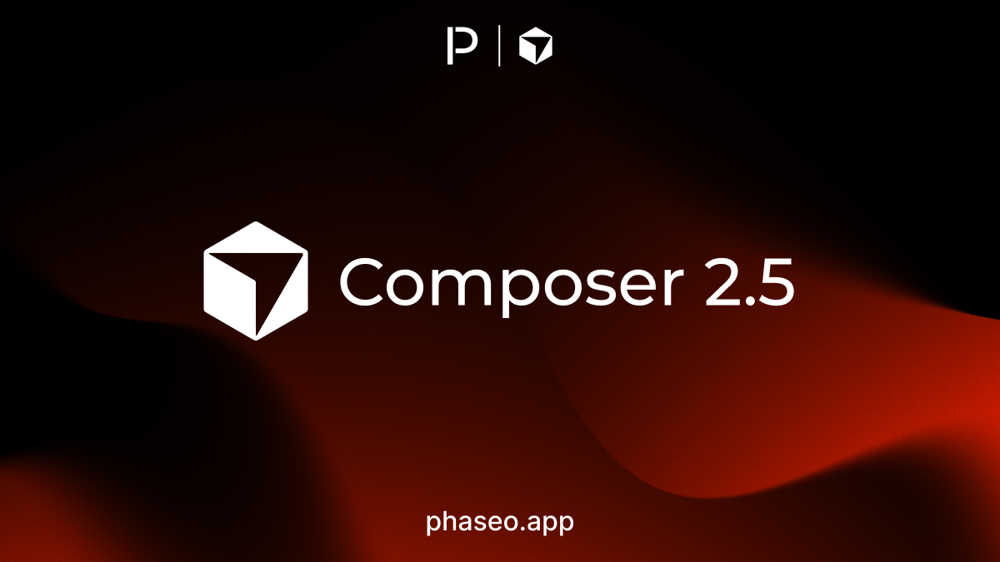

- [Cursor: Composer 2.5](https://phaseo.app/models/cursor/composer-2.5)

</Update>

<Update label="2026年5月16日" tags={["機能","モデルのリリース","プロバイダー対応","SDK","料金","ドキュメント"]}>

### 機能

- プロバイダーの有効化状態と地域フィルターを見直し、リクエスト前に利用できないルートを見分けやすくしました ([PR #495](https://github.com/phaseoteam/Phaseo/pull/495)).
- 無料ルーターの動作を改善し、料金、プロバイダー選択、ゲートウェイルーティングの一貫性を高めました ([PR #495](https://github.com/phaseoteam/Phaseo/pull/495)).

### SDKのリリース

- Agent SDKのドキュメントとサンプルを公開し、永続的なループ、並列ツール、エージェントのオーケストレーションに関する初の公開ガイドを追加しました ([PR #495](https://github.com/phaseoteam/Phaseo/pull/495)).

### モデルのリリース

- [xAI: Grok TTS](https://phaseo.app/models/x-ai/grok-tts)

</Update>

<Update label="2026年5月15日" tags={["モデルのリリース"]}>

### モデルのリリース

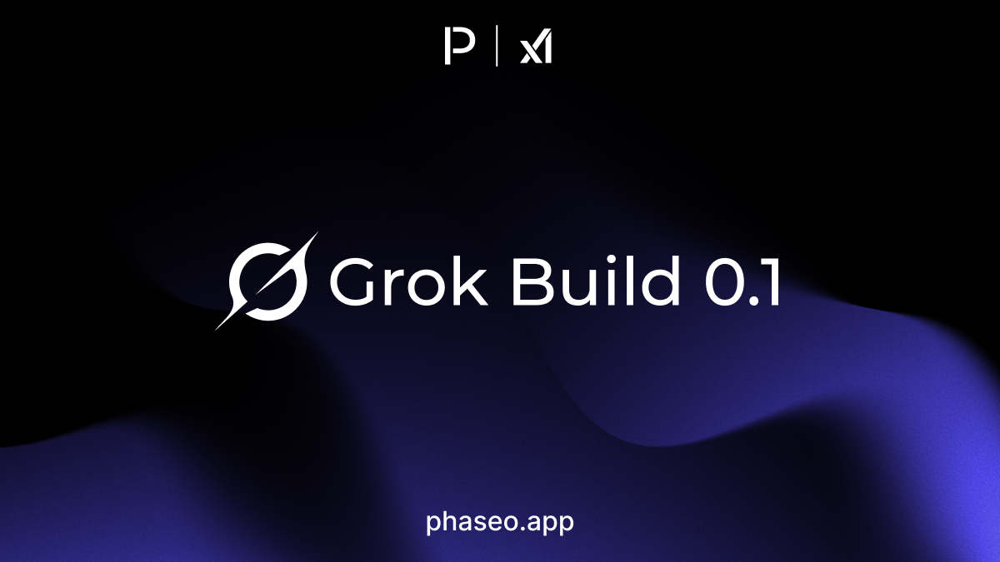

- [xAI: Grok Build 0.1](https://phaseo.app/models/x-ai/grok-build-0.1)

</Update>

<Update label="2026年5月7日" tags={["機能","モデルのリリース","プロバイダー対応","料金"]}>

### 機能

- モデルページでルート、プラン、料金を分かりやすく表示できるよう、プロバイダーの提供状況と料金の概要を拡充しました ([PR #474](https://github.com/phaseoteam/Phaseo/pull/474)).
- リアルタイムの分単位料金を製品に表示し、音声やライブセッションのモデルをトークン課金のモデルと比較しやすくしました ([PR #477](https://github.com/phaseoteam/Phaseo/pull/477)).

### モデルのリリース

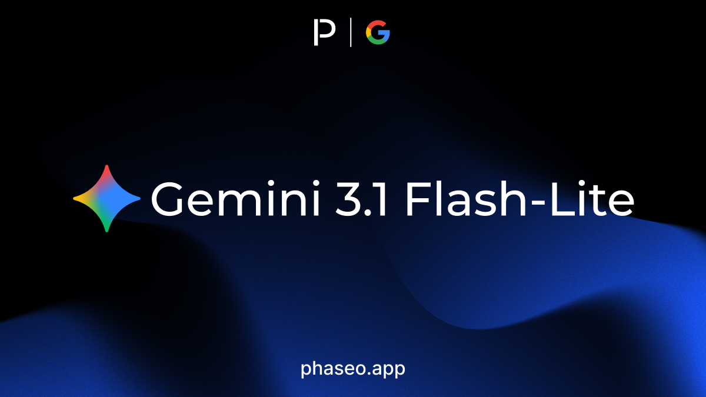

- [Google: Gemini 3.1 Flash-Lite](https://phaseo.app/models/google/gemini-3.1-flash-lite)
- [OpenAI: GPT Realtime 2](https://phaseo.app/models/openai/gpt-realtime-2)
- [OpenAI: GPT Realtime Translate](https://phaseo.app/models/openai/gpt-realtime-translate)
- [OpenAI: GPT Realtime Whisper](https://phaseo.app/models/openai/gpt-realtime-whisper)

</Update>

<Update label="2026年5月6日" tags={["機能","モデルのリリース"]}>

### 機能

- 動画生成と非同期ジョブのライフサイクル対応を拡充し、プロバイダーの長時間処理の状態をより明確にしました ([PR #468](https://github.com/phaseoteam/Phaseo/pull/468)).
- ゲートウェイ画面に予約、完了、失敗の状態を追加し、非同期メディアリクエストをデバッグしやすくしました ([PR #468](https://github.com/phaseoteam/Phaseo/pull/468)).

### モデルのリリース

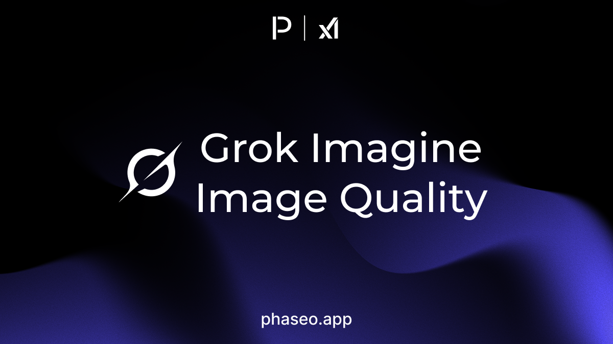

- [xAI: Grok Imagine Image Quality](https://phaseo.app/models/x-ai/grok-imagine-image-quality)

</Update>

<Update label="2026年5月5日" tags={["モデルのリリース"]}>

### モデルのリリース

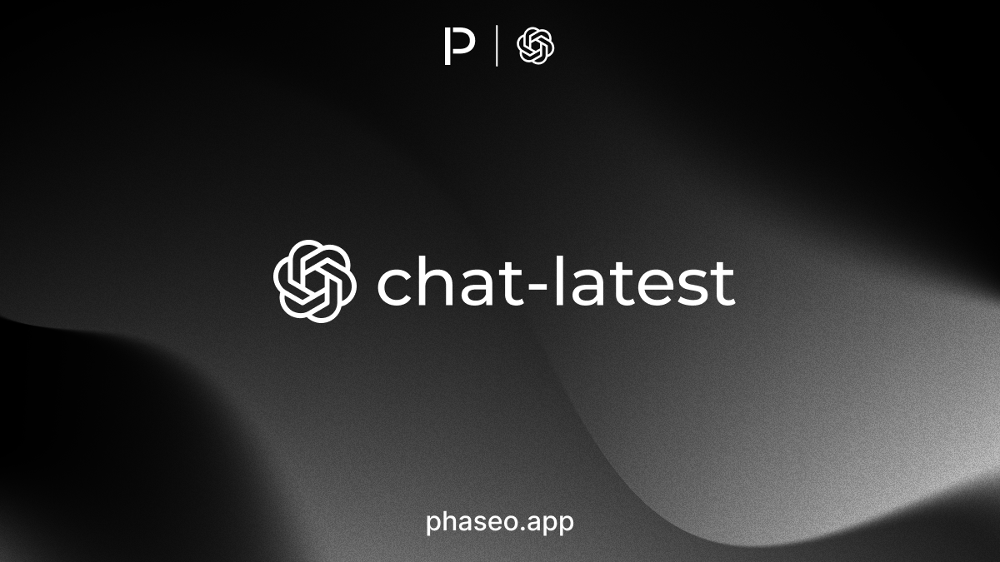

- [OpenAI: chat-latest](https://phaseo.app/models/openai/chat-latest)

</Update>

<Update label="2026年5月1日" tags={["機能","SDK"]}>

### SDKのリリース

- [TypeScript SDK 2.0.4](https://github.com/phaseoteam/Phaseo/releases/tag/%40ai-stats%2Fsdk%402.0.4)最新のゲートウェイスキーマに合わせて、生成済みOpenAPIとモデル関連の更新を適用しました。
- [Python SDK 2.0.4](https://github.com/phaseoteam/Phaseo/releases/tag/%40ai-stats%2Fpy-sdk%402.0.4)最新のゲートウェイスキーマに合わせて、生成済みOpenAPIとモデル関連の更新を適用しました。
- [Go SDK 2.0.4](https://github.com/phaseoteam/Phaseo/releases/tag/%40ai-stats%2Fgo-sdk%402.0.4)最新のゲートウェイスキーマに合わせて、生成済みOpenAPIとモデル関連の更新を適用しました。
- [C# SDK 2.0.4](https://github.com/phaseoteam/Phaseo/releases/tag/%40ai-stats%2Fcsharp-sdk%402.0.4)最新のゲートウェイスキーマに合わせて、生成済みOpenAPIとモデル関連の更新を適用しました。
- [Java SDK 2.0.4](https://github.com/phaseoteam/Phaseo/releases/tag/%40ai-stats%2Fjava-sdk%402.0.4)最新のゲートウェイスキーマに合わせて、生成済みOpenAPIとモデル関連の更新を適用しました。
- [PHP SDK 2.0.4](https://github.com/phaseoteam/Phaseo/releases/tag/%40ai-stats%2Fphp-sdk%402.0.4)最新のゲートウェイスキーマに合わせて、生成済みOpenAPIとモデル関連の更新を適用しました。
- [Ruby SDK 2.0.4](https://github.com/phaseoteam/Phaseo/releases/tag/%40ai-stats%2Fruby-sdk%402.0.4)最新のゲートウェイスキーマに合わせて、生成済みOpenAPIとモデル関連の更新を適用しました。

</Update>

