<Update label="July 15, 2026" tags={["Model Releases"]}>

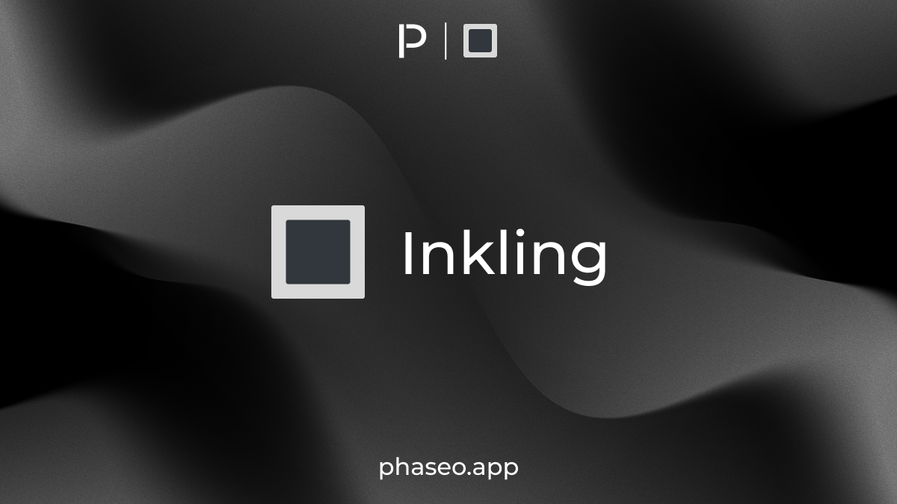

- [Thinking Machines: Inkling](https://phaseo.app/models/thinking-machines/inkling)
- [Thinking Machines: Inkling 64K](https://phaseo.app/models/thinking-machines/inkling-64k)
- [Thinking Machines: Inkling Small](https://phaseo.app/models/thinking-machines/inkling-small)

</Update>

<Update label="July 9, 2026" tags={["Features","Model Releases"]}>

### Features

- Dropdown menus and tab selectors now use Base UI render composition consistently across chat, settings, usage, rankings, and data screens ([PR #938](https://github.com/phaseoteam/Phaseo/pull/938)).
- The OpenAI GPT-5.6 migration guide was added for Sol, Terra, and Luna readiness planning.
- Model links now store human-readable titles alongside link kinds and preserve multiple links of the same kind.
- Amazon Bedrock provider coverage was staged for SpaceXAI Grok 4.3 with Bedrock Mantle model id `xai.grok-4.3`, standard pricing, and current `us-west-2` in-region availability. The provider-model capability is currently disabled pending setup. AWS currently lists Grok 4.3 as the only SpaceXAI model on Bedrock, and does not list Geo or Global inference for it.
- Amazon Bedrock OpenAI frontier model coverage was checked; AWS still documents GPT-5.5 and GPT-5.4 as regional/Geo in-region offerings, with Global cross-region pricing marked as coming soon.

### Model Releases

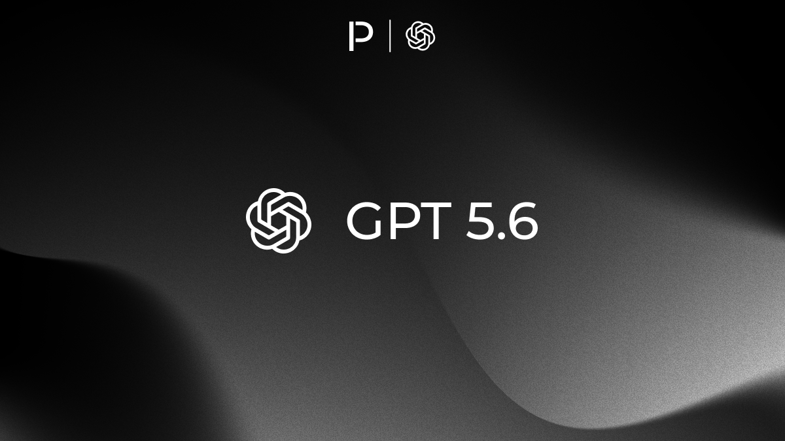

- [OpenAI: GPT 5.6 Sol](https://phaseo.app/models/openai/gpt-5.6-sol)
- [OpenAI: GPT 5.6 Terra](https://phaseo.app/models/openai/gpt-5.6-terra)
- [OpenAI: GPT 5.6 Luna](https://phaseo.app/models/openai/gpt-5.6-luna)
- Muse Spark 1.1 was added with Meta Model API preview metadata, 1M context, benchmark coverage, and titled announcement/API links.

</Update>

<Update label="July 8, 2026" tags={["Model Releases"]}>

### Model Releases

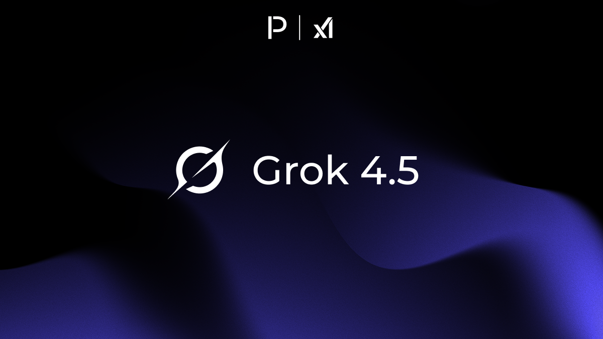

- [OpenAI: GPT Live 1](https://phaseo.app/models/openai/gpt-live-1)
- [OpenAI: GPT Live 1 Mini](https://phaseo.app/models/openai/gpt-live-1-mini)
- [SpaceXAI: Grok 4.5](https://phaseo.app/models/spacex-ai/grok-4.5)
- [KwaiPilot: Kat Coder Air V2.5](https://phaseo.app/models/kwaipilot/kat-coder-air-v2.5)
- [KwaiPilot: Kat Coder Pro V2.5](https://phaseo.app/models/kwaipilot/kat-coder-pro-v2.5)

</Update>

<Update label="July 7, 2026" tags={["Features","Model Releases"]}>

### Features

- Chat now surfaces clearer timing and tool metadata, audio attachments, model-picker focus handling, tag management, and account credit display ([PR #922](https://github.com/phaseoteam/Phaseo/pull/922)).
- Header search now lazy-loads a compact cached index only when opened, reducing normal dashboard payloads ([PR #920](https://github.com/phaseoteam/Phaseo/pull/920)).
- Chat streaming, tool-call continuation, and model catalogue cache refresh paths were hardened for more reliable server-tool turns and model pages ([PR #919](https://github.com/phaseoteam/Phaseo/pull/919), [PR #918](https://github.com/phaseoteam/Phaseo/pull/918)).
- API key reveal flows, internal navigation, and new-model Discord notifications were tightened for cleaner settings, admin, and release workflows ([PR #812](https://github.com/phaseoteam/Phaseo/pull/812), [PR #925](https://github.com/phaseoteam/Phaseo/pull/925), [PR #927](https://github.com/phaseoteam/Phaseo/pull/927)).
- SiliconFlow provider coverage was added for Tencent Hy3, including the free route and current pricing.
- xAI catalogue and provider labels were renamed to SpaceXAI across model pages, provider records, aliases, logos, and generated SDK/OpenAPI surfaces.
- Aion 1.0 and Aion 1.0 Mini were marked deprecated and retired on July 4, 2026 after Aion Labs removed them from the live model endpoint.

### Model Releases

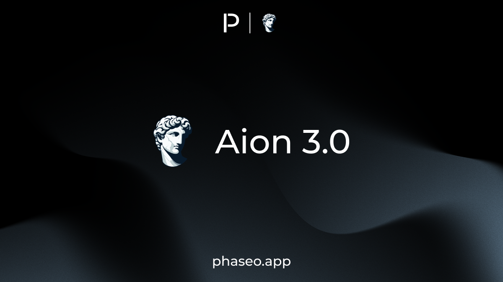

- [Aion Labs: Aion 3.0](https://phaseo.app/models/aion-labs/aion-3.0)
- [Aion Labs: Aion 3.0 Mini](https://phaseo.app/models/aion-labs/aion-3.0-mini)
- [Meta: Muse Image](https://phaseo.app/models/meta/muse-image)
- [Meta: Muse Video](https://phaseo.app/models/meta/muse-video)
- [Sakana: Fugu](https://phaseo.app/models/sakana/fugu)
- [Sakana: Fugu Ultra](https://phaseo.app/models/sakana/fugu-ultra)
- [Tencent: Hy3](https://phaseo.app/models/tencent/hy3)
- Microsoft MAI and Phi catalog entries

</Update>

<Update label="July 9, 2026" tags={["Features","Docs","Branding","Migration"]}>

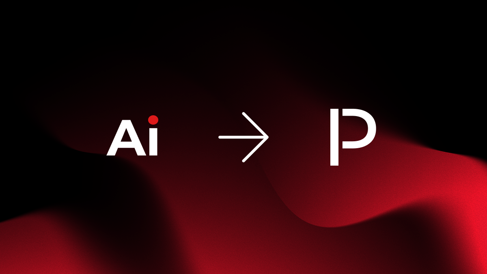

### Features

- AI Stats is now Phaseo across the product, documentation, SDK examples, and public site. Read the migration announcement in [AI Stats is becoming Phaseo](https://phaseo.app/blog/phaseo-migration-2026-07-06).
- New developer-facing examples use Phaseo naming and `PHASEO_*` configuration while existing deployments can keep their current environment-variable names.
- The blog and announcement surfaces were refreshed for the rebrand, including the new migration announcement layout and launch imagery.
- Local, preview, and production builds now use distinct favicons so active environments are easier to tell apart while testing.

</Update>

<Update label="July 6, 2026" tags={["Model Releases","Provider Coverage","Pricing"]}>

### Model Releases

- [OpenAI: GPT Realtime 2.1](https://phaseo.app/models/openai/gpt-realtime-2.1)
- [OpenAI: GPT Realtime 2.1 Mini](https://phaseo.app/models/openai/gpt-realtime-2.1-mini)
- [Tencent: Hy3](https://phaseo.app/models/tencent/hy3)

### Provider Coverage

- Amazon Bedrock Mantle was split into its own provider catalogue with model coverage and pricing for Anthropic, Google, MiniMax, MoonshotAI, NVIDIA, OpenAI, Qwen, SpaceXAI, and Z.AI models.
- AtlasCloud and Novita provider coverage was added for Tencent Hy3, including free-route pricing where available.
- Groq Qwen 3.6 gateway routing was disabled until provider pricing is available.

### Pricing

- DeepSeek V4 Flash and DeepSeek V4 Pro pricing now supports time-windowed provider rates.

</Update>

<Update label="July 5, 2026" tags={["Features"]}>

### Features

- Server-tool inputs, monitor history links, workspace credit cache invalidation, and pricing edge cases were hardened across gateway and web surfaces ([PR #900](https://github.com/phaseoteam/Phaseo/pull/900)).
- Chat gateway target resolution now fails closed in production when the configured gateway URL is missing, while preserving local-development overrides ([PR #899](https://github.com/phaseoteam/Phaseo/pull/899)).
- Anthropic and Bedrock request shaping now uses adaptive thinking controls for Claude Sonnet 5 and newer Opus 4.x models ([PR #901](https://github.com/phaseoteam/Phaseo/pull/901)).
- Server-tool handling was hardened for datetime, web fetch, web search, image generation, and fusion workflows.
- Monitor links now apply stricter URL safety checks.
- GMICloud MiniMax M3 cached-read pricing and Google Vertex Gemini 3.1 Flash-Lite Image pricing validation were tightened.

</Update>

<Update label="July 4, 2026" tags={["Features"]}>

### Features

- Chat shortcuts, prompt queue controls, composer tool configuration, restored tags, bulk editing, and richer response timing metadata shipped together for the chat workspace ([PR #896](https://github.com/phaseoteam/Phaseo/pull/896)).

</Update>

<Update label="July 3, 2026" tags={["Features"]}>

### Features

- Individual model pages were overhauled with clearer lifecycle notices, restored routing details, and better handoffs from model pages into gateway workflows ([PR #888](https://github.com/phaseoteam/Phaseo/pull/888)).
- Retired and replaced model pages now make status, alternatives, and historical context easier to scan without burying the current model link ([PR #888](https://github.com/phaseoteam/Phaseo/pull/888)).
- Chat tags, tool-call markers, API target controls, and mobile viewport handling were restored or tightened across the chat experience ([PR #894](https://github.com/phaseoteam/Phaseo/pull/894), [PR #895](https://github.com/phaseoteam/Phaseo/pull/895), [PR #891](https://github.com/phaseoteam/Phaseo/pull/891)).

</Update>

<Update label="July 2, 2026" tags={["Features","Model Releases"]}>

### Features

- Core interactive UI primitives moved onto Base UI, improving accessibility and behaviour consistency across filters, menus, dialogs, and model controls ([PR #854](https://github.com/phaseoteam/Phaseo/pull/854)).
- Chat and settings flows received follow-up polish after the Base UI migration, including steadier model pickers and cleaner menu spacing ([PR #853](https://github.com/phaseoteam/Phaseo/pull/853)).

### Model Releases

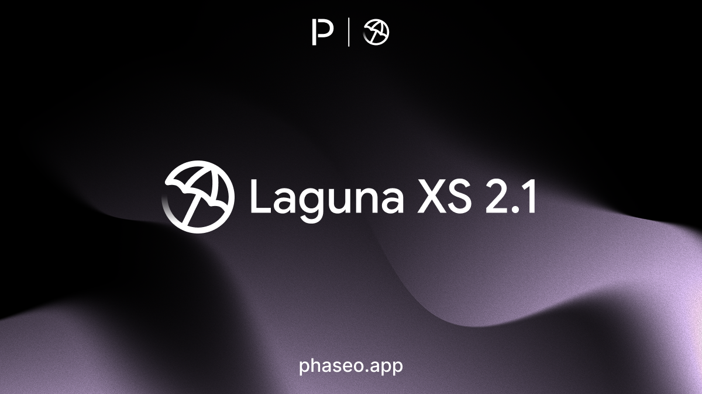

- [Poolside: Laguna XS 2.1](https://phaseo.app/models/poolside/laguna-xs-2.1)

</Update>

<Update label="July 1, 2026" tags={["Model Releases"]}>

### Model Releases

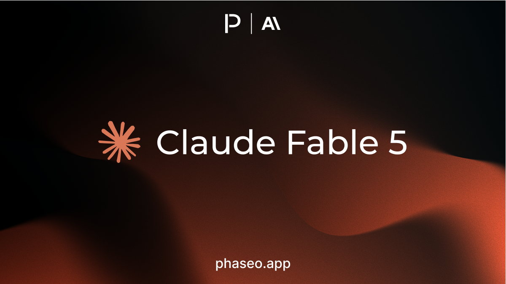

- [Anthropic: Claude Fable 5](https://phaseo.app/models/anthropic/claude-fable-5)

</Update>

<Update label="June 30, 2026" tags={["Features","Model Releases"]}>

### Features

- Pricing calculators now support time-windowed pricing and side-by-side model comparisons, making burst, realtime, and route-specific pricing easier to reason about ([PR #864](https://github.com/phaseoteam/Phaseo/pull/864)).
- The pricing calculator layout was simplified so model, provider, and usage assumptions are easier to adjust before comparing costs ([PR #864](https://github.com/phaseoteam/Phaseo/pull/864)).

### Model Releases

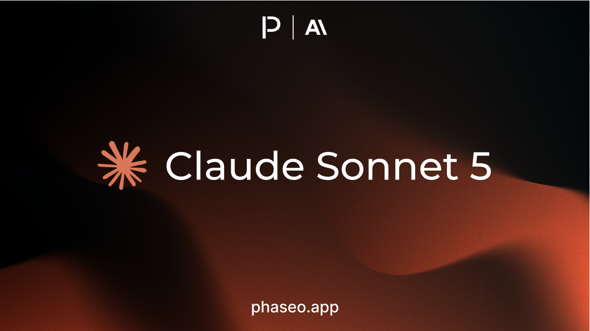

- [Anthropic: Claude Sonnet 5](https://phaseo.app/models/anthropic/claude-sonnet-5)
- [Google: Gemini Omni Flash Preview](https://phaseo.app/models/google/gemini-omni-flash-preview)
- [Mistral: Leanstral 1.5](https://phaseo.app/models/mistral/leanstral-1.5)
- [Mistral: OCR 4](https://phaseo.app/models/mistral/ocr-4)

</Update>

<Update label="June 29, 2026" tags={["Model Releases"]}>

### Model Releases

- [Meituan: LongCat 2.0](https://phaseo.app/models/meituan/longcat-2.0)

</Update>

<Update label="June 23, 2026" tags={["Model Releases"]}>

### Model Releases

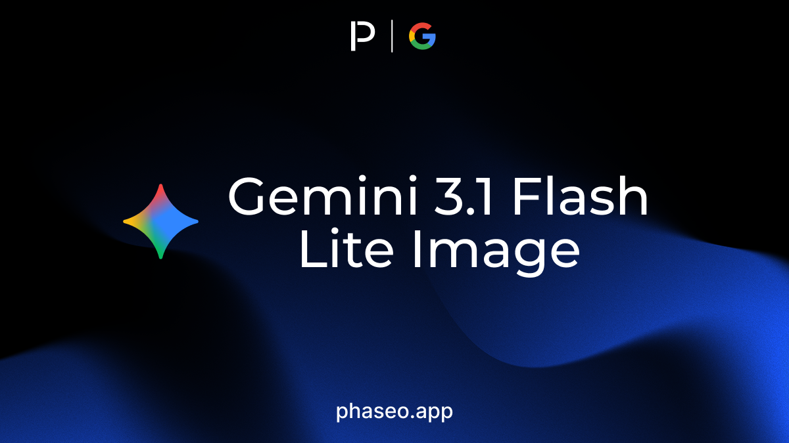

- [Google: Gemini 3.1 Flash Lite image (Nano Banana 2 Lite)](https://phaseo.app/models/google/gemini-3.1-flash-lite-image)

</Update>

<Update label="June 17, 2026" tags={["Model Releases"]}>

### Model Releases

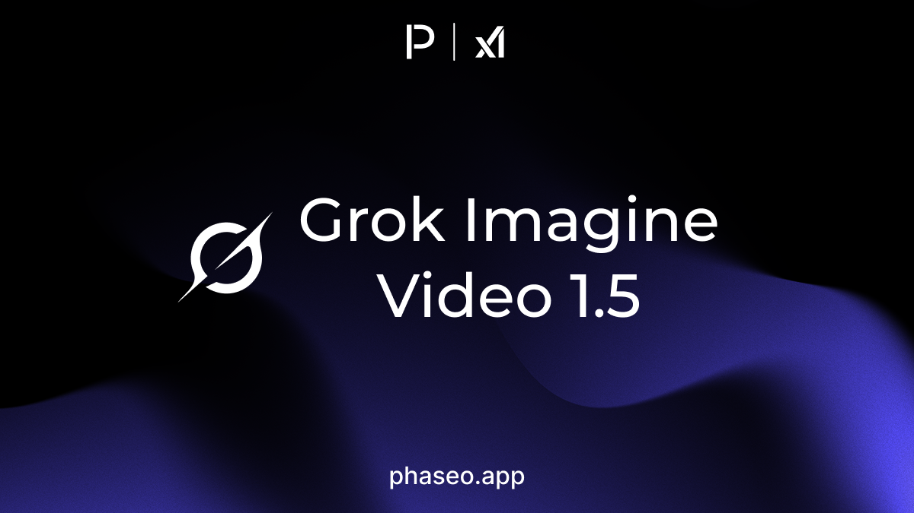

- [xAI: Grok Imagine Video 1.5](https://phaseo.app/models/x-ai/grok-imagine-video-1.5)

</Update>

<Update label="June 16, 2026" tags={["Model Releases"]}>

### Model Releases

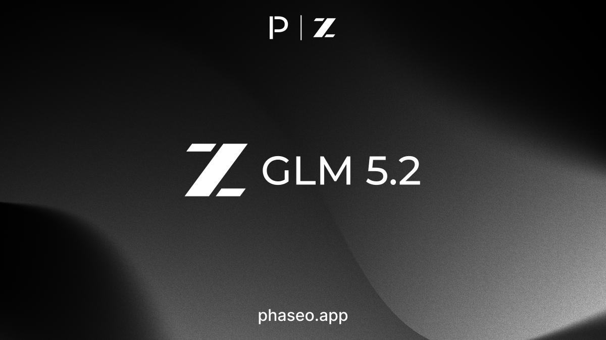

- [z.AI: GLM 5.2](https://phaseo.app/models/z-ai/glm-5.2)

</Update>

<Update label="June 15, 2026" tags={["Model Releases"]}>

### Model Releases

- [ByteDance: Seedance 2.0 Mini (2026-06-15)](https://phaseo.app/models/bytedance/seedance-2.0-mini-260615)

</Update>

<Update label="June 14, 2026" tags={["Model Releases"]}>

### Model Releases

- [CrofAI: Greg 2 Super](https://phaseo.app/models/crofai/greg-2-super)
- [CrofAI: Greg 2 Ultra](https://phaseo.app/models/crofai/greg-2-ultra)

</Update>

<Update label="June 12, 2026" tags={["Model Releases"]}>

### Model Releases

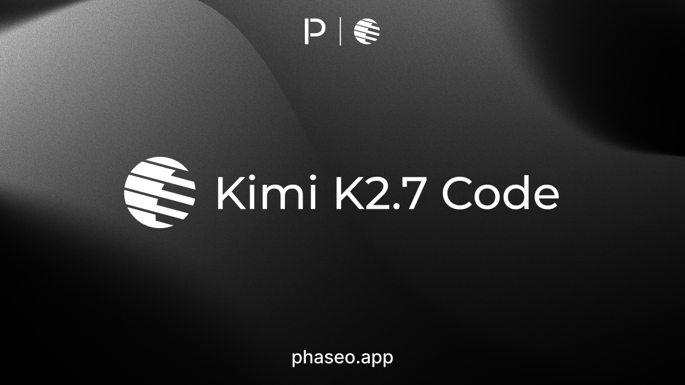

- [Moonshot: Kimi K2.7 Code](https://phaseo.app/models/moonshotai/kimi-k2.7-code)

</Update>

<Update label="June 11, 2026" tags={["Model Releases"]}>

### Model Releases

- [z.AI: GLM 5.2](https://phaseo.app/models/z-ai/glm-5.2)

</Update>

<Update label="June 10, 2026" tags={["Model Releases"]}>

### Model Releases

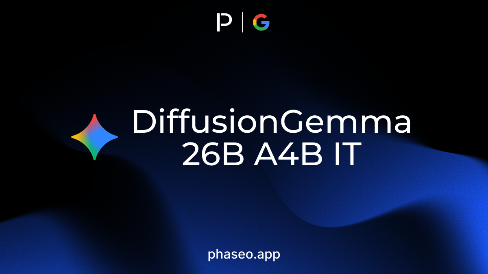

- [Google: DiffusionGemma 26B A4B IT](https://phaseo.app/models/google/diffusiongemma-26b-a4b-it)

</Update>

<Update label="June 9, 2026" tags={["Model Releases"]}>

### Model Releases

- [Anthropic: Claude Fable 5](https://phaseo.app/models/anthropic/claude-fable-5)
- [Anthropic: Claude Mythos 5](https://phaseo.app/models/anthropic/claude-mythos-5)
- [Google: Gemini 3.5 Live Translate Preview](https://phaseo.app/models/google/gemini-3.5-live-translate-preview)

</Update>

<Update label="June 5, 2026" tags={["Model Releases"]}>

### Model Releases

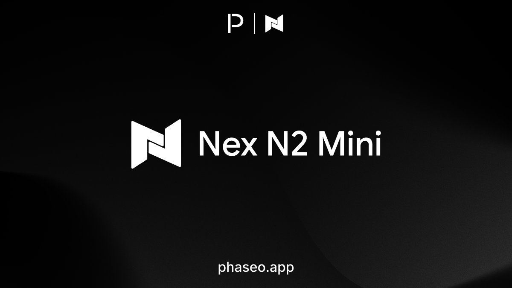

- [Nex AGI: Nex N2 Mini](https://phaseo.app/models/nex-agi/nex-n2-mini)
- [Nex AGI: Nex N2 Pro](https://phaseo.app/models/nex-agi/nex-n2-pro)

</Update>

<Update label="June 3, 2026" tags={["Model Releases"]}>

### Model Releases

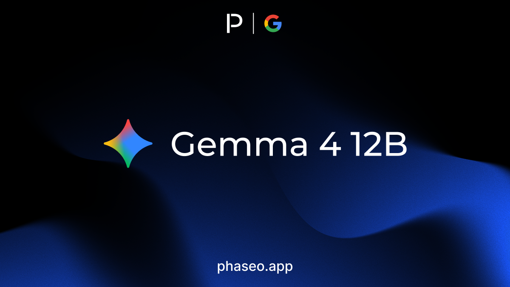

- [Google: Gemma 4 12B](https://phaseo.app/models/google/gemma-4-12b)

</Update>

<Update label="June 1, 2026" tags={["Model Releases"]}>

### Model Releases

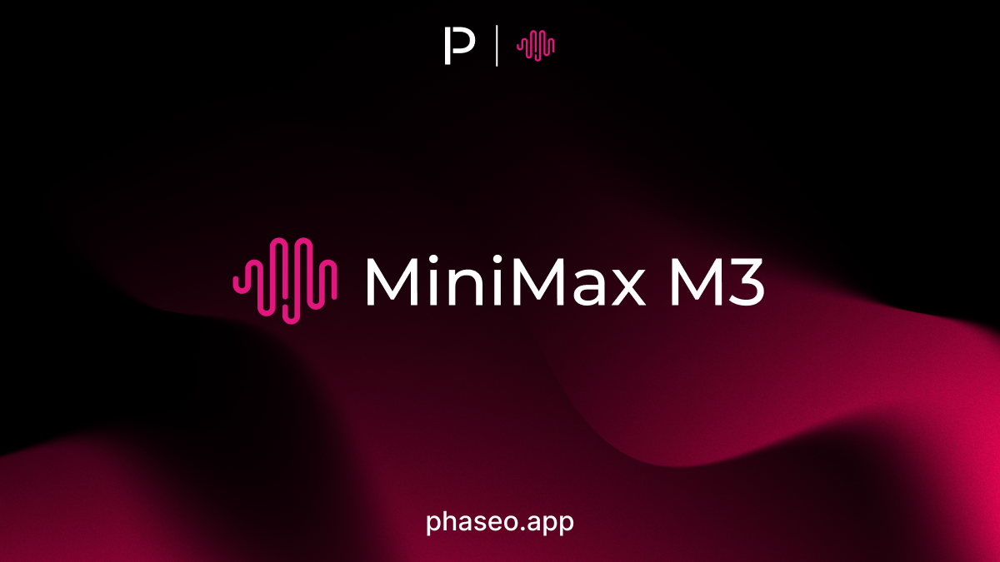

- [MiniMax: MiniMax M3](https://phaseo.app/models/minimax/minimax-m3)
- [Nvidia: Nemotron 3 Ultra](https://phaseo.app/models/nvidia/nemotron-3-ultra-550b-a55b)
- [Qwen: Qwen 3.7 Plus](https://phaseo.app/models/qwen/qwen3.7-plus)

</Update>

<Update label="May 31, 2026" tags={["Model Releases"]}>

### Model Releases

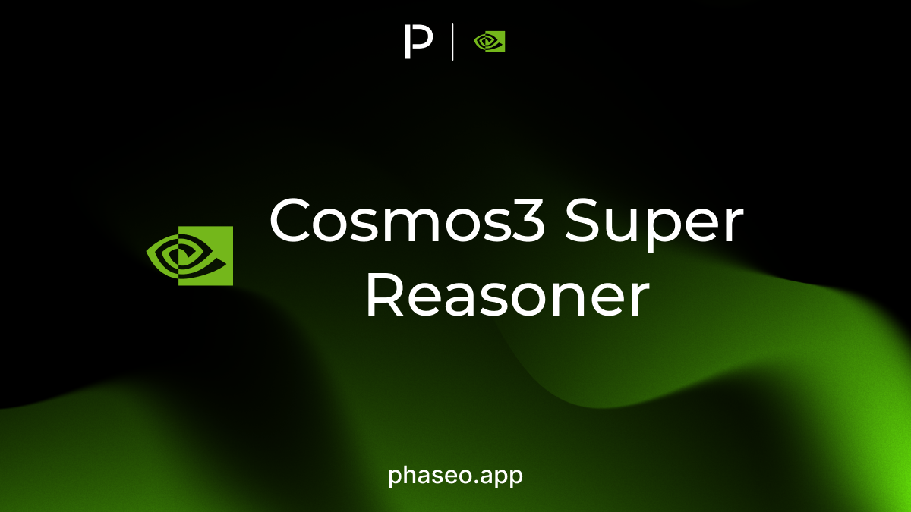

- [Nvidia: Cosmos3 Super Reasoner](https://phaseo.app/models/nvidia/cosmos3-super-reasoner)

</Update>

<Update label="May 30, 2026" tags={["Model Releases"]}>

### Model Releases

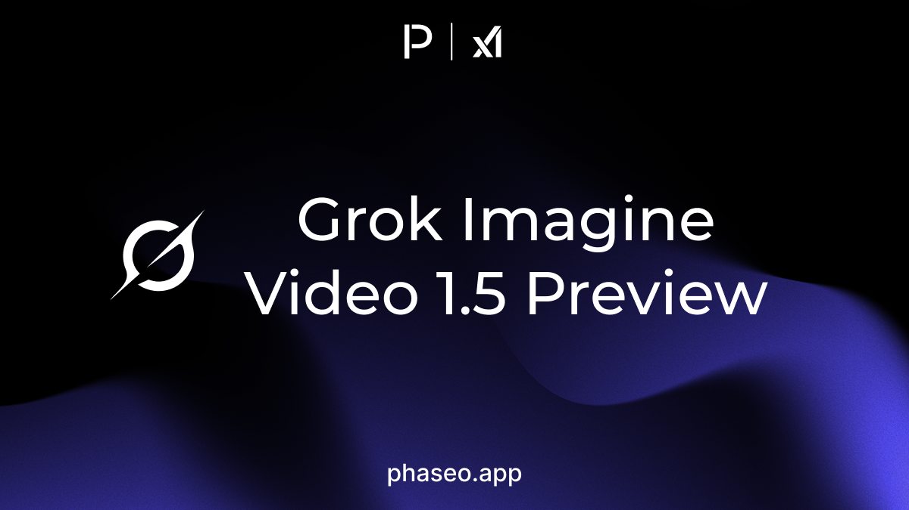

- [xAI: Grok Imagine Video 1.5 Preview](https://phaseo.app/models/x-ai/grok-imagine-video-1.5-preview)

</Update>

<Update label="May 29, 2026" tags={["Model Releases"]}>

### Model Releases

- [StepFun: Step 3.7 Flash](https://phaseo.app/models/stepfun/step-3.7-flash)

</Update>

<Update label="May 28, 2026" tags={["Features","Model Releases","Provider Coverage","Pricing"]}>

### Features

- Pricing selectors now present Qwen 3.7 Max variants more clearly, reducing ambiguity between preview, dated, and current model routes ([PR #418](https://github.com/phaseoteam/Phaseo/pull/418)).
- Anthropic-on-AWS provider branding was refreshed so Bedrock and Claude Platform routes are easier to distinguish in provider lists ([PR #415](https://github.com/phaseoteam/Phaseo/pull/415)).

### Model Releases

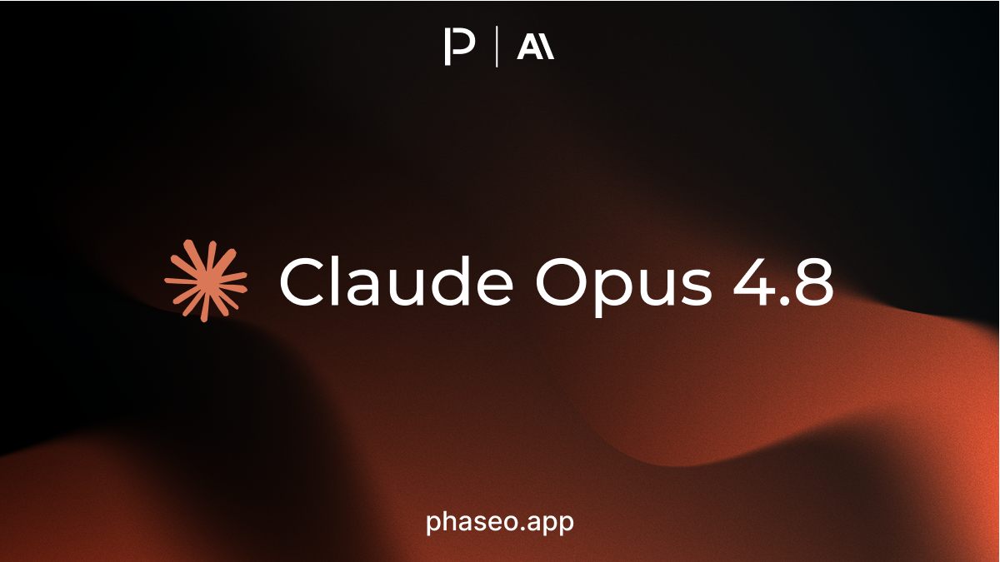

- [Anthropic: Claude Opus 4.8](https://phaseo.app/models/anthropic/claude-opus-4.8)
- [CrofAI: Greg RP](https://phaseo.app/models/crofai/greg-rp)
- [Google: Gemini 3 Pro Image (Nano Banana Pro)](https://phaseo.app/models/google/gemini-3-pro-image)
- [Google: Gemini 3.1 Flash Image (Nano Banana 2)](https://phaseo.app/models/google/gemini-3.1-flash-image)

</Update>

<Update label="May 26, 2026" tags={["Model Releases"]}>

### Model Releases

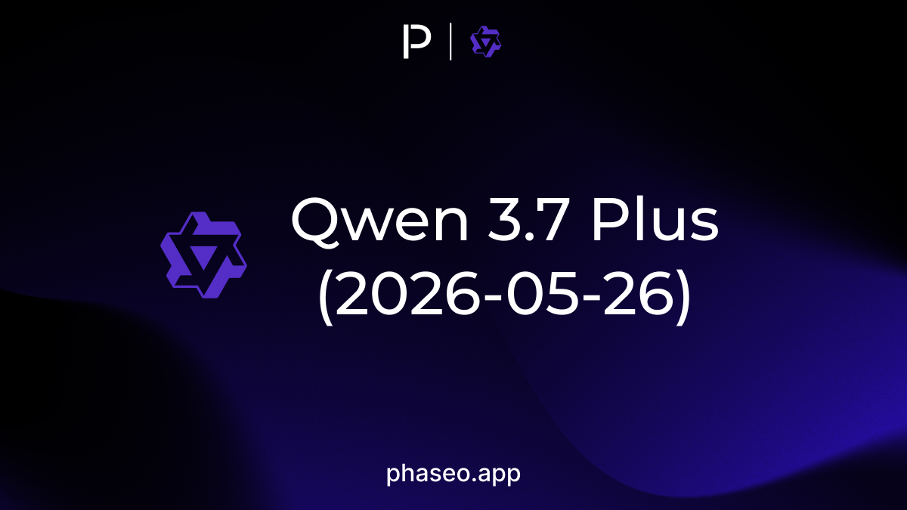

- [Qwen: Qwen 3.7 Plus (2026-05-26)](https://phaseo.app/models/qwen/qwen3.7-plus-2026-05-26)

</Update>

<Update label="May 25, 2026" tags={["Model Releases"]}>

### Model Releases

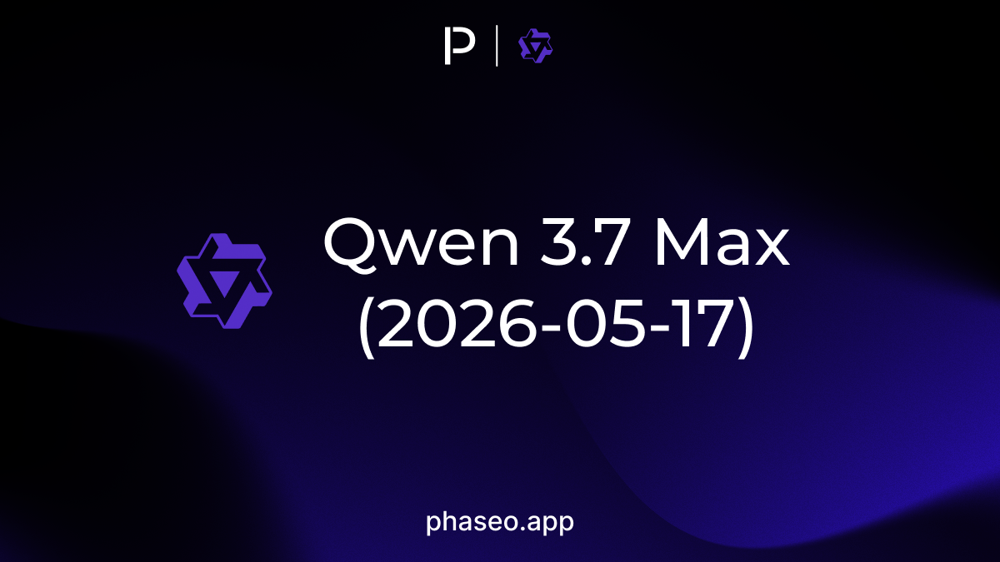

- [Qwen: Qwen 3.7 Max (2026-05-17)](https://phaseo.app/models/qwen/qwen3.7-max-2026-05-17)
- [Qwen: Qwen 3.7 Max Preview](https://phaseo.app/models/qwen/qwen3.7-max-preview)

</Update>

<Update label="May 21, 2026" tags={["Model Releases"]}>

### Model Releases

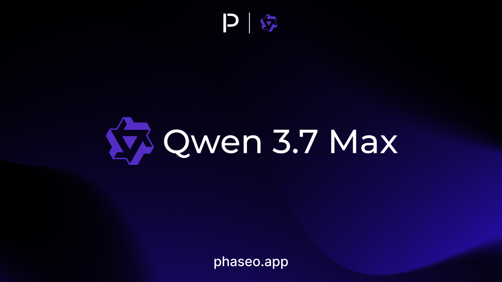

- [Qwen: Qwen 3.7 Max](https://phaseo.app/models/qwen/qwen3.7-max)

</Update>

<Update label="May 20, 2026" tags={["Model Releases"]}>

### Model Releases

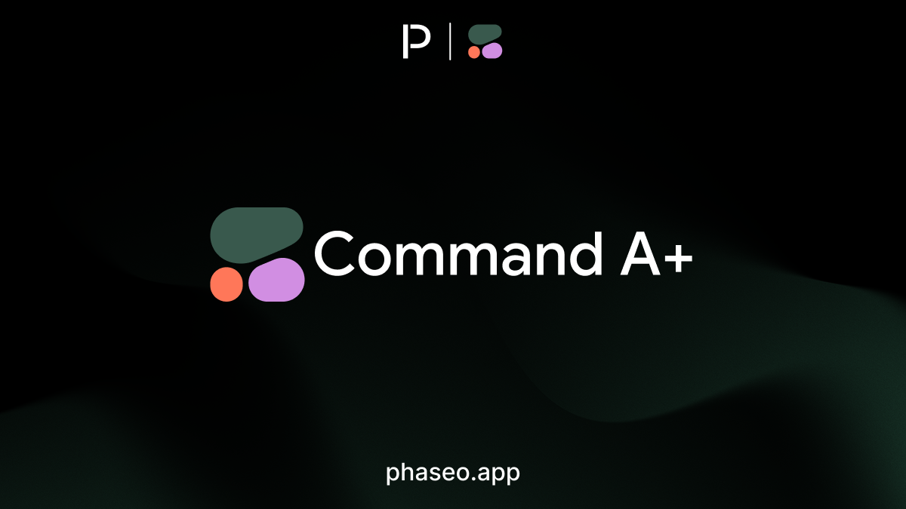

- [Cohere: Command A+](https://phaseo.app/models/cohere/command-a-plus)

</Update>

<Update label="May 19, 2026" tags={["Features","Model Releases","SDK","Docs"]}>

### SDK Releases

- The TypeScript Agent SDK launch added a dedicated package for building agentic applications on top of Phaseo Gateway ([PR #495](https://github.com/phaseoteam/Phaseo/pull/495)). See [`@phaseo/agent-sdk`](https://github.com/phaseoteam/Phaseo/tree/main/packages/sdk/agent-sdk-ts).

### Model Releases

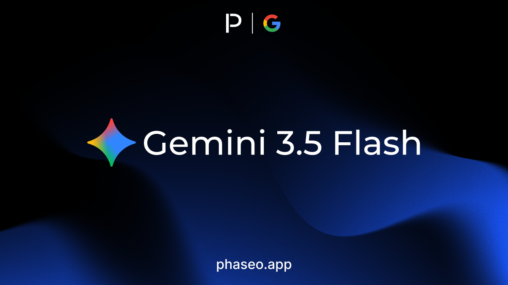

- [Google: Gemini 3.5 Flash](https://phaseo.app/models/google/gemini-3.5-flash)
- [Qwen: Qwen 3.5 LiveTranslate Flash Realtime (2026-05-19)](https://phaseo.app/models/qwen/qwen3.5-livetranslate-flash-realtime-2026-05-19)

</Update>

<Update label="May 18, 2026" tags={["Model Releases"]}>

### Model Releases

- [Cursor: Composer 2.5](https://phaseo.app/models/cursor/composer-2.5)

</Update>

<Update label="May 16, 2026" tags={["Features","Model Releases","Provider Coverage","SDK","Pricing","Docs"]}>

### Features

- Provider activation states and region filters were tightened so unavailable routes are easier to identify before a request is made ([PR #495](https://github.com/phaseoteam/Phaseo/pull/495)).
- Free-router behaviour was made more predictable across pricing, provider selection, and gateway routing surfaces ([PR #495](https://github.com/phaseoteam/Phaseo/pull/495)).

### SDK Releases

- Agent SDK documentation and examples shipped with the first public workflow guidance for durable loops, parallel tools, and agent orchestration ([PR #495](https://github.com/phaseoteam/Phaseo/pull/495)).

### Model Releases

- [xAI: Grok TTS](https://phaseo.app/models/x-ai/grok-tts)

</Update>

<Update label="May 15, 2026" tags={["Model Releases"]}>

### Model Releases

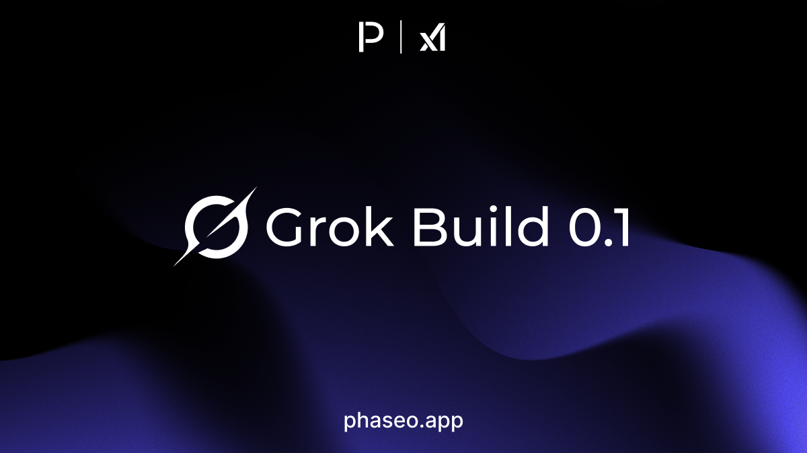

- [xAI: Grok Build 0.1](https://phaseo.app/models/x-ai/grok-build-0.1)

</Update>

<Update label="May 7, 2026" tags={["Features","Model Releases","Provider Coverage","Pricing"]}>

### Features

- Provider availability and pricing summaries were expanded so model pages show clearer route, tier, and cost differences ([PR #474](https://github.com/phaseoteam/Phaseo/pull/474)).
- Realtime minute pricing became visible in the product, making audio and live-session models easier to compare against token-priced models ([PR #477](https://github.com/phaseoteam/Phaseo/pull/477)).

### Model Releases

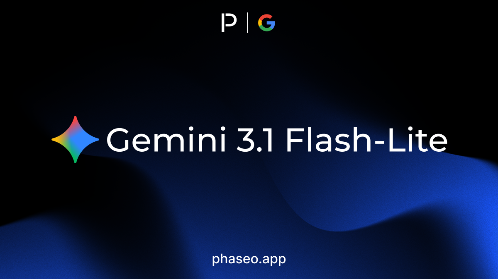

- [Google: Gemini 3.1 Flash-Lite](https://phaseo.app/models/google/gemini-3.1-flash-lite)
- [OpenAI: GPT Realtime 2](https://phaseo.app/models/openai/gpt-realtime-2)
- [OpenAI: GPT Realtime Translate](https://phaseo.app/models/openai/gpt-realtime-translate)
- [OpenAI: GPT Realtime Whisper](https://phaseo.app/models/openai/gpt-realtime-whisper)

</Update>

<Update label="May 6, 2026" tags={["Features","Model Releases"]}>

### Features

- Video generation and async job lifecycle coverage expanded, including clearer status handling for long-running provider work ([PR #468](https://github.com/phaseoteam/Phaseo/pull/468)).
- Gateway surfaces now expose more of the reservation, completion, and failure states needed to debug async media requests ([PR #468](https://github.com/phaseoteam/Phaseo/pull/468)).

### Model Releases

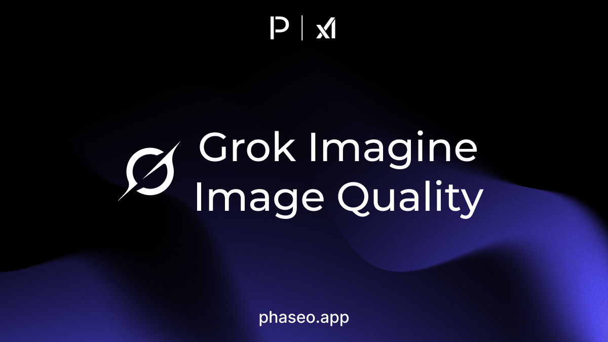

- [xAI: Grok Imagine Image Quality](https://phaseo.app/models/x-ai/grok-imagine-image-quality)

</Update>

<Update label="May 5, 2026" tags={["Model Releases"]}>

### Model Releases

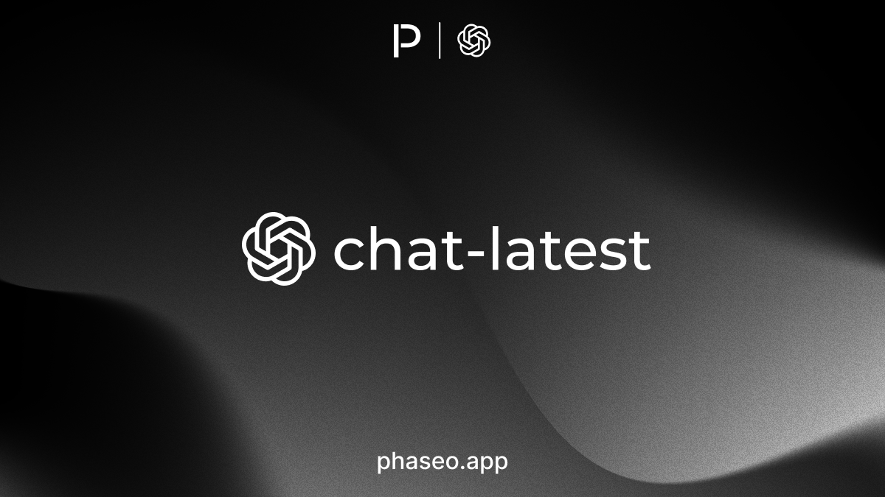

- [OpenAI: chat-latest](https://phaseo.app/models/openai/chat-latest)

</Update>

<Update label="May 1, 2026" tags={["Features","SDK"]}>

### SDK Releases

- [TypeScript SDK 2.0.4](https://github.com/phaseoteam/Phaseo/releases/tag/%40ai-stats%2Fsdk%402.0.4): generated OpenAPI and model-surface updates for the latest gateway schema.
- [Python SDK 2.0.4](https://github.com/phaseoteam/Phaseo/releases/tag/%40ai-stats%2Fpy-sdk%402.0.4): generated OpenAPI and model-surface updates for the latest gateway schema.
- [Go SDK 2.0.4](https://github.com/phaseoteam/Phaseo/releases/tag/%40ai-stats%2Fgo-sdk%402.0.4): generated OpenAPI and model-surface updates for the latest gateway schema.
- [C# SDK 2.0.4](https://github.com/phaseoteam/Phaseo/releases/tag/%40ai-stats%2Fcsharp-sdk%402.0.4): generated OpenAPI and model-surface updates for the latest gateway schema.
- [Java SDK 2.0.4](https://github.com/phaseoteam/Phaseo/releases/tag/%40ai-stats%2Fjava-sdk%402.0.4): generated OpenAPI and model-surface updates for the latest gateway schema.
- [PHP SDK 2.0.4](https://github.com/phaseoteam/Phaseo/releases/tag/%40ai-stats%2Fphp-sdk%402.0.4): generated OpenAPI and model-surface updates for the latest gateway schema.
- [Ruby SDK 2.0.4](https://github.com/phaseoteam/Phaseo/releases/tag/%40ai-stats%2Fruby-sdk%402.0.4): generated OpenAPI and model-surface updates for the latest gateway schema.

</Update>

<Update label="April 30, 2026" tags={["Model Releases"]}>

### Model Releases

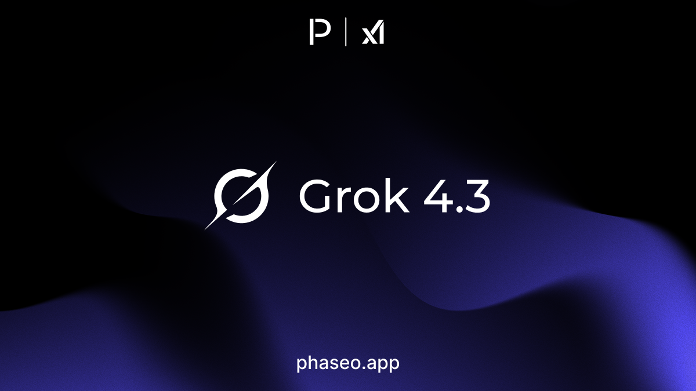

- [xAI: Grok 4.3](https://phaseo.app/models/x-ai/grok-4.3)

</Update>

<Update label="April 29, 2026" tags={["Features","Model Releases","SDK"]}>

### SDK Releases

- SDK `2.0.2` shipped for [TypeScript](https://github.com/phaseoteam/Phaseo/releases/tag/%40ai-stats%2Fsdk%402.0.2), [Python](https://github.com/phaseoteam/Phaseo/releases/tag/%40ai-stats%2Fpy-sdk%402.0.2), [Go](https://github.com/phaseoteam/Phaseo/releases/tag/%40ai-stats%2Fgo-sdk%402.0.2), [C#](https://github.com/phaseoteam/Phaseo/releases/tag/%40ai-stats%2Fcsharp-sdk%402.0.2), [Java](https://github.com/phaseoteam/Phaseo/releases/tag/%40ai-stats%2Fjava-sdk%402.0.2), [PHP](https://github.com/phaseoteam/Phaseo/releases/tag/%40ai-stats%2Fphp-sdk%402.0.2), and [Ruby](https://github.com/phaseoteam/Phaseo/releases/tag/%40ai-stats%2Fruby-sdk%402.0.2).
- This release separated runtime request model IDs from generated callable-helper constants, so newly released models can be used before the next SDK publish.
- Generated helpers now track the current callable-on-gateway snapshot, reducing noisy SDK churn from catalog-only model updates.

### Model Releases

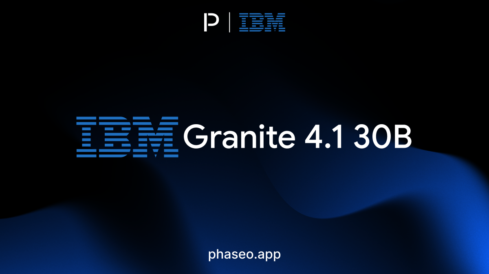

- [IBM: Granite 4.1 30B](https://phaseo.app/models/ibm/granite-4.1-30b)
- [IBM: Granite 4.1 3B](https://phaseo.app/models/ibm/granite-4.1-3b)
- [IBM: Granite 4.1 8B](https://phaseo.app/models/ibm/granite-4.1-8b)
- [Mistral: Mistral Medium 3.5](https://phaseo.app/models/mistral/mistral-medium-3.5)

</Update>

<Update label="April 28, 2026" tags={["Model Releases"]}>

### Model Releases

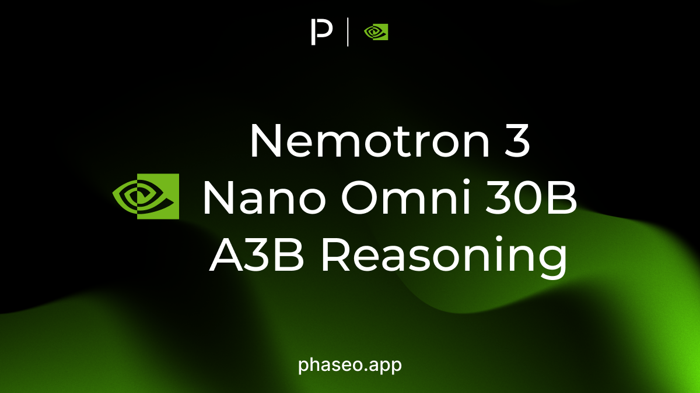

- [ByteDance: Seed 2.0 Lite (2026-04-28)](https://phaseo.app/models/bytedance/seed-2.0-lite-2026-04-28)
- [ByteDance: Seed 2.0 Mini (2026-04-28)](https://phaseo.app/models/bytedance/seed-2.0-mini-2026-04-28)
- [Nvidia: Nemotron 3 Nano Omni 30B A3B Reasoning](https://phaseo.app/models/nvidia/nemotron-3-nano-omni-30b-a3b-reasoning)
- [Poolside: Laguna XS.2](https://phaseo.app/models/poolside/laguna-xs.2)

</Update>

<Update label="April 25, 2026" tags={["Features","Pricing","Model Releases"]}>

### Features

- Low-balance alerts and billing safeguards were expanded so teams get clearer warning before usage runs into account limits ([PR #371](https://github.com/phaseoteam/Phaseo/pull/371)).
- Pricing edge cases now fail more predictably when provider billing rules are incomplete or route metadata changes unexpectedly ([PR #374](https://github.com/phaseoteam/Phaseo/pull/374)).

### Model Releases

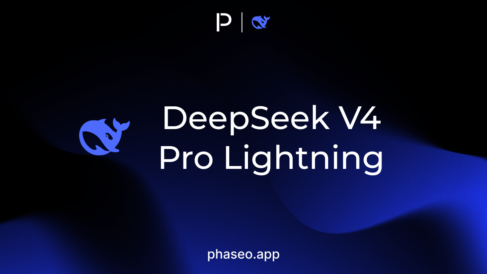

- [DeepSeek: DeepSeek V4 Pro Lightning](https://phaseo.app/models/deepseek/deepseek-v4-pro-lightning)

</Update>

<Update label="April 24, 2026" tags={["Model Releases"]}>

### Model Releases

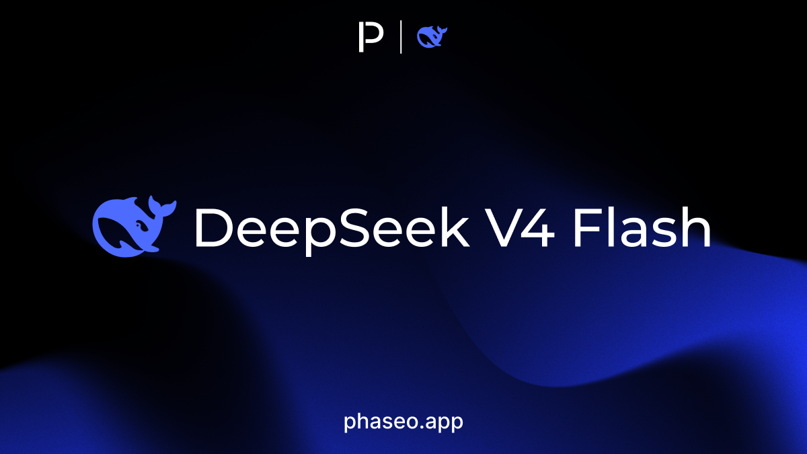

- [DeepSeek: DeepSeek V4 Flash](https://phaseo.app/models/deepseek/deepseek-v4-flash)
- [DeepSeek: DeepSeek V4 Pro](https://phaseo.app/models/deepseek/deepseek-v4-pro)

</Update>

<Update label="April 23, 2026" tags={["Model Releases"]}>

### Model Releases

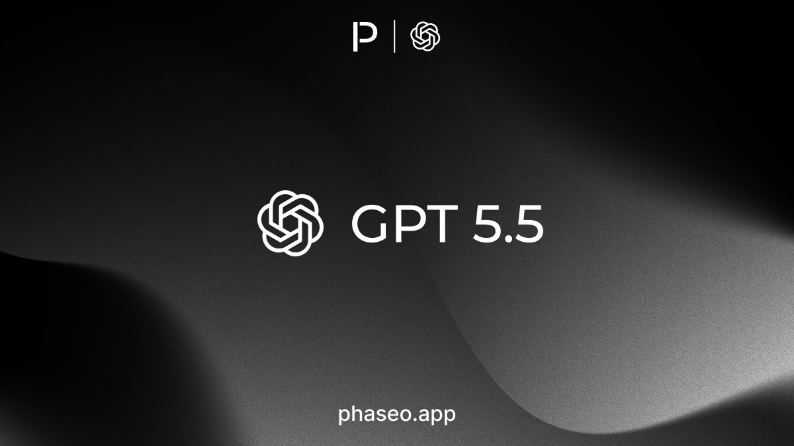

- [OpenAI: GPT 5.5](https://phaseo.app/models/openai/gpt-5.5)
- [OpenAI: GPT 5.5 Pro](https://phaseo.app/models/openai/gpt-5.5-pro)
- [Tencent Hunyuan: Hy3 Preview](https://phaseo.app/models/tencent/hy3-preview)

</Update>

<Update label="April 22, 2026" tags={["Features","SDK","Model Releases"]}>

### Features

- SDK `2.0.0` shipped with regenerated clients and broader parity against the current gateway contract.

### Model Releases

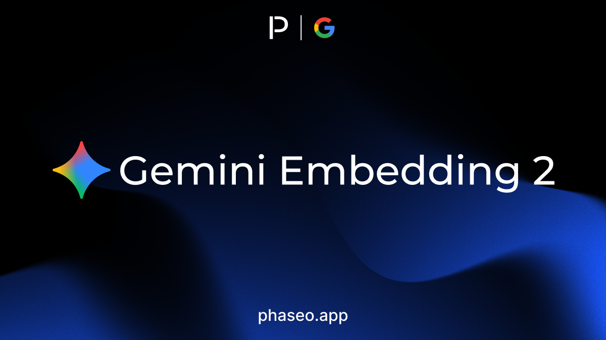

- [Google: Gemini Embedding 2](https://phaseo.app/models/google/gemini-embedding-2)
- [Qwen: Qwen 3.6 27B](https://phaseo.app/models/qwen/qwen3.6-27b)
- [Xiaomi: MiMo V2.5](https://phaseo.app/models/xiaomi/mimo-v2.5)
- [Xiaomi: MiMo V2.5 Pro](https://phaseo.app/models/xiaomi/mimo-v2.5-pro)
- [Xiaomi: MiMo V2.5 TTS](https://phaseo.app/models/xiaomi/mimo-v2.5-tts)

</Update>

<Update label="April 21, 2026" tags={["Features","Model Releases"]}>

### Features

- The announcements hub, workspace management surfaces, and related membership flows shipped.

### Model Releases

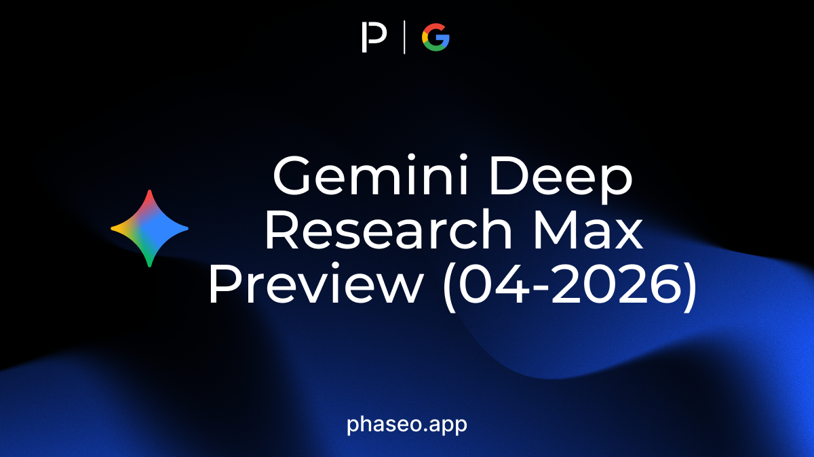

- [Google: Gemini Deep Research Max Preview (04-2026)](https://phaseo.app/models/google/deep-research-max-preview-04-2026)
- [Google: Gemini Deep Research Preview (04-2026)](https://phaseo.app/models/google/deep-research-preview-04-2026)
- [OpenAI: GPT Image 2](https://phaseo.app/models/openai/gpt-image-2)

</Update>

<Update label="April 20, 2026" tags={["Model Releases"]}>

### Model Releases

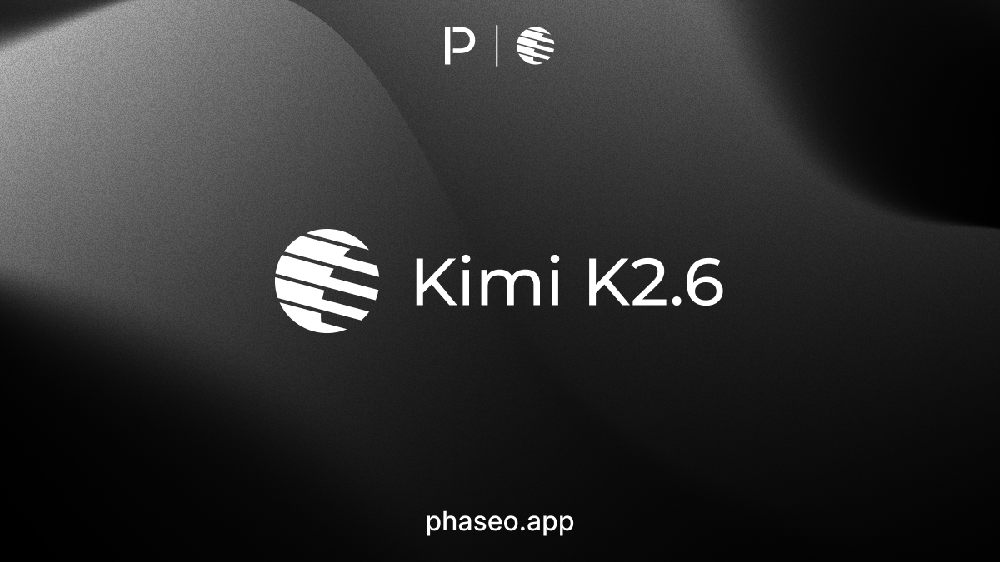

- [Moonshot: Kimi K2.6](https://phaseo.app/models/moonshotai/kimi-k2.6)
- [Qwen: Qwen 3.5 Plus (2026-04-20)](https://phaseo.app/models/qwen/qwen3.5-plus-2026-04-20)

</Update>

<Update label="April 18, 2026" tags={["Features","Model Releases","SDK","Docs"]}>

### Features

- SDK `1.2.0` synced model availability, generated types, and docs with the latest catalog changes.

</Update>

<Update label="April 17, 2026" tags={["Model Releases"]}>

### Model Releases

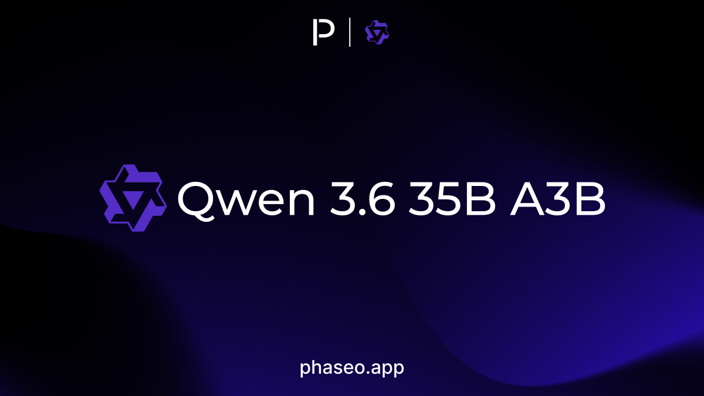

- [Qwen: Qwen 3.6 35B A3B](https://phaseo.app/models/qwen/qwen3.6-35b-a3b)
- [xAI: Grok TTS](https://phaseo.app/models/x-ai/grok-tts)

</Update>

<Update label="April 16, 2026" tags={["Model Releases"]}>

### Model Releases

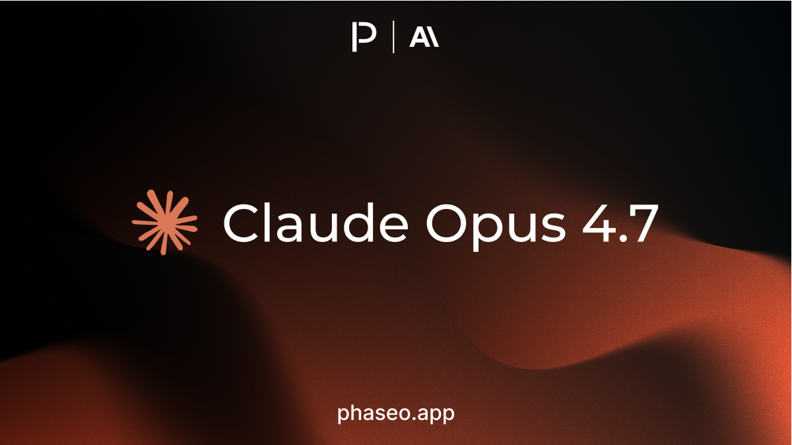

- [Anthropic: Claude Opus 4.7](https://phaseo.app/models/anthropic/claude-opus-4.7)

</Update>

<Update label="April 15, 2026" tags={["Model Releases"]}>

### Model Releases

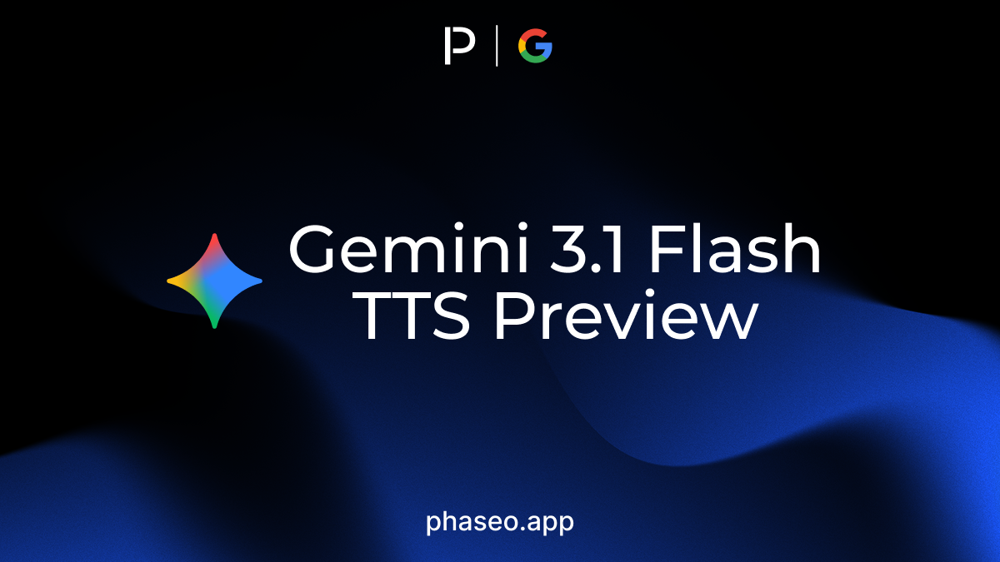

- [Google: Gemini 3.1 Flash TTS Preview](https://phaseo.app/models/google/gemini-3.1-flash-tts-preview)

</Update>

<Update label="April 14, 2026" tags={["Model Releases"]}>

### Model Releases

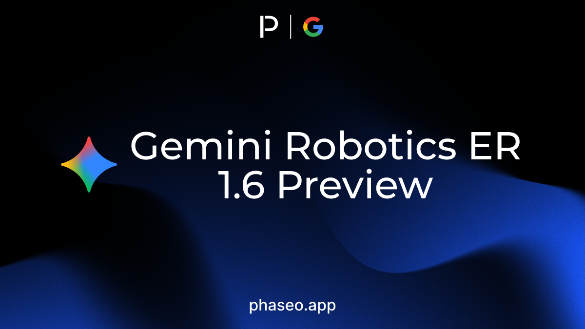

- [Google: Gemini Robotics ER 1.6 Preview](https://phaseo.app/models/google/gemini-robotics-er-1.6-preview)

</Update>

<Update label="April 13, 2026" tags={["Model Releases"]}>

### Model Releases

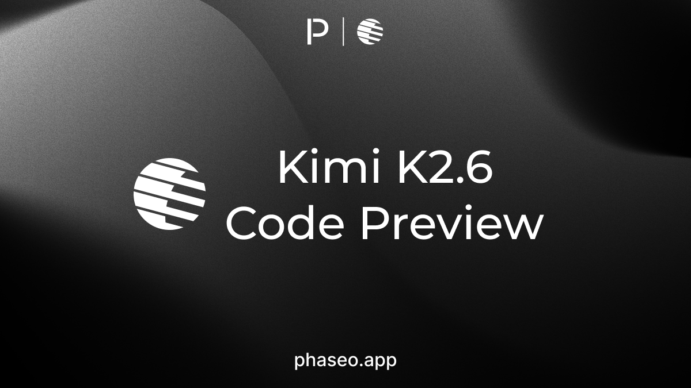

- [Moonshot: Kimi K2.6 Code Preview](https://phaseo.app/models/moonshotai/kimi-k2.6-code-preview)

</Update>

<Update label="April 11, 2026" tags={["Model Releases"]}>

### Model Releases

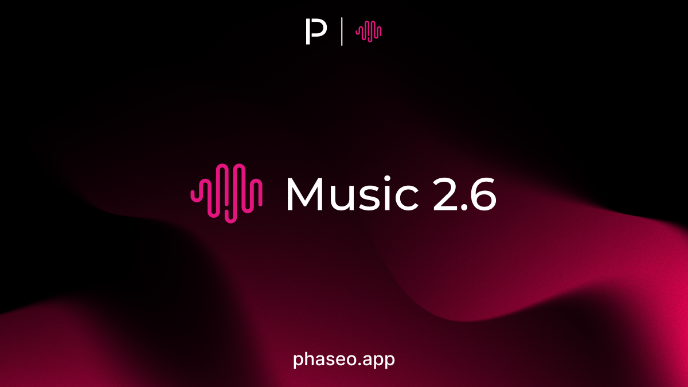

- [MiniMax: Music 2.6](https://phaseo.app/models/minimax/music-2.6)

</Update>

<Update label="April 8, 2026" tags={["Model Releases"]}>

### Model Releases

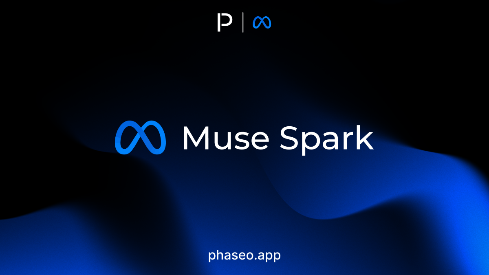

- [Meta: Muse Spark](https://phaseo.app/models/meta/muse-spark)
- [Meta: Muse Spark Contemplating](https://phaseo.app/models/meta/muse-spark-contemplating)

</Update>

<Update label="April 7, 2026" tags={["Model Releases"]}>

### Model Releases

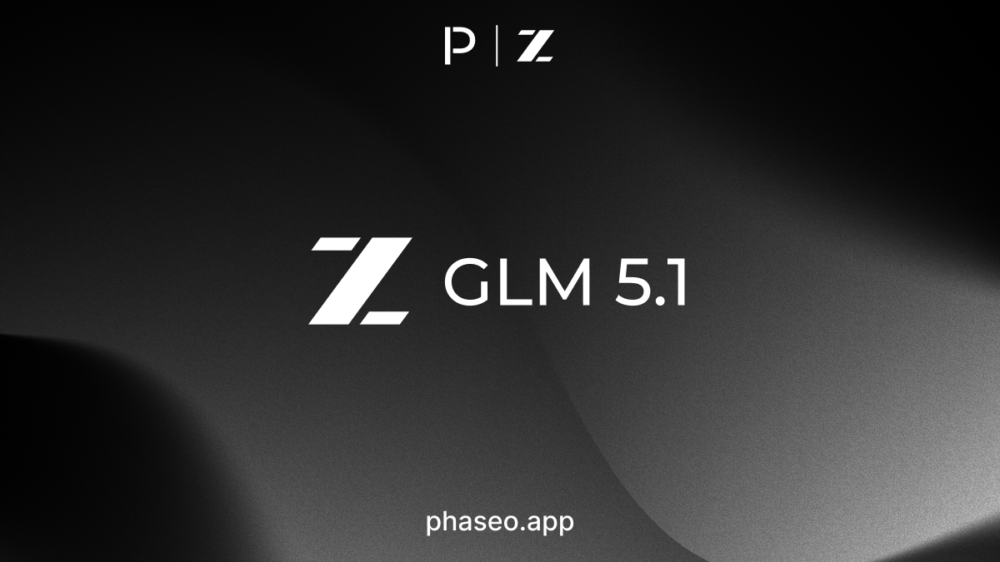

- [z.AI: GLM 5.1](https://phaseo.app/models/z-ai/glm-5.1)

</Update>

<Update label="April 4, 2026" tags={["Features","Model Releases","SDK","Pricing"]}>

### Features

- Mobile model pages, pricing layouts, and free-route visibility were improved, and the Pay As You Go top-up fee dropped to 5%.

</Update>

<Update label="April 3, 2026" tags={["Model Releases"]}>

### Model Releases

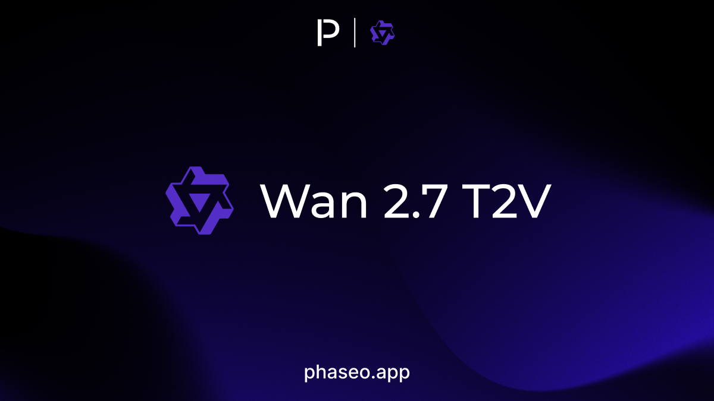

- [Qwen: Wan 2.7 T2V](https://phaseo.app/models/qwen/wan2.7-t2v)

</Update>

<Update label="April 2, 2026" tags={["Model Releases"]}>

### Model Releases

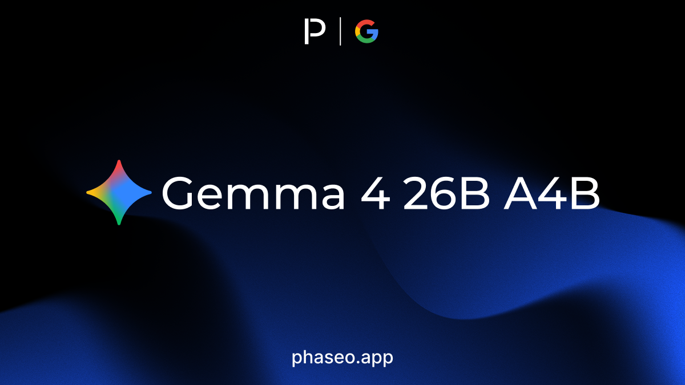

- [Google: Gemma 4 26B A4B](https://phaseo.app/models/google/gemma-4-26b-a4b)
- [Google: Gemma 4 31B](https://phaseo.app/models/google/gemma-4-31b)

</Update>

<Update label="April 1, 2026" tags={["Model Releases"]}>

### Model Releases

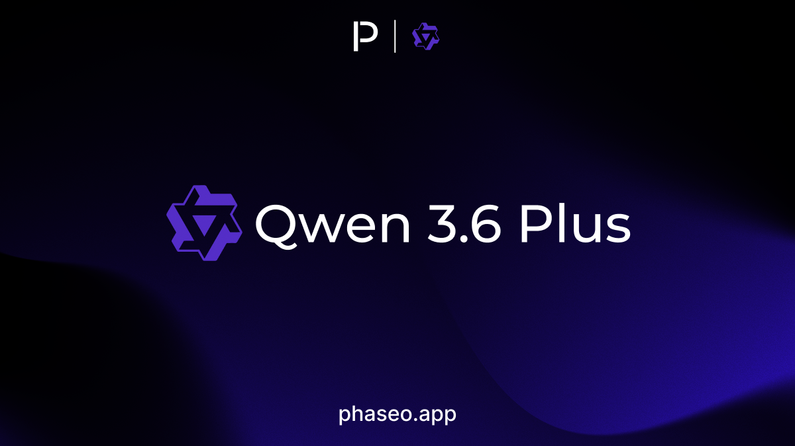

- [Arcee AI: Trinity Large Thinking](https://phaseo.app/models/arcee-ai/trinity-large-thinking)
- [Qwen: Qwen 3.6 Plus](https://phaseo.app/models/qwen/qwen3.6-plus)
- [z.AI: GLM 5V Turbo](https://phaseo.app/models/z-ai/glm-5v-turbo)

</Update>

<Update label="March 31, 2026" tags={["Model Releases"]}>

### Model Releases

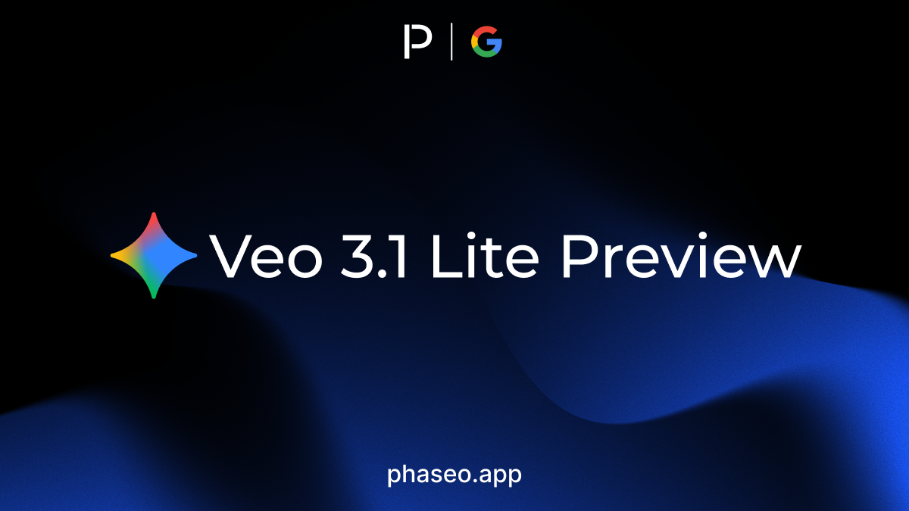

- [Google: Veo 3.1 Lite Preview](https://phaseo.app/models/google/veo-3.1-lite-preview)

</Update>

<Update label="March 23, 2026" tags={["Model Releases"]}>

### Model Releases

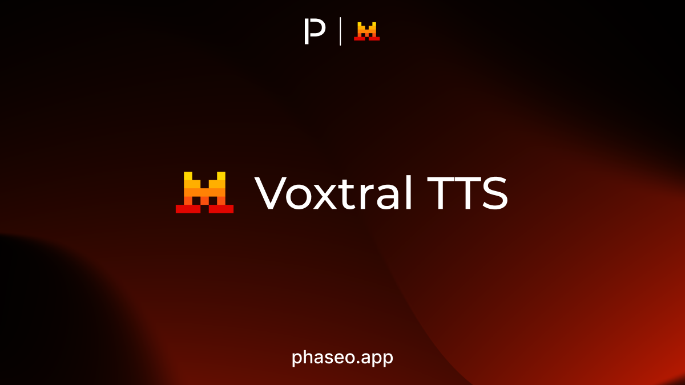

- [Mistral: Voxtral TTS](https://phaseo.app/models/mistral/voxtral-tts)

</Update>

<Update label="March 22, 2026" tags={["Features","Model Releases","SDK"]}>

### Features

- New language SDKs shipped, TypeScript and Python SDKs were overhauled, and chat rooms went multimodal.
- Foundry launched, LLM Council became the first Foundry project, and SDK `1.1.0` aligned model availability and lifecycle warnings with the API.

</Update>

<Update label="March 19, 2026" tags={["Model Releases"]}>

### Model Releases

- [Xiaomi: MiMo V2 Omni](https://phaseo.app/models/xiaomi/mimo-v2-omni)
- [Xiaomi: MiMo V2 Pro](https://phaseo.app/models/xiaomi/mimo-v2-pro)
- [Xiaomi: MiMo V2 TTS](https://phaseo.app/models/xiaomi/mimo-v2-tts)

</Update>

<Update label="March 18, 2026" tags={["Model Releases"]}>

### Model Releases

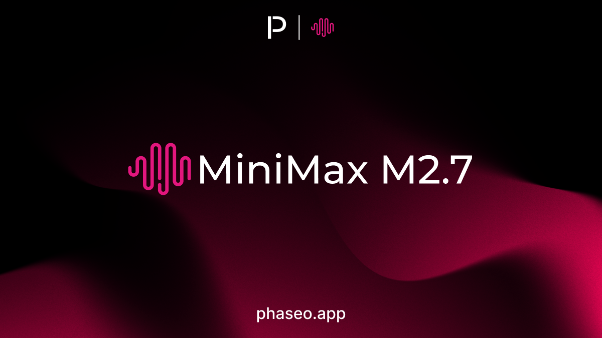

- [MiniMax: MiniMax M2.7](https://phaseo.app/models/minimax/minimax-m2.7)
- [Xiaomi: MiMo V2 Omni](https://phaseo.app/models/xiaomi/mimo-v2-omni)
- [Xiaomi: MiMo V2 Pro](https://phaseo.app/models/xiaomi/mimo-v2-pro)
- [Xiaomi: MiMo V2 TTS](https://phaseo.app/models/xiaomi/mimo-v2-tts)

</Update>

<Update label="March 17, 2026" tags={["Model Releases"]}>

### Model Releases

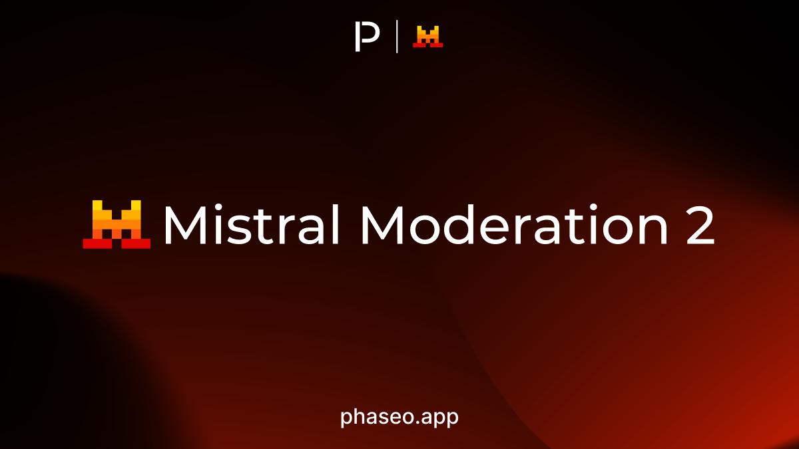

- [Mistral: Mistral Moderation 2](https://phaseo.app/models/mistral/mistral-moderation-2)
- [OpenAI: GPT 5.4 Mini](https://phaseo.app/models/openai/gpt-5.4-mini)
- [OpenAI: GPT 5.4 Nano](https://phaseo.app/models/openai/gpt-5.4-nano)

</Update>

<Update label="March 16, 2026" tags={["Model Releases"]}>

### Model Releases

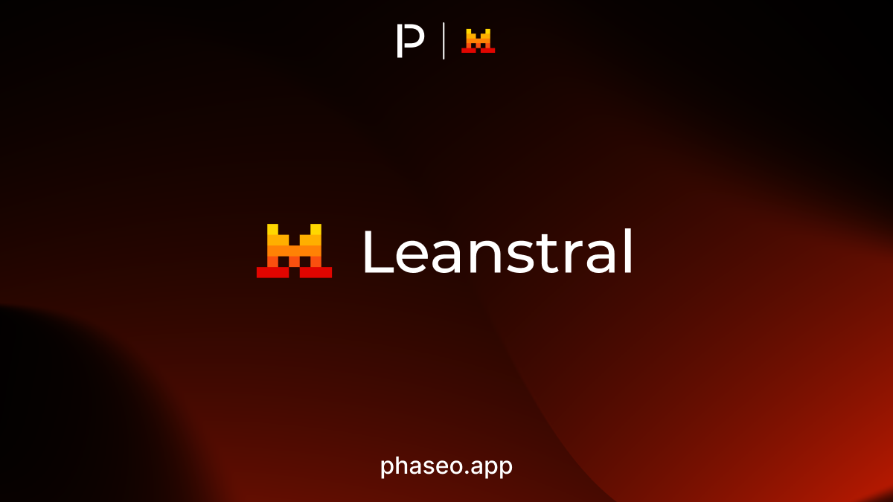

- [Mistral: Leanstral](https://phaseo.app/models/mistral/leanstral)
- [Mistral: Mistral Small 4](https://phaseo.app/models/mistral/mistral-small-4)

</Update>

<Update label="March 15, 2026" tags={["Model Releases"]}>

### Model Releases

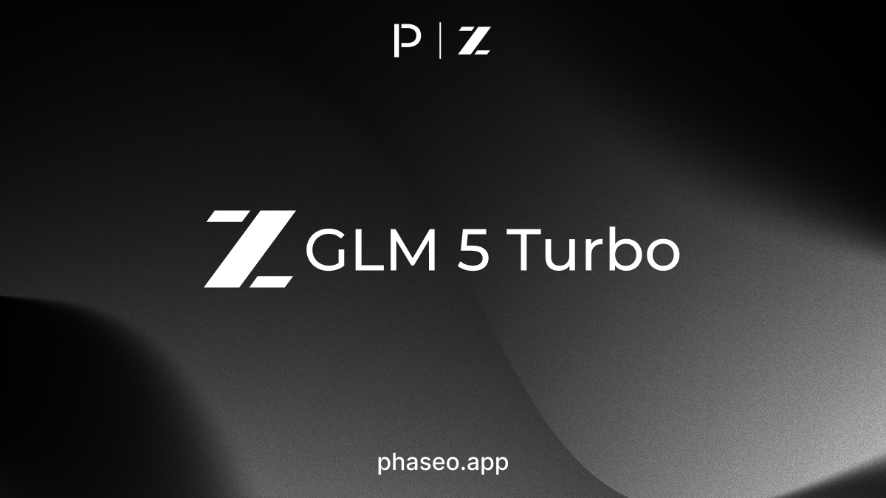

- [z.AI: GLM 5 Turbo](https://phaseo.app/models/z-ai/glm-5-turbo)

</Update>

<Update label="March 12, 2026" tags={["Features","Model Releases"]}>

### Features

- The models display page was overhauled for clearer availability, metadata hierarchy, and support context.

### Model Releases

- [Nvidia: Nemotron 3 Super](https://phaseo.app/models/nvidia/nemotron-3-super-120b-a12b)

</Update>

<Update label="March 11, 2026" tags={["Model Releases"]}>

### Model Releases

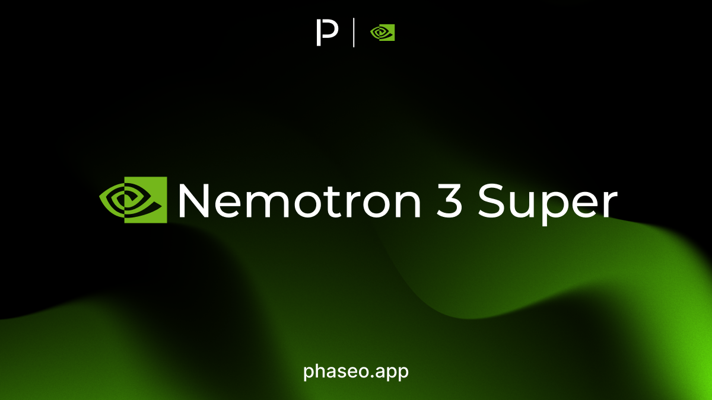

- [Nvidia: Nemotron 3 Super](https://phaseo.app/models/nvidia/nemotron-3-super-120b-a12b)

</Update>

<Update label="March 10, 2026" tags={["Features","Model Releases","Provider Coverage","Docs"]}>

### Features

- A broader brand refresh shipped across the website and docs.
- Alibaba Cloud provider coverage landed across Phaseo, gateway routes, and documentation.

### Model Releases

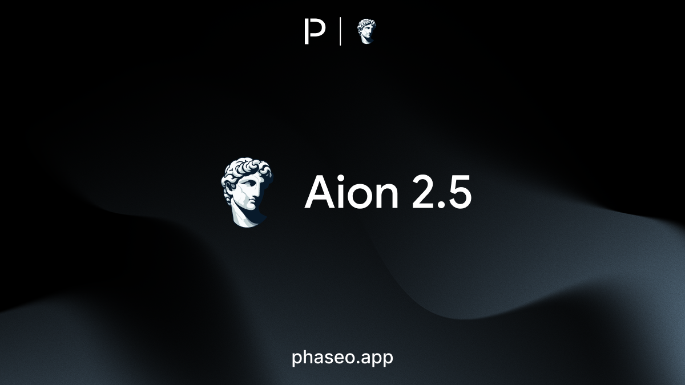

- [Aion Labs: Aion 2.5](https://phaseo.app/models/aion-labs/aion-2.5)
- [Google: Gemini Embedding 2 Preview](https://phaseo.app/models/google/gemini-embedding-2-preview)

</Update>

<Update label="March 5, 2026" tags={["Features","Model Releases","Docs"]}>

### Features

- GPT 5.4 and GPT 5.4 Pro landed across discovery, gateway, and docs.

### Model Releases

- [OpenAI: GPT 5.4](https://phaseo.app/models/openai/gpt-5.4)
- [OpenAI: GPT 5.4 Pro](https://phaseo.app/models/openai/gpt-5.4-pro)

</Update>

<Update label="March 3, 2026" tags={["Features","Model Releases","Docs"]}>

### Features

- Gemini 3.1 Flash Lite Preview landed across product surfaces, gateway routing, and docs.

### Model Releases

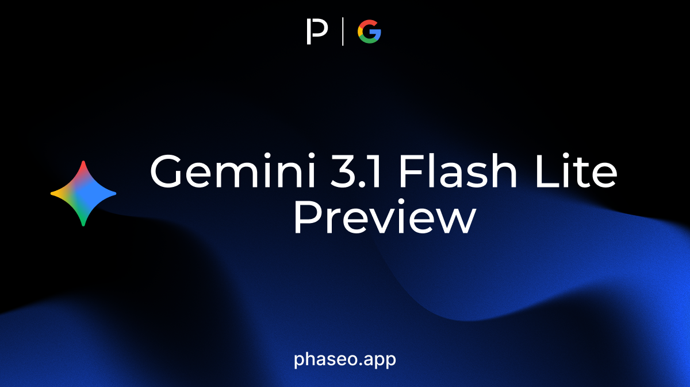

- [Google: Gemini 3.1 Flash Lite Preview](https://phaseo.app/models/google/gemini-3.1-flash-lite-preview)
- [OpenAI: GPT 5.3 Chat](https://phaseo.app/models/openai/gpt-5.3-chat)

</Update>

<Update label="March 2, 2026" tags={["Features","Docs","Model Releases"]}>

### Features

- Responses API assistant `phase` support landed across request handling, response payloads, and OpenAPI docs.

### Model Releases

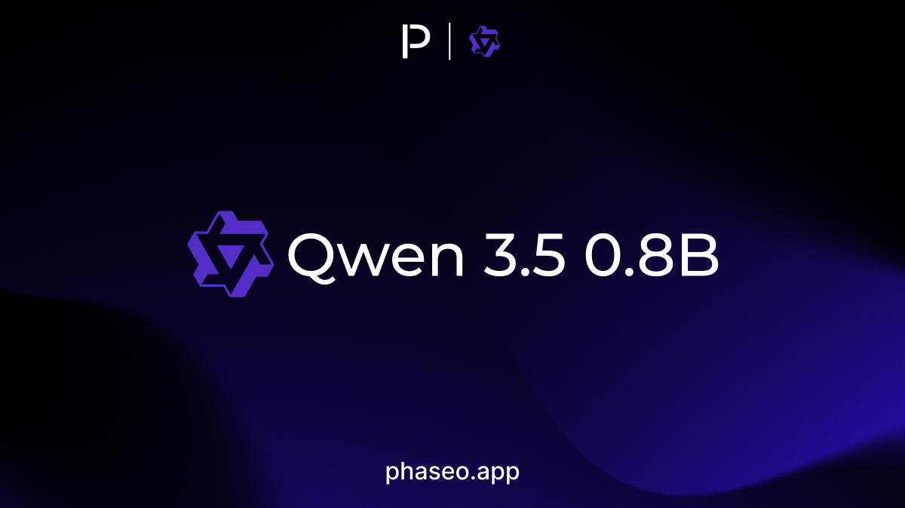

- [Qwen: Qwen 3.5 0.8B](https://phaseo.app/models/qwen/qwen3.5-0.8b)
- [Qwen: Qwen 3.5 2B](https://phaseo.app/models/qwen/qwen3.5-2b)
- [Qwen: Qwen 3.5 4B](https://phaseo.app/models/qwen/qwen3.5-4b)
- [Qwen: Qwen 3.5 9B](https://phaseo.app/models/qwen/qwen3.5-9b)

</Update>

<Update label="February 26, 2026" tags={["Features","Model Releases","Docs"]}>

### Features

- Gemini 3.1 Flash Image Preview support landed across discovery, gateway compatibility, and docs.

### Model Releases

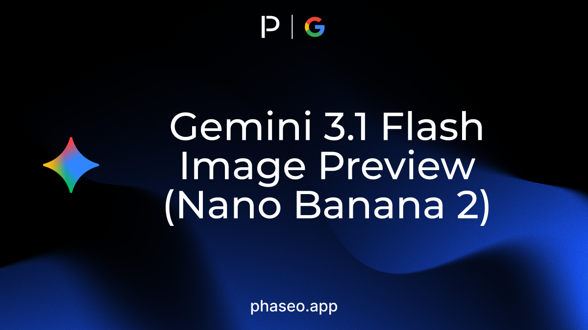

- [Google: Gemini 3.1 Flash Image Preview (Nano Banana 2)](https://phaseo.app/models/google/gemini-3.1-flash-image-preview)

</Update>

<Update label="February 24, 2026" tags={["Model Releases"]}>

### Model Releases

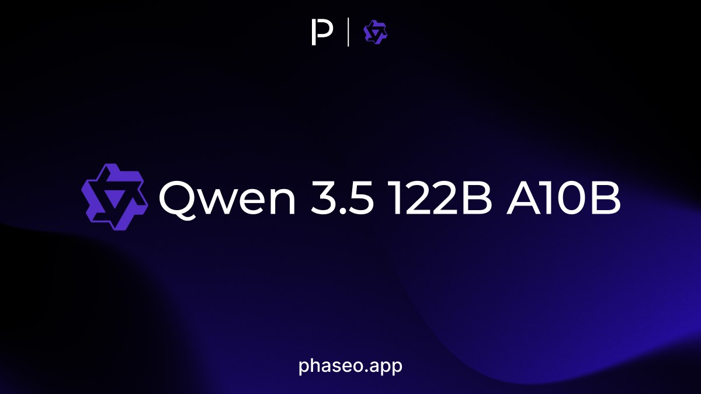

- [Inception: Mercury 2](https://phaseo.app/models/inception/mercury-2)
- [Inception: Mercury Edit 2](https://phaseo.app/models/inception/mercury-edit-2)
- [Liquid AI: LFM 2 24B A2B](https://phaseo.app/models/liquid-ai/lfm-2-24b-a2b)
- [Qwen: Qwen 3.5 122B A10B](https://phaseo.app/models/qwen/qwen3.5-122b-a10b)
- [Qwen: Qwen 3.5 27B](https://phaseo.app/models/qwen/qwen3.5-27b)
- [Qwen: Qwen 3.5 35B A3B](https://phaseo.app/models/qwen/qwen3.5-35b-a3b)

</Update>

<Update label="February 23, 2026" tags={["Model Releases"]}>

### Model Releases

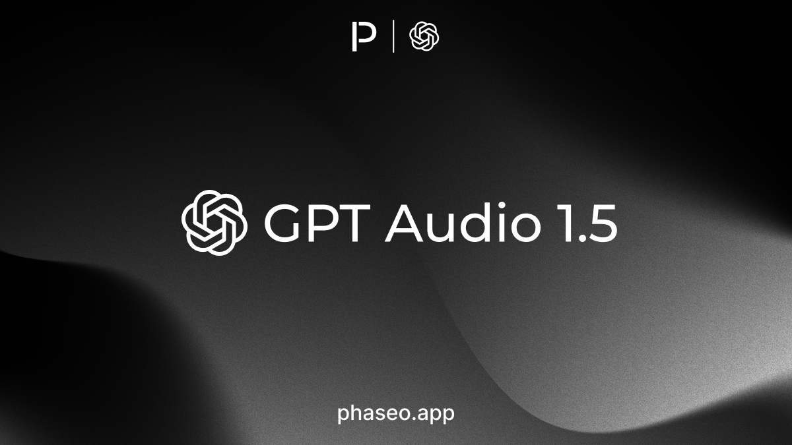

- [OpenAI: GPT Audio 1.5](https://phaseo.app/models/openai/gpt-audio-1.5)
- [OpenAI: GPT Realtime 1.5](https://phaseo.app/models/openai/gpt-realtime-1.5)
- [Qwen: Qwen 3.5 Flash](https://phaseo.app/models/qwen/qwen3.5-flash)

</Update>

<Update label="February 19, 2026" tags={["Features","Model Releases","Pricing","Docs"]}>

### Features

- Gemini 3.1 Pro Preview coverage landed across discovery, pricing, gateway support, and docs.

### Model Releases

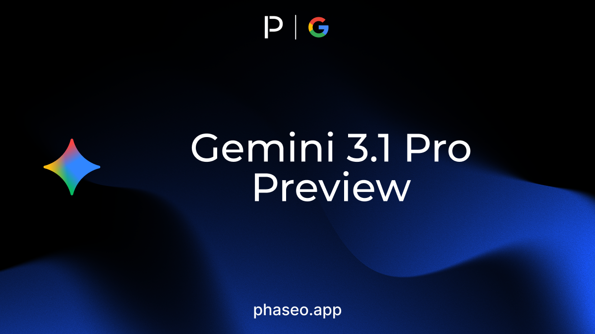

- [Google: Gemini 3.1 Pro Preview](https://phaseo.app/models/google/gemini-3.1-pro-preview)
- [Google: Gemini 3.1 Pro Preview Customtools](https://phaseo.app/models/google/gemini-3.1-pro-preview-customtools)

</Update>

<Update label="February 18, 2026" tags={["Features","Model Releases","Docs"]}>

### Features

- Claude Sonnet 4.6 coverage landed across discovery, gateway compatibility, and docs.

### Model Releases

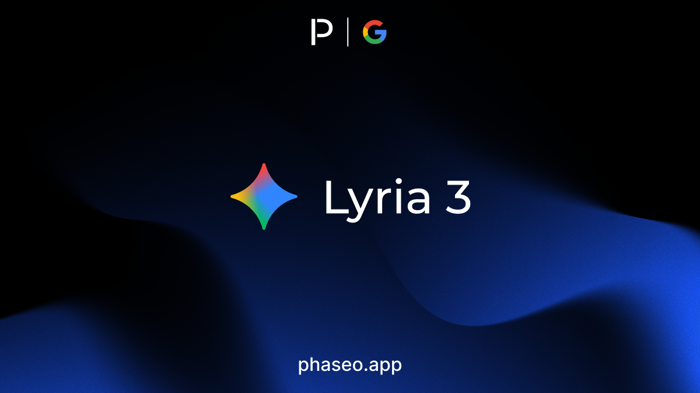

- [Google: Lyria 3](https://phaseo.app/models/google/lyria-3)
- [Prime Intellect: Intellect 3.1](https://phaseo.app/models/prime-intellect/intellect-3.1)

</Update>

<Update label="February 17, 2026" tags={["Model Releases"]}>

### Model Releases

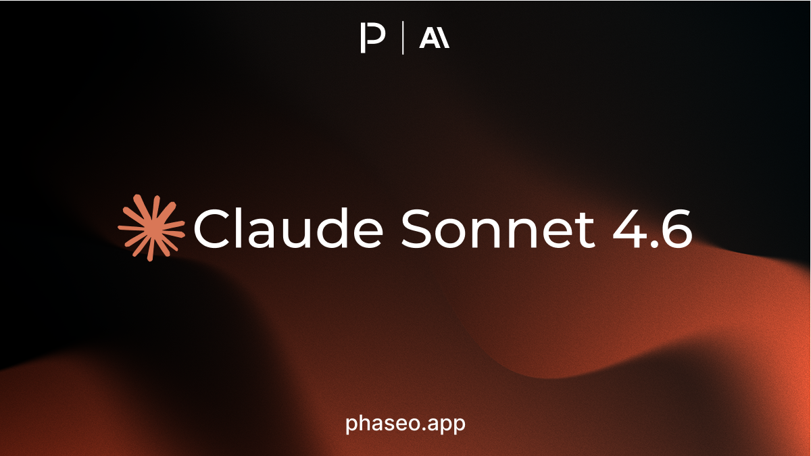

- [Anthropic: Claude Sonnet 4.6](https://phaseo.app/models/anthropic/claude-sonnet-4.6)
- [Cohere: Tiny Aya Earth](https://phaseo.app/models/cohere/tiny-aya-earth)
- [Cohere: Tiny Aya Fire](https://phaseo.app/models/cohere/tiny-aya-fire)
- [Cohere: Tiny Aya Global](https://phaseo.app/models/cohere/tiny-aya-global)
- [Cohere: Tiny Aya Water](https://phaseo.app/models/cohere/tiny-aya-water)
- [xAI: Grok 4.20](https://phaseo.app/models/x-ai/grok-4.20)
- [xAI: Grok 4.20 Multi Agent Beta](https://phaseo.app/models/x-ai/grok-4.20-multi-agent-beta)

</Update>

<Update label="February 16, 2026" tags={["Model Releases"]}>

### Model Releases

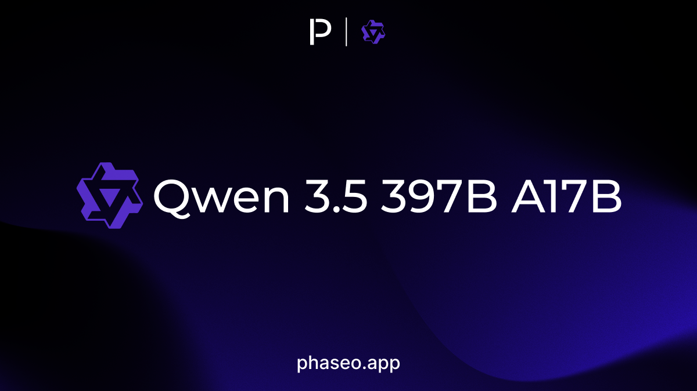

- [Qwen: Qwen 3.5 397B A17B](https://phaseo.app/models/qwen/qwen3.5-397b-a17b)
- [Qwen: Qwen 3.5 Plus](https://phaseo.app/models/qwen/qwen3.5-plus)
- [Qwen: Qwen 3.5 Plus (2026-02-15)](https://phaseo.app/models/qwen/qwen3.5-plus-2026-02-15)

</Update>

<Update label="February 15, 2026" tags={["Model Releases"]}>

### Model Releases

- [ByteDance: Seed 2.0 Code Preview (2026-02-15)](https://phaseo.app/models/bytedance/seed-2.0-code-preview-2026-02-15)

</Update>

<Update label="February 14, 2026" tags={["Model Releases"]}>

### Model Releases

- [ByteDance: Seed 2.0 Lite](https://phaseo.app/models/bytedance/seed-2.0-lite)
- [ByteDance: Seed 2.0 Mini](https://phaseo.app/models/bytedance/seed-2.0-mini)
- [ByteDance: Seed 2.0 Pro](https://phaseo.app/models/bytedance/seed-2.0-pro)

</Update>

<Update label="February 12, 2026" tags={["Model Releases"]}>

### Model Releases

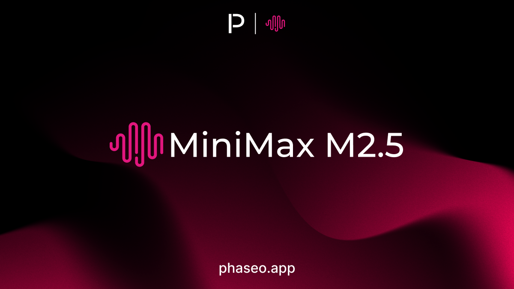

- [ByteDance: Seedance 2.0](https://phaseo.app/models/bytedance/seedance-2.0)
- [ByteDance: Seedance 2.0 Fast](https://phaseo.app/models/bytedance/seedance-2.0-fast)
- [Inclusion AI: Ring 1T 2.5](https://phaseo.app/models/inclusionai/ring-1t-2.5)
- [MiniMax: MiniMax M2.5](https://phaseo.app/models/minimax/minimax-m2.5)
- [OpenAI: GPT 5.3 Codex Spark](https://phaseo.app/models/openai/gpt-5.3-codex-spark)

</Update>

<Update label="February 11, 2026" tags={["Model Releases"]}>

### Model Releases

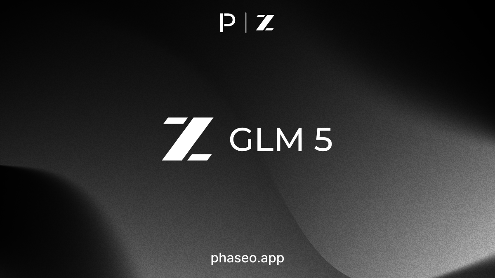

- [z.AI: GLM 5](https://phaseo.app/models/z-ai/glm-5)

</Update>

<Update label="February 9, 2026" tags={["Model Releases"]}>

### Model Releases

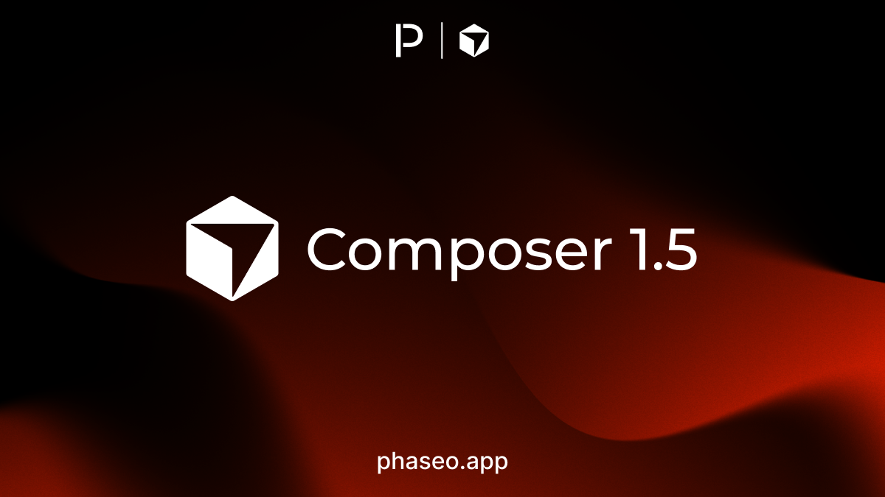

- [Cursor: Composer 1.5](https://phaseo.app/models/cursor/composer-1.5)

</Update>

<Update label="February 5, 2026" tags={["Model Releases"]}>

### Model Releases

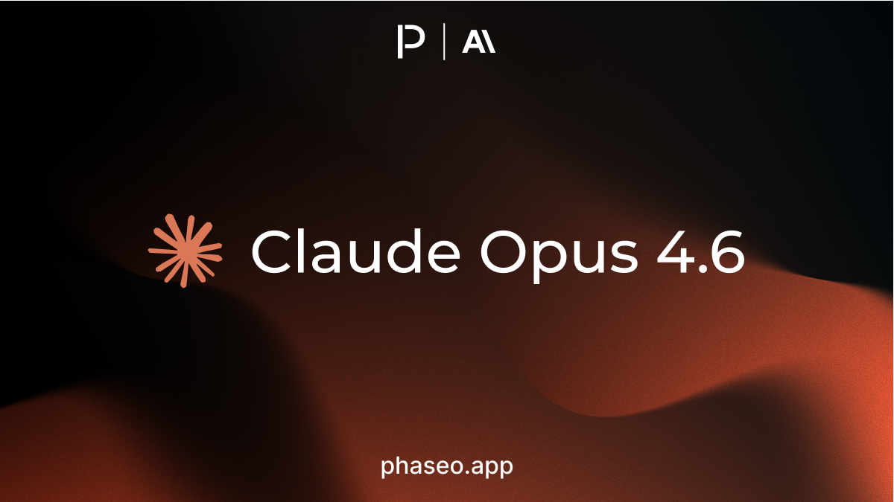

- [Anthropic: Claude Opus 4.6](https://phaseo.app/models/anthropic/claude-opus-4.6)
- [OpenAI: GPT 5.3 Codex](https://phaseo.app/models/openai/gpt-5.3-codex)

</Update>

<Update label="February 4, 2026" tags={["Model Releases"]}>

### Model Releases

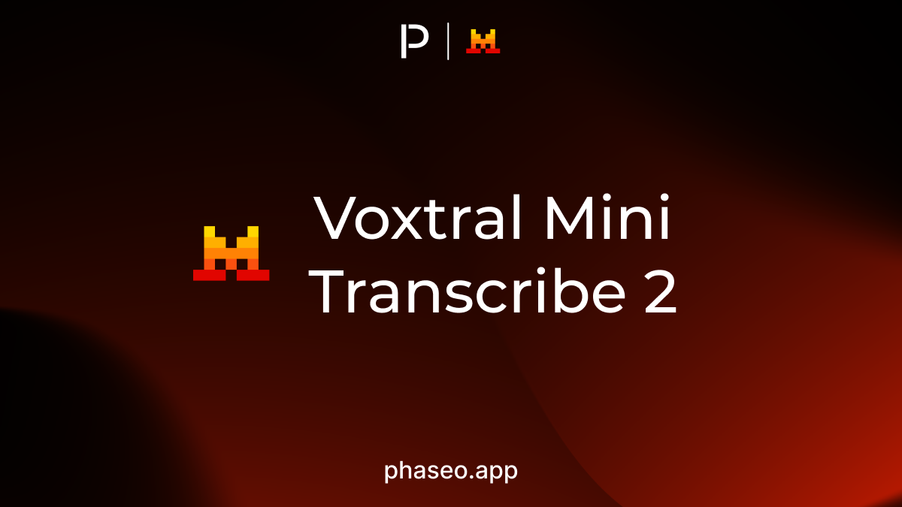

- [Mistral: Voxtral Mini Transcribe 2](https://phaseo.app/models/mistral/voxtral-mini-transcribe-2)

</Update>

<Update label="January 30, 2026" tags={["Features","Model Releases","SDK"]}>

### Features

- The gateway was overhauled again, including Anthropic-compatible `/messages` support.
- Database architecture, website UX, playground tooling, and SDK direction were all refreshed for broader expansion.

### Model Releases

- [z.AI: GLM 4.5 Air X](https://phaseo.app/models/z-ai/glm-4.5-air-x)
- [z.AI: GLM 4.5 X](https://phaseo.app/models/z-ai/glm-4.5-x)
- [xAI: Grok Imagine Image](https://phaseo.app/models/x-ai/grok-imagine-image)
- [xAI: Grok Imagine Video](https://phaseo.app/models/x-ai/grok-imagine-video)
- [Moonshot: Kimi K2.5](https://phaseo.app/models/moonshotai/kimi-k2.5)
- [MiniMax: MiniMax M2 Her](https://phaseo.app/models/minimax/minimax-m2-her)
- [Qwen: Qwen 3 Max Thinking](https://phaseo.app/models/qwen/qwen3-max-thinking)

</Update>

<Update label="January 29, 2026" tags={["Model Releases"]}>

### Model Releases

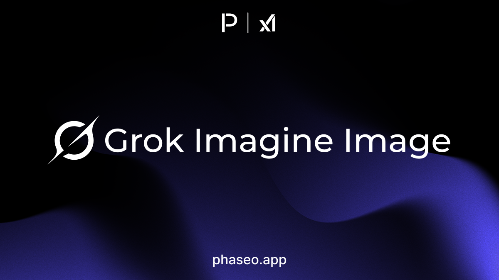

- [xAI: Grok Imagine Image](https://phaseo.app/models/x-ai/grok-imagine-image)
- [xAI: Grok Imagine Image Pro](https://phaseo.app/models/x-ai/grok-imagine-image-pro)
- [xAI: Grok Imagine Video](https://phaseo.app/models/x-ai/grok-imagine-video)

</Update>

<Update label="January 27, 2026" tags={["Model Releases"]}>

### Model Releases

- [Arcee AI: Trinity Large](https://phaseo.app/models/arcee-ai/trinity-large)
- [CrofAI: Greg 1](https://phaseo.app/models/crofai/greg-1)
- [CrofAI: Greg 1 Mini](https://phaseo.app/models/crofai/greg-1-mini)
- [CrofAI: Greg 1 Super](https://phaseo.app/models/crofai/greg-1-super)
- [Moonshot: Kimi K2.5](https://phaseo.app/models/moonshotai/kimi-k2.5)

</Update>

<Update label="January 26, 2026" tags={["Model Releases"]}>

### Model Releases

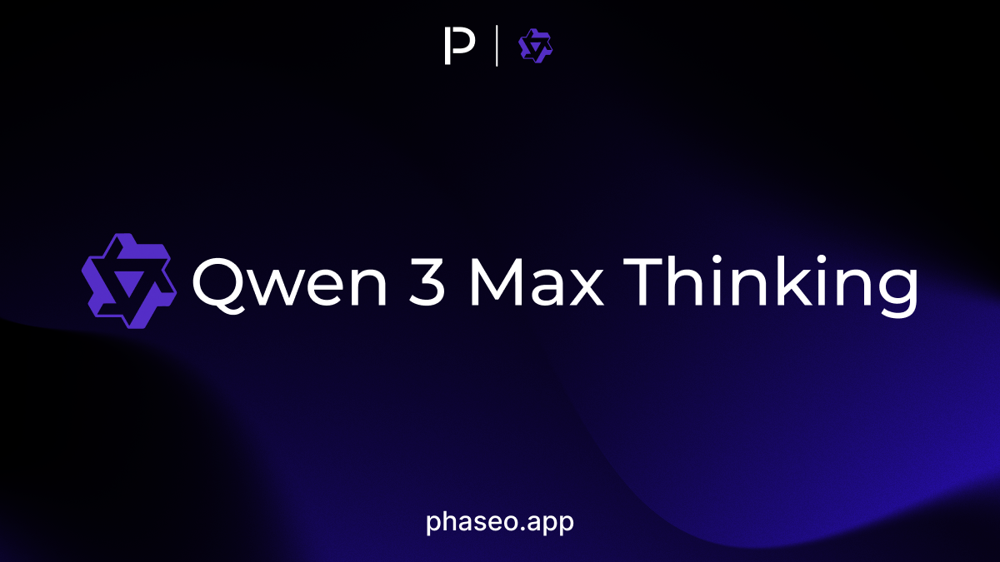

- [Qwen: Qwen 3 Max Thinking](https://phaseo.app/models/qwen/qwen3-max-thinking)
- [Upstage: Solar Pro 3 (2026-01-26)](https://phaseo.app/models/upstage/solar-pro-3)

</Update>

<Update label="January 24, 2026" tags={["Model Releases"]}>

### Model Releases

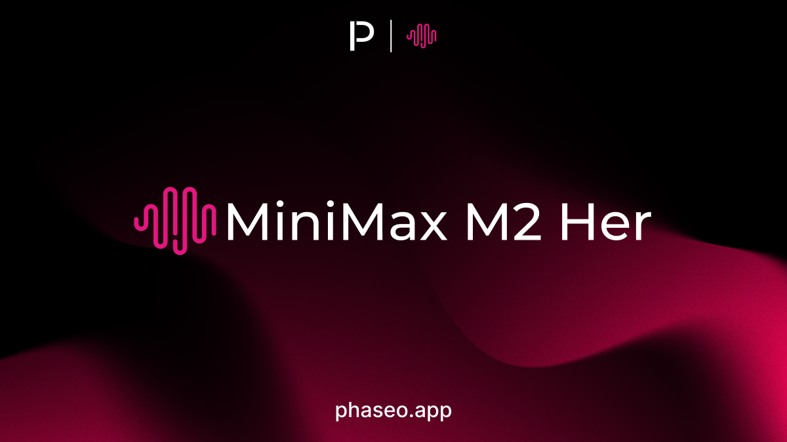

- [MiniMax: MiniMax M2 Her](https://phaseo.app/models/minimax/minimax-m2-her)

</Update>

<Update label="January 22, 2026" tags={["Model Releases"]}>

### Model Releases

- [Baidu: Ernie 5.0](https://phaseo.app/models/baidu/ernie-5.0)

</Update>

<Update label="January 20, 2026" tags={["Model Releases"]}>

### Model Releases

- [Liquid AI: LFM 2.5 1.2B Thinking](https://phaseo.app/models/liquid-ai/lfm-2.5-1.2b-thinking)

</Update>

<Update label="January 19, 2026" tags={["Model Releases"]}>

### Model Releases

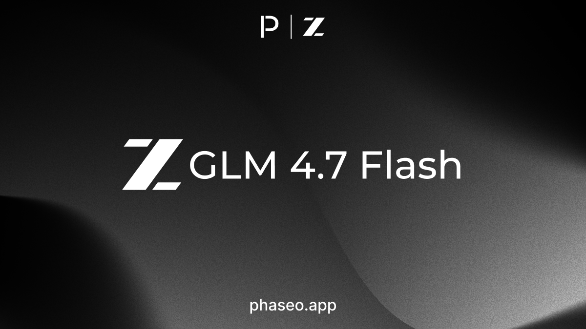

- [z.AI: GLM 4.7 Flash](https://phaseo.app/models/z-ai/glm-4.7-flash)

</Update>

<Update label="January 16, 2026" tags={["Model Releases"]}>

### Model Releases

- [MiniMax: Music 2.5](https://phaseo.app/models/minimax/music-2.5)

</Update>

<Update label="January 15, 2026" tags={["Model Releases"]}>

### Model Releases

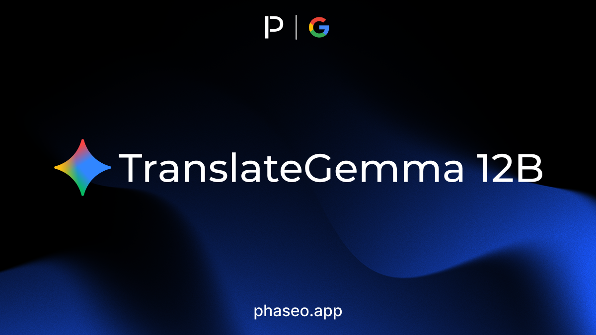

- [Black Forest Labs: Flux 2 Klein 4B](https://phaseo.app/models/black-forest-labs/flux-2-klein-4b)
- [Black Forest Labs: Flux 2 Klein 9B](https://phaseo.app/models/black-forest-labs/flux-2-klein-9b)
- [Google: TranslateGemma 12B](https://phaseo.app/models/google/translategemma-12b)
- [Google: TranslateGemma 27B](https://phaseo.app/models/google/translategemma-27b)
- [Google: TranslateGemma 4B](https://phaseo.app/models/google/translategemma-4b)
- [Voyage: Voyage 4](https://phaseo.app/models/voyage/voyage-4)
- [Voyage: Voyage 4 Large](https://phaseo.app/models/voyage/voyage-4-large)
- [Voyage: Voyage 4 Lite](https://phaseo.app/models/voyage/voyage-4-lite)
- [Voyage: Voyage Multimodal 3.5](https://phaseo.app/models/voyage/voyage-multimodal-3.5)

</Update>

<Update label="January 14, 2026" tags={["Model Releases"]}>

### Model Releases

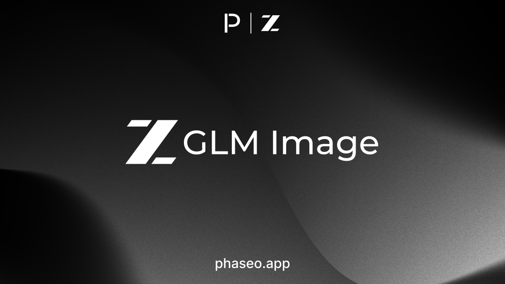

- [z.AI: GLM Image](https://phaseo.app/models/z-ai/glm-image)

</Update>

<Update label="January 13, 2026" tags={["Model Releases"]}>

### Model Releases

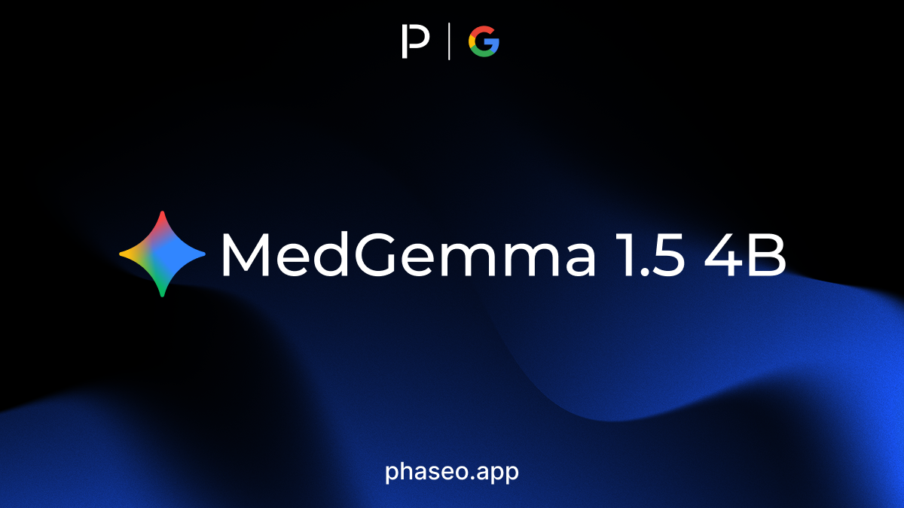

- [Google: MedGemma 1.5 4B](https://phaseo.app/models/google/medgemma-1.5-4b)

</Update>

<Update label="January 9, 2026" tags={["Model Releases"]}>

### Model Releases

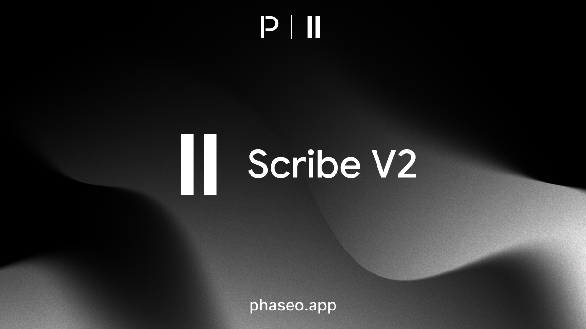

- [ElevenLabs: Scribe V2](https://phaseo.app/models/eleven-labs/scribe-v2)

</Update>

<Update label="January 8, 2026" tags={["Model Releases"]}>

### Model Releases

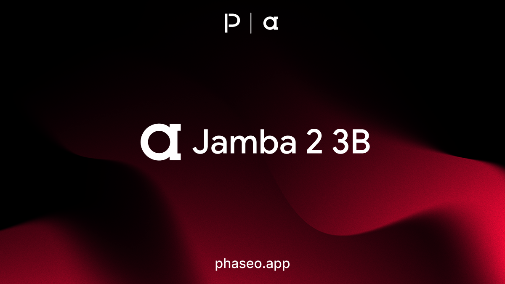

- [ai21: Jamba 2 3B](https://phaseo.app/models/ai21/jamba-2-3b)
- [ai21: Jamba Mini 2](https://phaseo.app/models/ai21/jamba-mini-2)

</Update>

<Update label="January 6, 2026" tags={["Model Releases"]}>

### Model Releases

- [Liquid AI: LFM 2.5 1.2B](https://phaseo.app/models/liquid-ai/lfm-2.5-1.2b)
- [Liquid AI: LFM 2.5 1.2B JP](https://phaseo.app/models/liquid-ai/lfm-2.5-1.2b-jp)
- [Nous: NousCoder 14B](https://phaseo.app/models/nous/nouscoder-14b)

</Update>

<Update label="January 3, 2026" tags={["Model Releases"]}>

### Model Releases

- [z.AI: GLM 4.7](https://phaseo.app/models/z-ai/glm-4.7)
- [MiniMax: Music 2.0](https://phaseo.app/models/minimax/music-2.0)
- [Relace: Relace Search](https://phaseo.app/models/relace/relace-search)
- [ByteDance: Seed 1.6 (2025-10-15)](https://phaseo.app/models/bytedance/seed-1.6-2025-10-15)
- [ByteDance: Seed 1.6 Flash (2025-08-28)](https://phaseo.app/models/bytedance/seed-1.6-flash-2025-08-28)
- [ByteDance: Seed 1.8](https://phaseo.app/models/bytedance/seed-1.8)
- [ByteDance: Seedream 4.5](https://phaseo.app/models/bytedance/seedream-4.5)
- [MiniMax: Speech 2.6](https://phaseo.app/models/minimax/speech-2.6)
- [Arcee AI: Trinity Large](https://phaseo.app/models/arcee-ai/trinity-large)

</Update>

<Update label="December 31, 2025" tags={["Model Releases"]}>

### Model Releases

- [LG: K EXAONE](https://phaseo.app/models/lg/k-exaone)

</Update>

<Update label="December 29, 2025" tags={["Model Releases"]}>

### Model Releases

- [NAVER: HyperClova X Seed Omni 8B](https://phaseo.app/models/naver-hyperclova/hyperclova-x-seed-omni-8b)
- [NAVER: HyperClova X Seed Think 32B](https://phaseo.app/models/naver-hyperclova/hyperclova-x-seed-think-32b)

</Update>

<Update label="December 28, 2025" tags={["Model Releases"]}>

### Model Releases

- [ByteDance: Seed 1.8 (2025-12-28)](https://phaseo.app/models/bytedance/seed-1.8-2025-12-28)

</Update>

<Update label="December 23, 2025" tags={["Model Releases"]}>

### Model Releases

- [MiniMax: MiniMax M2.1](https://phaseo.app/models/minimax/minimax-m2.1)

</Update>

<Update label="December 22, 2025" tags={["Model Releases"]}>

### Model Releases

- [z.AI: GLM 4.7](https://phaseo.app/models/z-ai/glm-4.7)

</Update>

<Update label="December 21, 2025" tags={["Model Releases"]}>

### Model Releases

- [Aion Labs: Aion 2.0](https://phaseo.app/models/aion-labs/aion-2.0)

</Update>

<Update label="December 19, 2025" tags={["Model Releases"]}>

### Model Releases

- [z.AI: GLM 4.7](https://phaseo.app/models/z-ai/glm-4.7)
- [OpenAI: GPT 5.2 Codex](https://phaseo.app/models/openai/gpt-5.2-codex)
- [Mistral: OCR 3](https://phaseo.app/models/mistral/ocr-3)

</Update>

<Update label="December 18, 2025" tags={["Model Releases"]}>

### Model Releases

- [ByteDance: Seed 1.8](https://phaseo.app/models/bytedance/seed-1.8)
- [Mistral: OCR 3](https://phaseo.app/models/mistral/ocr-3)
- [OpenAI: GPT 5.2 Codex](https://phaseo.app/models/openai/gpt-5.2-codex)

</Update>

<Update label="December 17, 2025" tags={["Model Releases"]}>

### Model Releases

- [Google: Gemini 3 Flash Preview](https://phaseo.app/models/google/gemini-3-flash-preview)

</Update>

<Update label="December 16, 2025" tags={["Model Releases"]}>

### Model Releases

- [AllenAI: Molmo 2 4B](https://phaseo.app/models/allenai/molmo-2-4b)
- [AllenAI: Molmo 2 8B](https://phaseo.app/models/allenai/molmo-2-8b)
- [Black Forest Labs: Flux 2 Max](https://phaseo.app/models/black-forest-labs/flux-2-max)
- [Mistral: Mistral Small Creative](https://phaseo.app/models/mistral/mistral-small-creative)
- [OpenAI: ChatGPT Image Latest](https://phaseo.app/models/openai/chatgpt-image-latest)
- [OpenAI: GPT Image 1.5](https://phaseo.app/models/openai/gpt-image-1.5)
- [Xiaomi: MiMo V2 Flash](https://phaseo.app/models/xiaomi/mimo-v2-flash)

</Update>

<Update label="December 15, 2025" tags={["Features","Model Releases","SDK"]}>

### Features

- Early alpha SDK releases landed for Python and TypeScript or JavaScript.

### Model Releases

- [AllenAI: Bolmo 1B](https://phaseo.app/models/allenai/bolmo-1b)
- [AllenAI: Bolmo 7B](https://phaseo.app/models/allenai/bolmo-7b)
- [Nvidia: Nemotron Nano 3 30B A3B](https://phaseo.app/models/nvidia/nemotron-3-nano-30b-a3b)
- [OpenAI: GPT 4o Mini Transcribe (2025-12-15)](https://phaseo.app/models/openai/gpt-4o-mini-transcribe)
- [OpenAI: GPT 4o Mini TTS (2025-12-15)](https://phaseo.app/models/openai/gpt-4o-mini-tts)
- [OpenAI: GPT Audio Mini (2025-12-15)](https://phaseo.app/models/openai/gpt-audio-mini)
- [OpenAI: GPT Realtime Mini (2025-12-15)](https://phaseo.app/models/openai/gpt-realtime-mini)
- [Upstage: Solar Pro 2 (2025-12-15)](https://phaseo.app/models/upstage/solar-pro-2)

</Update>

<Update label="December 12, 2025" tags={["Features","Model Releases","SDK","Pricing","Docs"]}>

### Features

- OpenAI-compatible `/responses` support, aligned SDKs, and gateway quickstart or pricing page updates shipped.
- Docs expanded ahead of the SDK launch, and nightly CI started automatically refreshing model statuses.

### Model Releases

- [AllenAI: Olmo 3.1 32B Instruct](https://phaseo.app/models/allenai/olmo-3.1-32b-instruct)
- [AllenAI: Olmo 3.1 32B Think](https://phaseo.app/models/allenai/olmo-3.1-32b-think)
- [Google: Gemini 2.5 Flash Native Audio Preview (2025-12-12)](https://phaseo.app/models/google/gemini-2.5-flash-native-audio-preview-2025-12-12)

</Update>

<Update label="December 11, 2025" tags={["Model Releases"]}>

### Model Releases

- [Cohere: Rerank V4.0 Fast](https://phaseo.app/models/cohere/rerank-v4.0-fast)
- [Cohere: Rerank V4.0 Pro](https://phaseo.app/models/cohere/rerank-v4.0-pro)
- [OpenAI: GPT 5.2](https://phaseo.app/models/openai/gpt-5.2)
- [OpenAI: GPT 5.2 Chat](https://phaseo.app/models/openai/gpt-5.2-chat)
- [OpenAI: GPT 5.2 Pro](https://phaseo.app/models/openai/gpt-5.2-pro)

</Update>

<Update label="December 10, 2025" tags={["Model Releases"]}>

### Model Releases

- [Google: Gemini 2.5 Flash Preview TTS (2025-12-10)](https://phaseo.app/models/google/gemini-2.5-flash-preview-tts-2025-12-10)
- [Google: Gemini 2.5 Pro Preview TTS (2025-12-10)](https://phaseo.app/models/google/gemini-2.5-pro-preview-tts)

</Update>

<Update label="December 9, 2025" tags={["Model Releases"]}>

### Model Releases

- [Mistral: Devstral 2.0](https://phaseo.app/models/mistral/devstral-2.0)
- [Mistral: Devstral Small 2.0](https://phaseo.app/models/mistral/devstral-small-2.0)
- [Nous: Nomos 1](https://phaseo.app/models/nous/nomos-1)

</Update>

<Update label="December 8, 2025" tags={["Model Releases"]}>

### Model Releases

- [OpenAI: Sora 2 (2025-12-08)](https://phaseo.app/models/openai/sora-2)
- [z.AI: GLM 4.6V](https://phaseo.app/models/z-ai/glm-4.6v)
- [z.AI: GLM 4.6V Flash](https://phaseo.app/models/z-ai/glm-4.6v-flash)

</Update>

<Update label="December 6, 2025" tags={["Model Releases"]}>

### Model Releases

- [Essential AI: Rnj-1](https://phaseo.app/models/essential-ai/rnj-1)

</Update>

<Update label="December 5, 2025" tags={["Features"]}>

### Features

- Dark mode shipped.

</Update>

<Update label="December 3, 2025" tags={["Model Releases"]}>

### Model Releases

- [ByteDance: Seedream 4.5](https://phaseo.app/models/bytedance/seedream-4.5)
- [Nous: Hermes 4.3 36B](https://phaseo.app/models/nous/hermes-4.3-36b)

</Update>

<Update label="December 2, 2025" tags={["Model Releases"]}>

### Model Releases

- [Amazon: Nova 2 Lite](https://phaseo.app/models/amazon/nova-2-lite)
- [Amazon: Nova 2 Omni](https://phaseo.app/models/amazon/nova-2-omni)
- [Amazon: Nova 2 Pro](https://phaseo.app/models/amazon/nova-2-pro)
- [Amazon: Nova 2 Sonic](https://phaseo.app/models/amazon/nova-2-sonic)
- [Amazon: Nova Multimodal Embeddings](https://phaseo.app/models/amazon/nova-multimodal-embeddings)
- [Mistral: Ministral 3.0 14B](https://phaseo.app/models/mistral/ministral-3.0-14b)
- [Mistral: Ministral 3.0 3B](https://phaseo.app/models/mistral/ministral-3.0-3b)
- [Mistral: Ministral 3.0 8B](https://phaseo.app/models/mistral/ministral-3.0-8b)
- [Mistral: Mistral Large 3.0](https://phaseo.app/models/mistral/mistral-large-3.0)

</Update>

<Update label="December 1, 2025" tags={["Features","Model Releases","Provider Coverage","SDK","Benchmarks"]}>

### Features

- Phaseo relaunched with a refreshed brand, a broader gateway, and much wider data coverage.
- Model availability, benchmark pages, provider pages, and the latest-updates surfaces were overhauled.
- The unified gateway entered alpha, and the first Python and TypeScript or JavaScript SDKs launched alongside it.

### Model Releases

- [Arcee AI: Trinity Mini](https://phaseo.app/models/arcee-ai/trinity-mini)
- [Arcee AI: Trinity Nano Preview](https://phaseo.app/models/arcee-ai/trinity-nano-preview)
- [DeepSeek: DeepSeek V3.2](https://phaseo.app/models/deepseek/deepseek-v3.2)
- [DeepSeek: DeepSeek V3.2 Speciale](https://phaseo.app/models/deepseek/deepseek-v3.2-speciale)
- [DeepSeek: DeepSeek V3.2 Thinking](https://phaseo.app/models/deepseek/deepseek-v3.2-thinking)

</Update>

<Update label="November 26, 2025" tags={["Model Releases"]}>

### Model Releases

- [Prime Intellect: Intellect 3](https://phaseo.app/models/prime-intellect/intellect-3)

</Update>

<Update label="November 25, 2025" tags={["Model Releases"]}>

### Model Releases

- [Black Forest Labs: Flux 2 Dev](https://phaseo.app/models/black-forest-labs/flux-2-dev)
- [Black Forest Labs: Flux 2 Flex](https://phaseo.app/models/black-forest-labs/flux-2-flex)
- [Black Forest Labs: Flux 2 Pro](https://phaseo.app/models/black-forest-labs/flux-2-pro)

</Update>

<Update label="November 24, 2025" tags={["Model Releases"]}>

### Model Releases

- [Anthropic: Claude Opus 4.5](https://phaseo.app/models/anthropic/claude-opus-4.5)

</Update>

<Update label="November 20, 2025" tags={["Model Releases"]}>

### Model Releases

- [AllenAI: Olmo 3 32B Think](https://phaseo.app/models/allenai/olmo-3-32b-think)
- [AllenAI: Olmo 3 7B Instruct](https://phaseo.app/models/allenai/olmo-3-7b-instruct)
- [AllenAI: Olmo 3 7B Think](https://phaseo.app/models/allenai/olmo-3-7b-think)
- [Google: Gemini 3 Pro Image Preview (Nano Banana Pro)](https://phaseo.app/models/google/gemini-3-pro-image-preview)

</Update>

<Update label="November 19, 2025" tags={["Model Releases"]}>

### Model Releases

- [OpenAI: GPT 5.1 Codex Max](https://phaseo.app/models/openai/gpt-5.1-codex-max)

</Update>

<Update label="November 18, 2025" tags={["Model Releases"]}>

### Model Releases

- [Google: Gemini 3 Pro Preview](https://phaseo.app/models/google/gemini-3-pro-preview)

</Update>

<Update label="November 17, 2025" tags={["Model Releases"]}>

### Model Releases

- [xAI: Grok 4.1 Non Thinking](https://phaseo.app/models/x-ai/grok-4.1-non-thinking)
- [xAI: Grok 4.1 Thinking](https://phaseo.app/models/x-ai/grok-4.1-thinking)

</Update>

<Update label="November 13, 2025" tags={["Model Releases"]}>

### Model Releases

- [OpenAI: GPT 5.1 Chat](https://phaseo.app/models/openai/gpt-5.1-chat)
- [OpenAI: GPT 5.1 Codex](https://phaseo.app/models/openai/gpt-5.1-codex)
- [OpenAI: GPT 5.1 Codex Mini](https://phaseo.app/models/openai/gpt-5.1-codex-mini)

</Update>

<Update label="November 12, 2025" tags={["Model Releases"]}>

### Model Releases

- [OpenAI: GPT 5.1](https://phaseo.app/models/openai/gpt-5.1)

</Update>

<Update label="November 11, 2025" tags={["Model Releases"]}>

### Model Releases

- [ElevenLabs: Scribe V2 Realtime](https://phaseo.app/models/eleven-labs/scribe-v2-realtime)

</Update>

<Update label="November 7, 2025" tags={["Model Releases"]}>

### Model Releases

- [OpenAI: GPT 5 Codex Mini](https://phaseo.app/models/openai/gpt-5-codex-mini)

</Update>

<Update label="November 6, 2025" tags={["Model Releases"]}>

### Model Releases

- [Moonshot: Kimi K2 Thinking](https://phaseo.app/models/moonshotai/kimi-k2-thinking)

</Update>

<Update label="October 30, 2025" tags={["Model Releases"]}>

### Model Releases

- [Moonshot: Kimi Linear 48B](https://phaseo.app/models/moonshotai/kimi-linear-48b)

</Update>

<Update label="October 29, 2025" tags={["Model Releases"]}>

### Model Releases

- [Cursor: Composer 1](https://phaseo.app/models/cursor/composer-1)
- [MiniMax: Music 2.0](https://phaseo.app/models/minimax/music-2.0)
- [MiniMax: Speech 2.6](https://phaseo.app/models/minimax/speech-2.6)
- [OpenAI: GPT OSS Safeguard 120b](https://phaseo.app/models/openai/gpt-oss-safeguard-120b)
- [OpenAI: GPT OSS Safeguard 20b](https://phaseo.app/models/openai/gpt-oss-safeguard-20b)

</Update>

<Update label="October 28, 2025" tags={["Model Releases"]}>

### Model Releases

- [MiniMax: Hailuo 2.3](https://phaseo.app/models/minimax/hailuo-2.3)
- [MiniMax: Hailuo 2.3 Fast](https://phaseo.app/models/minimax/hailuo-2.3-fast)

</Update>

<Update label="October 27, 2025" tags={["Model Releases"]}>

### Model Releases

- [MiniMax: MiniMax M2](https://phaseo.app/models/minimax/minimax-m2)
- [Suno: Suno V4.5 All](https://phaseo.app/models/suno/suno-v4.5-all)

</Update>

<Update label="October 20, 2025" tags={["Model Releases"]}>

### Model Releases

- [DeepSeek: DeepSeek OCR](https://phaseo.app/models/deepseek/deepseek-ocr)

</Update>

<Update label="October 15, 2025" tags={["Model Releases"]}>

### Model Releases

- [Anthropic: Claude Haiku 4.5](https://phaseo.app/models/anthropic/claude-haiku-4.5)
- [ByteDance: Seed 1.6 (2025-10-15)](https://phaseo.app/models/bytedance/seed-1.6-2025-10-15)
- [Google: Veo 3.1 Fast Preview](https://phaseo.app/models/google/veo-3.1-fast-preview)
- [Google: Veo 3.1 Preview](https://phaseo.app/models/google/veo-3.1-preview)
- [OpenAI: GPT 4o Transcribe Diarize](https://phaseo.app/models/openai/gpt-4o-transcribe-diarize)

</Update>

<Update label="October 14, 2025" tags={["Model Releases"]}>

### Model Releases

- [OpenAI: GPT 5 Search API](https://phaseo.app/models/openai/gpt-5-search-api)

</Update>

<Update label="October 8, 2025" tags={["Model Releases"]}>

### Model Releases

- [ai21: Jamba Reasoning 3B](https://phaseo.app/models/ai21/jamba-reasoning-3b)

</Update>

<Update label="October 7, 2025" tags={["Model Releases"]}>

### Model Releases

- [Google: Gemini 2.5 Computer Use Preview](https://phaseo.app/models/google/gemini-2.5-computer-use-preview)
- [Liquid AI: LFM 2 8B A1B](https://phaseo.app/models/liquid-ai/lfm-2-8b-a1b)

</Update>

<Update label="October 6, 2025" tags={["Model Releases"]}>

### Model Releases

- [OpenAI: GPT Audio Mini (2025-10-06)](https://phaseo.app/models/openai/gpt-audio-mini-2025-10-06)
- [OpenAI: GPT Image 1 Mini](https://phaseo.app/models/openai/gpt-image-1-mini)
- [OpenAI: GPT Realtime Mini (2025-10-06)](https://phaseo.app/models/openai/gpt-realtime-mini-2025-10-06)

</Update>

<Update label="October 3, 2025" tags={["Model Releases"]}>

### Model Releases

- [OpenAI: Sora 2 Pro](https://phaseo.app/models/openai/sora-2-pro)

</Update>

<Update label="October 2, 2025" tags={["Model Releases"]}>

### Model Releases

- [Google: Gemini 2.5 Flash Image (Nano Banana)](https://phaseo.app/models/google/gemini-2.5-flash-image)
- [IBM: Granite 4.0 Micro](https://phaseo.app/models/ibm/granite-4.0-micro)
- [IBM: Granite 4.0 Small](https://phaseo.app/models/ibm/granite-4.0-small)
- [IBM: Granite 4.0 Tiny](https://phaseo.app/models/ibm/granite-4.0-tiny)

</Update>

<Update label="September 30, 2025" tags={["Model Releases"]}>

### Model Releases

- [OpenAI: Sora 2 (2025-09-30)](https://phaseo.app/models/openai/sora-2-2025-09-30)
- [z.AI: GLM 4.6](https://phaseo.app/models/z-ai/glm-4.6)

</Update>

<Update label="September 29, 2025" tags={["Model Releases"]}>

### Model Releases

- [Anthropic: Claude Sonnet 4.5](https://phaseo.app/models/anthropic/claude-sonnet-4.5)
- [DeepSeek: DeepSeek V3.2 Exp](https://phaseo.app/models/deepseek/deepseek-v3.2-exp)

</Update>

<Update label="September 25, 2025" tags={["Model Releases"]}>

### Model Releases

- [Google: Gemini 2.5 Flash Lite Preview (2025-09-25)](https://phaseo.app/models/google/gemini-2.5-flash-lite-preview-2025-09-25)
- [Google: Gemini 2.5 Flash Preview (2025-09-25)](https://phaseo.app/models/google/gemini-2.5-flash-preview-2025-09-25)
- [Google: Gemini Robotics ER 1.5 Preview](https://phaseo.app/models/google/gemini-robotics-er-1.5-preview)

</Update>

<Update label="September 23, 2025" tags={["Model Releases"]}>

### Model Releases

- [Liquid AI: LFM 2 2.6B](https://phaseo.app/models/liquid-ai/lfm-2-2.6b)
- [Suno: Suno V5](https://phaseo.app/models/suno/suno-v5)

</Update>

<Update label="September 22, 2025" tags={["Model Releases"]}>

### Model Releases

- [DeepSeek: DeepSeek V3.1 Terminus](https://phaseo.app/models/deepseek/deepseek-v3.1-terminus)
- [Qwen: Qwen3 LiveTranslate Flash Realtime](https://phaseo.app/models/qwen/qwen3-livetranslate-flash-realtime)

</Update>

<Update label="September 20, 2025" tags={["Model Releases"]}>

### Model Releases

- [xAI: Grok 4 Fast Non Reasoning](https://phaseo.app/models/x-ai/grok-4-fast-non-reasoning)
- [xAI: Grok 4 Fast Reasoning](https://phaseo.app/models/x-ai/grok-4-fast-reasoning)

</Update>

<Update label="September 19, 2025" tags={["Model Releases"]}>

### Model Releases

- [Inclusion AI: Ring Flash 2.0](https://phaseo.app/models/inclusionai/ring-flash-2.0)

</Update>

<Update label="September 17, 2025" tags={["Model Releases"]}>

### Model Releases

- [Inclusion AI: Ling Flash 2.0](https://phaseo.app/models/inclusionai/ling-flash-2.0)
- [Mistral: Magistral Medium 1.2](https://phaseo.app/models/mistral/magistral-medium-1.2)
- [Mistral: Magistral Small 1.2](https://phaseo.app/models/mistral/magistral-small-1.2)

</Update>

<Update label="September 15, 2025" tags={["Model Releases"]}>

### Model Releases

- [OpenAI: GPT 5 Codex](https://phaseo.app/models/openai/gpt-5-codex)

</Update>

<Update label="September 9, 2025" tags={["Model Releases"]}>

### Model Releases

- [Google: Veo 3](https://phaseo.app/models/google/veo-3)
- [Google: Veo 3 Fast](https://phaseo.app/models/google/veo-3-fast)
- [Upstage: Solar Pro 2 (2025-09-09)](https://phaseo.app/models/upstage/solar-pro-2-2025-09-09)

</Update>

<Update label="September 5, 2025" tags={["Model Releases"]}>

### Model Releases

- [Moonshot: Kimi K2 (2025-09-05)](https://phaseo.app/models/moonshotai/kimi-k2)

</Update>

<Update label="August 28, 2025" tags={["Model Releases"]}>

### Model Releases

- [ByteDance: Seed 1.6 Flash (2025-08-28)](https://phaseo.app/models/bytedance/seed-1.6-flash-2025-08-28)
- [Cohere: Command A Translate](https://phaseo.app/models/cohere/command-a-translate)
- [OpenAI: GPT Audio](https://phaseo.app/models/openai/gpt-audio)
- [OpenAI: GPT Realtime](https://phaseo.app/models/openai/gpt-realtime)
- [xAI: Grok Code Fast 1](https://phaseo.app/models/x-ai/grok-code-fast-1)

</Update>

<Update label="August 25, 2025" tags={["Model Releases"]}>

### Model Releases

- [Google: Gemini 2.5 Flash Image Preview (Nano Banana)](https://phaseo.app/models/google/gemini-2.5-flash-image-preview)

</Update>

<Update label="August 21, 2025" tags={["Model Releases"]}>

### Model Releases

- [Cohere: Command A Reasoning](https://phaseo.app/models/cohere/command-a-reasoning)
- [DeepSeek: DeepSeek V3.1](https://phaseo.app/models/deepseek/deepseek-v3.1)

</Update>

<Update label="August 14, 2025" tags={["Model Releases"]}>

### Model Releases

- [Google: Imagen 4.0 Fast Generate 001](https://phaseo.app/models/google/imagen-4.0-fast-generate-001)
- [Google: Imagen 4.0 Generate 001](https://phaseo.app/models/google/imagen-4.0-generate-001)
- [Google: Imagen 4.0 Ultra Generate 001](https://phaseo.app/models/google/imagen-4.0-ultra-generate-001)

</Update>

<Update label="August 12, 2025" tags={["Model Releases"]}>

### Model Releases

- [Mistral: Mistral Medium 3.1](https://phaseo.app/models/mistral/mistral-medium-3.1)

</Update>

<Update label="August 11, 2025" tags={["Model Releases"]}>

### Model Releases

- [z.AI: GLM 4.5V](https://phaseo.app/models/z-ai/glm-4.5v)

</Update>

<Update label="August 7, 2025" tags={["Model Releases"]}>

### Model Releases

- [OpenAI: GPT 5](https://phaseo.app/models/openai/gpt-5)
- [OpenAI: GPT 5 Chat](https://phaseo.app/models/openai/gpt-5-chat)
- [OpenAI: GPT 5 Mini](https://phaseo.app/models/openai/gpt-5-mini)
- [OpenAI: GPT 5 Nano](https://phaseo.app/models/openai/gpt-5-nano)
- [OpenAI: GPT 5 Pro](https://phaseo.app/models/openai/gpt-5-pro)

</Update>

<Update label="August 6, 2025" tags={["Model Releases"]}>

### Model Releases

- [MiniMax: Speech 2.5 HD Preview](https://phaseo.app/models/minimax/speech-2.5-hd-preview)
- [MiniMax: Speech 2.5 Turbo Preview](https://phaseo.app/models/minimax/speech-2.5-turbo-preview)

</Update>

<Update label="August 5, 2025" tags={["Model Releases"]}>

### Model Releases

- [Anthropic: Claude Opus 4.1](https://phaseo.app/models/anthropic/claude-opus-4.1)
- [OpenAI: GPT OSS 120b](https://phaseo.app/models/openai/gpt-oss-120b)
- [OpenAI: GPT OSS 20b](https://phaseo.app/models/openai/gpt-oss-20b)

</Update>

<Update label="July 31, 2025" tags={["Model Releases"]}>

### Model Releases

- [Cohere: Command A Vision](https://phaseo.app/models/cohere/command-a-vision)

</Update>

<Update label="July 30, 2025" tags={["Model Releases"]}>

### Model Releases

- [Mistral: Codestral (2025-07-30)](https://phaseo.app/models/mistral/codestral)

</Update>

<Update label="July 28, 2025" tags={["Model Releases"]}>

### Model Releases

- [z.AI: GLM 4.5](https://phaseo.app/models/z-ai/glm-4.5)
- [z.AI: GLM 4.5 Air](https://phaseo.app/models/z-ai/glm-4.5-air)

</Update>

<Update label="July 26, 2025" tags={["Model Releases"]}>

### Model Releases

- [Nous: Hermes 4 14B](https://phaseo.app/models/nous/hermes-4-14b)
- [Nous: Hermes 4 405B](https://phaseo.app/models/nous/hermes-4-405b)
- [Nous: Hermes 4 70B](https://phaseo.app/models/nous/hermes-4-70b)

</Update>

<Update label="July 24, 2025" tags={["Model Releases"]}>

### Model Releases

- [Mistral: Magistral Medium 1.1](https://phaseo.app/models/mistral/magistral-medium-1.1)
- [Mistral: Magistral Small 1.1](https://phaseo.app/models/mistral/magistral-small-1.1)

</Update>

<Update label="July 22, 2025" tags={["Model Releases"]}>

### Model Releases

- [Google: Gemini 2.5 Flash-Lite](https://phaseo.app/models/google/gemini-2.5-flash-lite)
- [NAVER: HyperClova X Seed Think 14B](https://phaseo.app/models/naver-hyperclova/hyperclova-x-seed-think-14b)

</Update>

<Update label="July 17, 2025" tags={["Model Releases"]}>

### Model Releases

- [Google: Veo 3.0 Fast Generate Preview](https://phaseo.app/models/google/veo-3.0-fast-generate-preview)
- [Google: Veo 3.0 Generate Preview](https://phaseo.app/models/google/veo-3.0-generate-preview)
- [Suno: Suno V4.5+](https://phaseo.app/models/suno/suno-v4.5+)

</Update>

<Update label="July 15, 2025" tags={["Model Releases"]}>

### Model Releases

- [LG: EXAONE 4.0 1.2B](https://phaseo.app/models/lg/exaone-4.0-1.2b)
- [LG: EXAONE 4.0 32B](https://phaseo.app/models/lg/exaone-4.0-32b)
- [Mistral: Voxtral Mini](https://phaseo.app/models/mistral/voxtral-mini)
- [Mistral: Voxtral Mini Transcribe](https://phaseo.app/models/mistral/voxtral-mini-transcribe)
- [Mistral: Voxtral Small](https://phaseo.app/models/mistral/voxtral-small)

</Update>

<Update label="July 11, 2025" tags={["Model Releases"]}>

### Model Releases

- [Moonshot: Kimi K2 (2025-07-11)](https://phaseo.app/models/moonshotai/kimi-k2-2025-07-11)

</Update>

<Update label="July 10, 2025" tags={["Model Releases"]}>

### Model Releases

- [Liquid AI: LFM 2 1.2B](https://phaseo.app/models/liquid-ai/lfm-2-1.2b)
- [Liquid AI: LFM 2 350M](https://phaseo.app/models/liquid-ai/lfm-2-350m)
- [Liquid AI: LFM 2 700M](https://phaseo.app/models/liquid-ai/lfm-2-700m)
- [Mistral: Devstral Medium 1.0](https://phaseo.app/models/mistral/devstral-medium-1.0)
- [Mistral: Devstral Small 1.1](https://phaseo.app/models/mistral/devstral-small-1.1)
- [Upstage: Solar Pro 2 (2025-07-10)](https://phaseo.app/models/upstage/solar-pro-2-2025-07-10)
- [xAI: Grok 4](https://phaseo.app/models/x-ai/grok-4)
- [xAI: Grok 4 Heavy](https://phaseo.app/models/x-ai/grok-4-heavy)

</Update>

<Update label="July 3, 2025" tags={["Model Releases"]}>

### Model Releases

- [ai21: Jamba Large 1.7](https://phaseo.app/models/ai21/jamba-large-1.7)
- [ai21: Jamba Mini 1.7](https://phaseo.app/models/ai21/jamba-mini-1.7)

</Update>

<Update label="July 2, 2025" tags={["Model Releases"]}>

### Model Releases

- [z.AI: GLM 4.1V 9B](https://phaseo.app/models/z-ai/glm-4.1v-9b)
- [z.AI: GLM 4.1V Thinking 9B](https://phaseo.app/models/z-ai/glm-4.1v-thinking-9b)

</Update>

<Update label="June 30, 2025" tags={["Model Releases"]}>

### Model Releases

- [Tencent Hunyuan: Hunyuan A13B Instruct](https://phaseo.app/models/tencent/hunyuan-a13b-instruct)

</Update>

<Update label="June 26, 2025" tags={["Model Releases"]}>

### Model Releases

- [OpenAI: o3 Deep Research](https://phaseo.app/models/openai/o3-deep-research)
- [OpenAI: o4 mini Deep Research ](https://phaseo.app/models/openai/o4-mini-deep-research)

</Update>

<Update label="June 25, 2025" tags={["Model Releases"]}>

### Model Releases

- [ByteDance: Seed 1.6 (2025-06-15)](https://phaseo.app/models/bytedance/seed-1.6-2025-06-15)
- [ByteDance: Seed 1.6 Flash (2025-06-15)](https://phaseo.app/models/bytedance/seed-1.6-flash-2025-06-15)
- [Google: Gemma 3n E2B](https://phaseo.app/models/google/gemma-3n-e2b)
- [Google: Gemma 3n E4B](https://phaseo.app/models/google/gemma-3n-e4b)

</Update>

<Update label="June 21, 2025" tags={["Model Releases"]}>

### Model Releases

- [Moonshot: Kimi VL A3B Thinking (2025-06-21)](https://phaseo.app/models/moonshotai/kimi-vl-a3b-thinking)

</Update>

<Update label="June 20, 2025" tags={["Model Releases"]}>

### Model Releases

- [MiniMax: Music 1.5](https://phaseo.app/models/minimax/music-1.5)
- [Mistral: Mistral Small 3.2](https://phaseo.app/models/mistral/mistral-small-3.2)

</Update>

<Update label="June 18, 2025" tags={["Model Releases"]}>

### Model Releases

- [MiniMax: Hailuo 02](https://phaseo.app/models/minimax/hailuo-02)

</Update>

<Update label="June 17, 2025" tags={["Model Releases"]}>

### Model Releases

- [Google: Gemini 2.5 Flash](https://phaseo.app/models/google/gemini-2.5-flash)
- [Google: Gemini 2.5 Flash Lite Preview (2025-06-17)](https://phaseo.app/models/google/gemini-2.5-flash-lite-preview-2025-06-17)
- [Google: Gemini 2.5 Pro](https://phaseo.app/models/google/gemini-2.5-pro)

</Update>

<Update label="June 16, 2025" tags={["Model Releases"]}>

### Model Releases

- [MiniMax: Minimax M1 40K](https://phaseo.app/models/minimax/minimax-m1-40k)
- [MiniMax: MiniMax M1 80K](https://phaseo.app/models/minimax/minimax-m1-80k)

</Update>

<Update label="June 11, 2025" tags={["Model Releases"]}>

### Model Releases

- [Google: Imagen 4.0 Fast Generate Preview (2025-06-11)](https://phaseo.app/models/google/imagen-4.0-fast-generate-preview)
- [Google: Imagen 4.0 Generate Preview (2025-06-11)](https://phaseo.app/models/google/imagen-4.0-generate-preview)
- [Google: Imagen 4.0 Ultra Generate Preview (2025-06-11)](https://phaseo.app/models/google/imagen-4.0-ultra-generate-preview)

</Update>

<Update label="June 10, 2025" tags={["Model Releases"]}>

### Model Releases

- [Mistral: Magistral Medium 1.0](https://phaseo.app/models/mistral/magistral-medium-1.0)
- [Mistral: Magistral Small 1.0](https://phaseo.app/models/mistral/magistral-small-1.0)
- [Mistral: Magistral Small 2506](https://phaseo.app/models/mistral/magistral-small-2506)
- [OpenAI: o3 Pro](https://phaseo.app/models/openai/o3-pro)

</Update>

<Update label="June 5, 2025" tags={["Model Releases"]}>

### Model Releases

- [Google: Gemini 2.5 Pro Preview (2025-06-05)](https://phaseo.app/models/google/gemini-2.5-pro-preview-2025-06-05)

</Update>

<Update label="June 3, 2025" tags={["Model Releases"]}>

### Model Releases

- [OpenAI: GPT 4o Audio (2025-06-03)](https://phaseo.app/models/openai/gpt-4o-audio)
- [OpenAI: GPT 4o Realtime Preview (2025-06-03)](https://phaseo.app/models/openai/gpt-4o-realtime-preview)

</Update>

<Update label="May 28, 2025" tags={["Model Releases"]}>

### Model Releases

- [DeepSeek: DeepSeek R1 (2025-05-28)](https://phaseo.app/models/deepseek/deepseek-r1-2025-05-28)
- [Mistral: Codestral Embed](https://phaseo.app/models/mistral/codestral-embed)

</Update>

<Update label="May 22, 2025" tags={["Model Releases"]}>

### Model Releases

- [Mistral: Mistral OCR 2](https://phaseo.app/models/mistral/mistral-ocr-2)

</Update>

<Update label="May 21, 2025" tags={["Model Releases"]}>

### Model Releases

- [Anthropic: Claude Opus 4](https://phaseo.app/models/anthropic/claude-opus-4)
- [Anthropic: Claude Sonnet 4](https://phaseo.app/models/anthropic/claude-sonnet-4)
- [Mistral: Devstral Small 1.0](https://phaseo.app/models/mistral/devstral-small-1.0)

</Update>

<Update label="May 20, 2025" tags={["Model Releases"]}>

### Model Releases

- [Google: Gemini 2.5 Flash Preview (2025-05-20)](https://phaseo.app/models/google/gemini-2.5-flash-preview-2025-05-20)
- [Google: Gemini 2.5 Flash Preview TTS (2025-05-20)](https://phaseo.app/models/google/gemini-2.5-flash-preview-tts-2025-05-20)
- [Google: Gemini 2.5 Pro Preview TTS (2025-05-20)](https://phaseo.app/models/google/gemini-2.5-pro-preview-tts-2025-05-20)
- [Google: Gemini Embedding 001](https://phaseo.app/models/google/gemini-embedding-001)
- [Google: Imagen 4.0 Preview](https://phaseo.app/models/google/imagen-4.0-preview)
- [Google: Imagen 4.0 Ultra Preview](https://phaseo.app/models/google/imagen-4.0-ultra-preview)
- [Upstage: Solar Pro 2 Preview](https://phaseo.app/models/upstage/solar-pro-2-preview)

</Update>

<Update label="May 16, 2025" tags={["Model Releases"]}>

### Model Releases

- [OpenAI: Codex Mini](https://phaseo.app/models/openai/codex-mini)

</Update>

<Update label="May 7, 2025" tags={["Model Releases"]}>

### Model Releases

- [Google: Gemini 2.0 Flash Preview Image Generation](https://phaseo.app/models/google/gemini-2.0-flash-preview-image-generation)
- [Mistral: Mistral Medium 3.0](https://phaseo.app/models/mistral/mistral-medium-3.0)

</Update>

<Update label="May 6, 2025" tags={["Model Releases"]}>

### Model Releases

- [Google: Gemini 2.5 Pro Preview (2025-05-06)](https://phaseo.app/models/google/gemini-2.5-pro-preview-2025-05-06)

</Update>

<Update label="May 2, 2025" tags={["Model Releases"]}>

### Model Releases

- [IBM: Granite 4.0 Tiny Preview](https://phaseo.app/models/ibm/granite-4.0-tiny-preview)

</Update>

<Update label="May 1, 2025" tags={["Model Releases"]}>

### Model Releases

- [Suno: Suno V4.5](https://phaseo.app/models/suno/suno-v4.5)

</Update>

<Update label="April 30, 2025" tags={["Model Releases"]}>

### Model Releases

- [Amazon: Nova Premier](https://phaseo.app/models/amazon/nova-premier)
- [Microsoft: Phi 4 Mini Reasoning](https://phaseo.app/models/microsoft/phi-4-mini-reasoning)
- [Microsoft: Phi 4 Reasoning](https://phaseo.app/models/microsoft/phi-4-reasoning)
- [Microsoft: Phi 4 Reasoning Plus](https://phaseo.app/models/microsoft/phi-4-reasoning-plus)

</Update>

<Update label="April 23, 2025" tags={["Model Releases"]}>

### Model Releases

- [OpenAI: GPT Image 1](https://phaseo.app/models/openai/gpt-image-1)

</Update>

<Update label="April 18, 2025" tags={["Model Releases"]}>

### Model Releases

- [xAI: Grok 3](https://phaseo.app/models/x-ai/grok-3)
- [xAI: Grok 3 Mini](https://phaseo.app/models/x-ai/grok-3-mini)

</Update>

<Update label="April 17, 2025" tags={["Model Releases"]}>

### Model Releases

- [Google: Gemini 2.5 Flash Preview (2025-04-17)](https://phaseo.app/models/google/gemini-2.5-flash-preview-2025-04-17)
- [Google: LearnLM 2.0 Flash Experimental](https://phaseo.app/models/google/learnlm-2.0-flash-experimental)

</Update>

<Update label="April 16, 2025" tags={["Model Releases"]}>

### Model Releases

- [IBM: Granite 3.3 2B Instruct](https://phaseo.app/models/ibm/granite-3.3-2b-instruct)
- [IBM: Granite 3.3 8B Instruct](https://phaseo.app/models/ibm/granite-3.3-8b-instruct)
- [OpenAI: o3](https://phaseo.app/models/openai/o3)
- [OpenAI: o4 Mini](https://phaseo.app/models/openai/o4-mini)

</Update>

<Update label="April 15, 2025" tags={["Model Releases"]}>

### Model Releases

- [Cohere: Embed V4](https://phaseo.app/models/cohere/embed-v4)
- [z.AI: GLM 4 32B](https://phaseo.app/models/z-ai/glm-4-32b)

</Update>

<Update label="April 14, 2025" tags={["Model Releases"]}>

### Model Releases

- [OpenAI: GPT 4.1](https://phaseo.app/models/openai/gpt-4.1)
- [OpenAI: GPT 4.1 Mini](https://phaseo.app/models/openai/gpt-4.1-mini)
- [OpenAI: GPT 4.1 Nano](https://phaseo.app/models/openai/gpt-4.1-nano)
- [z.AI: GLM 4 9B (2025-04-14)](https://phaseo.app/models/z-ai/glm-4-9b)

</Update>

<Update label="April 9, 2025" tags={["Model Releases"]}>

### Model Releases

- [Google: Gemini 2.0 Flash Live 001](https://phaseo.app/models/google/gemini-2.0-flash-live-001)
- [Google: Gemini Live 2.5 Flash Preview](https://phaseo.app/models/google/gemini-live-2.5-flash-preview)
- [Google: Veo 2](https://phaseo.app/models/google/veo-2)
- [Moonshot: Kimi VL A3B](https://phaseo.app/models/moonshotai/kimi-vl-a3b)
- [Moonshot: Kimi VL A3B Thinking (2025-04-09)](https://phaseo.app/models/moonshotai/kimi-vl-a3b-thinking-2025-04-09)

</Update>

<Update label="April 8, 2025" tags={["Model Releases"]}>

### Model Releases

- [Amazon: Nova Sonic](https://phaseo.app/models/amazon/nova-sonic)

</Update>

<Update label="April 7, 2025" tags={["Model Releases"]}>

### Model Releases

- [Nvidia: Llama 3.1 Nemotron Ultra 253B v1](https://phaseo.app/models/nvidia/llama-3.1-nemotron-ultra-253b-v1)

</Update>

<Update label="April 5, 2025" tags={["Model Releases"]}>

### Model Releases

- [Meta: Llama 4 Maverick](https://phaseo.app/models/meta/llama-4-maverick)
- [Meta: Llama 4 Scout](https://phaseo.app/models/meta/llama-4-scout)

</Update>

<Update label="April 2, 2025" tags={["Model Releases"]}>

### Model Releases

- [MiniMax: Speech 02 HD](https://phaseo.app/models/minimax/speech-02-hd)
- [MiniMax: Speech 02 Turbo](https://phaseo.app/models/minimax/speech-02-turbo)

</Update>

<Update label="March 25, 2025" tags={["Model Releases"]}>

### Model Releases

- [Google: Gemini 2.5 Pro Experimental (2025-03-25)](https://phaseo.app/models/google/gemini-2.5-pro-experimental-2025-03-25)

</Update>

<Update label="March 24, 2025" tags={["Model Releases"]}>

### Model Releases

- [DeepSeek: DeepSeek V3 (2025-03-24)](https://phaseo.app/models/deepseek/deepseek-v3-2025-03-24)
- [Qwen: Qwen 2.5 VL 32B Instruct](https://phaseo.app/models/qwen/qwen2.5-vl-32b)

</Update>

<Update label="March 20, 2025" tags={["Model Releases"]}>

### Model Releases

- [OpenAI: GPT 4o Mini Transcribe (2025-03-20)](https://phaseo.app/models/openai/gpt-4o-mini-transcribe-2025-03-20)
- [OpenAI: GPT 4o Mini TTS (2025-03-20)](https://phaseo.app/models/openai/gpt-4o-mini-tts-2025-03-20)
- [OpenAI: GPT 4o Transcribe](https://phaseo.app/models/openai/gpt-4o-transcribe)

</Update>

<Update label="March 19, 2025" tags={["Model Releases"]}>

### Model Releases

- [OpenAI: o1 pro](https://phaseo.app/models/openai/o1-pro)

</Update>

<Update label="March 18, 2025" tags={["Model Releases"]}>

### Model Releases

- [LG: EXAONE Deep 2.4B](https://phaseo.app/models/lg/exaone-deep-2.4b)
- [LG: EXAONE Deep 32B](https://phaseo.app/models/lg/exaone-deep-32b)
- [LG: EXAONE Deep 7.8B](https://phaseo.app/models/lg/exaone-deep-7.8b)
- [Nvidia: Llama 3.1 Nemotron Nano 8B V1](https://phaseo.app/models/nvidia/llama-3.1-nemotron-nano-8b-v1)
- [Nvidia: Llama 3.3 Nemotron Super 49B v1](https://phaseo.app/models/nvidia/llama-3.3-nemotron-super-49b-v1)

</Update>

<Update label="March 17, 2025" tags={["Model Releases"]}>

### Model Releases

- [Mistral: Mistral Small 3.1](https://phaseo.app/models/mistral/mistral-small-3.1)

</Update>

<Update label="March 13, 2025" tags={["Model Releases"]}>

### Model Releases

- [Cohere: Command A](https://phaseo.app/models/cohere/command-a)

</Update>

<Update label="March 12, 2025" tags={["Model Releases"]}>

### Model Releases

- [Google: Gemma 3 12B](https://phaseo.app/models/google/gemma-3-12b)
- [Google: Gemma 3 1B](https://phaseo.app/models/google/gemma-3-1b)
- [Google: Gemma 3 27B](https://phaseo.app/models/google/gemma-3-27b)
- [Google: Gemma 3 4B](https://phaseo.app/models/google/gemma-3-4b)

</Update>

<Update label="March 11, 2025" tags={["Model Releases"]}>

### Model Releases

- [OpenAI: Computer Use Preview](https://phaseo.app/models/openai/computer-use-preview)
- [OpenAI: GPT 4o Mini Search Preview](https://phaseo.app/models/openai/gpt-4o-mini-search-preview)
- [OpenAI: GPT 4o Search Preview](https://phaseo.app/models/openai/gpt-4o-search-preview)

</Update>

<Update label="March 7, 2025" tags={["Model Releases"]}>

### Model Releases

- [Google: Gemini Embedding Exp 0307](https://phaseo.app/models/google/gemini-embedding-exp-0307)

</Update>

<Update label="March 6, 2025" tags={["Model Releases"]}>

### Model Releases

- [ai21: Jamba Large 1.6](https://phaseo.app/models/ai21/jamba-large-1.6)
- [ai21: Jamba Mini 1.6](https://phaseo.app/models/ai21/jamba-mini-1.6)
- [Mistral: Mistral OCR](https://phaseo.app/models/mistral/mistral-ocr)

</Update>

<Update label="March 4, 2025" tags={["Model Releases"]}>

### Model Releases

- [Cohere: C4AI Aya Vision 32B](https://phaseo.app/models/cohere/c4ai-aya-vision-32b)
- [Cohere: C4AI Aya Vision 8B](https://phaseo.app/models/cohere/c4ai-aya-vision-8b)

</Update>

<Update label="February 27, 2025" tags={["Model Releases"]}>

### Model Releases

- [OpenAI: GPT 4.5](https://phaseo.app/models/openai/gpt-4.5)

</Update>

<Update label="February 24, 2025" tags={["Model Releases"]}>

### Model Releases

- [Anthropic: Claude 3.7 Sonnet](https://phaseo.app/models/anthropic/claude-3.7-sonnet)

</Update>

<Update label="February 19, 2025" tags={["Model Releases"]}>

### Model Releases

- [xAI: Grok 3 Beta](https://phaseo.app/models/x-ai/grok-3-beta)
- [xAI: Grok 3 Mini Beta](https://phaseo.app/models/x-ai/grok-3-mini-beta)

</Update>

<Update label="February 17, 2025" tags={["Model Releases"]}>

### Model Releases

- [Mistral: Mistral Saba](https://phaseo.app/models/mistral/mistral-saba)

</Update>

<Update label="February 15, 2025" tags={["Model Releases"]}>

### Model Releases

- [MiniMax: Image 01](https://phaseo.app/models/minimax/image-01)

</Update>

<Update label="February 11, 2025" tags={["Model Releases"]}>

### Model Releases

- [MiniMax: I2V 01 Director](https://phaseo.app/models/minimax/i2v-01-director)
- [MiniMax: T2V 01 Director](https://phaseo.app/models/minimax/t2v-01-director)

</Update>

<Update label="February 5, 2025" tags={["Model Releases"]}>

### Model Releases

- [Google: Gemini 2.0 Flash](https://phaseo.app/models/google/gemini-2.0-flash)
- [Google: Gemini 2.0 Flash Lite](https://phaseo.app/models/google/gemini-2.0-flash-lite)
- [Google: Gemini 2.0 Pro Exp (2025-02-05)](https://phaseo.app/models/google/gemini-2.0-pro-exp)

</Update>

<Update label="February 1, 2025" tags={["Model Releases"]}>

### Model Releases

- [Microsoft: Phi 4 Mini](https://phaseo.app/models/microsoft/phi-4-mini)
- [Microsoft: Phi 4 multimodal instruct](https://phaseo.app/models/microsoft/phi-4-multimodal-instruct)

</Update>

<Update label="January 30, 2025" tags={["Model Releases"]}>

### Model Releases

- [Mistral: Mistral Small 24b 2501](https://phaseo.app/models/mistral/mistral-small-24b-2501)
- [Mistral: Mistral Small 3.0](https://phaseo.app/models/mistral/mistral-small-3.0)
- [OpenAI: o3 mini](https://phaseo.app/models/openai/o3-mini)

</Update>

<Update label="January 29, 2025" tags={["Model Releases"]}>

### Model Releases

- [Aion Labs: Aion 1.0](https://phaseo.app/models/aion-labs/aion-1.0)
- [Aion Labs: Aion 1.0 Mini](https://phaseo.app/models/aion-labs/aion-1.0-mini)
- [Google: Imagen 3.0 Generate 002](https://phaseo.app/models/google/imagen-3.0-generate-002)

</Update>

<Update label="January 26, 2025" tags={["Model Releases"]}>

### Model Releases

- [Qwen: Qwen 2.5 VL 72B Instruct](https://phaseo.app/models/qwen/qwen2.5-vl-72b)

</Update>

<Update label="January 21, 2025" tags={["Model Releases"]}>

### Model Releases

- [Google: Gemini 2.0 Flash Thinking Exp (2025-01-21)](https://phaseo.app/models/google/gemini-2.0-flash-thinking-exp-2025-01-21)

</Update>

<Update label="January 20, 2025" tags={["Model Releases"]}>

### Model Releases

- [DeepSeek: DeepSeek R1 (2025-01-20)](https://phaseo.app/models/deepseek/deepseek-r1-2025-01-20)
- [Moonshot: Kimi K1.5](https://phaseo.app/models/moonshotai/kimi-k1.5)

</Update>

<Update label="January 15, 2025" tags={["Model Releases"]}>

### Model Releases

- [MiniMax: Minimax Text 01](https://phaseo.app/models/minimax/minimax-text-01)
- [MiniMax: Minimax VL 01](https://phaseo.app/models/minimax/minimax-vl-01)

</Update>

<Update label="January 13, 2025" tags={["Model Releases"]}>

### Model Releases

- [Mistral: Codestral (2025-01-13)](https://phaseo.app/models/mistral/codestral-2025-01-13)

</Update>

<Update label="December 26, 2024" tags={["Model Releases"]}>

### Model Releases

- [DeepSeek: DeepSeek V3](https://phaseo.app/models/deepseek/deepseek-v3)
- [DeepSeek: DeepSeek V3 (2024-12-26)](https://phaseo.app/models/deepseek/deepseek-v3-2024-12-26)

</Update>

<Update label="December 19, 2024" tags={["Model Releases"]}>

### Model Releases

- [Google: Gemini 2.0 Flash Thinking Exp (2024-12-19)](https://phaseo.app/models/google/gemini-2.0-flash-thinking-exp-2024-12-19)

</Update>

<Update label="December 17, 2024" tags={["Model Releases"]}>

### Model Releases

- [OpenAI: GPT 4o Audio (2024-12-17)](https://phaseo.app/models/openai/gpt-4o-audio-2024-12-17)
- [OpenAI: GPT 4o Mini Audio Preview](https://phaseo.app/models/openai/gpt-4o-mini-audio-preview)
- [OpenAI: GPT 4o Mini Realtime Preview](https://phaseo.app/models/openai/gpt-4o-mini-realtime-preview)
- [OpenAI: GPT 4o Realtime Preview (2024-12-17)](https://phaseo.app/models/openai/gpt-4o-realtime-preview-2024-12-17)
- [OpenAI: o1](https://phaseo.app/models/openai/o1)

</Update>

<Update label="December 13, 2024" tags={["Model Releases"]}>

### Model Releases

- [Cohere: Command R 7b](https://phaseo.app/models/cohere/command-r-7b)
- [Cohere: Command R7b](https://phaseo.app/models/cohere/command-r7b)
- [DeepSeek: DeepSeek VL2](https://phaseo.app/models/deepseek/deepseek-vl2)
- [DeepSeek: DeepSeek VL2 Small](https://phaseo.app/models/deepseek/deepseek-vl2-small)
- [DeepSeek: DeepSeek VL2 Tiny](https://phaseo.app/models/deepseek/deepseek-vl2-tiny)

</Update>

<Update label="December 12, 2024" tags={["Model Releases"]}>

### Model Releases

- [Microsoft: Phi 4](https://phaseo.app/models/microsoft/phi-4)

</Update>

<Update label="December 11, 2024" tags={["Model Releases"]}>

### Model Releases

- [Nous: Hermes 3 Llama 3.2 3B](https://phaseo.app/models/nous/hermes-3-llama-3.2-3b)

</Update>

<Update label="December 10, 2024" tags={["Model Releases"]}>

### Model Releases

- [DeepSeek: DeepSeek V2.5 (2024-12-10)](https://phaseo.app/models/deepseek/deepseek-v2.5-2024-12-10)

</Update>

<Update label="December 9, 2024" tags={["Model Releases"]}>

### Model Releases

- [LG: EXAONE 3.5 2.4B](https://phaseo.app/models/lg/exaone-3.5-2.4b)
- [LG: EXAONE 3.5 32B](https://phaseo.app/models/lg/exaone-3.5-32b)
- [LG: EXAONE 3.5 7.8B](https://phaseo.app/models/lg/exaone-3.5-7.8b)
- [OpenAI: Sora 1](https://phaseo.app/models/openai/sora-1)

</Update>

<Update label="December 6, 2024" tags={["Model Releases"]}>

### Model Releases

- [Google: Gemini Exp 1206](https://phaseo.app/models/google/gemini-exp-1206)
- [Meta: Llama 3.3 70B Instruct](https://phaseo.app/models/meta/llama-3.3-70b)

</Update>

<Update label="December 4, 2024" tags={["Model Releases"]}>

### Model Releases

- [Amazon: Nova Lite 1.0](https://phaseo.app/models/amazon/nova-lite-1.0)
- [Amazon: Nova Micro 1.0](https://phaseo.app/models/amazon/nova-micro-1.0)
- [Amazon: Nova Pro 1.0](https://phaseo.app/models/amazon/nova-pro-1.0)

</Update>

<Update label="December 3, 2024" tags={["Model Releases"]}>

### Model Releases

- [Amazon: Nova Canvas](https://phaseo.app/models/amazon/nova-canvas)
- [Amazon: Nova Reel](https://phaseo.app/models/amazon/nova-reel)

</Update>

<Update label="November 30, 2024" tags={["Model Releases"]}>

### Model Releases

- [Aion Labs: Aion RP Llama 3.1 8B](https://phaseo.app/models/aion-labs/aion-rp-llama-3.1-8b)

</Update>

<Update label="November 21, 2024" tags={["Model Releases"]}>

### Model Releases

- [Google: Gemini Exp 1121](https://phaseo.app/models/google/gemini-exp-1121)

</Update>

<Update label="November 20, 2024" tags={["Model Releases"]}>

### Model Releases

- [DeepSeek: DeepSeek R1 Lite Preview](https://phaseo.app/models/deepseek/deepseek-r1-lite-preview)
- [OpenAI: GPT 4o (2024-11-20)](https://phaseo.app/models/openai/gpt-4o)

</Update>

<Update label="November 19, 2024" tags={["Model Releases"]}>

### Model Releases

- [Google: LearnLM 1.5 Pro Experimental](https://phaseo.app/models/google/learnlm-1.5-pro-experimental)
- [Suno: Suno V4](https://phaseo.app/models/suno/suno-v4)

</Update>

<Update label="November 18, 2024" tags={["Model Releases"]}>

### Model Releases

- [Google: Text Embedding 005](https://phaseo.app/models/google/text-embedding-005)
- [Mistral: Mistral Large 2.1](https://phaseo.app/models/mistral/mistral-large-2.1)
- [Mistral: Pixtral Large](https://phaseo.app/models/mistral/pixtral-large)

</Update>

<Update label="November 14, 2024" tags={["Model Releases"]}>

### Model Releases

- [Google: Gemini Exp 1114](https://phaseo.app/models/google/gemini-exp-1114)

</Update>

<Update label="November 6, 2024" tags={["Model Releases"]}>

### Model Releases

- [Mistral: Mistral Moderation](https://phaseo.app/models/mistral/mistral-moderation)

</Update>

<Update label="November 4, 2024" tags={["Model Releases"]}>

### Model Releases

- [Anthropic: Claude 3.5 Haiku](https://phaseo.app/models/anthropic/claude-3.5-haiku)

</Update>

<Update label="October 24, 2024" tags={["Model Releases"]}>

### Model Releases

- [Cohere: C4AI Aya Expanse 32B](https://phaseo.app/models/cohere/c4ai-aya-expanse-32b)
- [Cohere: C4AI Aya Expanse 8B](https://phaseo.app/models/cohere/c4ai-aya-expanse-8b)
- [z.AI: GLM 4 9B Chat 1M](https://phaseo.app/models/z-ai/glm-4-9b-chat-1m)

</Update>

<Update label="October 22, 2024" tags={["Model Releases"]}>

### Model Releases

- [Anthropic: Claude 3.5 Sonnet (2024-10-22)](https://phaseo.app/models/anthropic/claude-3.5-sonnet-2024-10-22)

</Update>

<Update label="October 9, 2024" tags={["Model Releases"]}>

### Model Releases

- [Mistral: Ministral 3B](https://phaseo.app/models/mistral/ministral-3b)
- [Mistral: Ministral 8B](https://phaseo.app/models/mistral/ministral-8b)

</Update>

<Update label="October 2, 2024" tags={["Model Releases"]}>

### Model Releases

- [Cohere: Rerank V3.5](https://phaseo.app/models/cohere/rerank-v3.5)

</Update>

<Update label="October 1, 2024" tags={["Model Releases"]}>

### Model Releases

- [Nvidia: Llama 3.1 Nemotron 70B Instruct](https://phaseo.app/models/nvidia/llama-3.1-nemotron-70b-instruct)
- [OpenAI: GPT 4o Audio (2024-10-01)](https://phaseo.app/models/openai/gpt-4o-audio-2024-10-01)
- [OpenAI: GPT 4o Realtime Preview (2024-10-01)](https://phaseo.app/models/openai/gpt-4o-realtime-preview-2024-10-01)

</Update>

<Update label="September 26, 2024" tags={["Model Releases"]}>

### Model Releases

- [OpenAI: Omni Moderation](https://phaseo.app/models/openai/omni-moderation)

</Update>

<Update label="September 25, 2024" tags={["Model Releases"]}>

### Model Releases

- [Meta: Llama 3.2 1B Instruct](https://phaseo.app/models/meta/llama-3.2-1b)
- [Meta: Llama 3.2 3B Instruct](https://phaseo.app/models/meta/llama-3.2-3b)

</Update>

<Update label="September 24, 2024" tags={["Model Releases"]}>

### Model Releases

- [Google: Gemini 1.5 Flash 002](https://phaseo.app/models/google/gemini-1.5-flash-002)
- [Google: Gemini 1.5 Flash 8B Exp (2024-09-24)](https://phaseo.app/models/google/gemini-1.5-flash-8b-exp-2024-09-24)
- [Google: Gemini 1.5 Pro 002](https://phaseo.app/models/google/gemini-1.5-pro-002)

</Update>

<Update label="September 17, 2024" tags={["Model Releases"]}>

### Model Releases

- [Mistral: Mistral Small 2.0](https://phaseo.app/models/mistral/mistral-small-2.0)
- [Mistral: Pixtral 12B](https://phaseo.app/models/mistral/pixtral-12b)

</Update>

<Update label="September 12, 2024" tags={["Model Releases"]}>

### Model Releases

- [OpenAI: o1 mini](https://phaseo.app/models/openai/o1-mini)
- [OpenAI: o1 preview](https://phaseo.app/models/openai/o1-preview)

</Update>

<Update label="September 5, 2024" tags={["Model Releases"]}>

### Model Releases

- [DeepSeek: DeepSeek V2.5 (2024-09-05)](https://phaseo.app/models/deepseek/deepseek-v2.5-2024-09-05)

</Update>

<Update label="August 30, 2024" tags={["Model Releases"]}>

### Model Releases

- [Cohere: Command R](https://phaseo.app/models/cohere/command-r)
- [Cohere: Command R (2024-08-30)](https://phaseo.app/models/cohere/command-r-2024-08-30)
- [Cohere: Command R+ (2024-08-30)](https://phaseo.app/models/cohere/command-r+-2024-08-30)

</Update>

<Update label="August 27, 2024" tags={["Model Releases"]}>

### Model Releases

- [Google: Gemini 1.5 Flash 8B Exp (2024-08-27)](https://phaseo.app/models/google/gemini-1.5-flash-8b-exp-2024-08-27)
- [Google: Gemini 1.5 Pro Exp (2024-08-27)](https://phaseo.app/models/google/gemini-1.5-pro-exp-2024-08-27)

</Update>

<Update label="August 23, 2024" tags={["Model Releases"]}>

### Model Releases

- [Microsoft: Phi 3.5 mini instruct](https://phaseo.app/models/microsoft/phi-3.5-mini-instruct)
- [Microsoft: Phi 3.5 MoE instruct](https://phaseo.app/models/microsoft/phi-3.5-moe-instruct)
- [Microsoft: Phi 3.5 vision instruct](https://phaseo.app/models/microsoft/phi-3.5-vision-instruct)

</Update>

<Update label="August 22, 2024" tags={["Model Releases"]}>

### Model Releases

- [ai21: Jamba Large 1.5](https://phaseo.app/models/ai21/jamba-large-1.5)
- [ai21: Jamba Mini 1.5](https://phaseo.app/models/ai21/jamba-mini-1.5)

</Update>

<Update label="August 15, 2024" tags={["Model Releases"]}>

### Model Releases

- [Nous: Hermes 3 Llama 3.1 405B](https://phaseo.app/models/nous/hermes-3-llama-3.1-405b)
- [Nous: Hermes 3 Llama 3.1 70B](https://phaseo.app/models/nous/hermes-3-llama-3.1-70b)
- [Nous: Hermes 3 Llama 3.1 8B](https://phaseo.app/models/nous/hermes-3-llama-3.1-8b)

</Update>

<Update label="August 13, 2024" tags={["Model Releases"]}>

### Model Releases

- [xAI: Grok 2](https://phaseo.app/models/x-ai/grok-2)
- [xAI: Grok 2 Mini](https://phaseo.app/models/x-ai/grok-2-mini)

</Update>

<Update label="August 7, 2024" tags={["Model Releases"]}>

### Model Releases

- [LG: EXAONE 3.0](https://phaseo.app/models/lg/exaone-3.0)

</Update>

<Update label="August 6, 2024" tags={["Model Releases"]}>

### Model Releases

- [OpenAI: GPT 4o (2024-08-06)](https://phaseo.app/models/openai/gpt-4o-2024-08-06)

</Update>

<Update label="August 1, 2024" tags={["Model Releases"]}>

### Model Releases

- [Google: Gemini 1.5 Pro Exp (2024-08-01)](https://phaseo.app/models/google/gemini-1.5-pro-exp-2024-08-01)

</Update>

<Update label="July 31, 2024" tags={["Model Releases"]}>

### Model Releases

- [Google: Gemma 2 2B](https://phaseo.app/models/google/gemma-2-2b)
- [Google: Imagen 3.0 Generate 001](https://phaseo.app/models/google/imagen-3.0-generate-001)

</Update>

<Update label="July 24, 2024" tags={["Model Releases"]}>

### Model Releases

- [DeepSeek: DeepSeek Coder V2 (2024-07-24)](https://phaseo.app/models/deepseek/deepseek-coder-v2-2024-07-27)
- [Mistral: Mistral Large 2.0](https://phaseo.app/models/mistral/mistral-large-2.0)

</Update>

<Update label="July 23, 2024" tags={["Model Releases"]}>

### Model Releases

- [Meta: Llama 3.1 405B Instruct](https://phaseo.app/models/meta/llama-3.1-405b)
- [Meta: Llama 3.1 70B Instruct](https://phaseo.app/models/meta/llama-3.1-70b)
- [Meta: Llama 3.1 8B Instruct](https://phaseo.app/models/meta/llama-3.1-8b)

</Update>

<Update label="July 18, 2024" tags={["Model Releases"]}>

### Model Releases

- [Mistral: Mistral Nemo](https://phaseo.app/models/mistralai/mistral-nemo)
- [Mistral: Mistral Nemo 12B](https://phaseo.app/models/mistral/mistral-nemo-12b)
- [Mistral: Mistral Nemo 2407](https://phaseo.app/models/mistral/mistral-nemo-2407)
- [OpenAI: GPT 4o Mini (2024-07-18)](https://phaseo.app/models/openai/gpt-4o-mini)

</Update>

<Update label="July 16, 2024" tags={["Model Releases"]}>

### Model Releases

- [Mistral: Codestral Mamba 7B](https://phaseo.app/models/mistral/codestral-mamba-7b)
- [Mistral: Mathstral 7B](https://phaseo.app/models/mistral/mathstral-7b)

</Update>

<Update label="June 28, 2024" tags={["Model Releases"]}>

### Model Releases

- [DeepSeek: DeepSeek V2 (2024-06-28)](https://phaseo.app/models/deepseek/deepseek-v2-2024-06-28)

</Update>

<Update label="June 27, 2024" tags={["Model Releases"]}>

### Model Releases

- [Google: Gemma 2 27B](https://phaseo.app/models/google/gemma-2-27b)
- [Google: Gemma 2 9B](https://phaseo.app/models/google/gemma-2-9b)
- [Nous: Hermes 2 Pro Llama 3 70B](https://phaseo.app/models/nous/hermes-2-pro-llama-3-70b)

</Update>

<Update label="June 21, 2024" tags={["Model Releases"]}>

### Model Releases

- [Anthropic: Claude 3.5 Sonnet (2024-06-20)](https://phaseo.app/models/anthropic/claude-3.5-sonnet-2024-06-20)

</Update>

<Update label="June 20, 2024" tags={["Model Releases"]}>

### Model Releases

- [Nous: Hermes 2 Theta Llama 3 70B](https://phaseo.app/models/nous/hermes-2-theta-llama-3-70b)

</Update>

<Update label="June 14, 2024" tags={["Model Releases"]}>

### Model Releases

- [DeepSeek: DeepSeek Coder V2 (2024-06-14)](https://phaseo.app/models/deepseek/deepseek-coder-v2-2024-06-14)

</Update>

<Update label="June 4, 2024" tags={["Model Releases"]}>

### Model Releases

- [z.AI: GLM 4 9B (2024-06-04)](https://phaseo.app/models/z-ai/glm-4-9b-2024-06-04)
- [z.AI: GLM 4 9B Chat](https://phaseo.app/models/z-ai/glm-4-9b-chat)

</Update>

<Update label="May 29, 2024" tags={["Model Releases"]}>

### Model Releases

- [Mistral: Codestral (2024-05-29)](https://phaseo.app/models/mistral/codestral-2024-05-29)

</Update>

<Update label="May 25, 2024" tags={["Model Releases"]}>

### Model Releases

- [Suno: Suno V3.5](https://phaseo.app/models/suno/suno-v3.5)

</Update>

<Update label="May 23, 2024" tags={["Model Releases"]}>

### Model Releases

- [Google: Gemini 1.5 Flash 001](https://phaseo.app/models/google/gemini-1.5-flash-001)
- [Google: Gemini 1.5 Pro 001](https://phaseo.app/models/google/gemini-1.5-pro-001)

</Update>

<Update label="May 22, 2024" tags={["Model Releases"]}>

### Model Releases

- [Mistral: Mistral 7B (2024-05-22)](https://phaseo.app/models/mistral/mistral-7b)

</Update>

<Update label="May 17, 2024" tags={["Model Releases"]}>

### Model Releases

- [DeepSeek: DeepSeek V2 (2024-05-17)](https://phaseo.app/models/deepseek/deepseek-v2-2024-05-17)

</Update>

<Update label="May 15, 2024" tags={["Model Releases"]}>

### Model Releases

- [Nous: Hermes 2 Theta Llama 3 8B](https://phaseo.app/models/nous/hermes-2-theta-llama-3-8b)

</Update>

<Update label="May 14, 2024" tags={["Model Releases"]}>

### Model Releases

- [Google: Gemini 1.5 Flash Preview](https://phaseo.app/models/google/gemini-1.5-flash-preview-2024-05-14)
- [Google: Text Embedding 004](https://phaseo.app/models/google/text-embedding-004)
- [Google: Text Multilingual Embedding 002](https://phaseo.app/models/google/text-multilingual-embedding-002)

</Update>

<Update label="May 13, 2024" tags={["Model Releases"]}>

### Model Releases

- [OpenAI: ChatGPT 4o](https://phaseo.app/models/openai/chatgpt-4o)
- [OpenAI: GPT 4o (2024-05-13)](https://phaseo.app/models/openai/gpt-4o-2024-05-13)

</Update>

<Update label="May 1, 2024" tags={["Model Releases"]}>

### Model Releases

- [Nous: Hermes 2 Pro Llama 3 8B](https://phaseo.app/models/nous/hermes-2-pro-llama-3-8b)

</Update>

<Update label="April 18, 2024" tags={["Model Releases"]}>

### Model Releases

- [Meta: Llama 3 70B Instruct](https://phaseo.app/models/meta/llama-3-70b)
- [Meta: Llama 3 8B Instruct](https://phaseo.app/models/meta/llama-3-8b)

</Update>

<Update label="April 17, 2024" tags={["Model Releases"]}>

### Model Releases

- [Mistral: Mixtral 8x22b](https://phaseo.app/models/mistral/mixtral-8x22b)

</Update>

<Update label="April 12, 2024" tags={["Model Releases"]}>

### Model Releases

- [xAI: Grok 1.5V](https://phaseo.app/models/x-ai/grok-1.5v)

</Update>

<Update label="April 4, 2024" tags={["Model Releases"]}>

### Model Releases

- [Cohere: Command R+ (2024-04-04)](https://phaseo.app/models/cohere/command-r+-2024-04-04)

</Update>

<Update label="March 28, 2024" tags={["Model Releases"]}>

### Model Releases

- [xAI: Grok 1.5](https://phaseo.app/models/x-ai/grok-1.5)

</Update>

<Update label="March 27, 2024" tags={["Model Releases"]}>

### Model Releases

- [Google: Image Generation 006](https://phaseo.app/models/google/image-generation-006)

</Update>

<Update label="March 15, 2024" tags={["Model Releases"]}>

### Model Releases

- [Google: Gemini 1.5 Flash 8B](https://phaseo.app/models/google/gemini-1.5-flash-8b)

</Update>

<Update label="March 13, 2024" tags={["Model Releases"]}>

### Model Releases

- [Anthropic: Claude 3 Haiku](https://phaseo.app/models/anthropic/claude-3-haiku)
- [Nous: Hermes 2 Pro Mistral 7B](https://phaseo.app/models/nous/hermes-2-pro-mistral-7b)

</Update>

<Update label="March 11, 2024" tags={["Model Releases"]}>

### Model Releases

- [Cohere: Command R (2024-03-11)](https://phaseo.app/models/cohere/command-r-2024-03-11)

</Update>

<Update label="March 4, 2024" tags={["Model Releases"]}>

### Model Releases

- [Anthropic: Claude 3 Opus](https://phaseo.app/models/anthropic/claude-3-opus)
- [Anthropic: Claude 3 Sonnet](https://phaseo.app/models/anthropic/claude-3-sonnet)

</Update>

<Update label="February 26, 2024" tags={["Model Releases"]}>

### Model Releases

- [Mistral: Mistral Large 1.0](https://phaseo.app/models/mistral/mistral-large-1.0)
- [Mistral: Mistral Small 1.0](https://phaseo.app/models/mistral/mistral-small-1.0)

</Update>

<Update label="February 21, 2024" tags={["Model Releases"]}>

### Model Releases

- [Google: Gemma 1 2B](https://phaseo.app/models/google/gemma-1-2b)
- [Google: Gemma 1 7B](https://phaseo.app/models/google/gemma-1-7b)

</Update>

<Update label="February 15, 2024" tags={["Model Releases"]}>

### Model Releases

- [Google: Gemini 1.0 Pro Vision 001](https://phaseo.app/models/google/gemini-1.0-pro-vision-001)

</Update>

<Update label="February 12, 2024" tags={["Model Releases"]}>

### Model Releases

- [Google: Multimodal Embedding 001](https://phaseo.app/models/google/multimodal-embedding-001)
- [Nous: Hermes 2 Llama 2 70B](https://phaseo.app/models/nous/hermes-2-llama-2-70b)

</Update>

<Update label="January 31, 2024" tags={["Model Releases"]}>

### Model Releases

- [Moonshot: Moonshot V1 128K](https://phaseo.app/models/moonshotai/moonshot-v1-128k)
- [Moonshot: Moonshot V1 32K](https://phaseo.app/models/moonshotai/moonshot-v1-32k)
- [Moonshot: Moonshot V1 8K](https://phaseo.app/models/moonshotai/moonshot-v1-8k)

</Update>

<Update label="January 25, 2024" tags={["Model Releases"]}>

### Model Releases

- [OpenAI: GPT 4 Turbo (2024-01-25)](https://phaseo.app/models/openai/gpt-4-turbo)
- [OpenAI: Text Embedding 3 Large](https://phaseo.app/models/openai/text-embedding-3-large)
- [OpenAI: Text Embedding 3 Small](https://phaseo.app/models/openai/text-embedding-3-small)

</Update>

<Update label="December 13, 2023" tags={["Model Releases"]}>

### Model Releases

- [Google: Embedding 001](https://phaseo.app/models/google/embedding-001)

</Update>

<Update label="December 12, 2023" tags={["Model Releases"]}>

### Model Releases

- [Google: Text Embedding Gecko 003](https://phaseo.app/models/google/text-embedding-gecko-003)

</Update>

<Update label="December 11, 2023" tags={["Model Releases"]}>

### Model Releases

- [Mistral: Mistral 7B (2023-12-11)](https://phaseo.app/models/mistral/mistral-7b-2023-12-11)
- [Mistral: Mistral Embed](https://phaseo.app/models/mistral/mistral-embed)
- [Mistral: Mistral Medium 1.0](https://phaseo.app/models/mistral/mistral-medium-1.0)
- [Mistral: Mixtral 8x7b](https://phaseo.app/models/mistral/mixtral-8x7b)

</Update>

<Update label="December 6, 2023" tags={["Model Releases"]}>

### Model Releases

- [Google: Gemini 1.0 Nano](https://phaseo.app/models/google/gemini-1.0-nano)
- [Google: Gemini 1.0 Pro](https://phaseo.app/models/google/gemini-1.0-pro)
- [Google: Gemini 1.0 Ultra](https://phaseo.app/models/google/gemini-1.0-ultra)

</Update>

<Update label="November 22, 2023" tags={["Model Releases"]}>

### Model Releases

- [Anthropic: Claude 2.1](https://phaseo.app/models/anthropic/claude-2.1)
- [Google: Image Generation 005](https://phaseo.app/models/google/image-generation-005)

</Update>

<Update label="November 6, 2023" tags={["Model Releases"]}>

### Model Releases

- [OpenAI: GPT 3.5 Turbo Instruct](https://phaseo.app/models/openai/gpt-3.5-turbo-instruct)
- [OpenAI: GPT 4 Turbo (2023-11-06)](https://phaseo.app/models/openai/gpt-4-turbo-2023-11-06)
- [OpenAI: TTS 1](https://phaseo.app/models/openai/tts-1)
- [OpenAI: TTS 1 HD](https://phaseo.app/models/openai/tts-1-hd)

</Update>

<Update label="November 2, 2023" tags={["Model Releases"]}>

### Model Releases

- [Google: Text Embedding Gecko 002](https://phaseo.app/models/google/text-embedding-gecko-002)
- [Google: Text Embedding Gecko Multilingual 001](https://phaseo.app/models/google/text-embedding-gecko-multilingual-001)

</Update>

<Update label="October 19, 2023" tags={["Model Releases"]}>

### Model Releases

- [OpenAI: Dall-E 3](https://phaseo.app/models/openai/dall-e-3)

</Update>

<Update label="September 28, 2023" tags={["Model Releases"]}>

### Model Releases

- [OpenAI: GPT 3.5 Turbo (2023-11-06)](https://phaseo.app/models/openai/gpt-3.5-turbo-2023-11-06)

</Update>

<Update label="September 27, 2023" tags={["Model Releases"]}>

### Model Releases

- [Mistral: Mistral 7B (2023-09-27)](https://phaseo.app/models/mistral/mistral-7b-2023-09-27)

</Update>

<Update label="August 22, 2023" tags={["Model Releases"]}>

### Model Releases

- [OpenAI: Babbage 002](https://phaseo.app/models/openai/babbage-002)
- [OpenAI: Davinci 002](https://phaseo.app/models/openai/davinci-002)

</Update>

<Update label="August 17, 2023" tags={["Model Releases"]}>

### Model Releases

- [Google: Image Generation 002](https://phaseo.app/models/google/image-generation-002)

</Update>

<Update label="August 9, 2023" tags={["Model Releases"]}>

### Model Releases

- [Anthropic: Claude Instant 1.2](https://phaseo.app/models/anthropic/claude-instant-1.2)

</Update>

<Update label="July 12, 2023" tags={["Model Releases"]}>

### Model Releases

- [Anthropic: Claude 2.0](https://phaseo.app/models/anthropic/claude-2.0)

</Update>

<Update label="June 20, 2023" tags={["Model Releases"]}>

### Model Releases

- [Meta: Llama 2 13B Chat](https://phaseo.app/models/meta/llama-2-13b-chat)
- [Meta: Llama 2 70B Chat](https://phaseo.app/models/meta/llama-2-70b-chat)

</Update>

<Update label="June 13, 2023" tags={["Model Releases"]}>

### Model Releases

- [OpenAI: GPT 3.5 Turbo 0613](https://phaseo.app/models/openai/gpt-3.5-turbo-0613)
- [OpenAI: GPT 3.5 Turbo 16k](https://phaseo.app/models/openai/gpt-3.5-turbo-16k)
- [OpenAI: GPT 3.5 Turbo 16K 0613](https://phaseo.app/models/openai/gpt-3.5-turbo-16k-0613)
- [OpenAI: GPT 4 (2023-06-13)](https://phaseo.app/models/openai/gpt-4)
- [OpenAI: GPT 4 32K 0613](https://phaseo.app/models/openai/gpt-4-32k-0613)

</Update>

<Update label="June 7, 2023" tags={["Model Releases"]}>

### Model Releases

- [Google: Image Text](https://phaseo.app/models/google/image-text)
- [Google: Text Embedding Gecko 001](https://phaseo.app/models/google/text-embedding-gecko-001)

</Update>

<Update label="May 1, 2023" tags={["Model Releases"]}>

### Model Releases

- [Google: Chat Bison](https://phaseo.app/models/google/chat-bison)
- [Google: Code Gecko](https://phaseo.app/models/google/code-gecko)
- [Google: Text Bison](https://phaseo.app/models/google/text-bison)

</Update>

<Update label="March 21, 2023" tags={["Model Releases"]}>

### Model Releases

- [OpenAI: GPT 3.5 Turbo (2024-01-25)](https://phaseo.app/models/openai/gpt-3.5-turbo-2024-01-25)

</Update>

<Update label="March 14, 2023" tags={["Model Releases"]}>

### Model Releases

- [Anthropic: Claude 1.0](https://phaseo.app/models/anthropic/claude-1.0)
- [Anthropic: Claude Instant 1.0](https://phaseo.app/models/anthropic/claude-instant-1.0)
- [OpenAI: GPT 4 (2023-03-14)](https://phaseo.app/models/openai/gpt-4-2023-03-14)
- [OpenAI: GPT 4 32K](https://phaseo.app/models/openai/gpt-4-32k)
- [OpenAI: GPT 4 32K 0314](https://phaseo.app/models/openai/gpt-4-32k-0314)
- [OpenAI: GPT 4 Turbo (2023-03-14)](https://phaseo.app/models/openai/gpt-4-turbo-2023-03-14)

</Update>

<Update label="March 1, 2023" tags={["Model Releases"]}>

### Model Releases

- [OpenAI: Whisper 1](https://phaseo.app/models/openai/whisper-1)

</Update>

<Update label="December 15, 2022" tags={["Model Releases"]}>

### Model Releases

- [OpenAI: Text Embedding Ada 002](https://phaseo.app/models/openai/text-embedding-ada-002)

</Update>

<Update label="September 28, 2022" tags={["Model Releases"]}>

### Model Releases

- [OpenAI: Dall-E 2](https://phaseo.app/models/openai/dall-e-2)

</Update>

<Update label="January 5, 2021" tags={["Model Releases"]}>

### Model Releases

- [OpenAI: Dall-E](https://phaseo.app/models/openai/dall-e)

</Update>

<Update label="June 11, 2020" tags={["Model Releases"]}>

### Model Releases

- [OpenAI: Ada](https://phaseo.app/models/openai/ada)
- [OpenAI: Babbage](https://phaseo.app/models/openai/babbage)
- [OpenAI: Curie](https://phaseo.app/models/openai/curie)
- [OpenAI: Davinci](https://phaseo.app/models/openai/davinci)
- [OpenAI: GPT 3](https://phaseo.app/models/openai/gpt-3)

</Update>

<Update label="November 5, 2019" tags={["Model Releases"]}>

### Model Releases

- [OpenAI: GPT 2](https://phaseo.app/models/openai/gpt-2)

</Update>

<Update label="June 11, 2018" tags={["Model Releases"]}>

### Model Releases

- [OpenAI: GPT 1](https://phaseo.app/models/openai/gpt-1)

</Update>
