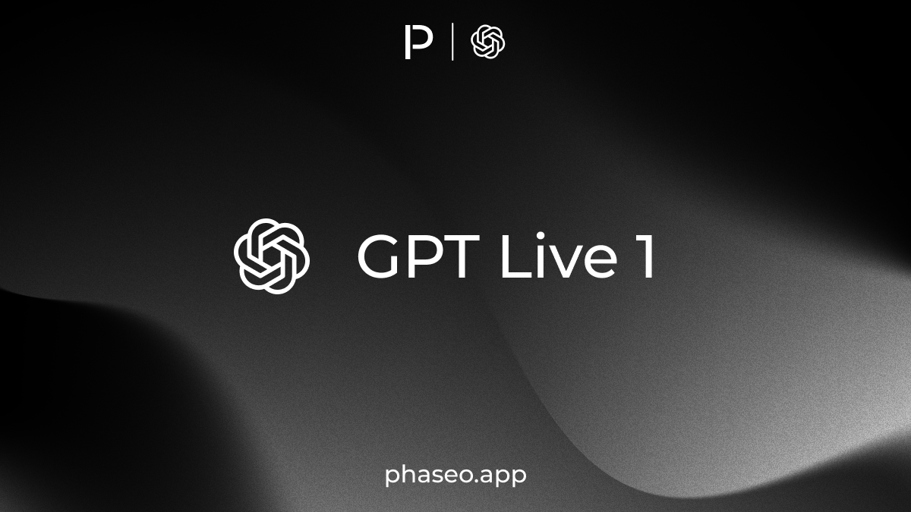

<Update label="September 13, 2026" tags={["Features"]}>

### Features

- Chat rooms now support per-request service tier selection for Priority and Flex requests ([#2357](https://github.com/phaseoteam/Phaseo/pull/2357)).
- Model pages now include interactive hourly provider performance views ([#2361](https://github.com/phaseoteam/Phaseo/pull/2361)).

</Update>

<Update label="September 11, 2026" tags={["Features"]}>

### Features

- [GPT Live 1](https://phaseo.app/models/openai/gpt-live-1) is now available in the Realtime chat room, with built-in voice selection, configurable Responses delegation, and optional web search ([#2338](https://github.com/phaseoteam/Phaseo/pull/2338)).

</Update>

<Update label="September 10, 2026" tags={["Features"]}>

### Features

- The Phaseo CLI now includes coding-agent integrations and runners, including safe OpenCode setup and management ([#2325](https://github.com/phaseoteam/Phaseo/pull/2325)).

</Update>

<Update label="September 9, 2026" tags={["Model Releases"]}>

### Model Releases

- [Suno V6](https://phaseo.app/models/suno/suno-v6)
- [Suno V6 Wild](https://phaseo.app/models/suno/suno-v6-wild)
- [Suno V6 Mini](https://phaseo.app/models/suno/suno-v6-mini)

</Update>

<Update label="September 8, 2026" tags={["Model Releases"]}>

### Model Releases

- [GPT Image 2.5 Flare](https://phaseo.app/models/openai/gpt-image-2.5-flare)
- [GPT Image 2.5 Sunburst](https://phaseo.app/models/openai/gpt-image-2.5-sunburst)
- [DeepSeek V4.1 Flash](https://phaseo.app/models/deepseek/deepseek-v4.1-flash)
- [Mercury 2.5](https://phaseo.app/models/inception/mercury-2.5)
- [Nex N2.5 Max](https://phaseo.app/models/nex-agi/nex-n2.5-max)
- [Nex N2.5 Mini](https://phaseo.app/models/nex-agi/nex-n2.5-mini)
- [Nex N2.5 Pro](https://phaseo.app/models/nex-agi/nex-n2.5-pro)

</Update>

<Update label="September 3, 2026" tags={["Model Releases"]}>

### Model Releases

- [GPT-6 Astra](https://phaseo.app/models/openai/gpt-6-astra)
- [GPT-6 Astra Pro](https://phaseo.app/models/openai/gpt-6-astra-pro)

- [Ling 3.0 Flash Sante](https://phaseo.app/models/inclusionai/ling-3.0-flash-sante)
- [Ling 3.0 Flash VL](https://phaseo.app/models/inclusionai/ling-3.0-flash-vl)

</Update>

<Update label="September 2, 2026" tags={["Model Releases"]}>

### Model Releases

- [Gemini 3.8 Flash](https://phaseo.app/models/google/gemini-3.8-flash)
- [Muse Spark 1.3](https://phaseo.app/models/meta/muse-spark-1.3)
- [Muse Spark 1.3 Contributor](https://phaseo.app/models/meta/muse-spark-1.3-contributor)
- [Qwen 3.8 Max 0902](https://phaseo.app/models/qwen/qwen3.8-max-0902)

</Update>

<Update label="September 1, 2026" tags={["Model Releases"]}>

### Model Releases

- [Claude Fable 5.1](https://phaseo.app/models/anthropic/claude-fable-5.1)
- [Muse Voice Transcribe 1.0](https://phaseo.app/models/meta/muse-voice-transcribe-1.0)

</Update>
