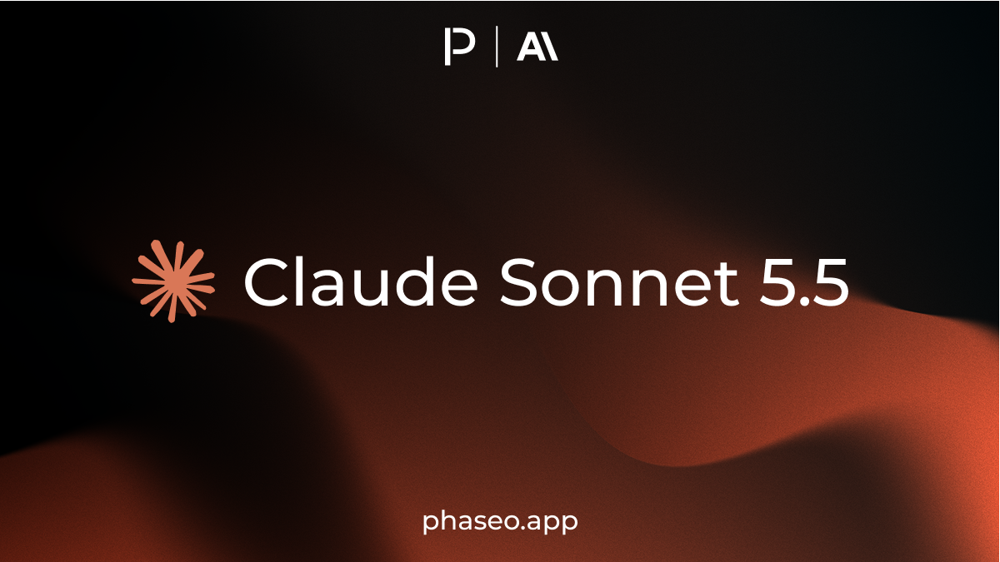
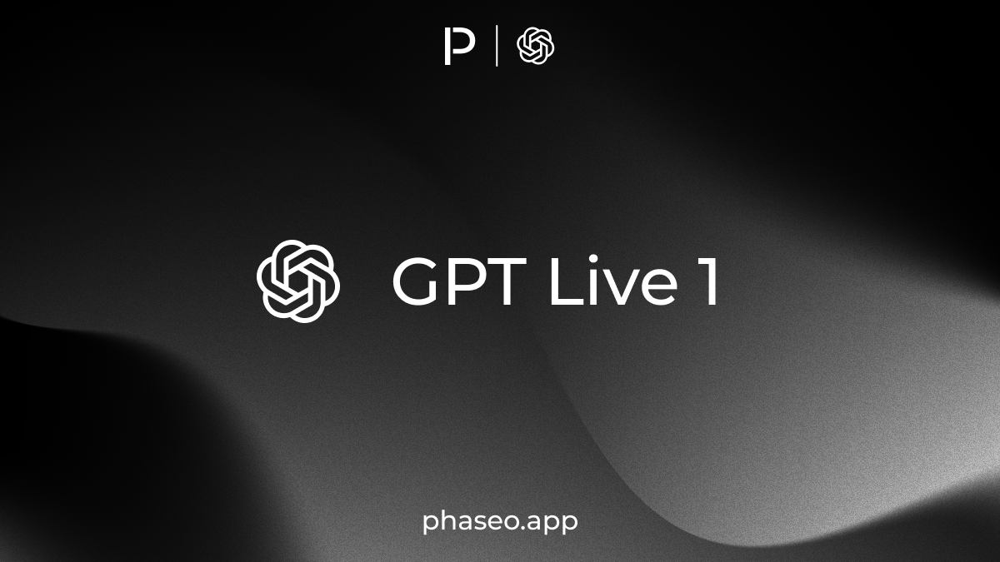
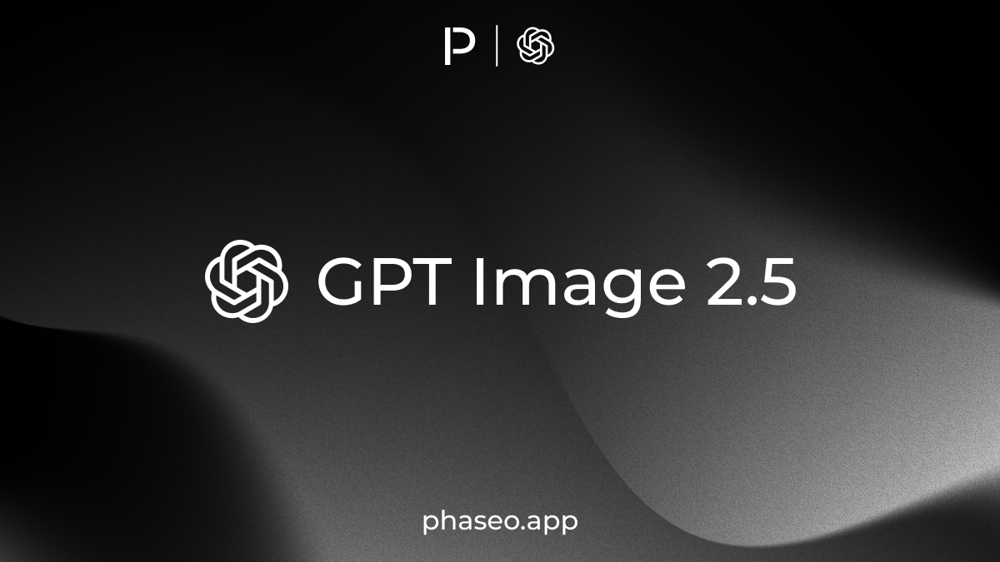
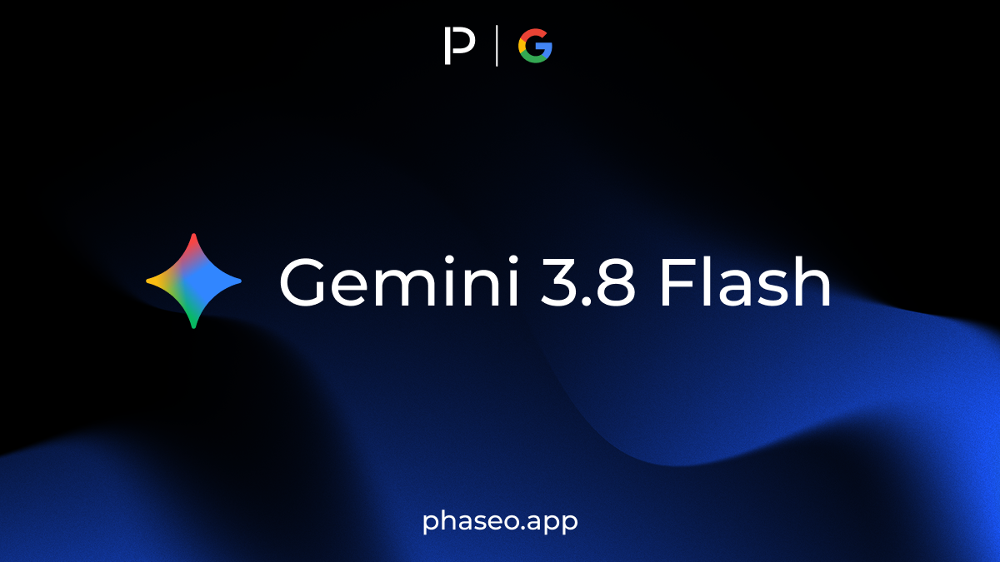
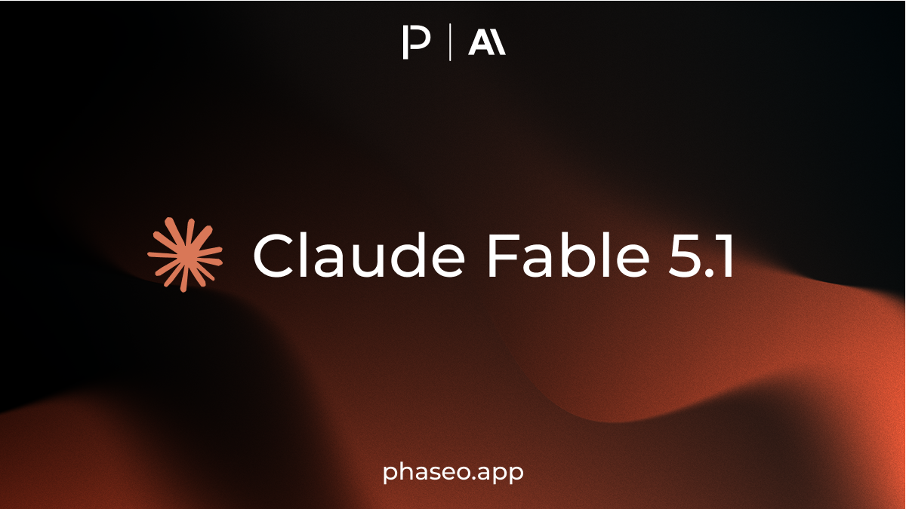

## September 28, 2026

Product

- Speech prices now appear as character-based text input rates in provider details, with introductory discounts shown on the applicable SKU ([#2649](https://github.com/phaseoteam/Phaseo/pull/2649), [#2652](https://github.com/phaseoteam/Phaseo/pull/2652)).

New Models

- [Eleven v4](https://phaseo.app/models/eleven-labs/eleven-v4) and [Eleven v4 Turbo](https://phaseo.app/models/eleven-labs/eleven-v4-turbo) were added for speech generation with inline expressive tags and voice-library IDs. Introductory rates of $0.022 and $0.011 per 1,000 characters run through October 12; v4 request options are available in the API and SDKs ([#2646](https://github.com/phaseoteam/Phaseo/pull/2646), [#2649](https://github.com/phaseoteam/Phaseo/pull/2649)).

- [Claude Sonnet 5.5](https://phaseo.app/models/anthropic/claude-sonnet-5.5) added with Anthropic, Claude Platform on AWS, Amazon Bedrock, and Google Vertex routes. Anthropic lists standard pricing at $2 per million input tokens and $10 per million output tokens.

***

## September 27, 2026

Product

- Image Studio now handles Hy Image options more reliably ([#2626](https://github.com/phaseoteam/Phaseo/pull/2626)).

***

## September 26, 2026

Product

- The Ultrafast service tier is available for compatible text requests across the gateway, pricing views, API, and SDKs ([#2624](https://github.com/phaseoteam/Phaseo/pull/2624)).

New Models

- GMI Cloud added a promotional [Hy Image 3.5 Preview](https://phaseo.app/models/tencent/hy-image-v3.5-preview) route ([#2611](https://github.com/phaseoteam/Phaseo/pull/2611)).

***

## September 25, 2026

Product

- Conditional provider prices now retain their catalogue terms instead of appearing as unconditional rates ([#2585](https://github.com/phaseoteam/Phaseo/pull/2585)).

***

## September 24, 2026

Product

- Global search now includes documentation pages and makes workspace switching easier ([#2526](https://github.com/phaseoteam/Phaseo/pull/2526), [#2572](https://github.com/phaseoteam/Phaseo/pull/2572)).

***

## September 23, 2026

Product

- Gemini 3.8 TTS pricing and billing are now represented in model and provider views ([#2540](https://github.com/phaseoteam/Phaseo/pull/2540), [#2560](https://github.com/phaseoteam/Phaseo/pull/2560)).
- SiliconFlow Decisions routing was added ([#2528](https://github.com/phaseoteam/Phaseo/pull/2528)).

***

## September 22, 2026

Product

- Chat reasoning and service tier controls now show only options supported by the selected model ([#2496](https://github.com/phaseoteam/Phaseo/pull/2496), [#2518](https://github.com/phaseoteam/Phaseo/pull/2518)).

New Models

- Gemini 3.8 Flash TTS and Flash Lite TTS were added to the catalogue; routing was initially held until billable pricing became available ([#2510](https://github.com/phaseoteam/Phaseo/pull/2510)).

***

## September 21, 2026

Product

- Models and API Providers tables now let you save column visibility, order, pinning, and density preferences ([#2473](https://github.com/phaseoteam/Phaseo/pull/2473)).
- Display preferences now include custom themes; chat request samples show more detail ([#2452](https://github.com/phaseoteam/Phaseo/pull/2452), [#2468](https://github.com/phaseoteam/Phaseo/pull/2468)).

***

## September 20, 2026

Product

- Provider pages now offer clearer navigation and routing guidance ([#2449](https://github.com/phaseoteam/Phaseo/pull/2449)).
- The TypeScript and Python SDKs gained developer workflow improvements ([#2443](https://github.com/phaseoteam/Phaseo/pull/2443)).

***

## September 19, 2026

Product

- Chat now has dedicated media and document rooms ([#2440](https://github.com/phaseoteam/Phaseo/pull/2440)).
- The TypeScript and Python SDKs can submit and wait for music, video, and batch jobs with polling and timeout controls ([#2434](https://github.com/phaseoteam/Phaseo/pull/2434)).

***

## September 18, 2026

New Models

- TypeSafe Jev Decisions integration was added ([#2425](https://github.com/phaseoteam/Phaseo/pull/2425)).

***

## September 17, 2026

Product

- Request logs now share a consistent table and response timeline ([#2415](https://github.com/phaseoteam/Phaseo/pull/2415)).
- Model discovery now separates public release announcements from internal review alerts ([#2420](https://github.com/phaseoteam/Phaseo/pull/2420)).

New Models

- Union Alpha provider routes were enabled ([#2414](https://github.com/phaseoteam/Phaseo/pull/2414)).

***

## September 16, 2026

Product

- Providers can manage catalogue offers and staged releases through a self-service interface, including review and scheduled availability ([#2406](https://github.com/phaseoteam/Phaseo/pull/2406)).
- Epoch capabilities benchmark views were added ([#2408](https://github.com/phaseoteam/Phaseo/pull/2408)).

***

## September 15, 2026

Product

- Auto Top-Up now includes an MFA consent flow ([#2401](https://github.com/phaseoteam/Phaseo/pull/2401)).
- Webhooks now separate events by job type ([#2397](https://github.com/phaseoteam/Phaseo/pull/2397)).

***

## September 14, 2026

Product

- Chat gained a conversation navigation rail ([#2385](https://github.com/phaseoteam/Phaseo/pull/2385)).

New Models

- Inference.net and Doubleword routes were added for DeepSeek V4.1 Flash ([#2384](https://github.com/phaseoteam/Phaseo/pull/2384)).

***

## September 13, 2026

Product

- Chat rooms now support per-request service tier selection for Priority and Flex requests ([#2357](https://github.com/phaseoteam/Phaseo/pull/2357)).
- Model pages now include interactive hourly provider performance views ([#2361](https://github.com/phaseoteam/Phaseo/pull/2361)).

***

## September 12, 2026

Product

- Model catalogue caches now refresh more consistently after updates ([#2346](https://github.com/phaseoteam/Phaseo/pull/2346)).

***

## September 11, 2026

Product

- [GPT Live 1](https://phaseo.app/models/openai/gpt-live-1) is now available in the Realtime chat room, with built-in voice selection, configurable Responses delegation, and optional web search ([#2338](https://github.com/phaseoteam/Phaseo/pull/2338)).
- API keys can now be searched in settings ([#2344](https://github.com/phaseoteam/Phaseo/pull/2344)).

***

## September 10, 2026

Product

- The Phaseo CLI now includes coding-agent integrations and runners, including safe OpenCode setup and management ([#2325](https://github.com/phaseoteam/Phaseo/pull/2325)).
- Artificial Analysis benchmark pages gained refreshed comparisons and pricing tier visuals ([#2321](https://github.com/phaseoteam/Phaseo/pull/2321), [#2323](https://github.com/phaseoteam/Phaseo/pull/2323)).

New Models

- [DeepSeek V4.1 Flash](https://phaseo.app/models/deepseek/deepseek-v4.1-flash)

***

## September 9, 2026

New Models

- [Suno V6](https://phaseo.app/models/suno/suno-v6)
- [Suno V6 Wild](https://phaseo.app/models/suno/suno-v6-wild)
- [Suno V6 Mini](https://phaseo.app/models/suno/suno-v6-mini)

***

## September 8, 2026

Product

- Administrators can manage catalogue records from the web app ([#2200](https://github.com/phaseoteam/Phaseo/pull/2200)).
- Artificial Analysis comparisons are now available across benchmark pages ([#2264](https://github.com/phaseoteam/Phaseo/pull/2264)).

New Models

- [GPT Image 2.5 Flare](https://phaseo.app/models/openai/gpt-image-2.5-flare)
- [GPT Image 2.5 Sunburst](https://phaseo.app/models/openai/gpt-image-2.5-sunburst)
- [DeepSeek V4.1 Flash Preview](https://phaseo.app/models/deepseek/deepseek-v4.1-flash-preview)
- [Mercury 2.5](https://phaseo.app/models/inception/mercury-2.5)
- [Nex N2.5 Max](https://phaseo.app/models/nex-agi/nex-n2.5-max)
- [Nex N2.5 Mini](https://phaseo.app/models/nex-agi/nex-n2.5-mini)
- [Nex N2.5 Pro](https://phaseo.app/models/nex-agi/nex-n2.5-pro)

***

## September 7, 2026

Product

- Realtime Sessions gained a table and detail sheet; API key and webhook settings gained clearer organization ([#2243](https://github.com/phaseoteam/Phaseo/pull/2243), [#2261](https://github.com/phaseoteam/Phaseo/pull/2261), [#2257](https://github.com/phaseoteam/Phaseo/pull/2257)).

***

## September 6, 2026

Product

- Video and Batch preview workflows and result downloads were improved across providers ([#2216](https://github.com/phaseoteam/Phaseo/pull/2216), [#2223](https://github.com/phaseoteam/Phaseo/pull/2223)).

***

## September 4, 2026

Product

- Workspaces can add private models ([#2201](https://github.com/phaseoteam/Phaseo/pull/2201)).

New Models

- GPT-6 Astra became available for routing ([#2199](https://github.com/phaseoteam/Phaseo/pull/2199), [#2203](https://github.com/phaseoteam/Phaseo/pull/2203)).

***

## September 3, 2026

Product

- The Phaseo Terraform provider and regional text routing were added ([#2164](https://github.com/phaseoteam/Phaseo/pull/2164), [#2165](https://github.com/phaseoteam/Phaseo/pull/2165)).

New Models

- [GPT-6 Astra](https://phaseo.app/models/openai/gpt-6-astra)
- [GPT-6 Astra Pro](https://phaseo.app/models/openai/gpt-6-astra-pro)

- [Ling 3.0 Flash Sante](https://phaseo.app/models/inclusionai/ling-3.0-flash-sante)
- [Ling 3.0 Flash VL](https://phaseo.app/models/inclusionai/ling-3.0-flash-vl)

***

## September 2, 2026

New Models

- [Gemini 3.8 Flash](https://phaseo.app/models/google/gemini-3.8-flash)
- [Muse Spark 1.3](https://phaseo.app/models/meta/muse-spark-1.3)
- [Muse Spark 1.3 Contributor](https://phaseo.app/models/meta/muse-spark-1.3-contributor)
- [Qwen 3.8 Max 0902](https://phaseo.app/models/qwen/qwen3.8-max-0902)

***

## September 1, 2026

New Models

- [Claude Fable 5.1](https://phaseo.app/models/anthropic/claude-fable-5.1)
- [Muse Voice Transcribe 1.0](https://phaseo.app/models/meta/muse-voice-transcribe-1.0)

***
