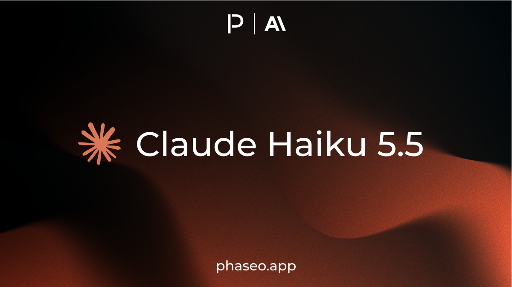
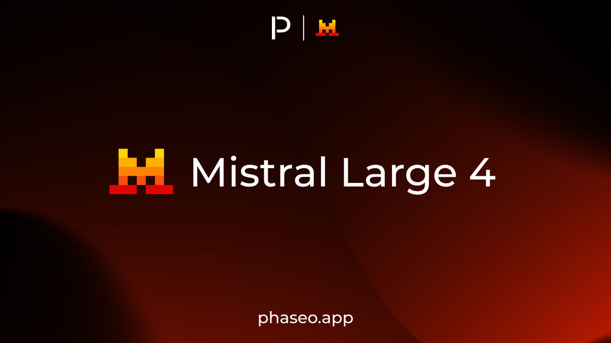
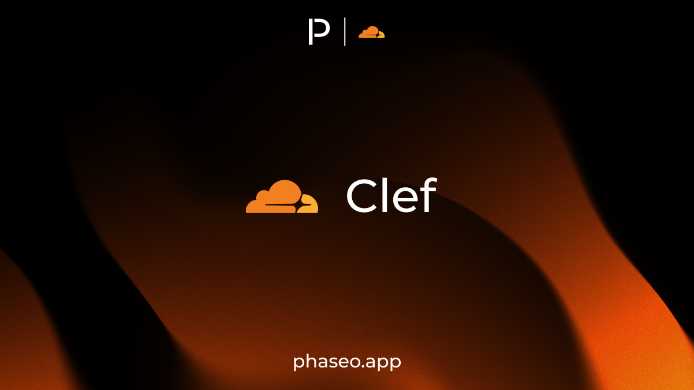

<Update label="October 7, 2026" tags={["Model Releases"]}>

### Model Releases

- [Anthropic: Claude Haiku 5.5](https://phaseo.app/models/anthropic/claude-haiku-5.5)

</Update>

<Update label="October 6, 2026" tags={["Model Releases"]}>

### Model Releases

- [Mistral: Mistral Large 4](https://phaseo.app/models/mistral/mistral-large-4.0)
- [Google: Nano Banana 2.1](https://phaseo.app/models/google/gemini-nano-banana-2.1)
- [Google: EmbeddingGemma 2](https://phaseo.app/models/google/embeddinggemma-2)

</Update>

<Update label="October 1, 2026" tags={["Model Releases"]}>

### Model Releases

- [Cloudflare: Clef](https://phaseo.app/models/cloudflare/clef)
- [Cloudflare: Clef Flash](https://phaseo.app/models/cloudflare/clef-flash)
- [Microsoft: MAI-Voice-2.1](https://phaseo.app/models/microsoft/mai-voice-2.1)
- [Microsoft: MAI-Voice-2.1-Flash](https://phaseo.app/models/microsoft/mai-voice-2.1-flash)
- [Microsoft: MAI-Transcribe-2-Streaming](https://phaseo.app/models/microsoft/mai-transcribe-2-streaming)

</Update>
