<Update label="January 30, 2026" tags={["Features","Model Releases","SDK"]}>

### Features

- The gateway was overhauled again, including Anthropic-compatible `/messages` support.
- Database architecture, website UX, playground tooling, and SDK direction were all refreshed for broader expansion.

### Model Releases

- [z.AI: GLM 4.5 Air X](https://phaseo.app/models/z-ai/glm-4.5-air-x)
- [z.AI: GLM 4.5 X](https://phaseo.app/models/z-ai/glm-4.5-x)
- [xAI: Grok Imagine Image](https://phaseo.app/models/x-ai/grok-imagine-image)
- [xAI: Grok Imagine Video](https://phaseo.app/models/x-ai/grok-imagine-video)
- [Moonshot: Kimi K2.5](https://phaseo.app/models/moonshotai/kimi-k2.5)
- [MiniMax: MiniMax M2 Her](https://phaseo.app/models/minimax/minimax-m2-her)
- [Qwen: Qwen 3 Max Thinking](https://phaseo.app/models/qwen/qwen3-max-thinking)

</Update>

<Update label="January 29, 2026" tags={["Model Releases"]}>

### Model Releases

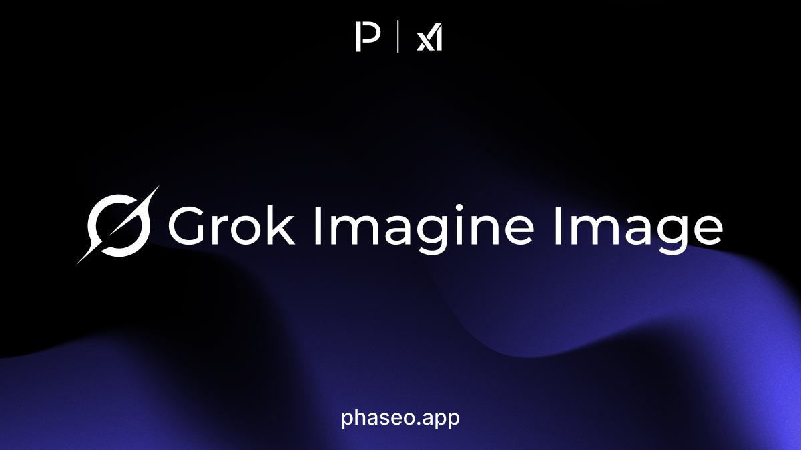

- [xAI: Grok Imagine Image](https://phaseo.app/models/x-ai/grok-imagine-image)
- [xAI: Grok Imagine Image Pro](https://phaseo.app/models/x-ai/grok-imagine-image-pro)
- [xAI: Grok Imagine Video](https://phaseo.app/models/x-ai/grok-imagine-video)

</Update>

<Update label="January 27, 2026" tags={["Model Releases"]}>

### Model Releases

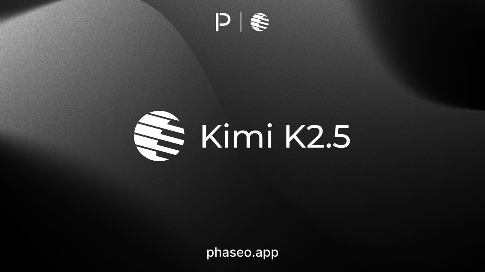

- [Arcee AI: Trinity Large](https://phaseo.app/models/arcee-ai/trinity-large)
- [CrofAI: Greg 1](https://phaseo.app/models/crofai/greg-1)
- [CrofAI: Greg 1 Mini](https://phaseo.app/models/crofai/greg-1-mini)
- [CrofAI: Greg 1 Super](https://phaseo.app/models/crofai/greg-1-super)
- [Moonshot: Kimi K2.5](https://phaseo.app/models/moonshotai/kimi-k2.5)

</Update>

<Update label="January 26, 2026" tags={["Model Releases"]}>

### Model Releases

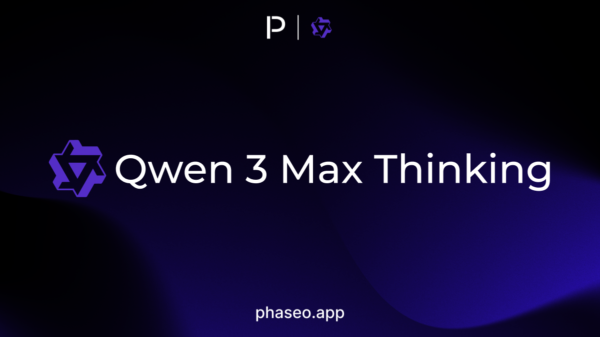

- [Qwen: Qwen 3 Max Thinking](https://phaseo.app/models/qwen/qwen3-max-thinking)
- [Upstage: Solar Pro 3 (2026-01-26)](https://phaseo.app/models/upstage/solar-pro-3)

</Update>

<Update label="January 24, 2026" tags={["Model Releases"]}>

### Model Releases

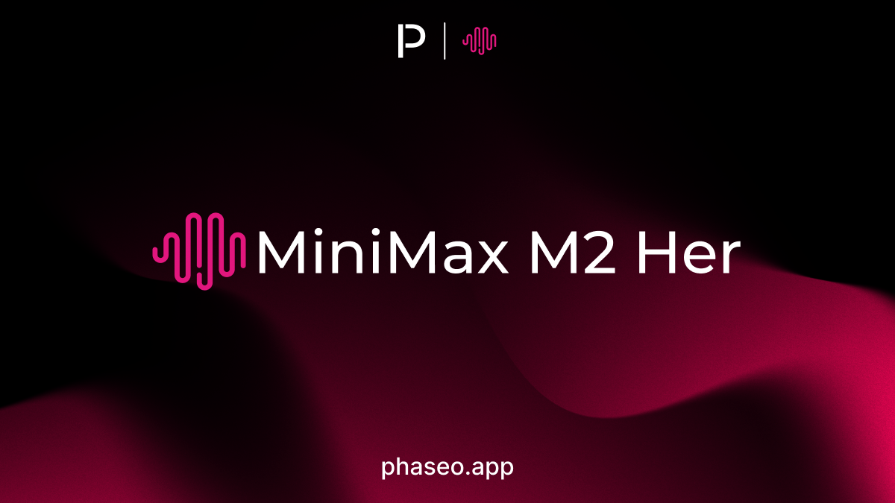

- [MiniMax: MiniMax M2 Her](https://phaseo.app/models/minimax/minimax-m2-her)

</Update>

<Update label="January 22, 2026" tags={["Model Releases"]}>

### Model Releases

- [Baidu: Ernie 5.0](https://phaseo.app/models/baidu/ernie-5.0)

</Update>

<Update label="January 20, 2026" tags={["Model Releases"]}>

### Model Releases

- [Liquid AI: LFM 2.5 1.2B Thinking](https://phaseo.app/models/liquid-ai/lfm-2.5-1.2b-thinking)

</Update>

<Update label="January 19, 2026" tags={["Model Releases"]}>

### Model Releases

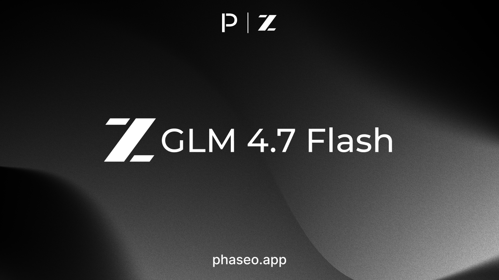

- [z.AI: GLM 4.7 Flash](https://phaseo.app/models/z-ai/glm-4.7-flash)

</Update>

<Update label="January 16, 2026" tags={["Model Releases"]}>

### Model Releases

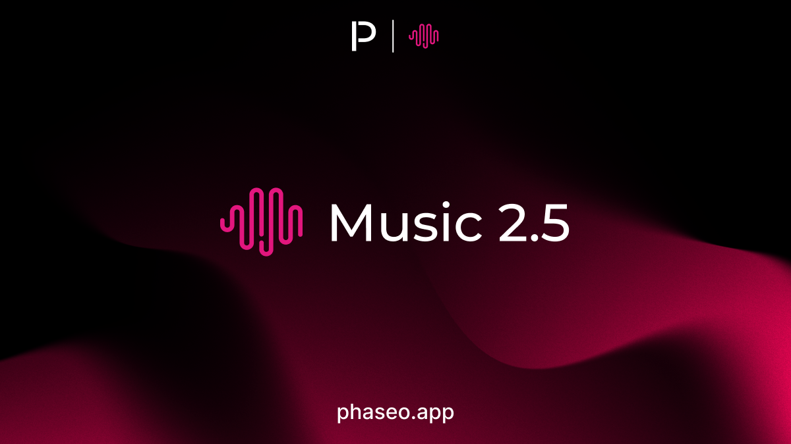

- [MiniMax: Music 2.5](https://phaseo.app/models/minimax/music-2.5)

</Update>

<Update label="January 15, 2026" tags={["Model Releases"]}>

### Model Releases

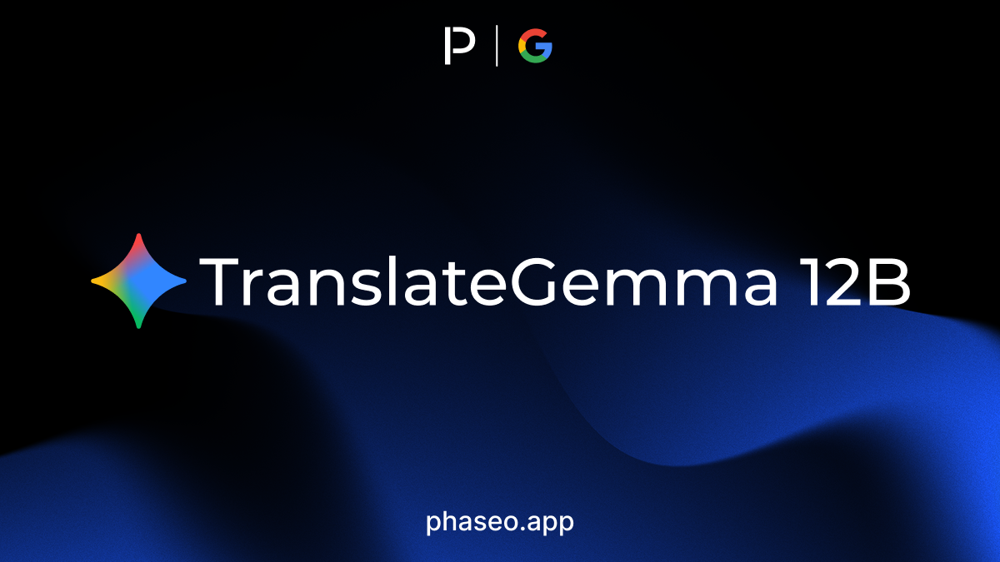

- [Black Forest Labs: Flux 2 Klein 4B](https://phaseo.app/models/black-forest-labs/flux-2-klein-4b)
- [Black Forest Labs: Flux 2 Klein 9B](https://phaseo.app/models/black-forest-labs/flux-2-klein-9b)
- [Google: TranslateGemma 12B](https://phaseo.app/models/google/translategemma-12b)
- [Google: TranslateGemma 27B](https://phaseo.app/models/google/translategemma-27b)
- [Google: TranslateGemma 4B](https://phaseo.app/models/google/translategemma-4b)
- [Voyage: Voyage 4](https://phaseo.app/models/voyage/voyage-4)
- [Voyage: Voyage 4 Large](https://phaseo.app/models/voyage/voyage-4-large)
- [Voyage: Voyage 4 Lite](https://phaseo.app/models/voyage/voyage-4-lite)
- [Voyage: Voyage Multimodal 3.5](https://phaseo.app/models/voyage/voyage-multimodal-3.5)

</Update>

<Update label="January 14, 2026" tags={["Model Releases"]}>

### Model Releases

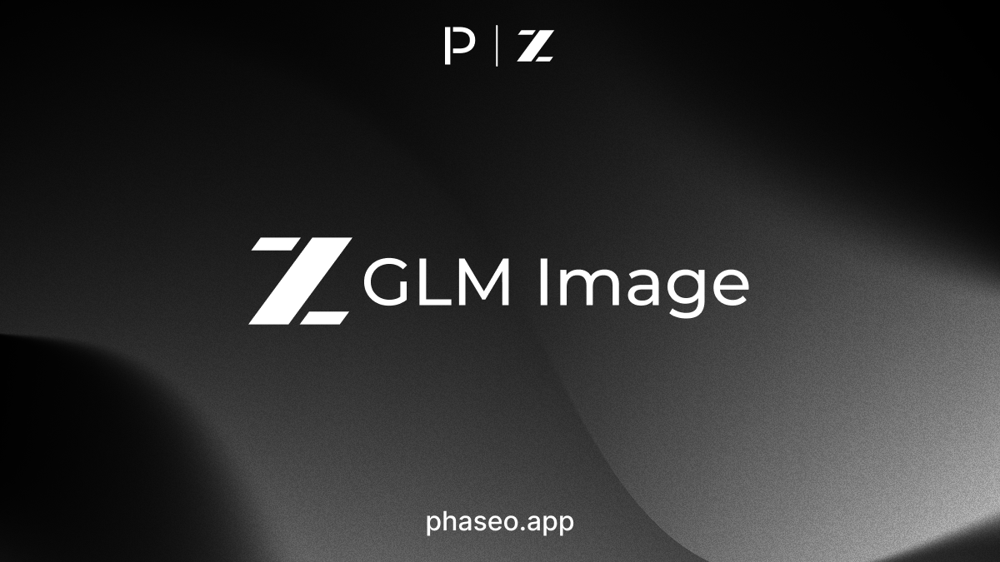

- [z.AI: GLM Image](https://phaseo.app/models/z-ai/glm-image)

</Update>

<Update label="January 13, 2026" tags={["Model Releases"]}>

### Model Releases

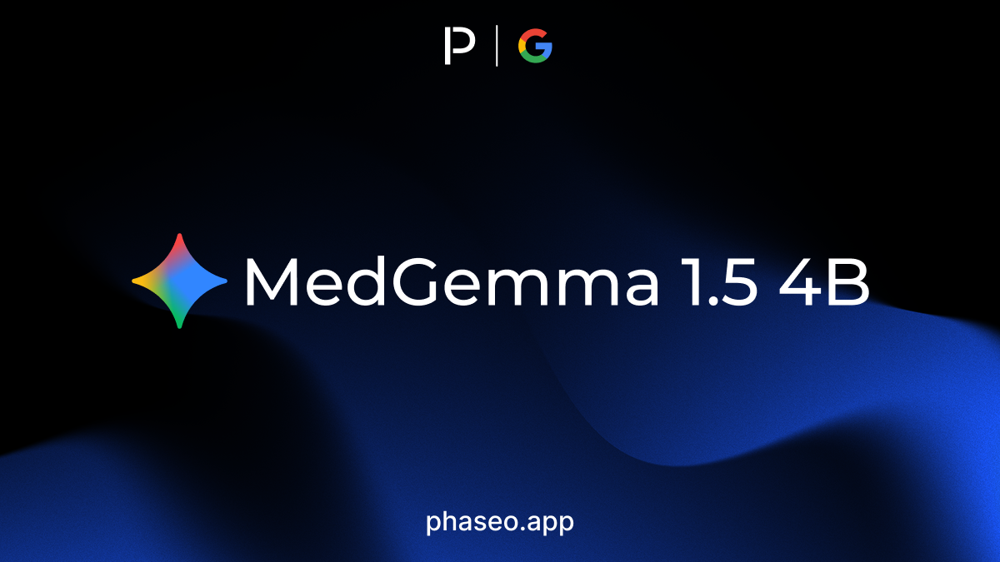

- [Google: MedGemma 1.5 4B](https://phaseo.app/models/google/medgemma-1.5-4b)

</Update>

<Update label="January 9, 2026" tags={["Model Releases"]}>

### Model Releases

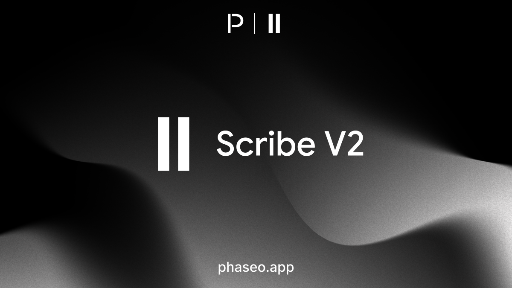

- [ElevenLabs: Scribe V2](https://phaseo.app/models/eleven-labs/scribe-v2)

</Update>

<Update label="January 8, 2026" tags={["Model Releases"]}>

### Model Releases

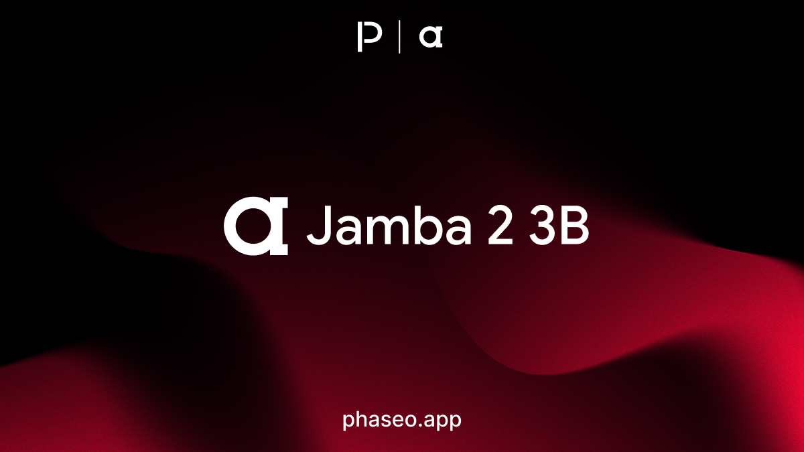

- [ai21: Jamba 2 3B](https://phaseo.app/models/ai21/jamba-2-3b)
- [ai21: Jamba Mini 2](https://phaseo.app/models/ai21/jamba-mini-2)

</Update>

<Update label="January 6, 2026" tags={["Model Releases"]}>

### Model Releases

- [Liquid AI: LFM 2.5 1.2B](https://phaseo.app/models/liquid-ai/lfm-2.5-1.2b)
- [Liquid AI: LFM 2.5 1.2B JP](https://phaseo.app/models/liquid-ai/lfm-2.5-1.2b-jp)
- [Nous: NousCoder 14B](https://phaseo.app/models/nous/nouscoder-14b)

</Update>

<Update label="January 3, 2026" tags={["Model Releases"]}>

### Model Releases

- [z.AI: GLM 4.7](https://phaseo.app/models/z-ai/glm-4.7)
- [MiniMax: Music 2.0](https://phaseo.app/models/minimax/music-2.0)
- [Relace: Relace Search](https://phaseo.app/models/relace/relace-search)
- [ByteDance: Seed 1.6 (2025-10-15)](https://phaseo.app/models/bytedance/seed-1.6-2025-10-15)
- [ByteDance: Seed 1.6 Flash (2025-08-28)](https://phaseo.app/models/bytedance/seed-1.6-flash-2025-08-28)
- [ByteDance: Seed 1.8](https://phaseo.app/models/bytedance/seed-1.8)
- [ByteDance: Seedream 4.5](https://phaseo.app/models/bytedance/seedream-4.5)
- [MiniMax: Speech 2.6](https://phaseo.app/models/minimax/speech-2.6)
- [Arcee AI: Trinity Large](https://phaseo.app/models/arcee-ai/trinity-large)

</Update>
