<Update label="March 31, 2026" tags={["Model Releases"]}>

### Model Releases

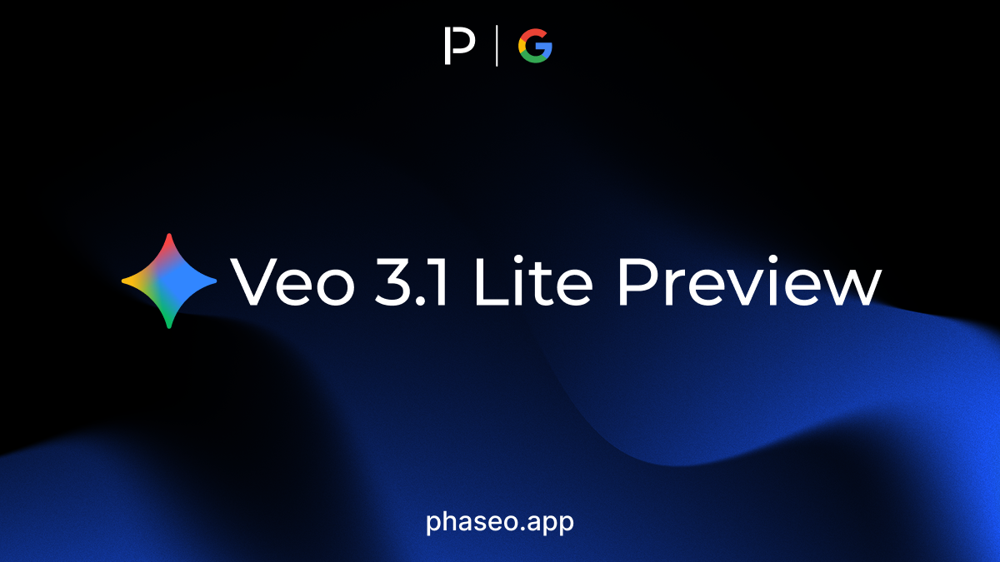

- [Google: Veo 3.1 Lite Preview](https://phaseo.app/models/google/veo-3.1-lite-preview)

</Update>

<Update label="March 23, 2026" tags={["Model Releases"]}>

### Model Releases

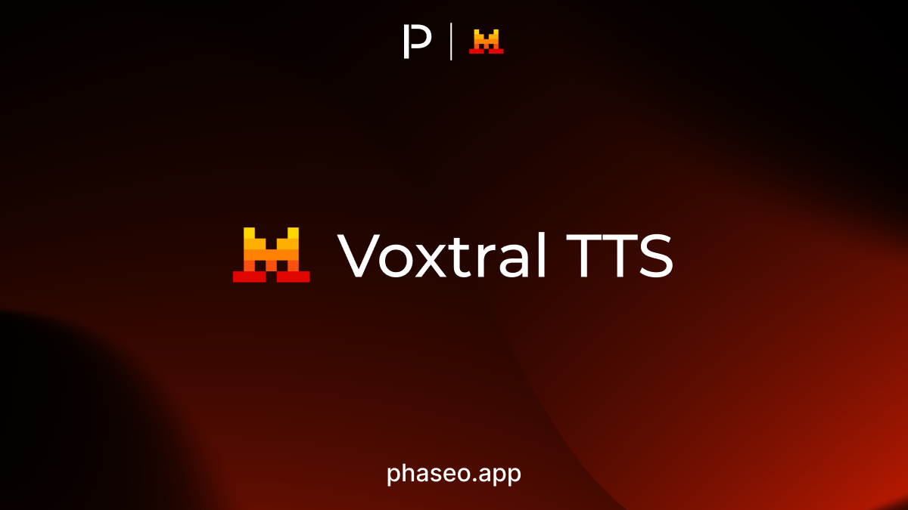

- [Mistral: Voxtral TTS](https://phaseo.app/models/mistral/voxtral-tts)

</Update>

<Update label="March 22, 2026" tags={["Features","Model Releases","SDK"]}>

### Features

- New language SDKs shipped, TypeScript and Python SDKs were overhauled, and chat rooms went multimodal.
- Foundry launched, LLM Council became the first Foundry project, and SDK `1.1.0` aligned model availability and lifecycle warnings with the API.

</Update>

<Update label="March 19, 2026" tags={["Model Releases"]}>

### Model Releases

- [Xiaomi: MiMo V2 Omni](https://phaseo.app/models/xiaomi/mimo-v2-omni)
- [Xiaomi: MiMo V2 Pro](https://phaseo.app/models/xiaomi/mimo-v2-pro)
- [Xiaomi: MiMo V2 TTS](https://phaseo.app/models/xiaomi/mimo-v2-tts)

</Update>

<Update label="March 18, 2026" tags={["Model Releases"]}>

### Model Releases

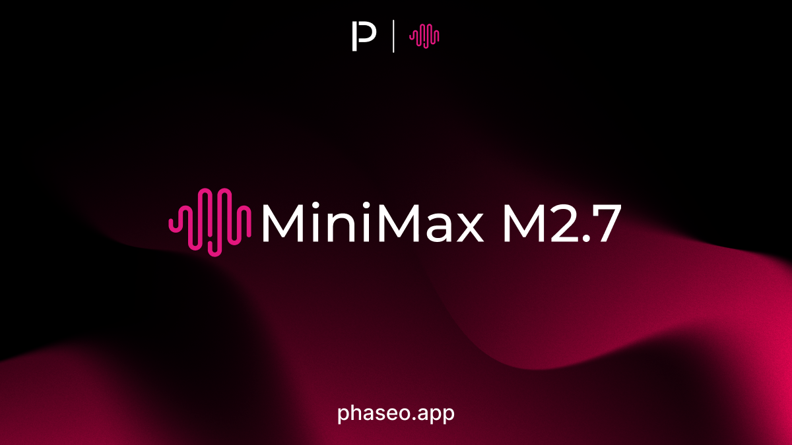

- [MiniMax: MiniMax M2.7](https://phaseo.app/models/minimax/minimax-m2.7)
- [Xiaomi: MiMo V2 Omni](https://phaseo.app/models/xiaomi/mimo-v2-omni)
- [Xiaomi: MiMo V2 Pro](https://phaseo.app/models/xiaomi/mimo-v2-pro)
- [Xiaomi: MiMo V2 TTS](https://phaseo.app/models/xiaomi/mimo-v2-tts)

</Update>

<Update label="March 17, 2026" tags={["Model Releases"]}>

### Model Releases

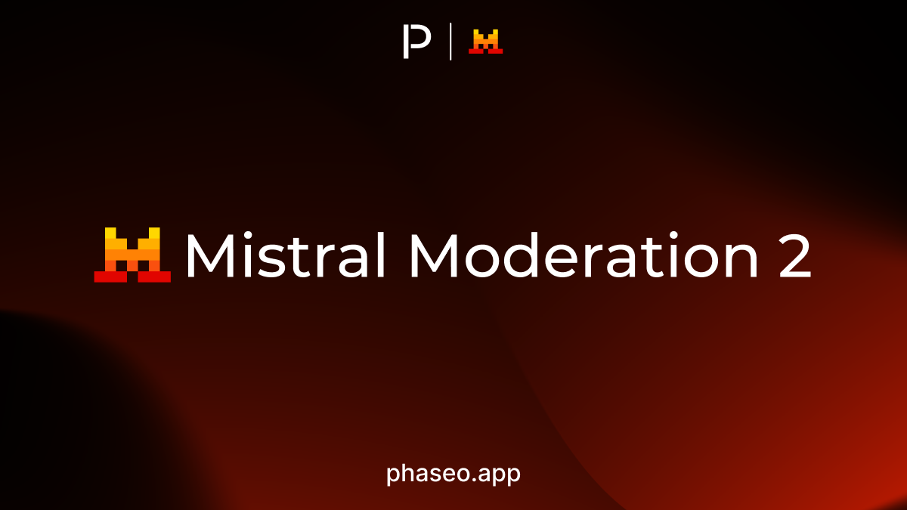

- [Mistral: Mistral Moderation 2](https://phaseo.app/models/mistral/mistral-moderation-2)
- [OpenAI: GPT 5.4 Mini](https://phaseo.app/models/openai/gpt-5.4-mini)
- [OpenAI: GPT 5.4 Nano](https://phaseo.app/models/openai/gpt-5.4-nano)

</Update>

<Update label="March 16, 2026" tags={["Model Releases"]}>

### Model Releases

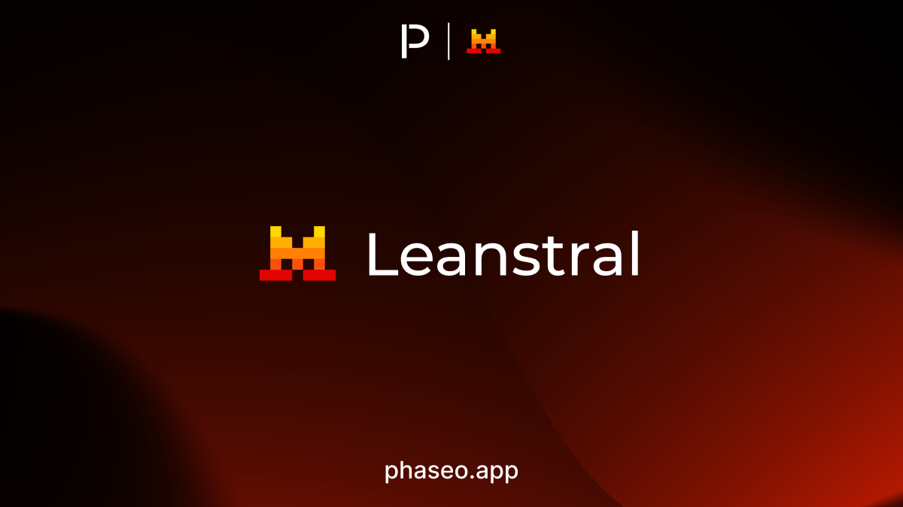

- [Mistral: Leanstral](https://phaseo.app/models/mistral/leanstral)
- [Mistral: Mistral Small 4](https://phaseo.app/models/mistral/mistral-small-4)

</Update>

<Update label="March 15, 2026" tags={["Model Releases"]}>

### Model Releases

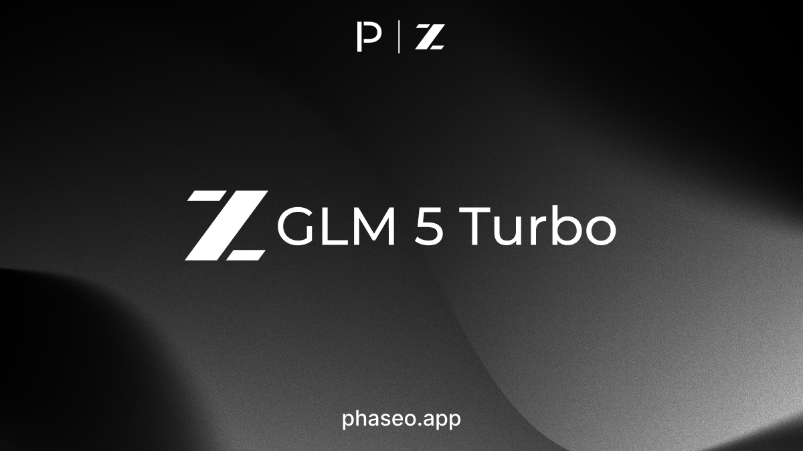

- [z.AI: GLM 5 Turbo](https://phaseo.app/models/z-ai/glm-5-turbo)

</Update>

<Update label="March 12, 2026" tags={["Features","Model Releases"]}>

### Features

- The models display page was overhauled for clearer availability, metadata hierarchy, and support context.

### Model Releases

- [Nvidia: Nemotron 3 Super](https://phaseo.app/models/nvidia/nemotron-3-super-120b-a12b)

</Update>

<Update label="March 11, 2026" tags={["Model Releases"]}>

### Model Releases

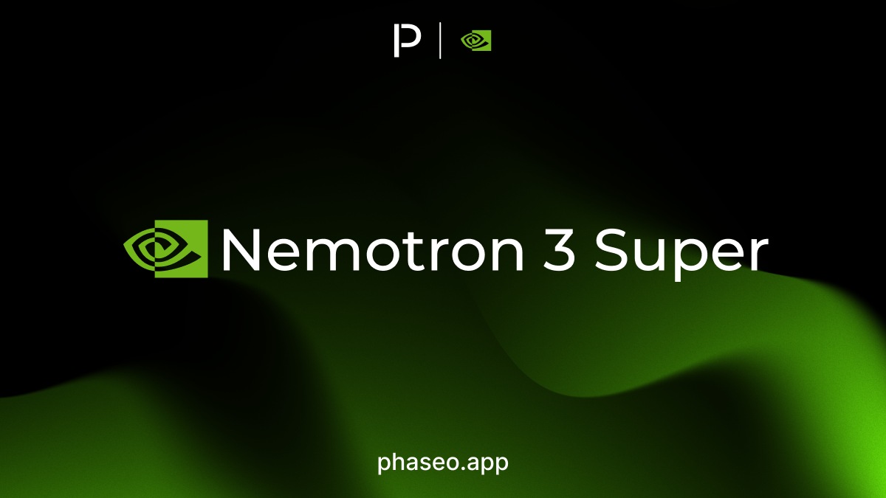

- [Nvidia: Nemotron 3 Super](https://phaseo.app/models/nvidia/nemotron-3-super-120b-a12b)

</Update>

<Update label="March 10, 2026" tags={["Features","Model Releases","Provider Coverage","Docs"]}>

### Features

- A broader brand refresh shipped across the website and docs.
- Alibaba Cloud provider coverage landed across Phaseo, gateway routes, and documentation.

### Model Releases

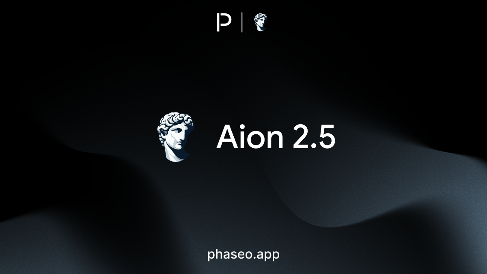

- [Aion Labs: Aion 2.5](https://phaseo.app/models/aion-labs/aion-2.5)
- [Google: Gemini Embedding 2 Preview](https://phaseo.app/models/google/gemini-embedding-2-preview)

</Update>

<Update label="March 5, 2026" tags={["Features","Model Releases","Docs"]}>

### Features

- GPT 5.4 and GPT 5.4 Pro landed across discovery, gateway, and docs.

### Model Releases

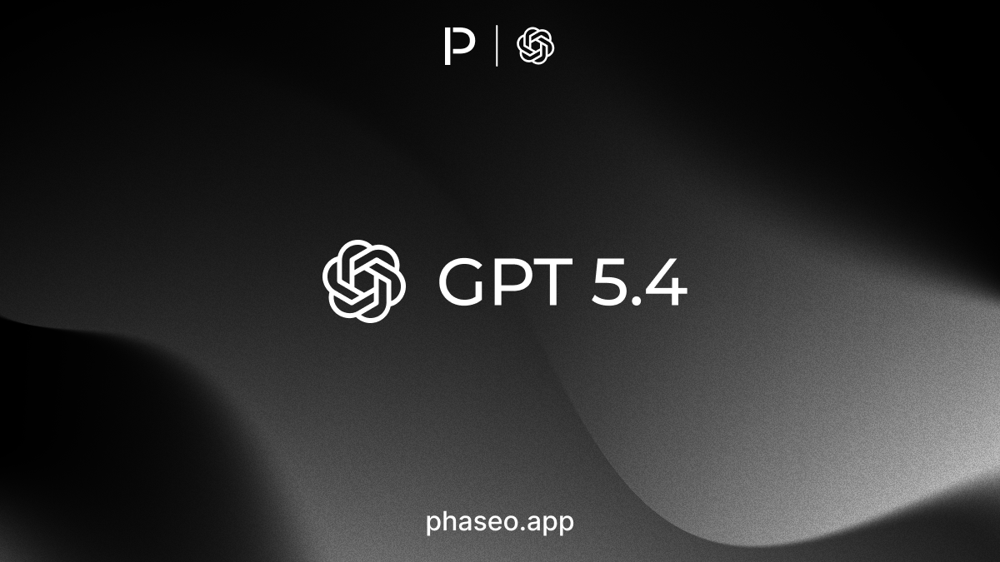

- [OpenAI: GPT 5.4](https://phaseo.app/models/openai/gpt-5.4)
- [OpenAI: GPT 5.4 Pro](https://phaseo.app/models/openai/gpt-5.4-pro)

</Update>

<Update label="March 3, 2026" tags={["Features","Model Releases","Docs"]}>

### Features

- Gemini 3.1 Flash Lite Preview landed across product surfaces, gateway routing, and docs.

### Model Releases

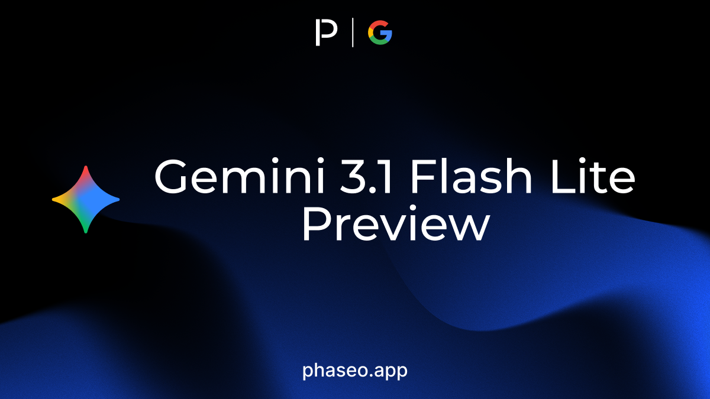

- [Google: Gemini 3.1 Flash Lite Preview](https://phaseo.app/models/google/gemini-3.1-flash-lite-preview)
- [OpenAI: GPT 5.3 Chat](https://phaseo.app/models/openai/gpt-5.3-chat)

</Update>

<Update label="March 2, 2026" tags={["Features","Docs","Model Releases"]}>

### Features

- Responses API assistant `phase` support landed across request handling, response payloads, and OpenAPI docs.

### Model Releases

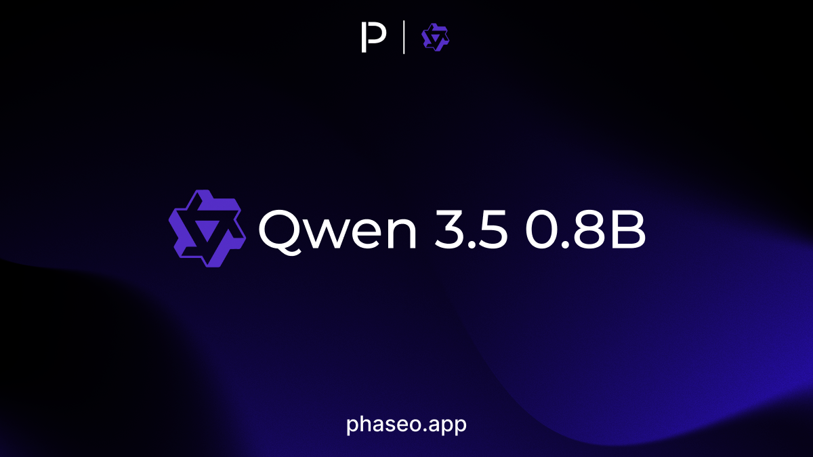

- [Qwen: Qwen 3.5 0.8B](https://phaseo.app/models/qwen/qwen3.5-0.8b)
- [Qwen: Qwen 3.5 2B](https://phaseo.app/models/qwen/qwen3.5-2b)
- [Qwen: Qwen 3.5 4B](https://phaseo.app/models/qwen/qwen3.5-4b)
- [Qwen: Qwen 3.5 9B](https://phaseo.app/models/qwen/qwen3.5-9b)

</Update>
