<Update label="April 30, 2026" tags={["Model Releases"]}>

### Model Releases

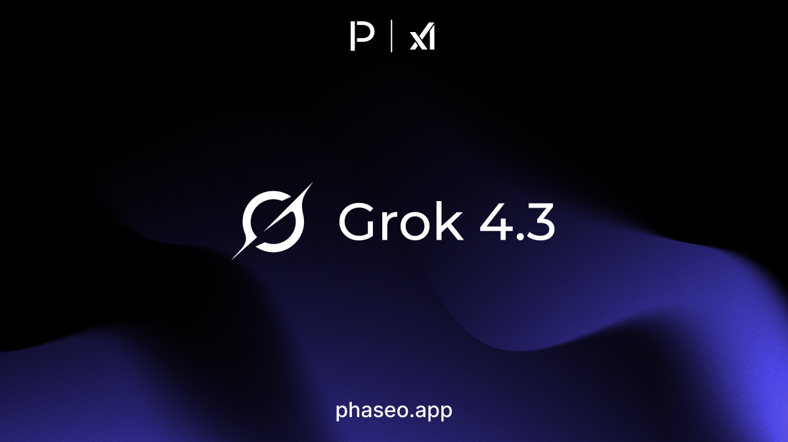

- [xAI: Grok 4.3](https://phaseo.app/models/x-ai/grok-4.3)

</Update>

<Update label="April 29, 2026" tags={["Features","Model Releases","SDK"]}>

### SDK Releases

- SDK `2.0.2` shipped for [TypeScript](https://github.com/phaseoteam/Phaseo/releases/tag/%40ai-stats%2Fsdk%402.0.2), [Python](https://github.com/phaseoteam/Phaseo/releases/tag/%40ai-stats%2Fpy-sdk%402.0.2), [Go](https://github.com/phaseoteam/Phaseo/releases/tag/%40ai-stats%2Fgo-sdk%402.0.2), [C#](https://github.com/phaseoteam/Phaseo/releases/tag/%40ai-stats%2Fcsharp-sdk%402.0.2), [Java](https://github.com/phaseoteam/Phaseo/releases/tag/%40ai-stats%2Fjava-sdk%402.0.2), [PHP](https://github.com/phaseoteam/Phaseo/releases/tag/%40ai-stats%2Fphp-sdk%402.0.2), and [Ruby](https://github.com/phaseoteam/Phaseo/releases/tag/%40ai-stats%2Fruby-sdk%402.0.2).
- This release separated runtime request model IDs from generated callable-helper constants, so newly released models can be used before the next SDK publish.
- Generated helpers now track the current callable-on-gateway snapshot, reducing noisy SDK churn from catalog-only model updates.

### Model Releases

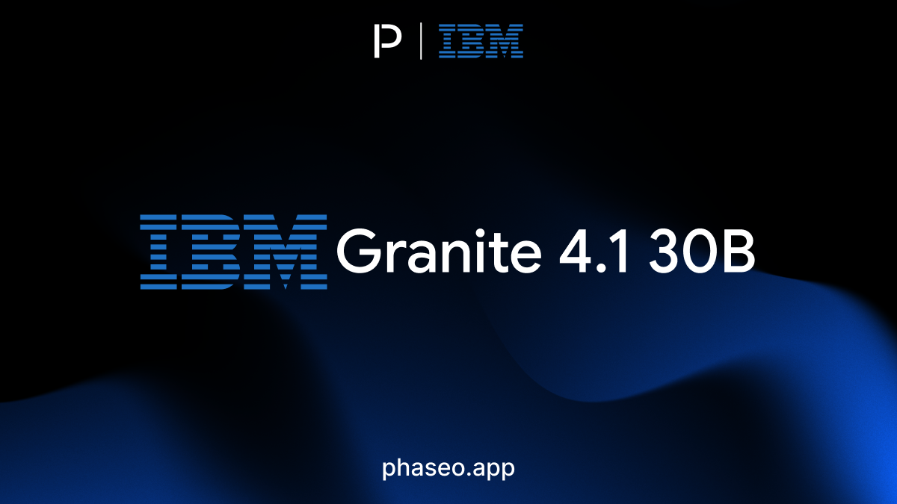

- [IBM: Granite 4.1 30B](https://phaseo.app/models/ibm/granite-4.1-30b)
- [IBM: Granite 4.1 3B](https://phaseo.app/models/ibm/granite-4.1-3b)
- [IBM: Granite 4.1 8B](https://phaseo.app/models/ibm/granite-4.1-8b)
- [Mistral: Mistral Medium 3.5](https://phaseo.app/models/mistral/mistral-medium-3.5)

</Update>

<Update label="April 28, 2026" tags={["Model Releases"]}>

### Model Releases

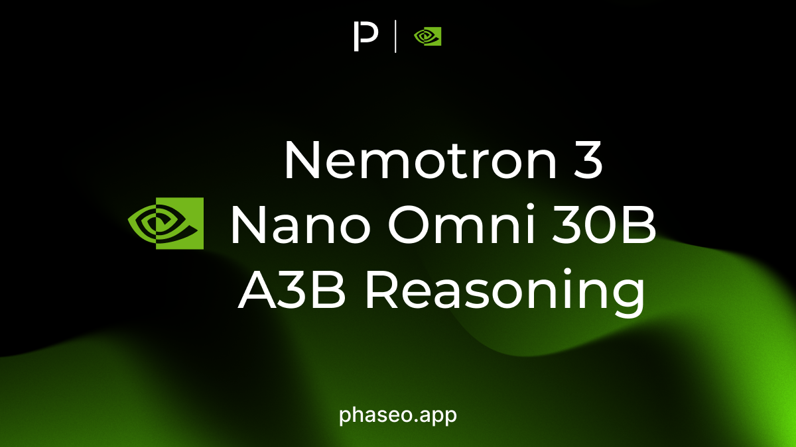

- [ByteDance: Seed 2.0 Lite (2026-04-28)](https://phaseo.app/models/bytedance/seed-2.0-lite-2026-04-28)
- [ByteDance: Seed 2.0 Mini (2026-04-28)](https://phaseo.app/models/bytedance/seed-2.0-mini-2026-04-28)
- [Nvidia: Nemotron 3 Nano Omni 30B A3B Reasoning](https://phaseo.app/models/nvidia/nemotron-3-nano-omni-30b-a3b-reasoning)
- [Poolside: Laguna XS.2](https://phaseo.app/models/poolside/laguna-xs.2)

</Update>

<Update label="April 25, 2026" tags={["Features","Pricing","Model Releases"]}>

### Features

- Low-balance alerts and billing safeguards were expanded so teams get clearer warning before usage runs into account limits ([PR #371](https://github.com/phaseoteam/Phaseo/pull/371)).
- Pricing edge cases now fail more predictably when provider billing rules are incomplete or route metadata changes unexpectedly ([PR #374](https://github.com/phaseoteam/Phaseo/pull/374)).

### Model Releases

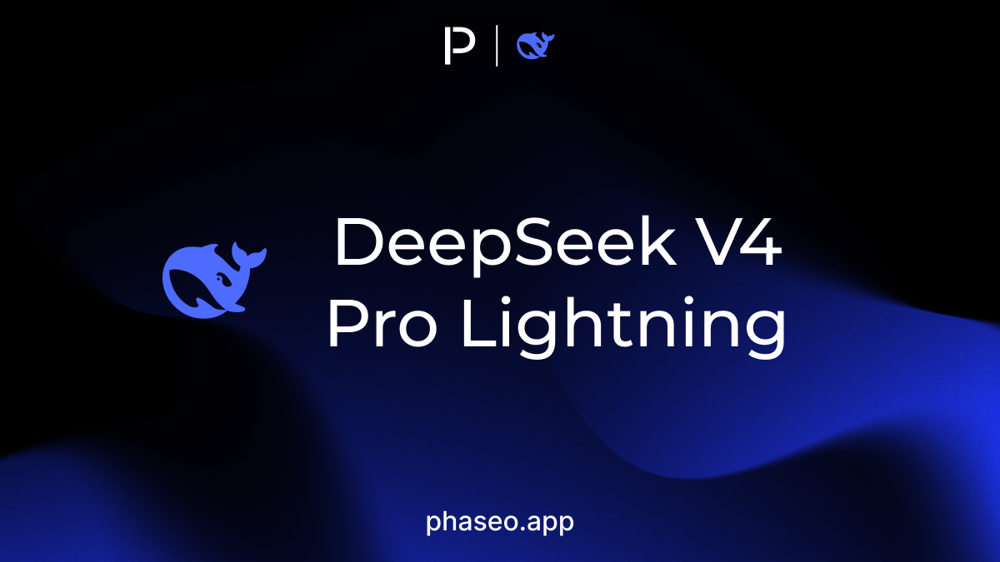

- [DeepSeek: DeepSeek V4 Pro Lightning](https://phaseo.app/models/deepseek/deepseek-v4-pro-lightning)

</Update>

<Update label="April 24, 2026" tags={["Model Releases"]}>

### Model Releases

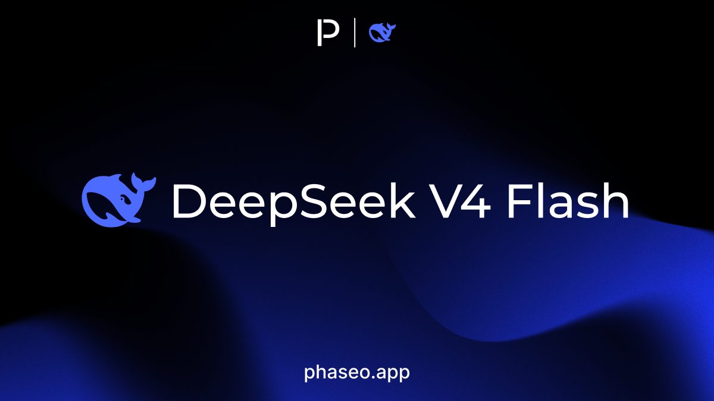

- [DeepSeek: DeepSeek V4 Flash](https://phaseo.app/models/deepseek/deepseek-v4-flash)
- [DeepSeek: DeepSeek V4 Pro](https://phaseo.app/models/deepseek/deepseek-v4-pro)

</Update>

<Update label="April 23, 2026" tags={["Model Releases"]}>

### Model Releases

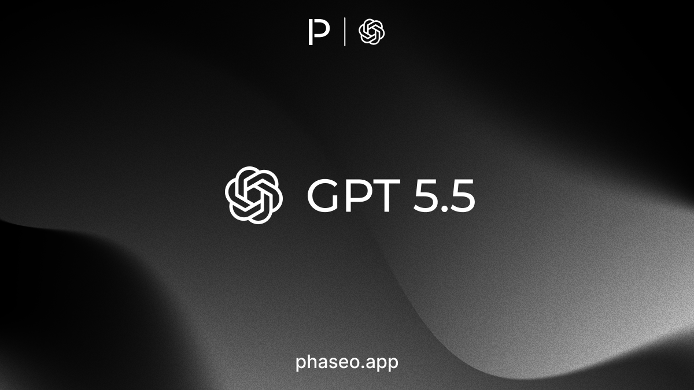

- [OpenAI: GPT 5.5](https://phaseo.app/models/openai/gpt-5.5)
- [OpenAI: GPT 5.5 Pro](https://phaseo.app/models/openai/gpt-5.5-pro)
- [Tencent Hunyuan: Hy3 Preview](https://phaseo.app/models/tencent/hy3-preview)

</Update>

<Update label="April 22, 2026" tags={["Features","SDK","Model Releases"]}>

### Features

- SDK `2.0.0` shipped with regenerated clients and broader parity against the current gateway contract.

### Model Releases

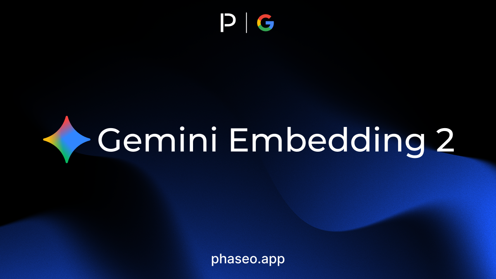

- [Google: Gemini Embedding 2](https://phaseo.app/models/google/gemini-embedding-2)
- [Qwen: Qwen 3.6 27B](https://phaseo.app/models/qwen/qwen3.6-27b)
- [Xiaomi: MiMo V2.5](https://phaseo.app/models/xiaomi/mimo-v2.5)
- [Xiaomi: MiMo V2.5 Pro](https://phaseo.app/models/xiaomi/mimo-v2.5-pro)
- [Xiaomi: MiMo V2.5 TTS](https://phaseo.app/models/xiaomi/mimo-v2.5-tts)

</Update>

<Update label="April 21, 2026" tags={["Features","Model Releases"]}>

### Features

- The announcements hub, workspace management surfaces, and related membership flows shipped.

### Model Releases

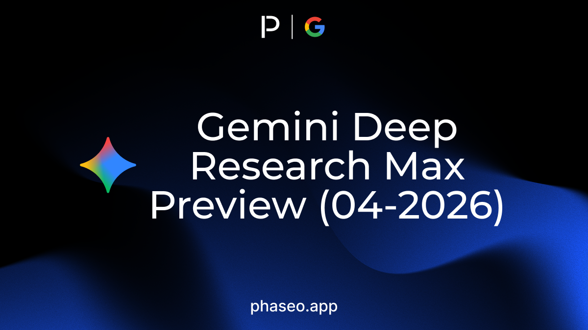

- [Google: Gemini Deep Research Max Preview (04-2026)](https://phaseo.app/models/google/deep-research-max-preview-04-2026)
- [Google: Gemini Deep Research Preview (04-2026)](https://phaseo.app/models/google/deep-research-preview-04-2026)
- [OpenAI: GPT Image 2](https://phaseo.app/models/openai/gpt-image-2)

</Update>

<Update label="April 20, 2026" tags={["Model Releases"]}>

### Model Releases

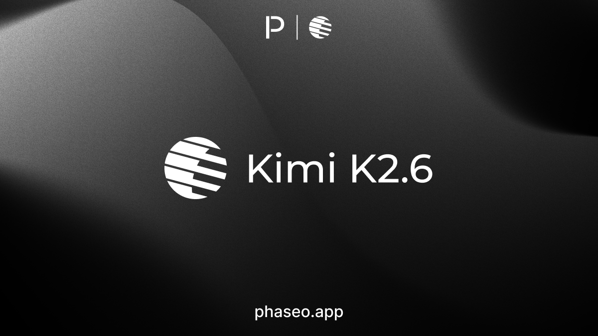

- [Moonshot: Kimi K2.6](https://phaseo.app/models/moonshotai/kimi-k2.6)
- [Qwen: Qwen 3.5 Plus (2026-04-20)](https://phaseo.app/models/qwen/qwen3.5-plus-2026-04-20)

</Update>

<Update label="April 18, 2026" tags={["Features","Model Releases","SDK","Docs"]}>

### Features

- SDK `1.2.0` synced model availability, generated types, and docs with the latest catalog changes.

</Update>

<Update label="April 17, 2026" tags={["Model Releases"]}>

### Model Releases

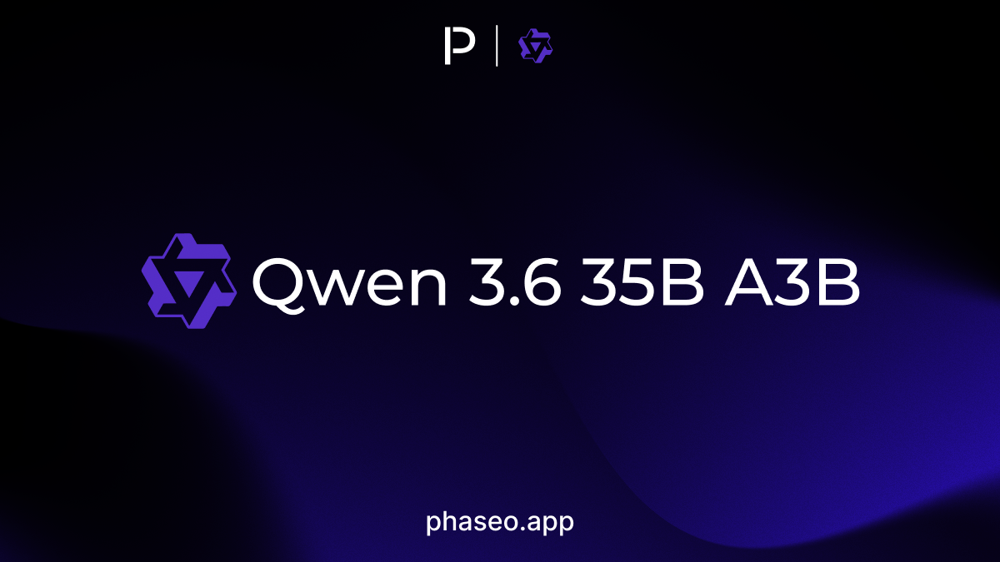

- [Qwen: Qwen 3.6 35B A3B](https://phaseo.app/models/qwen/qwen3.6-35b-a3b)
- [xAI: Grok TTS](https://phaseo.app/models/x-ai/grok-tts)

</Update>

<Update label="April 16, 2026" tags={["Model Releases"]}>

### Model Releases

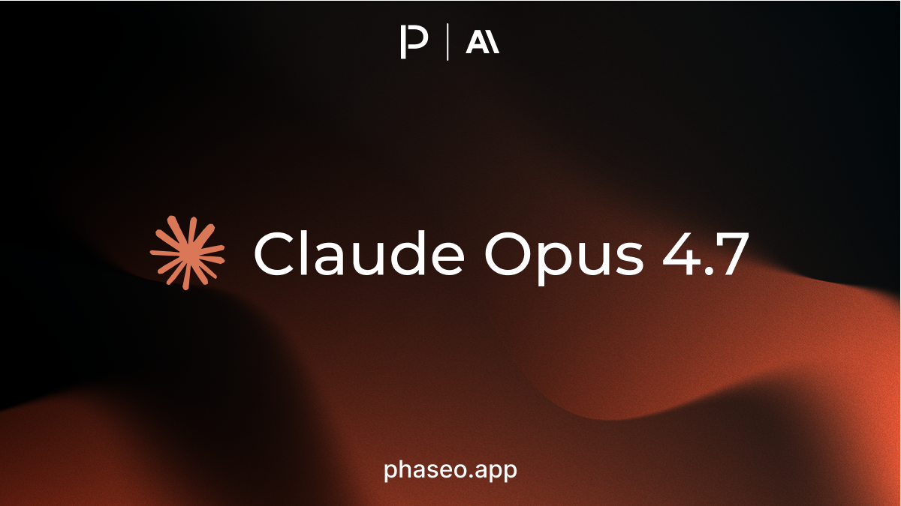

- [Anthropic: Claude Opus 4.7](https://phaseo.app/models/anthropic/claude-opus-4.7)

</Update>

<Update label="April 15, 2026" tags={["Model Releases"]}>

### Model Releases

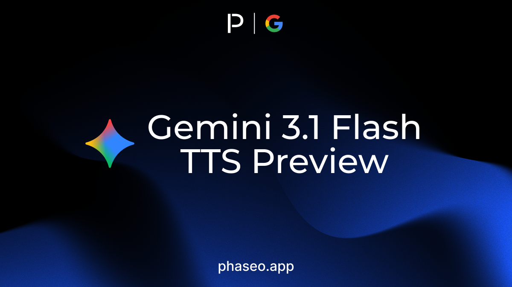

- [Google: Gemini 3.1 Flash TTS Preview](https://phaseo.app/models/google/gemini-3.1-flash-tts-preview)

</Update>

<Update label="April 14, 2026" tags={["Model Releases"]}>

### Model Releases

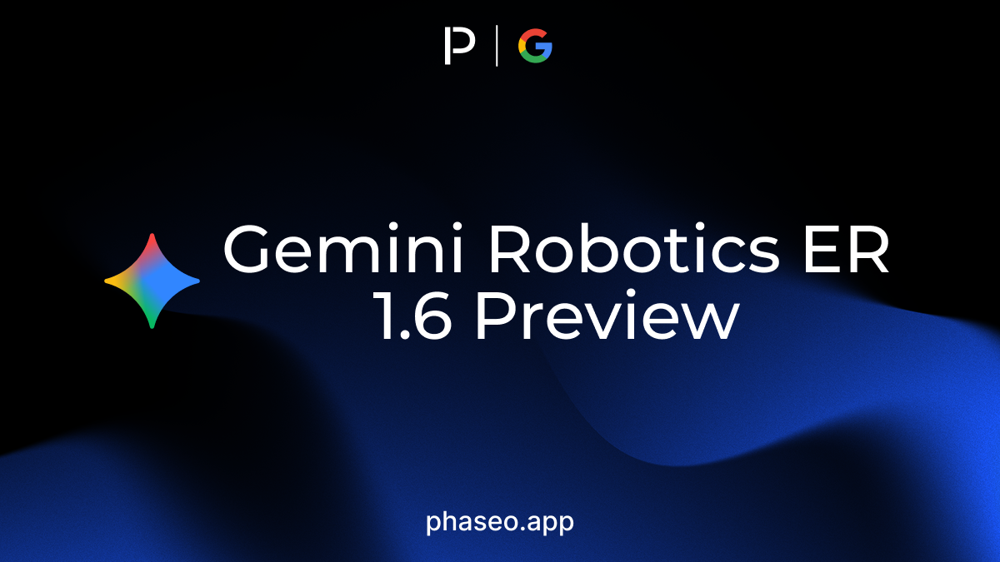

- [Google: Gemini Robotics ER 1.6 Preview](https://phaseo.app/models/google/gemini-robotics-er-1.6-preview)

</Update>

<Update label="April 13, 2026" tags={["Model Releases"]}>

### Model Releases

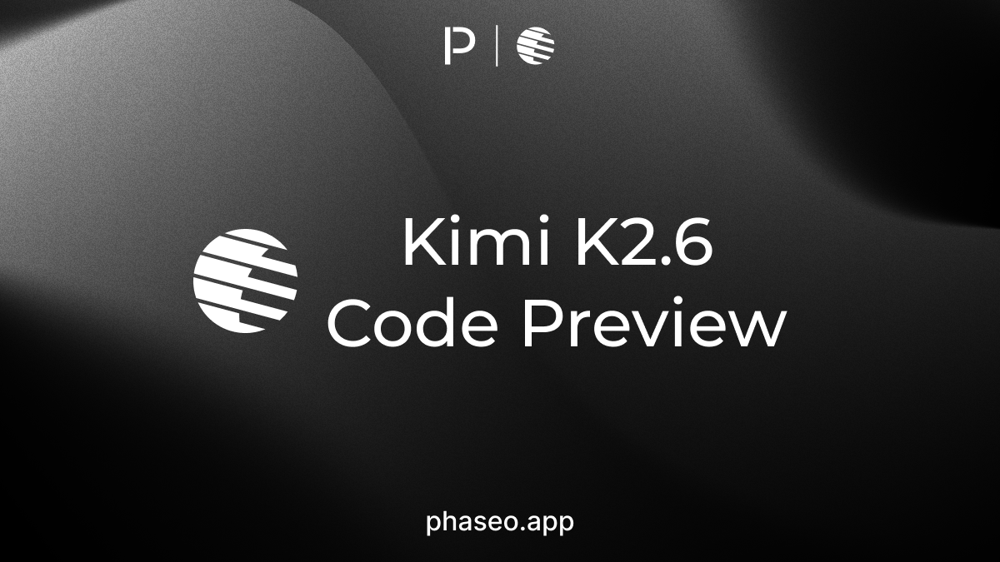

- [Moonshot: Kimi K2.6 Code Preview](https://phaseo.app/models/moonshotai/kimi-k2.6-code-preview)

</Update>

<Update label="April 11, 2026" tags={["Model Releases"]}>

### Model Releases

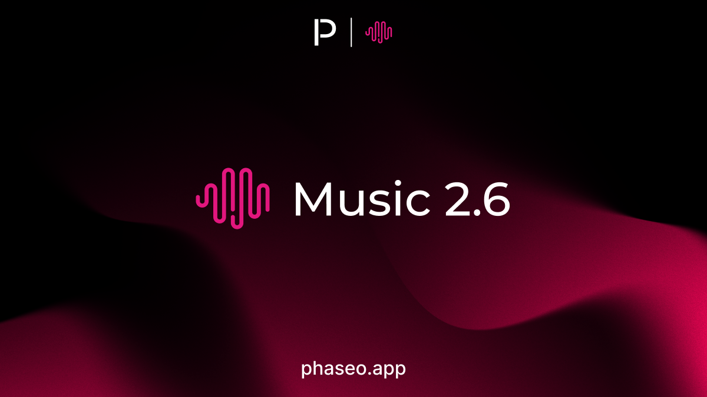

- [MiniMax: Music 2.6](https://phaseo.app/models/minimax/music-2.6)

</Update>

<Update label="April 8, 2026" tags={["Model Releases"]}>

### Model Releases

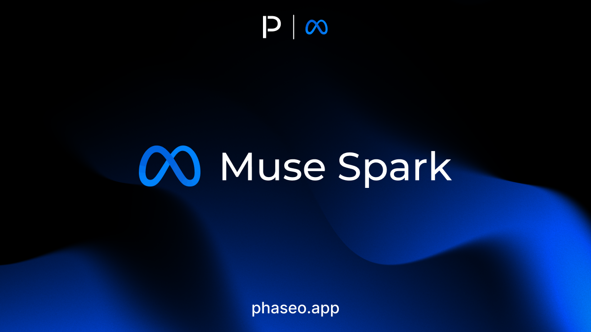

- [Meta: Muse Spark](https://phaseo.app/models/meta/muse-spark)
- [Meta: Muse Spark Contemplating](https://phaseo.app/models/meta/muse-spark-contemplating)

</Update>

<Update label="April 7, 2026" tags={["Model Releases"]}>

### Model Releases

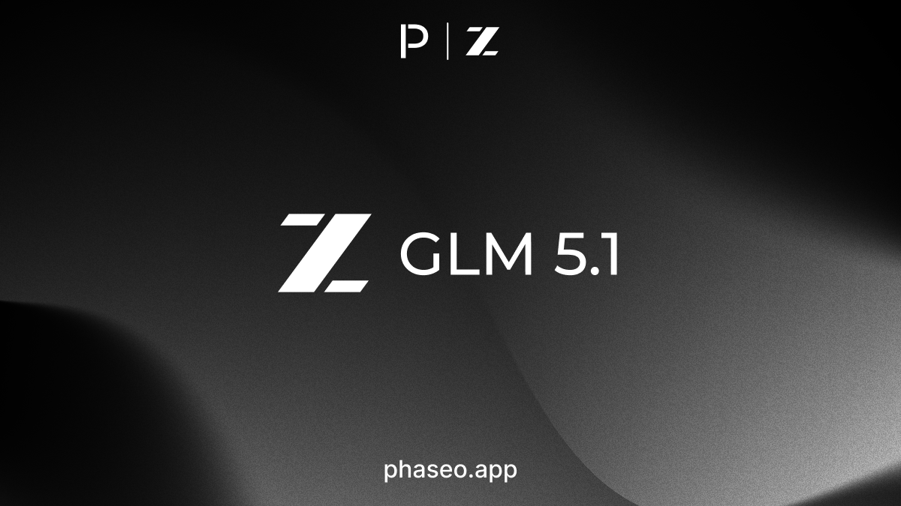

- [z.AI: GLM 5.1](https://phaseo.app/models/z-ai/glm-5.1)

</Update>

<Update label="April 4, 2026" tags={["Features","Model Releases","SDK","Pricing"]}>

### Features

- Mobile model pages, pricing layouts, and free-route visibility were improved, and the Pay As You Go top-up fee dropped to 5%.

</Update>

<Update label="April 3, 2026" tags={["Model Releases"]}>

### Model Releases

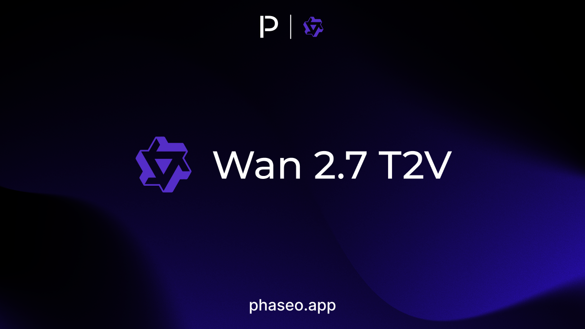

- [Qwen: Wan 2.7 T2V](https://phaseo.app/models/qwen/wan2.7-t2v)

</Update>

<Update label="April 2, 2026" tags={["Model Releases"]}>

### Model Releases

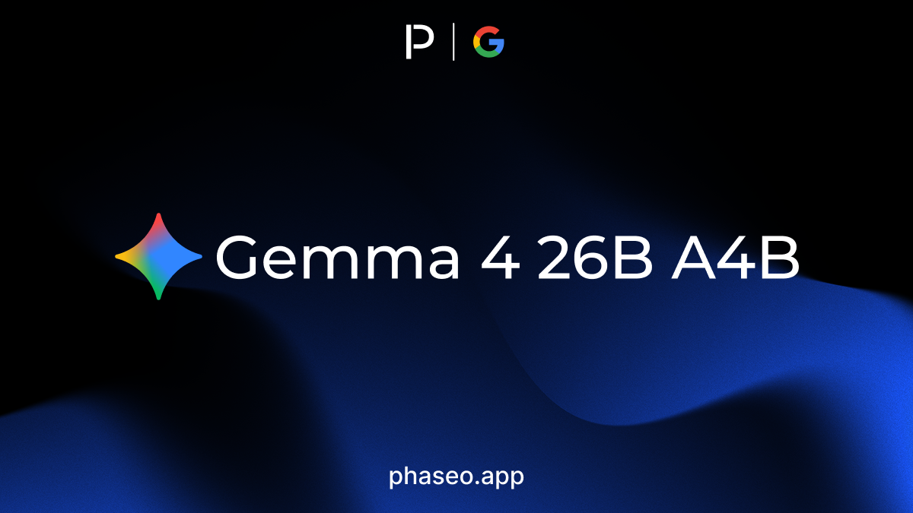

- [Google: Gemma 4 26B A4B](https://phaseo.app/models/google/gemma-4-26b-a4b)
- [Google: Gemma 4 31B](https://phaseo.app/models/google/gemma-4-31b)

</Update>

<Update label="April 1, 2026" tags={["Model Releases"]}>

### Model Releases

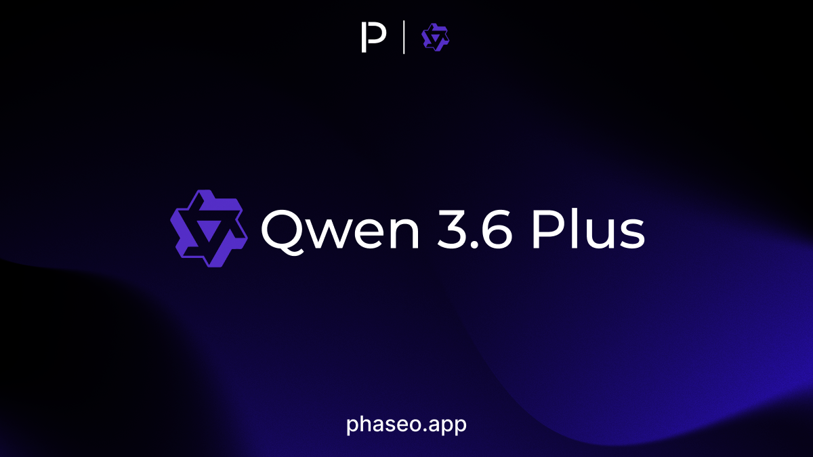

- [Arcee AI: Trinity Large Thinking](https://phaseo.app/models/arcee-ai/trinity-large-thinking)
- [Qwen: Qwen 3.6 Plus](https://phaseo.app/models/qwen/qwen3.6-plus)
- [z.AI: GLM 5V Turbo](https://phaseo.app/models/z-ai/glm-5v-turbo)

</Update>
