<Update label="May 31, 2026" tags={["Model Releases"]}>

### Model Releases

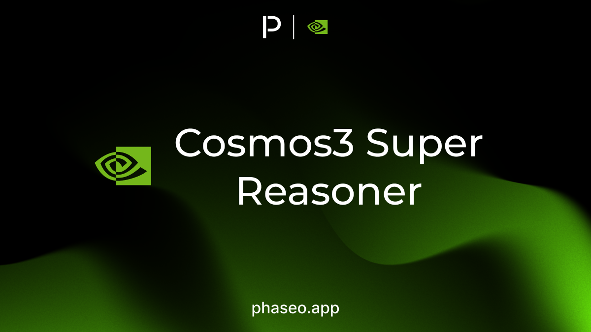

- [Nvidia: Cosmos3 Super Reasoner](https://phaseo.app/models/nvidia/cosmos3-super-reasoner)

</Update>

<Update label="May 30, 2026" tags={["Model Releases"]}>

### Model Releases

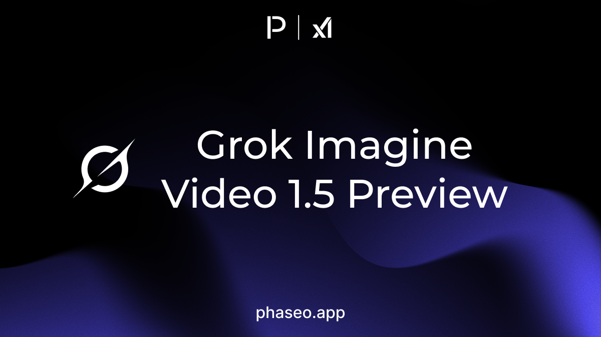

- [xAI: Grok Imagine Video 1.5 Preview](https://phaseo.app/models/x-ai/grok-imagine-video-1.5-preview)

</Update>

<Update label="May 29, 2026" tags={["Model Releases"]}>

### Model Releases

- [StepFun: Step 3.7 Flash](https://phaseo.app/models/stepfun/step-3.7-flash)

</Update>

<Update label="May 28, 2026" tags={["Features","Model Releases","Provider Coverage","Pricing"]}>

### Features

- Pricing selectors now present Qwen 3.7 Max variants more clearly, reducing ambiguity between preview, dated, and current model routes ([PR #418](https://github.com/phaseoteam/Phaseo/pull/418)).
- Anthropic-on-AWS provider branding was refreshed so Bedrock and Claude Platform routes are easier to distinguish in provider lists ([PR #415](https://github.com/phaseoteam/Phaseo/pull/415)).

### Model Releases

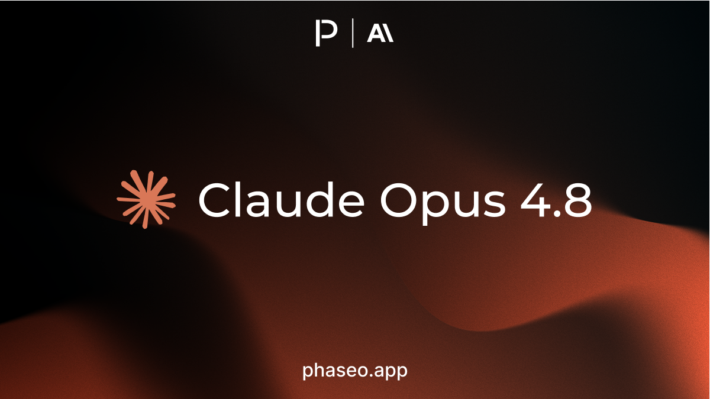

- [Anthropic: Claude Opus 4.8](https://phaseo.app/models/anthropic/claude-opus-4.8)
- [CrofAI: Greg RP](https://phaseo.app/models/crofai/greg-rp)
- [Google: Gemini 3 Pro Image (Nano Banana Pro)](https://phaseo.app/models/google/gemini-3-pro-image)
- [Google: Gemini 3.1 Flash Image (Nano Banana 2)](https://phaseo.app/models/google/gemini-3.1-flash-image)

</Update>

<Update label="May 26, 2026" tags={["Model Releases"]}>

### Model Releases

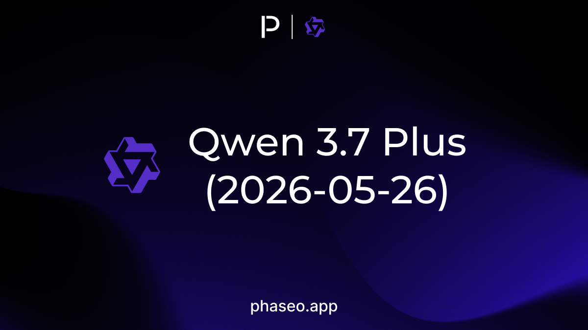

- [Qwen: Qwen 3.7 Plus (2026-05-26)](https://phaseo.app/models/qwen/qwen3.7-plus-2026-05-26)

</Update>

<Update label="May 25, 2026" tags={["Model Releases"]}>

### Model Releases

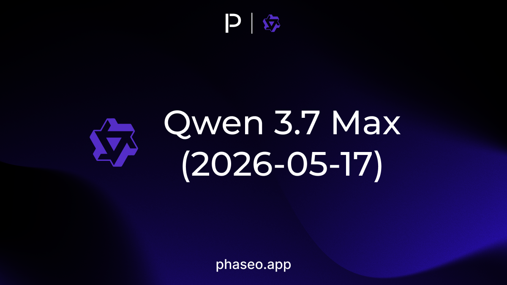

- [Qwen: Qwen 3.7 Max (2026-05-17)](https://phaseo.app/models/qwen/qwen3.7-max-2026-05-17)
- [Qwen: Qwen 3.7 Max Preview](https://phaseo.app/models/qwen/qwen3.7-max-preview)

</Update>

<Update label="May 21, 2026" tags={["Model Releases"]}>

### Model Releases

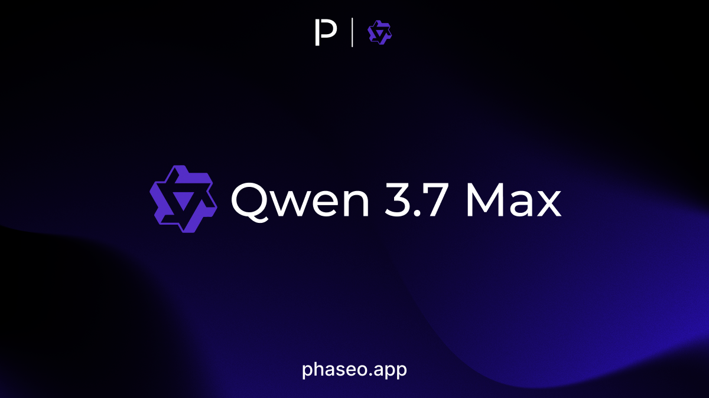

- [Qwen: Qwen 3.7 Max](https://phaseo.app/models/qwen/qwen3.7-max)

</Update>

<Update label="May 20, 2026" tags={["Model Releases"]}>

### Model Releases

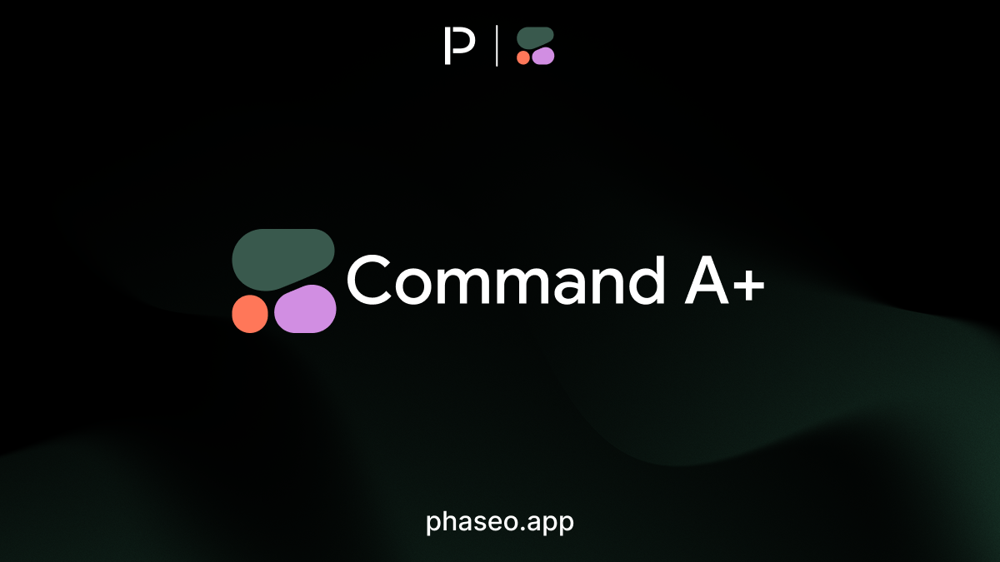

- [Cohere: Command A+](https://phaseo.app/models/cohere/command-a-plus)

</Update>

<Update label="May 19, 2026" tags={["Features","Model Releases","SDK","Docs"]}>

### SDK Releases

- The TypeScript Agent SDK launch added a dedicated package for building agentic applications on top of Phaseo Gateway ([PR #495](https://github.com/phaseoteam/Phaseo/pull/495)). See [`@phaseo/agent-sdk`](https://github.com/phaseoteam/Phaseo/tree/main/packages/sdk/agent-sdk-ts).

### Model Releases

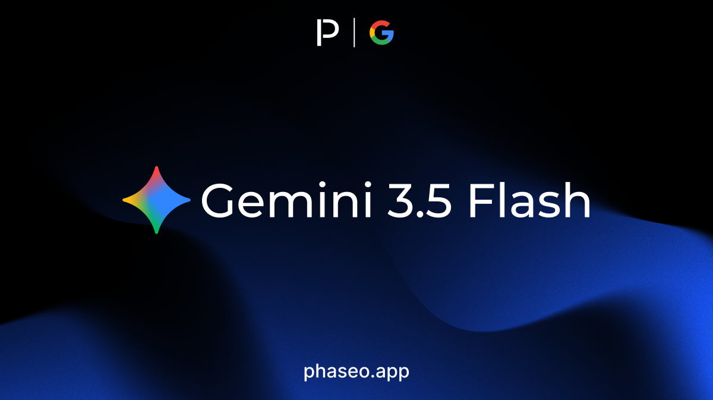

- [Google: Gemini 3.5 Flash](https://phaseo.app/models/google/gemini-3.5-flash)
- [Qwen: Qwen 3.5 LiveTranslate Flash Realtime (2026-05-19)](https://phaseo.app/models/qwen/qwen3.5-livetranslate-flash-realtime-2026-05-19)

</Update>

<Update label="May 18, 2026" tags={["Model Releases"]}>

### Model Releases

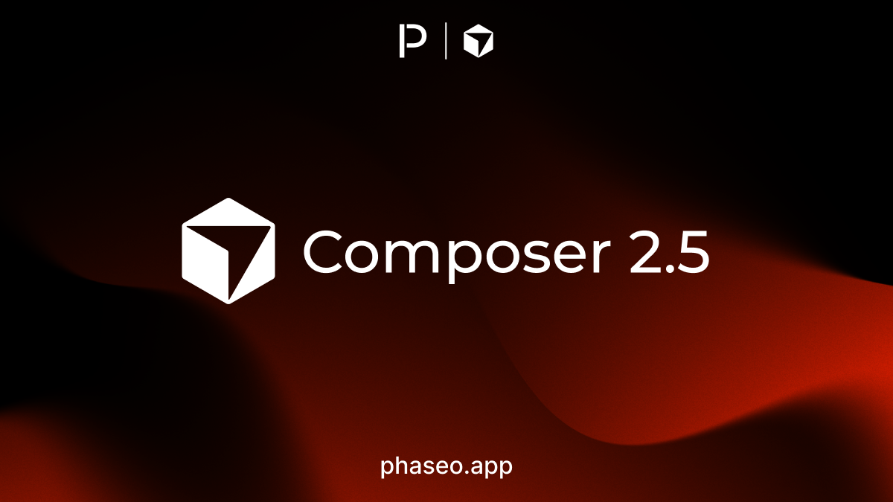

- [Cursor: Composer 2.5](https://phaseo.app/models/cursor/composer-2.5)

</Update>

<Update label="May 16, 2026" tags={["Features","Model Releases","Provider Coverage","SDK","Pricing","Docs"]}>

### Features

- Provider activation states and region filters were tightened so unavailable routes are easier to identify before a request is made ([PR #495](https://github.com/phaseoteam/Phaseo/pull/495)).
- Free-router behaviour was made more predictable across pricing, provider selection, and gateway routing surfaces ([PR #495](https://github.com/phaseoteam/Phaseo/pull/495)).

### SDK Releases

- Agent SDK documentation and examples shipped with the first public workflow guidance for durable loops, parallel tools, and agent orchestration ([PR #495](https://github.com/phaseoteam/Phaseo/pull/495)).

### Model Releases

- [xAI: Grok TTS](https://phaseo.app/models/x-ai/grok-tts)

</Update>

<Update label="May 15, 2026" tags={["Model Releases"]}>

### Model Releases

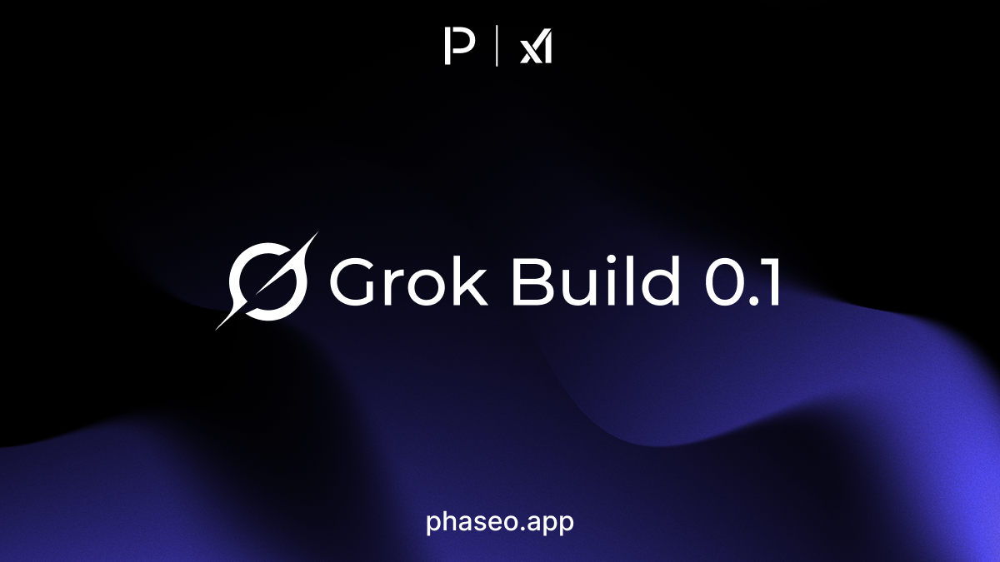

- [xAI: Grok Build 0.1](https://phaseo.app/models/x-ai/grok-build-0.1)

</Update>

<Update label="May 7, 2026" tags={["Features","Model Releases","Provider Coverage","Pricing"]}>

### Features

- Provider availability and pricing summaries were expanded so model pages show clearer route, tier, and cost differences ([PR #474](https://github.com/phaseoteam/Phaseo/pull/474)).
- Realtime minute pricing became visible in the product, making audio and live-session models easier to compare against token-priced models ([PR #477](https://github.com/phaseoteam/Phaseo/pull/477)).

### Model Releases

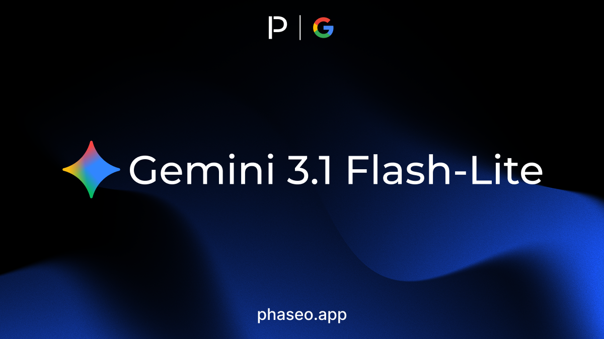

- [Google: Gemini 3.1 Flash-Lite](https://phaseo.app/models/google/gemini-3.1-flash-lite)
- [OpenAI: GPT Realtime 2](https://phaseo.app/models/openai/gpt-realtime-2)
- [OpenAI: GPT Realtime Translate](https://phaseo.app/models/openai/gpt-realtime-translate)
- [OpenAI: GPT Realtime Whisper](https://phaseo.app/models/openai/gpt-realtime-whisper)

</Update>

<Update label="May 6, 2026" tags={["Features","Model Releases"]}>

### Features

- Video generation and async job lifecycle coverage expanded, including clearer status handling for long-running provider work ([PR #468](https://github.com/phaseoteam/Phaseo/pull/468)).
- Gateway surfaces now expose more of the reservation, completion, and failure states needed to debug async media requests ([PR #468](https://github.com/phaseoteam/Phaseo/pull/468)).

### Model Releases

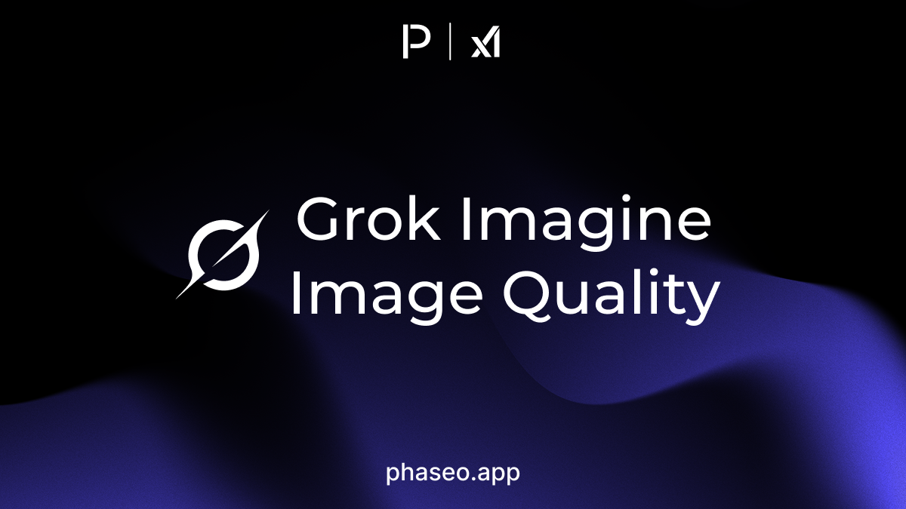

- [xAI: Grok Imagine Image Quality](https://phaseo.app/models/x-ai/grok-imagine-image-quality)

</Update>

<Update label="May 5, 2026" tags={["Model Releases"]}>

### Model Releases

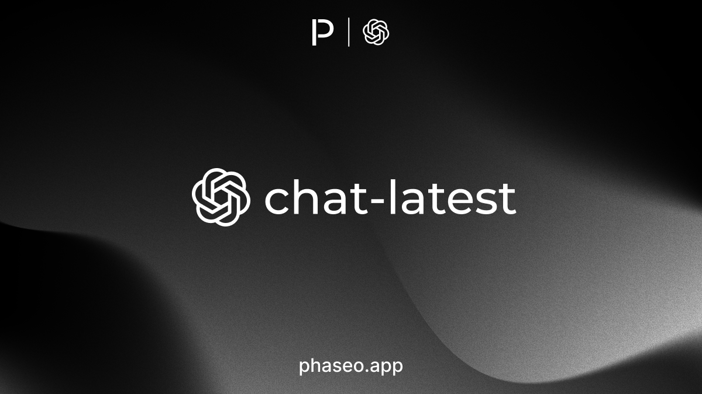

- [OpenAI: chat-latest](https://phaseo.app/models/openai/chat-latest)

</Update>

<Update label="May 1, 2026" tags={["Features","SDK"]}>

### SDK Releases

- [TypeScript SDK 2.0.4](https://github.com/phaseoteam/Phaseo/releases/tag/%40ai-stats%2Fsdk%402.0.4): generated OpenAPI and model-surface updates for the latest gateway schema.
- [Python SDK 2.0.4](https://github.com/phaseoteam/Phaseo/releases/tag/%40ai-stats%2Fpy-sdk%402.0.4): generated OpenAPI and model-surface updates for the latest gateway schema.
- [Go SDK 2.0.4](https://github.com/phaseoteam/Phaseo/releases/tag/%40ai-stats%2Fgo-sdk%402.0.4): generated OpenAPI and model-surface updates for the latest gateway schema.
- [C# SDK 2.0.4](https://github.com/phaseoteam/Phaseo/releases/tag/%40ai-stats%2Fcsharp-sdk%402.0.4): generated OpenAPI and model-surface updates for the latest gateway schema.
- [Java SDK 2.0.4](https://github.com/phaseoteam/Phaseo/releases/tag/%40ai-stats%2Fjava-sdk%402.0.4): generated OpenAPI and model-surface updates for the latest gateway schema.
- [PHP SDK 2.0.4](https://github.com/phaseoteam/Phaseo/releases/tag/%40ai-stats%2Fphp-sdk%402.0.4): generated OpenAPI and model-surface updates for the latest gateway schema.
- [Ruby SDK 2.0.4](https://github.com/phaseoteam/Phaseo/releases/tag/%40ai-stats%2Fruby-sdk%402.0.4): generated OpenAPI and model-surface updates for the latest gateway schema.

</Update>
