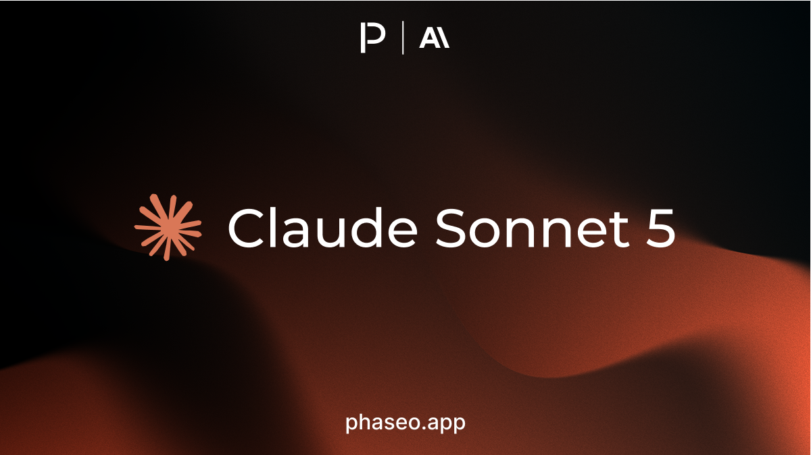
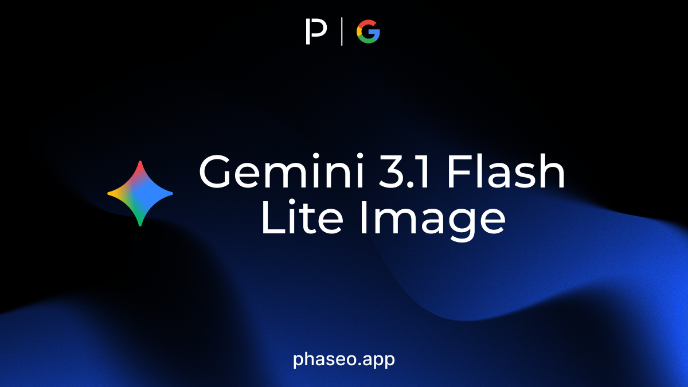
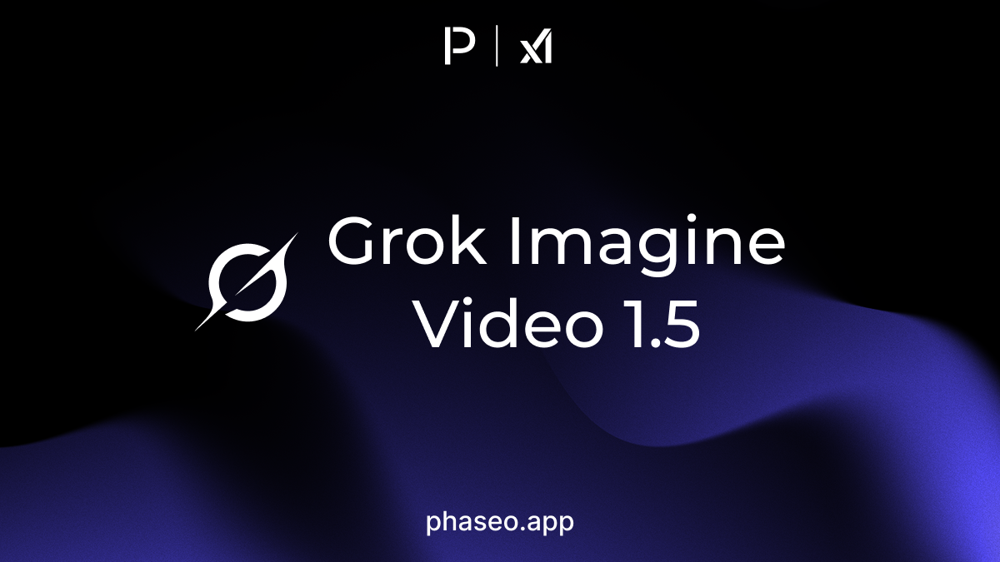
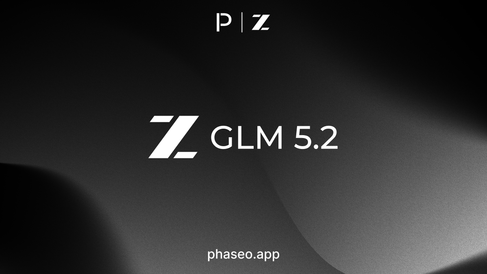
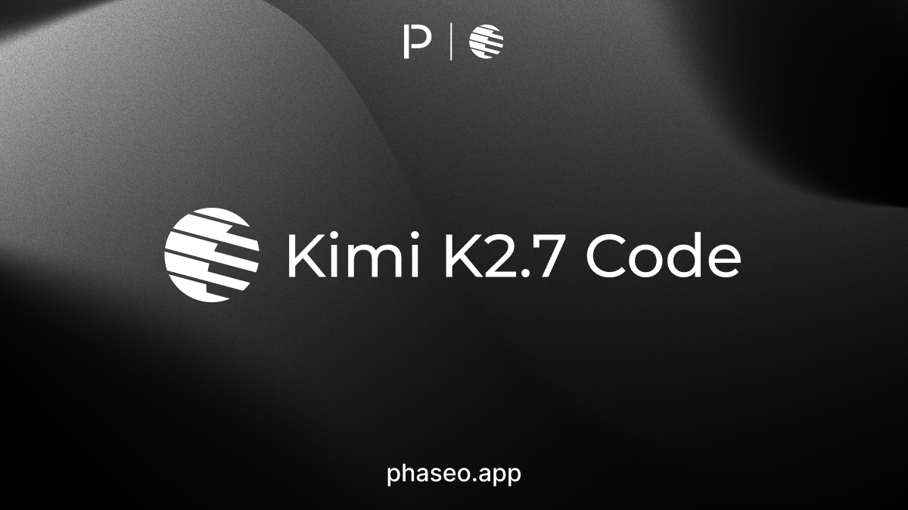
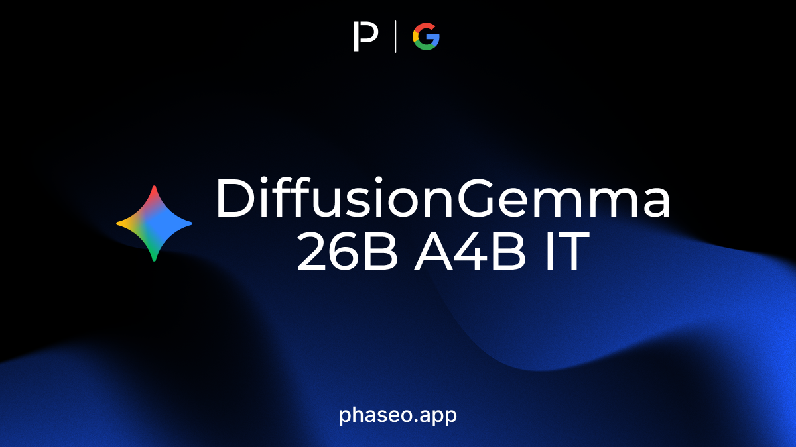
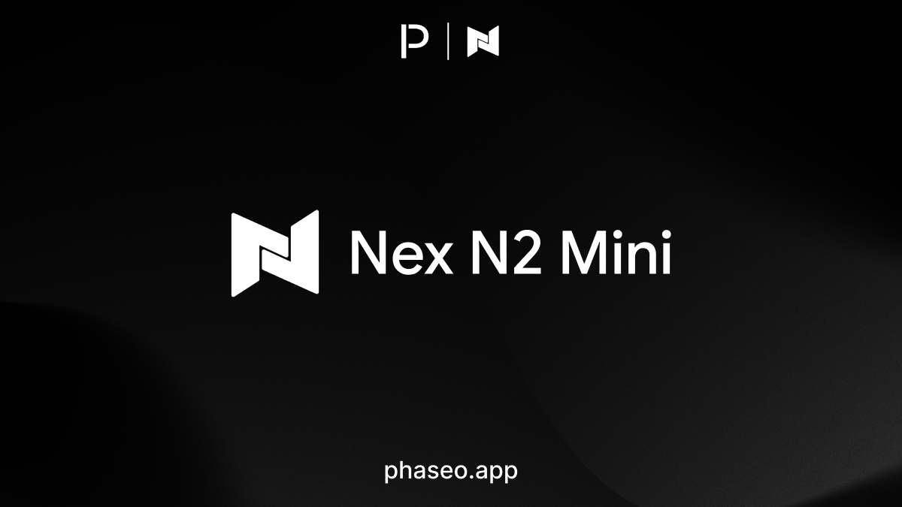
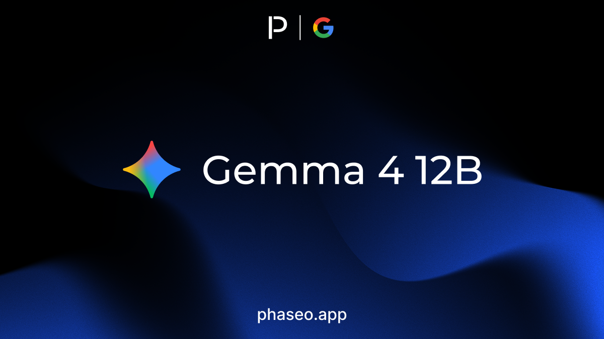
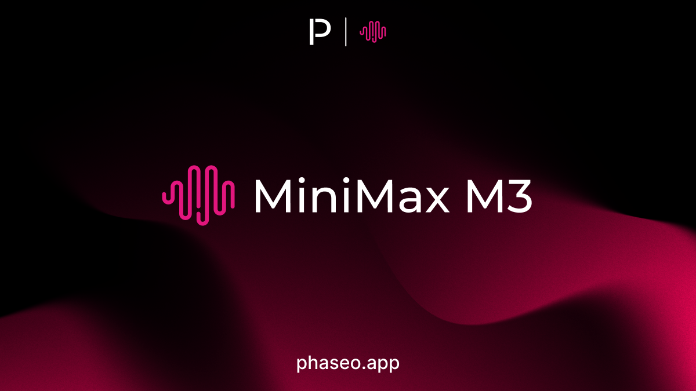

<Update label="June 30, 2026" tags={["Features","Model Releases"]}>

### Features

- Pricing calculators now support time-windowed pricing and side-by-side model comparisons, making burst, realtime, and route-specific pricing easier to reason about ([PR #864](https://github.com/phaseoteam/Phaseo/pull/864)).
- The pricing calculator layout was simplified so model, provider, and usage assumptions are easier to adjust before comparing costs ([PR #864](https://github.com/phaseoteam/Phaseo/pull/864)).

### Model Releases

- [Anthropic: Claude Sonnet 5](https://phaseo.app/models/anthropic/claude-sonnet-5)
- [Google: Gemini Omni Flash Preview](https://phaseo.app/models/google/gemini-omni-flash-preview)
- [Mistral: Leanstral 1.5](https://phaseo.app/models/mistral/leanstral-1.5)
- [Mistral: OCR 4](https://phaseo.app/models/mistral/ocr-4)

</Update>

<Update label="June 29, 2026" tags={["Model Releases"]}>

### Model Releases

- [Meituan: LongCat 2.0](https://phaseo.app/models/meituan/longcat-2.0)

</Update>

<Update label="June 23, 2026" tags={["Model Releases"]}>

### Model Releases

- [Google: Gemini 3.1 Flash Lite image (Nano Banana 2 Lite)](https://phaseo.app/models/google/gemini-3.1-flash-lite-image)

</Update>

<Update label="June 17, 2026" tags={["Model Releases"]}>

### Model Releases

- [xAI: Grok Imagine Video 1.5](https://phaseo.app/models/x-ai/grok-imagine-video-1.5)

</Update>

<Update label="June 16, 2026" tags={["Model Releases"]}>

### Model Releases

- [z.AI: GLM 5.2](https://phaseo.app/models/z-ai/glm-5.2)

</Update>

<Update label="June 15, 2026" tags={["Model Releases"]}>

### Model Releases

- [ByteDance: Seedance 2.0 Mini (2026-06-15)](https://phaseo.app/models/bytedance/seedance-2.0-mini-260615)

</Update>

<Update label="June 14, 2026" tags={["Model Releases"]}>

### Model Releases

- [CrofAI: Greg 2 Super](https://phaseo.app/models/crofai/greg-2-super)
- [CrofAI: Greg 2 Ultra](https://phaseo.app/models/crofai/greg-2-ultra)

</Update>

<Update label="June 12, 2026" tags={["Model Releases"]}>

### Model Releases

- [Moonshot: Kimi K2.7 Code](https://phaseo.app/models/moonshotai/kimi-k2.7-code)

</Update>

<Update label="June 11, 2026" tags={["Model Releases"]}>

### Model Releases

- [z.AI: GLM 5.2](https://phaseo.app/models/z-ai/glm-5.2)

</Update>

<Update label="June 10, 2026" tags={["Model Releases"]}>

### Model Releases

- [Google: DiffusionGemma 26B A4B IT](https://phaseo.app/models/google/diffusiongemma-26b-a4b-it)

</Update>

<Update label="June 9, 2026" tags={["Model Releases"]}>

### Model Releases

- [Anthropic: Claude Fable 5](https://phaseo.app/models/anthropic/claude-fable-5)
- [Anthropic: Claude Mythos 5](https://phaseo.app/models/anthropic/claude-mythos-5)
- [Google: Gemini 3.5 Live Translate Preview](https://phaseo.app/models/google/gemini-3.5-live-translate-preview)

</Update>

<Update label="June 5, 2026" tags={["Model Releases"]}>

### Model Releases

- [Nex AGI: Nex N2 Mini](https://phaseo.app/models/nex-agi/nex-n2-mini)
- [Nex AGI: Nex N2 Pro](https://phaseo.app/models/nex-agi/nex-n2-pro)

</Update>

<Update label="June 3, 2026" tags={["Model Releases"]}>

### Model Releases

- [Google: Gemma 4 12B](https://phaseo.app/models/google/gemma-4-12b)

</Update>

<Update label="June 1, 2026" tags={["Model Releases"]}>

### Model Releases

- [MiniMax: MiniMax M3](https://phaseo.app/models/minimax/minimax-m3)
- [Nvidia: Nemotron 3 Ultra](https://phaseo.app/models/nvidia/nemotron-3-ultra-550b-a55b)
- [Qwen: Qwen 3.7 Plus](https://phaseo.app/models/qwen/qwen3.7-plus)

</Update>
