<Update label="2026年3月31日" tags={["模型发布"]}>

### 模型发布

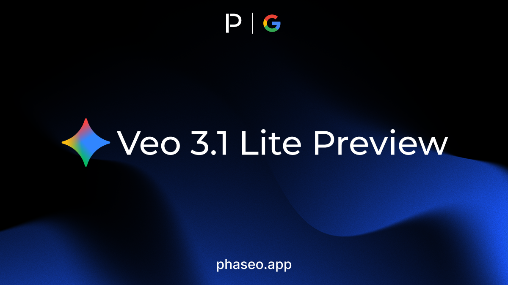

- [Google: Veo 3.1 Lite Preview](https://phaseo.app/models/google/veo-3.1-lite-preview)

</Update>

<Update label="2026年3月23日" tags={["模型发布"]}>

### 模型发布

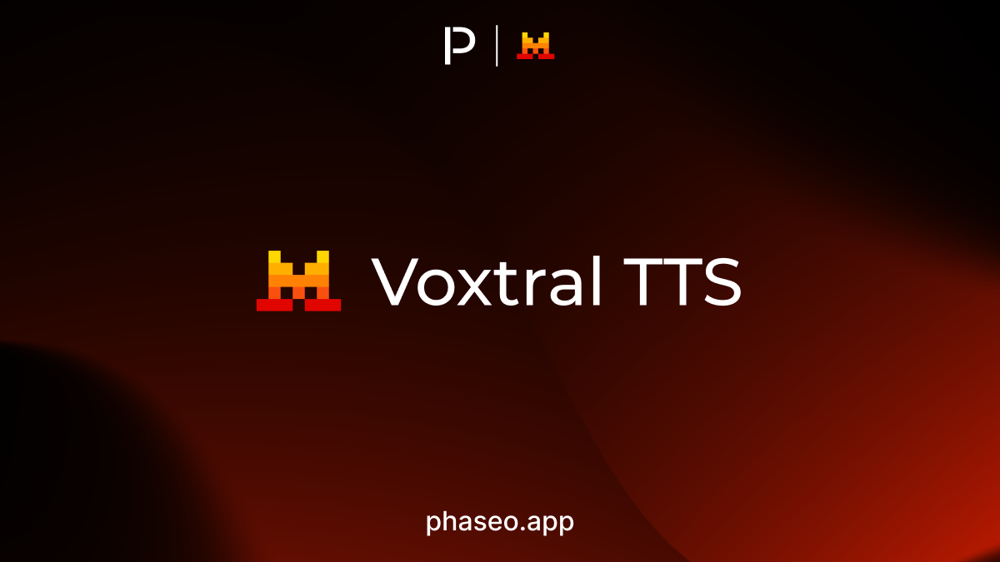

- [Mistral: Voxtral TTS](https://phaseo.app/models/mistral/voxtral-tts)

</Update>

<Update label="2026年3月22日" tags={["功能","模型发布","SDK"]}>

### 功能

- 我们发布了新的语言 SDK，全面改进了 TypeScript 和 Python SDK，并为聊天室加入多模态能力。
- Foundry 正式推出，LLM Council 成为首个 Foundry 项目；SDK `1.1.0` 也让模型可用性和生命周期警告与 API 保持一致。

</Update>

<Update label="2026年3月19日" tags={["模型发布"]}>

### 模型发布

- [Xiaomi: MiMo V2 Omni](https://phaseo.app/models/xiaomi/mimo-v2-omni)
- [Xiaomi: MiMo V2 Pro](https://phaseo.app/models/xiaomi/mimo-v2-pro)
- [Xiaomi: MiMo V2 TTS](https://phaseo.app/models/xiaomi/mimo-v2-tts)

</Update>

<Update label="2026年3月18日" tags={["模型发布"]}>

### 模型发布

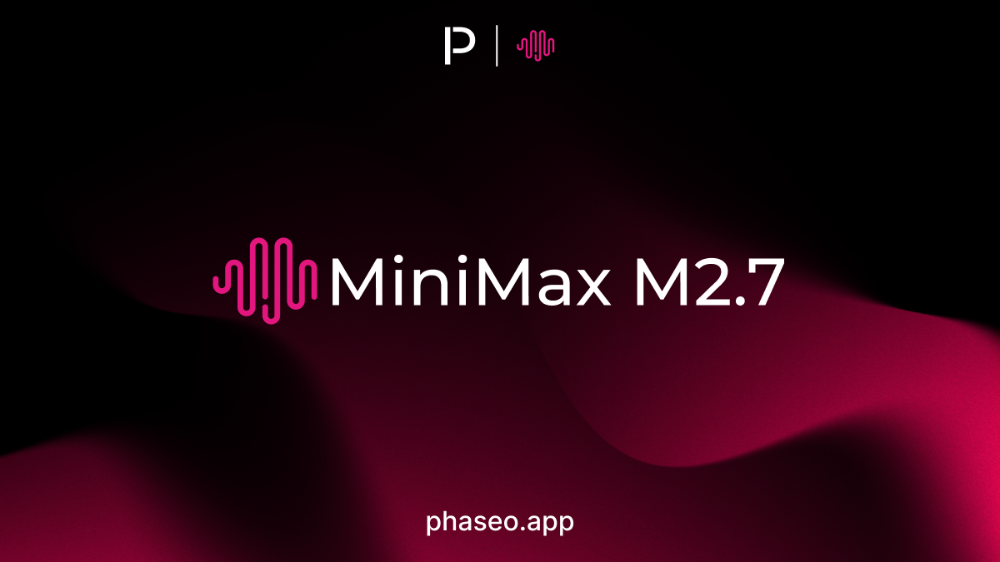

- [MiniMax: MiniMax M2.7](https://phaseo.app/models/minimax/minimax-m2.7)
- [Xiaomi: MiMo V2 Omni](https://phaseo.app/models/xiaomi/mimo-v2-omni)
- [Xiaomi: MiMo V2 Pro](https://phaseo.app/models/xiaomi/mimo-v2-pro)
- [Xiaomi: MiMo V2 TTS](https://phaseo.app/models/xiaomi/mimo-v2-tts)

</Update>

<Update label="2026年3月17日" tags={["模型发布"]}>

### 模型发布

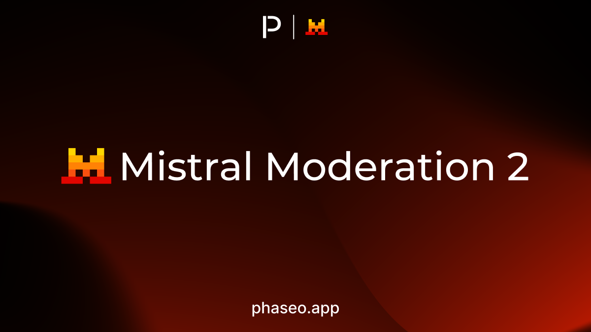

- [Mistral: Mistral Moderation 2](https://phaseo.app/models/mistral/mistral-moderation-2)
- [OpenAI: GPT 5.4 Mini](https://phaseo.app/models/openai/gpt-5.4-mini)
- [OpenAI: GPT 5.4 Nano](https://phaseo.app/models/openai/gpt-5.4-nano)

</Update>

<Update label="2026年3月16日" tags={["模型发布"]}>

### 模型发布

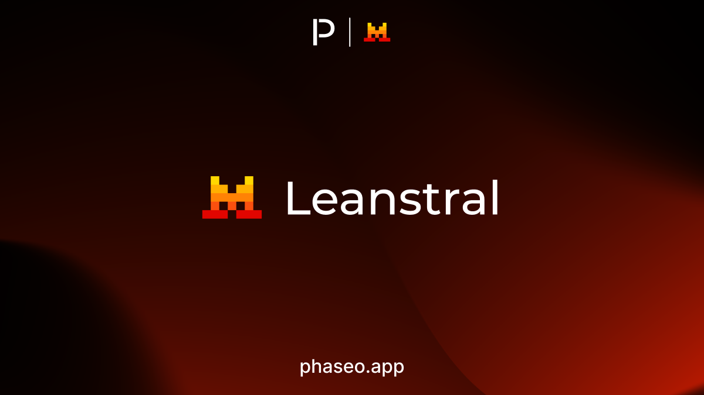

- [Mistral: Leanstral](https://phaseo.app/models/mistral/leanstral)
- [Mistral: Mistral Small 4](https://phaseo.app/models/mistral/mistral-small-4)

</Update>

<Update label="2026年3月15日" tags={["模型发布"]}>

### 模型发布

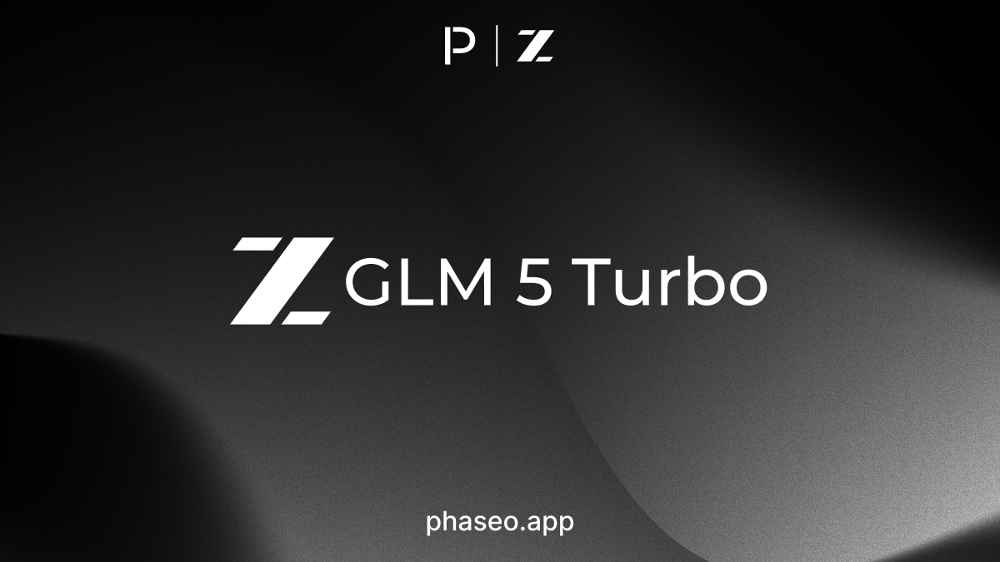

- [z.AI: GLM 5 Turbo](https://phaseo.app/models/z-ai/glm-5-turbo)

</Update>

<Update label="2026年3月12日" tags={["功能","模型发布"]}>

### 功能

- 模型展示页经过全面改版，更清晰地呈现可用性、元数据层级和支持信息。

### 模型发布

- [Nvidia: Nemotron 3 Super](https://phaseo.app/models/nvidia/nemotron-3-super-120b-a12b)

</Update>

<Update label="2026年3月11日" tags={["模型发布"]}>

### 模型发布

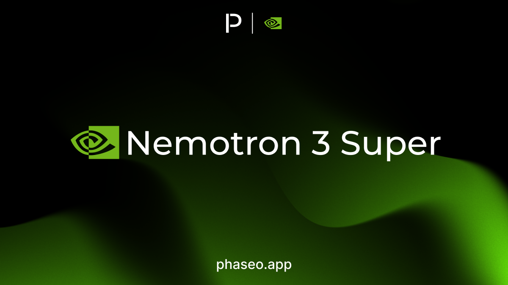

- [Nvidia: Nemotron 3 Super](https://phaseo.app/models/nvidia/nemotron-3-super-120b-a12b)

</Update>

<Update label="2026年3月10日" tags={["功能","模型发布","供应商支持","文档"]}>

### 功能

- 品牌焕新扩展到了网站和文档。
- Phaseo、网关路由和文档现已支持 Alibaba Cloud。

### 模型发布

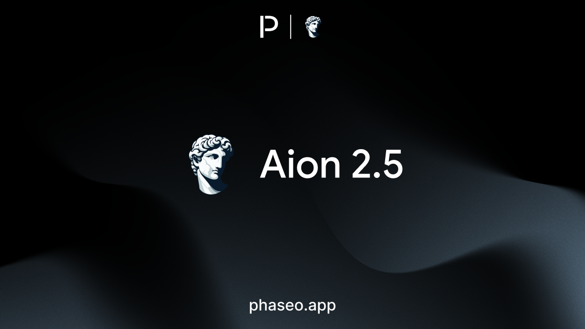

- [Aion Labs: Aion 2.5](https://phaseo.app/models/aion-labs/aion-2.5)
- [Google: Gemini Embedding 2 Preview](https://phaseo.app/models/google/gemini-embedding-2-preview)

</Update>

<Update label="2026年3月5日" tags={["功能","模型发布","文档"]}>

### 功能

- GPT 5.4 和 GPT 5.4 Pro 已在模型发现、网关和文档中上线。

### 模型发布

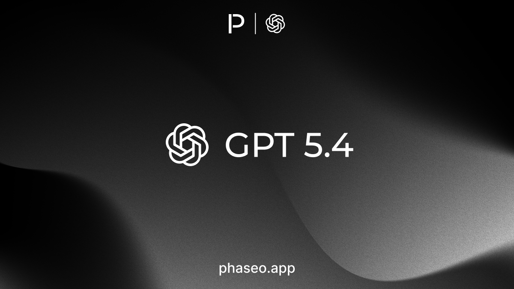

- [OpenAI: GPT 5.4](https://phaseo.app/models/openai/gpt-5.4)
- [OpenAI: GPT 5.4 Pro](https://phaseo.app/models/openai/gpt-5.4-pro)

</Update>

<Update label="2026年3月3日" tags={["功能","模型发布","文档"]}>

### 功能

- Gemini 3.1 Flash Lite Preview 已在产品界面、网关路由和文档中上线。

### 模型发布

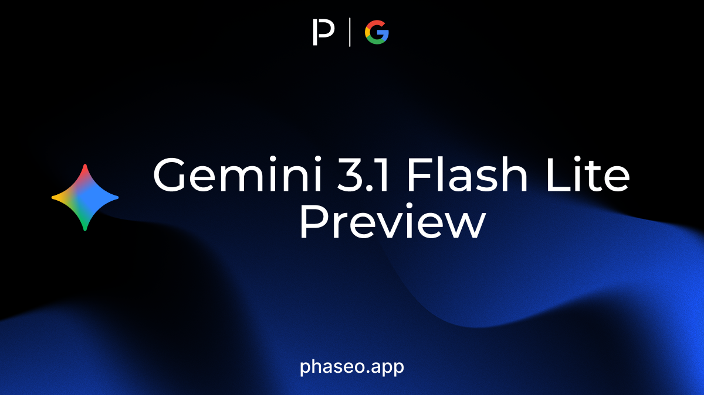

- [Google: Gemini 3.1 Flash Lite Preview](https://phaseo.app/models/google/gemini-3.1-flash-lite-preview)
- [OpenAI: GPT 5.3 Chat](https://phaseo.app/models/openai/gpt-5.3-chat)

</Update>

<Update label="2026年3月2日" tags={["功能","文档","模型发布"]}>

### 功能

- Responses API assistant `phase` 已在请求处理、响应内容和 OpenAPI 文档中得到支持。

### 模型发布

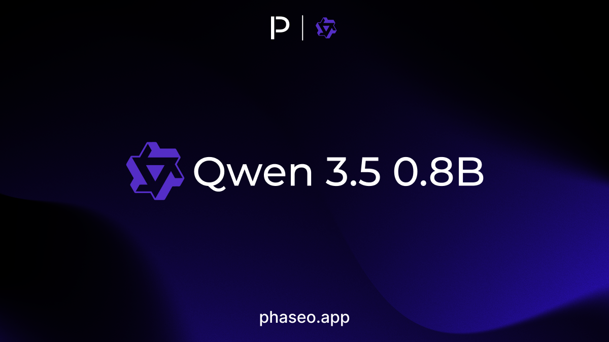

- [Qwen: Qwen 3.5 0.8B](https://phaseo.app/models/qwen/qwen3.5-0.8b)
- [Qwen: Qwen 3.5 2B](https://phaseo.app/models/qwen/qwen3.5-2b)
- [Qwen: Qwen 3.5 4B](https://phaseo.app/models/qwen/qwen3.5-4b)
- [Qwen: Qwen 3.5 9B](https://phaseo.app/models/qwen/qwen3.5-9b)

</Update>

